# Introduction to Amazon Elastic Container Service

## Table of Contents
- 실습개요
- 실습목표
- 교육대상 및 전제 조건
  - 교육대상
  - 전제 조건 및 사전 수행 작업
- 작업 1 : Amazon-ECS-Sample 이미지로 작업 정의 등록
- 작업 2 : 서비스 생성
- 작업 3 : 서비스에 새 응용 프로그램 버전 배포
- 결론

## 실습개요
이번 실습에서는 Amazon Elastic Container Service 를 소개합니다 .

Amazon ECS (Amazon Elastic Container Service)는 확장성이 뛰어나고 빠른 컨테이너 관리 서비스로 Amazon EC2 인스턴스 클러스터에서 Docker 컨테이너를 쉽게 실행, 중지 및 관리 할 수 있습니다. Amazon ECS 를 사용하면 간단한 API 호출로 컨테이너 기반 애플리케이션을 시작 및 중지 할 수 있으며 중앙 집중식 서비스에서 클러스터 상태를 얻을 수 있으며 익숙한 여러 Amazon EC2 기능에 액세스 할 수 있습니다.

Amazon ECS 를 사용하여 리소스 요구, 격리 정책 및 가용성 요구 사항에 따라 클러스터 전체에서 컨테이너 배치를 예약 할 수 있습니다. Amazon ECS 를 사용하면 자체 클러스터 관리 및 구성 관리 시스템을 운영하거나 관리 인프라 확장에 대해 걱정할 필요가 없습니다.

### Amazon ECS 작업 예약
Amazon ECS (Amazon Elastic Container Service)는 작업 및 컨테이너에 유연한 스케줄링 기능을 제공하는 공유 상태의 낙관적 동시성 시스템입니다. Amazon ECS 스케줄러는 Amazon ECS API 에서 제공하는 클러스터 상태 정보를 활용하여 적절한 배치 결정을 내립니다. Amazon ECS 는 장기 실행 상태 비 저장 서비스 및 애플리케이션을위한 서비스 스케줄러를 제공합니다. 서비스 스케줄러는 지정된 수의 작업이 지속적으로 실행되도록하고 작업이 실패 할 때 (예 : 기본 컨테이너 인스턴스가 어떤 이유로 실패한 경우) 작업을 다시 예약합니다. 서비스 스케줄러는 선택적으로 작업이 Elastic Load Balancing 로드 밸런서에 대해 등록되도록합니다. 새 작업 정의 배포와 같이 서비스 스케줄러에서 유지 관리하는 서비스를 업데이트 할 수 있습니다.

## 실습목표
이번 실습에서 여러분은 다음 작업들의 수행 방법을 배우게 됩니다.
- Amazon ECS 작업 정의 생성
- Amazon ECS 클러스터 생성하기
- Amazon ECS 서비스에 애플리케이션 배포

## 교육대상 및 전제 조건
### 교육대상
- AWS 에 응용 프로그램 및 환경을 배포하려는 개발자, DevOps 및 SysOps 전문가
및 솔루션 설계자
- AWS 를 평가하려는 의사 결정자

### 전제 조건 및 사전 수행 작업
- 표준 인터넷 브라우저 사용 준비 (Chrome 브라우저 권장).
- 실습 완료하기 위한 시간 확보 : 50 분
- AWS 계정을 사용하여 AWS Console 에 접속하고, 실습을 위한 프로젝트를 생성

## 작업 1 : Amazon-ECS 실행 설정
https://console.aws.amazon.com/ecs/home#/firstRun 이 주소를 브라우저의 인터넷 창에 복사 -> 붙여넣기 한 뒤 AWS 콘솔에 로그인 하십시오.

1. Amazon ECS 에는 Amazon Elastic Container Registry(ECR)를 사용하여 이미지 리포지토리를 생성하고 이미지를 리포지토리로 푸시하는 옵션이 첫 실행 마법사에 포함되어 있습니다.

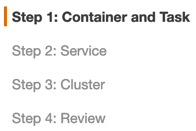

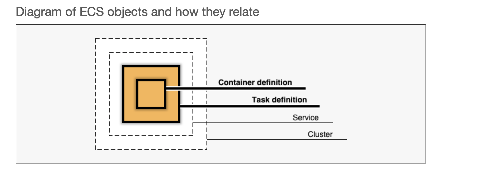

2. Sample-app 을 선택한 뒤 다음을 누르십시오.

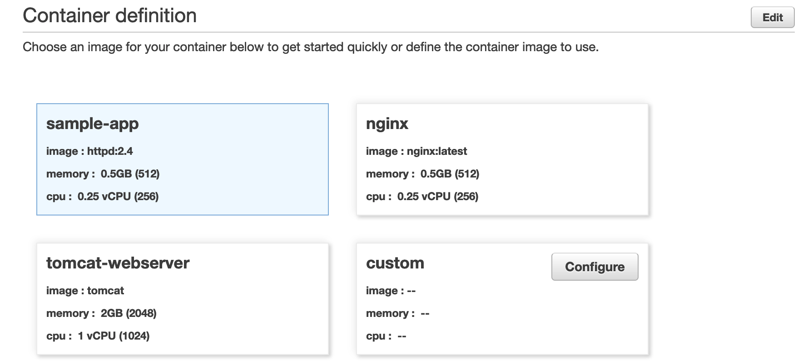

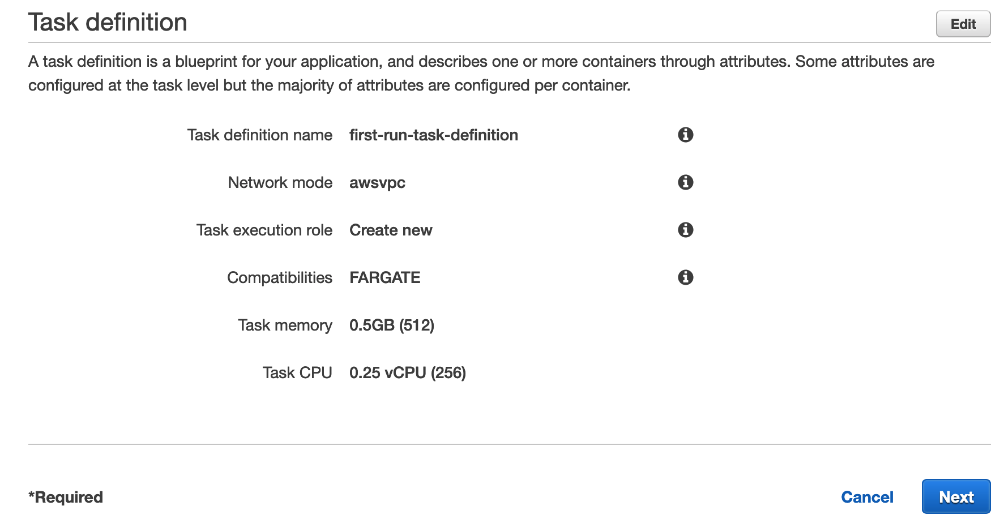

3. 단계 2 에서 로드 밸런서 유형을 Application Load Balancer 로 체크한뒤 다음을 누르십시오.

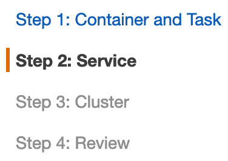

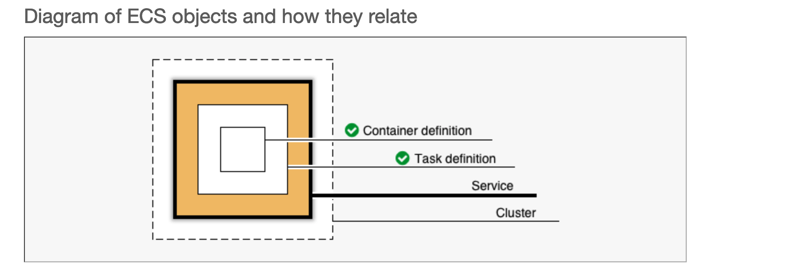

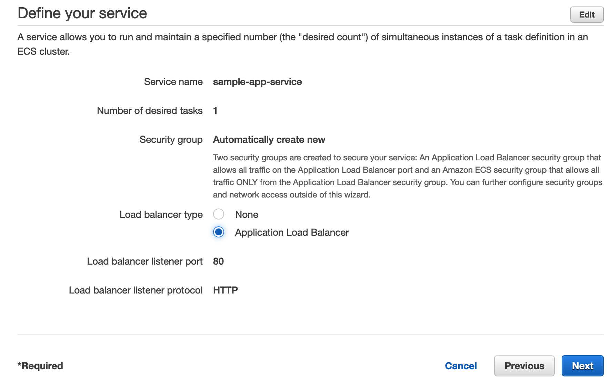

4. 클러스터의 이름을 지정하고 다음을 클릭하십시오.

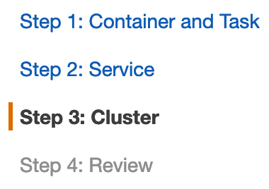

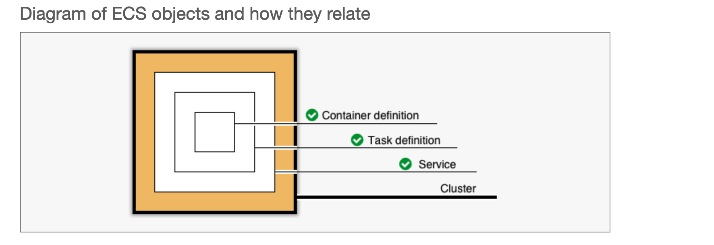

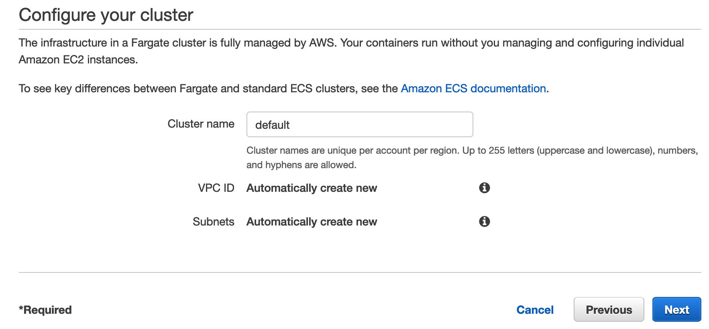

5. 검토 후 다음을 클릭 하십시오.

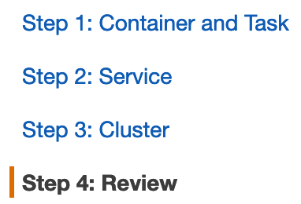

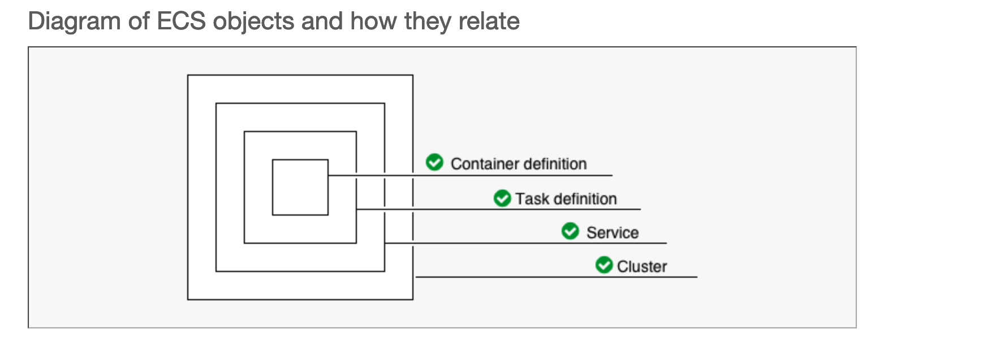

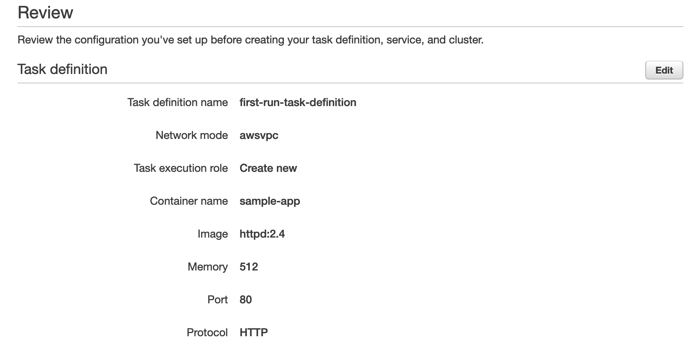

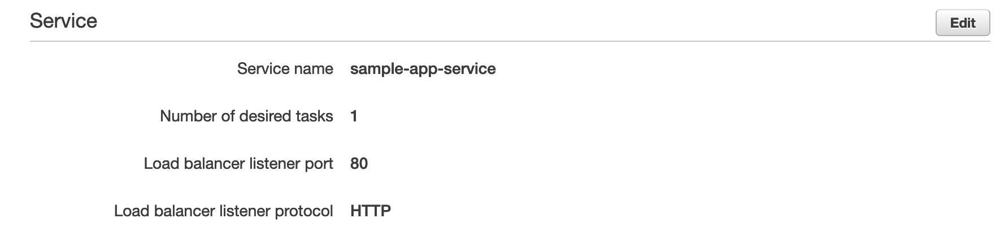

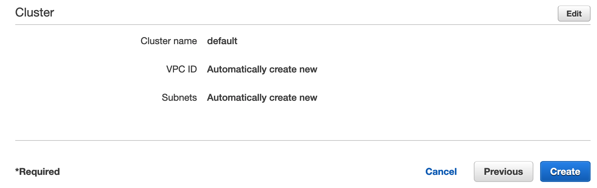

6. 서비스 생성이 완료 될 때 까지 기다리십시오.

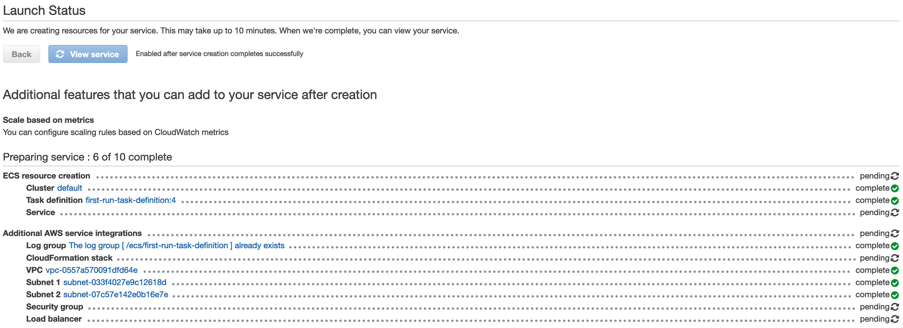

7. 서비스 보기를 클릭 하고 만들어진 내용을 확인하십시오.

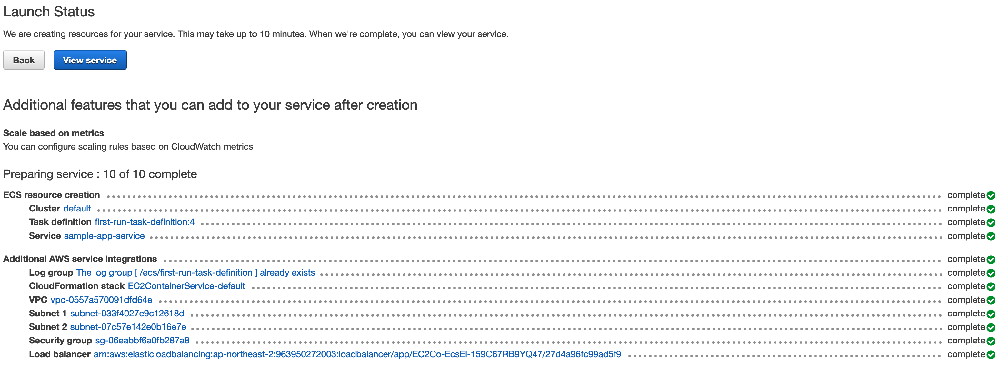

## 작업 2 : 샘플 애플리케이션 열기
이 단계에서 Amazon ECS 가 컨테이너에 어떤 Docker 이미지를 사용하고, 작업에 몇 개의 컨테이너를 사용하며, 각 컨테이너에 대한 리소스 할당은 어떻게 되는지 알 수 있도록 작업 정의를 지정합니다.

1. Service 에서 EC2 를 선택 하십시오.

2. 좌측 탭에서 로드밸런서를 클릭 하십시오.

3. 로드밸런서의 DNS 를 복사후 인터넷 창에 붙여넣기 하십시오.(아래와 같은 창이 표시됩니다)

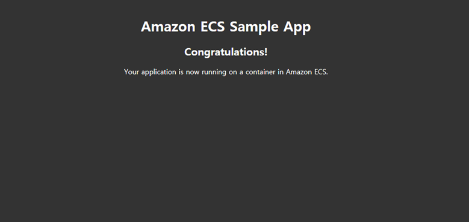

## 작업 3 : 리소스 삭제
1. Service 에서 ECS 를 클릭하십시오.

2. 왼쪽의 탐색 메뉴에서 클러스터를 클릭하십시오 .

3. 생성한 서비스 이름인 Sample-app-service 를 클릭하십시오.

4. 우측 상단에 삭제버튼을 클릭한 뒤 delete me 를 입력하여 삭제하십시오.

5. 왼쪽 탐색 메뉴에서 다시 클러스터를 선택합니다

6. Default>를 클릭 하십시오.

7. 우측 상단에서 클러스터 삭제를 클릭하십시오.

8. Delete me 를 입력 후 삭제가 완료 될 때 까지 기다리십시오.

9. 좌측 탭에서 작업정의를 클릭하십시오.

10. 정의된 작업 first-run-task-definition 을 클릭 하십시오.

11. 체크 박스 선택 후 작업 탭에서 등록취소를 클릭하십시오.

12. 알림창이 나오면 등록 취소를 클릭하십시오.

## 결론
축하합니다! 당신은 지금 성공적으로 완료했습니다.
- Amazon ECS 작업 정의 생성
- Amazon ECS 클러스터 생성
- Amazon ECS 서비스에 애플리케이션 배포
