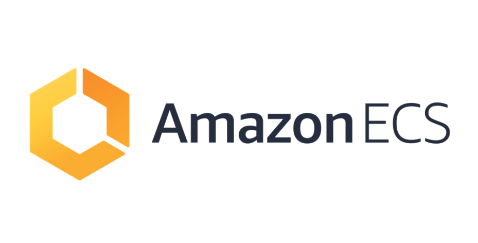

# ECSworkshop

<!-- * [ECS-LAB](README.md)
  * [ECS(ELASTIC CONTAINER SERVICE) 소개](readme/1.introduction.md)
  * [Start the LAB](readme/2.start-the-workshop.md)
  * [ECS LAB](readme/3.microservices.md)
  * [ECS 클러스터 및 컨테이너 모니터링](readme/4.monitoring.md)
  * [AMAZON ECS 클러스터 용량 공급자](readme/6.capacity-providers.md)
  * [ECS FARGATE의 블루/그린 배포](readme/8.blue-green-deployments.md)