# Building and Deploying Containers Using Amazon Elastic Container Service

## Table of Contents

<details>
<summary>Table of Contents</summary>
<div markdown="1">

1.	AWS FARGATE 소개
    1) 개념
    2) 클러스터
    3) 태스크
    4) 서비스
2.	전제조건
    1) AWS 계정 생성
    2) 작업 공간 만들기
    3) CLI 도구 설치
3.	APPLICATION
    1) SOURCE
    2) Build
    3) 배포
    4) SCALE
    5) CLEANUP
4.	CDK 개요
    1) AWS CDK 툴킷 설치
    2) 새 프로젝트 만들기
    3) ADD OUR APPLICATION
    4) DEPLOY APPLICATION
    5) 데이터베이스 구성
    6) CLEANUP
5.	학습 마무리
6.	결론
7.	다음 단계

</div>
</details>

## 1.	AWS FARGATE 소개
### 기본 Fargate 개념 연습


AWS Fargate실습에 오신 것을 환영합니다!
이 실습의 목표는 AWS Fargate를 신속하게 시작하고 실행하는 방법을 알려주는 것입니다.
Docker의 배경 및 컨테이너 워크플로는 필요하지 않지만 권장됩니다.
이 장에서는 Fargate의 기본 작업을 소개하고 실습의 실제 부분을 위한 토대를 마련합니다.

1) 개념
Fargate는 서버나 클러스터를 관리하지 않고도 컨테이너를 실행할 수 있는 Amazon ECS 용 컴퓨팅 엔진입니다. AWS Fargate를 사용하면 더 이상 컨테이너를 실행하기 위해 가상 머신 클러스터를 프로비저닝, 구성 및 확장할 필요가 없습니다. 따라서 서버 유형을 선택하거나 클러스터 확장시기를 결정하거나 클러스터 패킹을 최적화할 필요가 없습니다. AWS Fargate를 사용하면 서버 또는 클러스터와 상호 작용하거나 생각할 필요가 없습니다. Fargate를 사용하면 애플리케이션을 실행하는 인프라를 관리하는 대신 애플리케이션을 설계하고 구축하는데 집중할 수 있습니다.

이 섹션에서는 다음 주제를 다룰 것입니다.
-	클러스터
-	작업
-	서비스
이 섹션의 내용은 대부분 Amazon ECS 블로그 게시물 의 빌딩 블록을 기반으로합니다.

2) 클러스터
클러스터는 단일 AWS 리전 내에 존재하지만 여러 가용 영역에 걸쳐 있을 수 있는 Fargate의 컨테이너화된 작업 그룹입니다. Fargate에서 클러스터는 기본 컴퓨팅 및 컨테이너 오케스트레이션을 관리하는 단순한 네임 스페이스로 간주 될 수 있습니다.
환경에 대해 별도의 클러스터를 생성하는 것이 일반적인 모범 사례 (예 : 개발, 단계, 제품)입니다. Fargate 제어 평면 / 클러스터는 무료이며 계산 비용 만 지불하면 됩니다.

3) 태스크
Fargate에서 컨테이너를 실행하려면 작업을 정의해야 합니다. 작업은 동일한 컴퓨팅 공간에서 일반적으로 밀접하게 결합된 매너에서 함께 실행되는 1-10 컨테이너의 논리적 그룹입니다. 사용자 정의 블로그 엔진을 실행하려는 경우 각각 자체 컨테이너에 웹 서버, 애플리케이션 서버 및 인 메모리 캐시를 결합할 수 있습니다. 이들은 기본 프론트 엔드 단위를 구성합니다.
작업 세부 정보는 AWS Management Console 또는 AWS CLI 에서 생성된 작업 정의에 포함되어 있습니다.
Fargate의 고급 작업 정의에는 다음 세부 정보가 포함됩니다.

-	작업의 각 컨테이너와 함께 사용할 Docker 이미지
-	각 작업 또는 작업 내의 각 컨테이너에 사용할 CPU 및 메모리 양
-	컨테이너가 완료되거나 실패한 경우 작업을 계속 실행할지 여부
-	컨테이너가 시작될 때 컨테이너가 실행해야 하는 명령
-	작업에서 사용해야하는 IAM 역할

예제 [태스크 정의 문서](https://docs.aws.amazon.com/AmazonECS/latest/developerguide/example_task_definitions.html)가 도움이 됩니다

4)	서비스
Fargate를 사용하면 클러스터에서 지정된 수의 작업 정의 인스턴스를 동시에 실행하고 유지할 수 있습니다. 이것을 서비스라고 합니다. 어떤 이유로 작업이 실패하거나 중단되어야 하는 경우 Amazon ECS 서비스 스케줄러는 다른 작업 정의 인스턴스를 시작하여 이를 교체하고 사용된 예약 전략에 따라 서비스에서 원하는 작업 수를 유지합니다.
서비스에서 원하는 작업 수를 유지하는 것 외에도 로드밸런서 뒤에서 서비스를 선택적으로 실행할 수 있습니다. 로드밸런서는 서비스와 관련된 작업에 트래픽을 분산시킵니다.

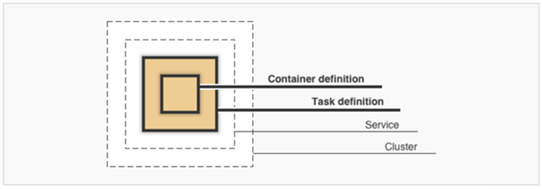

## 2.	전제조건
-	AWS 계정 생성
-	작업 공간 만들기
-	CLI 도구 설치

### 1) AWS 계정 생성
계정에는 새로운 IAM 역할을 생성하고 다른 IAM 권한을 범위 지정할 수 있어야합니다. 새 계정의 경우 이는 문제가 되지 않습니다. 보안상의 이유로 회사 / 회사 계정에는 계정에 연결된 IAM과 관련된 제한이 있을 수 있습니다.
-	관리자 액세스 권한이 있는 AWS 계정이 없는 경우 : 여기를 클릭하여 지금 만드십시오.
-	AWS 계정을 생성한 후 아래 단계에 따라 이 계정에 대한 관리 액세스 권한이 있는 IAM 사용자를 생성하십시오.
  - 실습에 사용할 새로운 IAM 사용자 생성
- 사용자 세부 사항을 입력하십시오.

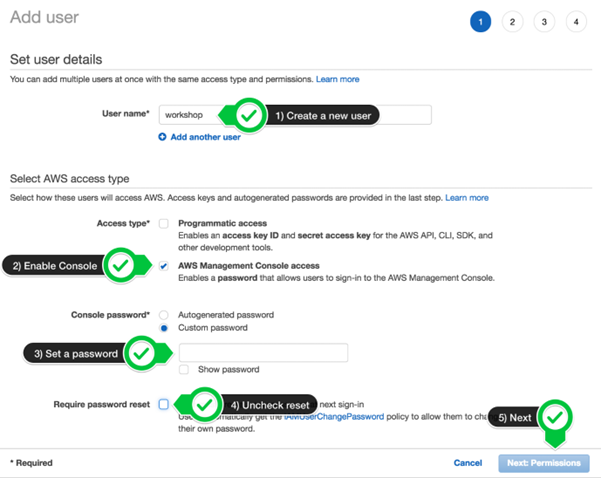

-	AdministratorAccess IAM 정책을 연결하십시오.

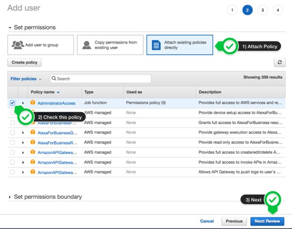

-	새 사용자를 작성하려면 클릭하십시오.

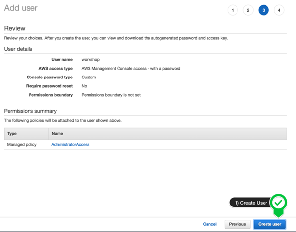

-	로그인 URL을 기록하고 저장하십시오.

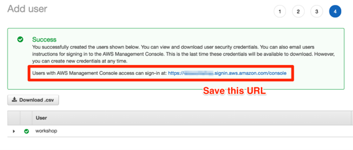

### 2) 작업 공간 만들기
Cloud9 작업 공간은 루트 계정 사용자가 아닌 관리자 권한이 있는 IAM 사용자가 빌드해야 합니다. 루트 계정 사용자가 아닌 IAM 사용자로 로그인했는지 확인하십시오.
* .amazonaws.com 도메인에 대해서는 광고 차단기, 자바 스크립트 차단기 및 추적 차단기가 비활성화되어 있어야합니다. 그렇지 않으면 작업 공간 연결에 영향을 줄 수 있습니다. Cloud9에는 타사 쿠키가 필요합니다. 특정 도메인을 허용 목록에 추가할 수 있습니다.

가장 가까운 지역에서 Cloud9를 시작하십시오.
| 리전 | Cloud9 환경 생성 |
| ---- | --------------- |
| 버지니아 북부 | Cloud9 환경 생성 : https://us-east-1.console.aws.amazon.com/cloud9/home?region=us-east-1 |
| 오하이오 | Cloud9 환경 생성 : https://us-east-2.console.aws.amazon.com/cloud9/home?region=us-east-2 |
| 오리건 | Cloud9 환경 생성 : https://us-west-2.console.aws.amazon.com/cloud9/home?region=us-west-2 |
| 아일랜드 | Cloud9 환경 생성 : https://eu-west-1.console.aws.amazon.com/cloud9/home?region=eu-west-1 |
| 프랑크푸르트 | Cloud9 환경 생성 : https://eu-central-1.console.aws.amazon.com/cloud9/home?region=eu-central-1 |
| **서울** | **Cloud9 환경 생성 : https://ap-northeast-2.console.aws.amazon.com/cloud9/home?region=ap-northeast-2** |
| 도쿄 | Cloud9 환경 생성 : https://ap-northeast-1.console.aws.amazon.com/cloud9/home?region=ap-northeast-1 |
| 싱가포르 | Cloud9 환경 생성 : https://ap-southeast-1.console.aws.amazon.com/cloud9/home?region=ap-southeast-1 |

-	환경 만들기를 선택 하십시오.
-	작업장 이름을 지정하고 다른 모든 기본값을 유지하십시오.

Cloud9 환경이 나타나면 시작 탭 과 하단 작업 영역을 닫고 환경을 사용자 정의하고 기본 작업 영역에서 새 터미널 탭을 여십시오.

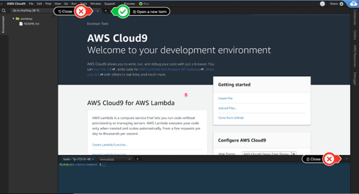

작업 공간은 이제 다음과 같아야 합니다.

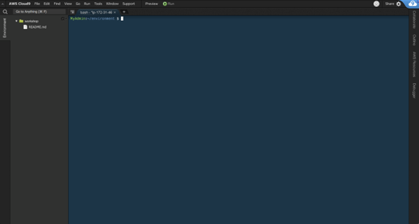

이 테마가 마음 에 들면 Cloud9 작업 공간 메뉴에서 보기 / 테마 / 태양화 / 태양광 을 선택하여 직접 선택할 수 있습니다.

### 3) CLI 도구 설치
AWS 명령 줄 인터페이스 (CLI)는 이미 Cloud9에 설치됩니다.
이 실습에서는 Fargate CLI도 사용합니다. Fargate CLI는 AWS CLI를 사용하여 Fargate에서 컨테이너 작업을 시작하는 복잡성을 추상화하는 작은 도구입니다.
이 실습에서는 Linux 바이너리를 다운로드하는 명령을 제공합니다. macOS / Windows를 실행중인 경우 다운로드 링크에 대한 공식 문서 를 참조하십시오.

CLI 유틸리티 설치

```
sudo yum -y install jq
```
```
# AWS 계정 ID 및 리전 구성
export ACCOUNT_ID=$(aws sts get-caller-identity --output text --query 'Account')
export AWS_REGION=$(curl -s 169.254.169.254/latest/dynamic/instance-identity/document | jq -r .region)
```
```
aws configure set default.region $AWS_REGION
```

## 3.	APPLICATION
이 섹션에서는 Spring Boot를 사용하여 작성된 샘플 응용 프로그램을 빌드하고 배포합니다.

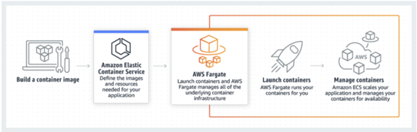

### 1) SOURCE
이 실습에서 사용할 샘플 Spring 애플리케이션은 Spring PetClinic 샘플 애플리케이션입니다. PetClinic은 Maven을 사용하여 빌드된 Spring Boot 애플리케이션입니다. Cloud9에는 OpenJDK 버전 1.7 설치가 포함되어 있으며 PetClinic을 빌드하고 실행하려면 버전 1.8을 설치해야 합니다.

```
sudo yum install -y java-1.8.0-openjdk-devel
sudo alternatives --config java
```

프롬프트에서 openjdk 1.8.0의 번호를 입력하십시오. 대부분의 경우 아래처럼 2 여야 합니다.

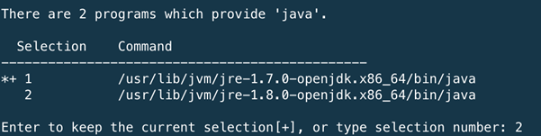

이제 같은 javac명령을 수행하십시오

```
sudo alternatives --config javac
```

이제 GitHub에서 애플리케이션 소스 코드를 다운로드할 수 있습니다.

```
cd ~/environment
git clone https://github.com/spring-projects/spring-petclinic.git
cd spring-petclinic
```

## 선택 사항 : Cloud9에서 로컬로 빌드 및 실행
Maven을 사용하여 애플리케이션을 빌드하고 jar 파일을 실행하고 명령 행을 실행하십시오.

```
./mvnw package
java -jar target/*.jar
```

그런 다음 Cloud9에서 애플리케이션을 미리보고 PetClinic에 액세스할 수 있습니다. 메뉴에서 미리보기 를 클릭 하고 실행중인 응용 프로그램 미리보기를 선택하십시오.

브라우저 창(http://<IP Address>:8080)에 PetClinic이 실행중인 것을 볼 수 있습니다.


ctrl-c를 눌러 응용 프로그램을 중지하고 다음 단계로 진행하십시오.

### 2) Build
이 단계에서는 PetClinic 애플리케이션의 Docker 이미지를 빌드하고 Cloud9 환경에서 로컬로 테스트합니다.

태그 만들기
도커 태그는 컨테이너 이미지의 특정 버전을 나타낸다. 이 실습에서는 날짜와 현재 Git SHA의 조합을 사용합니다.

```
cd ~/environment/spring-petclinic
export TAG=$(date +%Y-%m-%d.%H.%M.%S).$(git rev-parse HEAD | head -c 8)
```

도커 이미지 빌드
도커 이미지를 빌드하려면 Dockerfile을 정의해야 합니다. 우리는 당신을 위해 하나를 준비했습니다, 이것을 프로젝트 디렉토리에 복사하고 구축을 시작하십시오.

```
cd ~/environment/spring-clinic
curl -O https://raw.githubusercontent.com/chankh/fargate-cdk-workshop/master/static/assets/Dockerfile
docker build --tag spring-petclinic:$TAG .
```

로컬로 실행
도커 이미지를 로컬에서 테스트하십시오.

```
docker run -it -p 8080:8080 spring-petclinic:$TAG
```

시작되면 메뉴에서 미리 보기 > 실행중인 애플리케이션 미리보기를 사용하여 애플리케이션을 미리 볼 수 있습니다.
계속 진행할 준비가 되면 ctrl-c를 눌러 응용 프로그램을 중지하고 다음 단계로 넘어갑니다.

### 3)	배포
첫 번째 컨테이너를 성공적으로 구축 했으므로 fargate 명령을 사용하여 애플리케이션을 AWS Fargate에 배포합니다.

최신 Fargate CLI 릴리스 다운로드 및 설치

```
export PATH=$PATH:$HOME/go/bin
go get -u github.com/jpignata/fargate
```

Version 확인

```
fargate --version
```

출력은 다음과 유사해야 합니다.

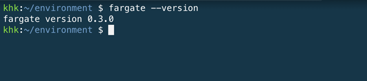

AWS Fargate에 배포
먼저 로드 밸런서를 만듭니다.

```
fargate lb create web --port 80
```

그리고 이것은 AWS Fargate에서 실행되는 서비스를 관리하는데 사용할 수 있는 ALB를 생성할 것입니다.
다음으로 서비스를 생성하고 이름을 spring-petclinic 으로 지정하고 방금 생성 한로드 밸런서에 연결한 다음 컨테이너가 포트 8080에서 수신하는 로드 밸런서에 알려야 합니다.

```
fargate service create spring-petclinic --lb web --port http:8080
```

이 fargateCLI는 우리에게 많은 노력을 단순화시킵니다. Amazon Elastic Container Registry (Amazon ECR) 에 프라이빗 Docker 이미지 리포지토리를 생성하고 , 프로젝트 디렉토리에서 컨테이너 이미지를 생성하고, 이미지를 Amazon ECR로 푸시하고 컨테이너를 AWS Fargate의 서비스로 실행합니다. 지금 Amazon ECS 콘솔 로 이동 하면“fargate”라는 클러스터가 표시되고 1 개의 서비스가 실행되고 있습니다.

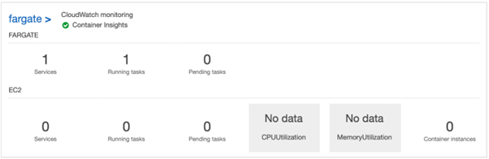

fargateCLI를 사용하여 이러한 정보를 볼 수도 있습니다.

```
fargate service info spring-petclinic
```

여기에서 로드 밸런서와 같은 많은 정보를 통해 서비스가 시작되고 실행중인 것을 확인할 수 있습니다.

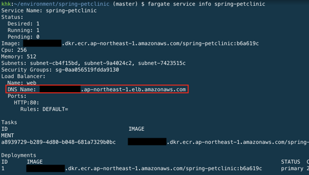

새 브라우저 창에서로드 밸런서 URL을 열면 PetClinic 응용 프로그램이 표시됩니다.

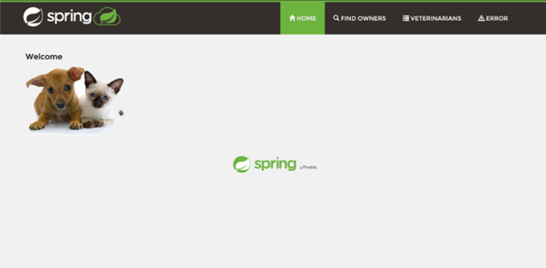

### 4) SCALE
이 시점에서 클러스터와 서비스가 시작되어 실행 중입니다. 우리의 응용 프로그램은 엄청나게 인기있는 것으로 판명되었으며 클러스터에서 실행중인 컨테이너 수를 확장해야 합니다.
fargate확장을 위해 CLI를 사용할 것입니다.

```
fargate service scale spring-petclinic 2
```

service info 명령을 다시 실행하면 두 개의 컨테이너가 실행 중임을 알 수 있습니다.

```
fargate service info spring-petclinic
```

이제 출력이 다음과 같아야 합니다.

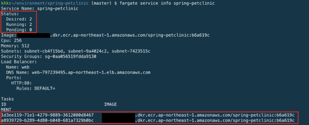

서비스를 2개로 확장했으며 2개의 컨테이너가 실행되고 있음을 알 수 있습니다.

### 5) CLEANUP
응용 프로그램을 계속 실행하려는 경우 그렇게할 수 있지만 이 섹션의 끝입니다. Fargate 클러스터를 정리하고 해제하려면 서비스를 삭제해야 합니다.

```
fargate service scale spring-petclinic 0
fargate service destroy spring-petclinic
```

작업 시간이 초과되면 명령을 다시 실행하십시오.
그런 다음로드 밸런서를 삭제하십시오.

```
fargate lb destroy web
```

마지막으로 Amazon ECS 클러스터 및 Amazon ECR 리포지토리를 삭제하십시오.

```
aws ecs delete-cluster --cluster fargate
aws ecr delete-repository --force --repository-name spring-petclinic
```

---

## 4.	CDK 개요
이전 섹션에서는 fargateCLI를 사용하여 Spring PetClinic 애플리케이션을 AWS Fargate에 배포했습니다. fargateCLI는 스케일링으로, AWS에 컨테이너를 실행하고 로그를 검사할 때 아주 기본적인 작업을 하는데 도움이 간단한 도구입니다. 그러나 결국에는 더 나은 모범 사례로 넘어 가기를 원할 것입니다.

AWS에서는 인프라로서 코드에 대해 이야기했지만, AWS CloudFormation을 사용하여 YAML 또는 JSON을 사용하여 템플릿을 작성하여 이를 배포하고 배포하는 옵션이 있습니다. 더 좋은 옵션은 AWS Cloud Development Kit를 사용하거나 간단히 말하면 AWS CDK입니다.

AWS CDK는 좋아하는 프로그래밍 언어로 클라우드 인프라를 재미 있고 쉽게 정의하고 AWS CloudFormation을 사용하여 배포할 수 있도록 하기 위해 AWS의 새로운 소프트웨어 개발 프레임 워크입니다.

AWS CDK는 현재 JavaScript, TypeScript, Python, Java 및 .NET에서 지원됩니다. 그러나 현재 워크숍은 TypeScript 및 Python에서만 사용할 수 있습니다. 더 많은 언어에 맞춘 워크샵이 곧 올 것입니다.

### 1) AWS CDK 툴킷 설치
다음으로 AWS CDK 툴킷을 설치합니다. 툴킷은 CDK 앱으로 작업할 수 있는 명령 줄 유틸리티입니다.
터미널 세션에서 다음 명령을 실행하십시오.

```
npm install -g aws-cdk
```

툴킷 버전을 확인할 수 있습니다.

```
$ cdk --version
1.8.0 (build 5244f97)
```

### 2) 새 프로젝트 만들기
AWS CDK 툴킷을 설치하면 cdk init새 프로젝트를 만드는데 사용됩니다. CDK 툴킷을 사용하여 애플리케이션에 대한 AWS CloudFormation 템플릿을 합성하고 계정에 배포하는 방법을 알아봅니다.

프로젝트 디렉토리를 만듭니다
Cloud9 환경에서 빈 디렉토리를 작성하십시오.

```
mkdir ~/environment/cdk-workshop
cd ~/environment/cdk-workshop
```

프로젝트 초기화
cdk init새로운 TypeScript CDK 프로젝트를 만드는데 사용할 것입니다

```
cdk init app --language typescript
```

출력은 다음과 같아야 합니다

```
Applying project template app for typescript
Initializing a new git repository...
Executing npm install...
npm notice created a lockfile as package-lock.json. You should commit this file.
npm WARN cdk@0.1.0 No repository field.
npm WARN cdk@0.1.0 No license field.

# Useful commands

 * `npm run build`   compile typescript to js
 * `npm run watch`   watch for changes and compile
 * `cdk deploy`      deploy this stack to your default AWS account/region
 * `cdk diff`        compare deployed stack with current state
 * `cdk synth`       emits the synthesized CloudFormation template
```

보시다시피, 시작하는데 유용한 명령이 많이 있습니다.
TypeScript 소스는 JavaScript로 컴파일해야하므로 소스 파일을 수정할 때마다로 컴파일해야 .js합니다.

프로젝트 디렉토리
cdk init 명령은 디렉토리에 프로젝트 구조를 만들었습니다. 프로젝트 디렉토리를 살펴보겠습니다.

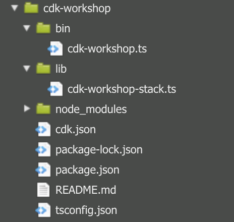

-	lib/cdk-workshop-stack.tsCDK 응용 프로그램의 기본 스택이 정의된 위치입니다. 이것은 우리가 대부분의 시간을 보낼 파일입니다.
-	bin/cdk-workshop.tsCDK 응용 프로그램의 진입 점입니다. lib/cdk-workshop-stack.ts 에 정의된 스택을 로드 합니다.
-	package.jsonnpm 모듈 매니페스트입니다. 여기에는 앱 이름, 버전, 종속성 및 "watch"및 "build"와 같은 빌드 스크립트 ( package-lock.jsonnpm에서 유지 관리) 와 같은 정보가 포함됩니다.
-	cdk.json은 툴킷에 앱 실행 방법을 알려줍니다. 우리의 경우에는 "node bin / cdk-workshop.js"가됩니다.
-	tsconfig.json프로젝트의 타이프 스크립트 구성
-	.gitignore및 .npmignore패키지 관리자에이 모듈을 게시할 때 TELL 자식과 포함할 파일을 NPM은 / 소스 제어에서 제외합니다.
-	node_modules npm에 의해 유지 관리되며 프로젝트의 모든 종속성을 포함합니다.

앱의 진입 점
bin / cdk-workshop.ts를 간단히 살펴 보겠습니다.

```
#!/usr/bin/env node
import 'source-map-support/register';
import cdk = require('@aws-cdk/core');
import { CdkWorkshopStack } from '../lib/cdk-workshop-stack';

const app = new cdk.App();
new CdkWorkshopStack(app, 'CdkWorkshopStack');
```

이 코드 CdkWorkshopStack는 lib/cdk-workshop-stack.ts파일 에서 클래스를 로드하고 인스턴스화 합니다. 더 이상이 파일을 볼 필요가 없습니다.

주요 스택
lib / cdk-workshop-stack.ts를여십시오. 응용 프로그램의 핵심은 다음과 같습니다.

```
import cdk = require('@aws-cdk/core');

export class CdkWorkshopStack extends cdk.Stack {
  constructor(scope: cdk.Construct, id: string, props?: cdk.StackProps) {
    super(scope, id, props);

    // The code that defines your stack goes here
  }
}
```

보시다시피, CDK 스택 ( CdkWorkshopStack)이 아무것도 없는 상태로 생성됩니다. 다음으로 Spring PetClinic 애플리케이션을 이 스택에 추가합니다.

### 3) ADD OUR APPLICATION
마지막으로 CDK 코드를 작성하겠습니다. 생성된 빈 스택에서 제공된 ECS 패턴 중 하나를 사용하여 Fargate 서비스를 추가합니다.

구문 라이브러리 설치
AWS CDK는 AWS Construct Library 라는 광범위한 구문 라이브러리 와 함께 제공됩니다. 구성 라이브러리는 각 AWS 서비스마다 하나씩 모듈로 나뉩니다. 예를 들어 Amazon EC2 인스턴스를 정의하려면 aws-ec2생성 라이브러리를 사용해야 합니다.

AWS 구성을 발견하고 배우려면 AWS 생성 라이브러리 참조를 찾아 볼 수 있습니다.
자, npm install필요한 모듈과 모든 의존성을 프로젝트에 설치하는데 사용합시다.

```
npm install @aws-cdk/aws-ec2
npm install @aws-cdk/aws-ecs
npm install @aws-cdk/aws-ecs-patterns
```

package.json 파일에 대한 npm의 경고는 무시해도 됩니다.

Fargate 서비스 만들기
AWS CDK의 강력한 기능을 살펴보겠습니다. lib/cdk-workshop-stack.ts 파일을 열고 파일 import의 시작 부분에 몇 가지 문장을 추가하고 스택에 리소스를 정의하십시오.

```
import cdk = require('@aws-cdk/core');
import ec2 = require('@aws-cdk/aws-ec2');
import ecs = require('@aws-cdk/aws-ecs');
import ecs_patterns = require('@aws-cdk/aws-ecs-patterns');

export class CdkWorkshopStack extends cdk.Stack {
  constructor(scope: cdk.Construct, id: string, props?: cdk.StackProps) {
    super(scope, id, props);

    // The code that defines your stack goes here
    const vpc = new ec2.Vpc(this, "workshop", {
      maxAzs: 3 // Default is all AZs in region
    });

    const cluster = new ecs.Cluster(this, "fargate", {
      vpc: vpc
    });

    // Create a load-balanced Fargate service and make it public
    new ecs_patterns.ApplicationLoadBalancedFargateService(this, "spring-petclinic", {
      cluster: cluster, // Required
      containerPort: 8080, // Port number on the container, default is 80
      cpu: 512, // Default is 256
      desiredCount: 2, // Default is 1
      image: ecs.ContainerImage.fromAsset("../spring-petclinic"), // Required
      memoryLimitMiB: 1024, // Default is 512
      publicLoadBalancer: true // Default is false
    });
}
}
```

-	30 줄 미만의 TypeScript 코드에서 다음과 같은 이점이 있는 AWS Fargate 서비스를 만들 수 있습니다.
-	로드 밸런서를 자동으로 구성합니다.
-	로드 밸런서에 대한 보안 그룹을 자동으로 엽니다. 이를 통해 보안 그룹을 명시 적으로 만들지 않고도 로드 밸런서가 인스턴스와 통신할 수 있습니다.
-	대상 그룹에 연결하는 서비스와 로드 밸런서 간의 종속성을 자동으로 주문합니다. 여기서 AWS CDK는 인스턴스를 만들기 전에 리스너를 생성하는 올바른 순서를 시행합니다.
-	자동 스케일링 그룹에서 사용자 데이터를 자동으로 구성합니다. 이렇게 하면 클러스터를 AMI에 연결하기위한 올바른 구성이 생성됩니다.
-	파라미터 조합을 조기에 검증합니다. 그러면 AWS CloudFormation 문제가 더 일찍 노출되므로 배포 시간이 절약됩니다. 예를 들어, 작업에 따라 메모리 설정을 잘못 구성하기 쉽습니다. 이전에는 앱을 배포할 때까지 오류가 발생하지 않았습니다. 그러나 이제 AWS CDK는 잘못된 구성을 감지하고 앱을 합성할 때 오류를 생성할 수 있습니다.
-	Amazon ECR의 이미지를 사용하는 경우 Amazon Elastic Container Registry (Amazon ECR)에 대한 권한을 자동으로 추가합니다.
-	자동으로 조정됩니다. AWS CDK는 Amazon EC2 클러스터를 사용할 때 인스턴스를 자동 확장할 수 있는 방법을 제공합니다. Fargate 클러스터에서 인스턴스를 사용할 때 자동으로 발생합니다.
-	또한 AWS CDK는 자동 확장이 인스턴스를 종료하려고 시도하지만 작업이 실행 중이거나 해당 인스턴스에서 예약된 경우 인스턴스가 삭제되지 않도록합니다. 이전에는 이 기능을 사용하기 위해 Lambda 함수를 만들어야 했습니다.
-	한 번에 머신에서 Amazon ECS로 소스를 배포할 수 있도록 자산 지원을 제공합니다. 이전에는 애플리케이션 소스를 사용하려면 Amazon ECR에 업로드 및 Docker 이미지 생성과 같은 몇 가지 수동 단계를 수행해야했습니다.

diff 확인
코드를 저장하고 배포하기 전에 차이점을 간단히 살펴 보겠습니다.

```
cdk diff
```

출력은 다음과 같습니다

```
Stack CdkWorkshopStack
The CdkWorkshopStack stack uses assets, which are currently not accounted for in the diff output! See https://github.com/aws/aws-cdk/issues/395
IAM Statement Changes
┌───┬────────────────────────────────────────────────┬────────┬────────────────────────────────────────────────┬─────────────────────────────────────────────────┬───────────┐
│   │ Resource                                       │ Effect │ Action                                         │ Principal                                       │ Condition │
├───┼────────────────────────────────────────────────┼────────┼────────────────────────────────────────────────┼─────────────────────────────────────────────────┼───────────┤
│ + │ ${AdoptEcrRepositorydbc60defc59544bcaa5c28c95d │ Allow  │ sts:AssumeRole                                 │ Service:lambda.amazonaws.com                    │           │
│   │ 68f62c/ServiceRole.Arn}                        │        │                                                │                                                 │           │
├───┼────────────────────────────────────────────────┼────────┼────────────────────────────────────────────────┼─────────────────────────────────────────────────┼───────────┤
│ + │ ${spring-petclinic/TaskDef/ExecutionRole.Arn}  │ Allow  │ sts:AssumeRole                                 │ Service:ecs-tasks.amazonaws.com                 │           │
├───┼────────────────────────────────────────────────┼────────┼────────────────────────────────────────────────┼─────────────────────────────────────────────────┼───────────┤
│ + │ ${spring-petclinic/TaskDef/TaskRole.Arn}       │ Allow  │ sts:AssumeRole                                 │ Service:ecs-tasks.amazonaws.com                 │           │
├───┼────────────────────────────────────────────────┼────────┼────────────────────────────────────────────────┼─────────────────────────────────────────────────┼───────────┤
│ + │ ${spring-petclinic/TaskDef/web/LogGroup.Arn}   │ Allow  │ logs:CreateLogStream                           │ AWS:${spring-petclinic/TaskDef/ExecutionRole}   │           │
│   │                                                │        │ logs:PutLogEvents                              │                                                 │           │
├───┼────────────────────────────────────────────────┼────────┼────────────────────────────────────────────────┼─────────────────────────────────────────────────┼───────────┤
│ + │ *                                              │ Allow  │ ecr:GetAuthorizationToken                      │ AWS:${spring-petclinic/TaskDef/ExecutionRole}   │           │
├───┼────────────────────────────────────────────────┼────────┼────────────────────────────────────────────────┼─────────────────────────────────────────────────┼───────────┤
│ + │ arn:${AWS::Partition}:ecr:${AWS::Region}:${AWS │ Allow  │ ecr:BatchCheckLayerAvailability                │ AWS:${spring-petclinic/TaskDef/ExecutionRole}   │           │
│   │ ::AccountId}:repository/${springpetclinicTaskD │        │ ecr:BatchGetImage                              │                                                 │           │
│   │ efwebAssetImageAdoptRepository17144F4B.Reposit │        │ ecr:GetDownloadUrlForLayer                     │                                                 │           │
│   │ oryName}                                       │        │                                                │                                                 │           │
├───┼────────────────────────────────────────────────┼────────┼────────────────────────────────────────────────┼─────────────────────────────────────────────────┼───────────┤
│ + │ arn:${AWS::Partition}:ecr:${AWS::Region}:${AWS │ Allow  │ ecr:BatchDeleteImage                           │ AWS:${AdoptEcrRepositorydbc60defc59544bcaa5c28c │           │
│   │ ::AccountId}:repository/{"Fn::Select":[0,"{\"F │        │ ecr:DeleteRepository                           │ 95d68f62c/ServiceRole}                          │           │
│   │ n::Split\":[\"@sha256:\",\"${springpetclinicTa │        │ ecr:GetRepositoryPolicy                        │                                                 │           │
│   │ skDefwebAssetImageImageName40F1DFAD}\"]}"]}    │        │ ecr:ListImages                                 │                                                 │           │
│   │                                                │        │ ecr:SetRepositoryPolicy                        │                                                 │           │
└───┴────────────────────────────────────────────────┴────────┴────────────────────────────────────────────────┴─────────────────────────────────────────────────┴───────────┘
IAM Policy Changes
┌───┬───────────────────────────────────────────────────────────────────┬────────────────────────────────────────────────────────────────────────────────┐
│   │ Resource                                                          │ Managed Policy ARN                                                             │
├───┼───────────────────────────────────────────────────────────────────┼────────────────────────────────────────────────────────────────────────────────┤
│ + │ ${AdoptEcrRepositorydbc60defc59544bcaa5c28c95d68f62c/ServiceRole} │ arn:${AWS::Partition}:iam::aws:policy/service-role/AWSLambdaBasicExecutionRole │
└───┴───────────────────────────────────────────────────────────────────┴────────────────────────────────────────────────────────────────────────────────┘
Security Group Changes
┌───┬───────────────────────────────────────────────────┬─────┬────────────┬───────────────────────────────────────────────────┐
│   │ Group                                             │ Dir │ Protocol   │ Peer                                              │
├───┼───────────────────────────────────────────────────┼─────┼────────────┼───────────────────────────────────────────────────┤
│ + │ ${spring-petclinic/LB/SecurityGroup.GroupId}      │ In  │ TCP 80     │ Everyone (IPv4)                                   │
│ + │ ${spring-petclinic/LB/SecurityGroup.GroupId}      │ Out │ TCP 80     │ ${spring-petclinic/Service/SecurityGroup.GroupId} │
├───┼───────────────────────────────────────────────────┼─────┼────────────┼───────────────────────────────────────────────────┤
│ + │ ${spring-petclinic/Service/SecurityGroup.GroupId} │ In  │ TCP 80     │ ${spring-petclinic/LB/SecurityGroup.GroupId}      │
│ + │ ${spring-petclinic/Service/SecurityGroup.GroupId} │ Out │ Everything │ Everyone (IPv4)                                   │
└───┴───────────────────────────────────────────────────┴─────┴────────────┴───────────────────────────────────────────────────┘
(NOTE: There may be security-related changes not in this list. See http://bit.ly/cdk-2EhF7Np)

Parameters
[+] Parameter spring-petclinic/TaskDef/web/AssetImage/ImageName springpetclinicTaskDefwebAssetImageImageName40F1DFAD: {"Type":"String","Description":"ECR repository name and tag asset \"CdkWorkshopStack/spring-petclinic/TaskDef/web/AssetImage\""}
[+] Parameter AdoptEcrRepositorydbc60defc59544bcaa5c28c95d68f62c/Code/S3Bucket AdoptEcrRepositorydbc60defc59544bcaa5c28c95d68f62cCodeS3Bucket92AB06B6: {"Type":"String","Description":"S3 bucket for asset \"CdkWorkshopStack/AdoptEcrRepositorydbc60defc59544bcaa5c28c95d68f62c/Code\""}
[+] Parameter AdoptEcrRepositorydbc60defc59544bcaa5c28c95d68f62c/Code/S3VersionKey AdoptEcrRepositorydbc60defc59544bcaa5c28c95d68f62cCodeS3VersionKey393B7276: {"Type":"String","Description":"S3 key for asset version \"CdkWorkshopStack/AdoptEcrRepositorydbc60defc59544bcaa5c28c95d68f62c/Code\""}
[+] Parameter AdoptEcrRepositorydbc60defc59544bcaa5c28c95d68f62c/Code/ArtifactHash AdoptEcrRepositorydbc60defc59544bcaa5c28c95d68f62cCodeArtifactHash8BCBAA49: {"Type":"String","Description":"Artifact hash for asset \"CdkWorkshopStack/AdoptEcrRepositorydbc60defc59544bcaa5c28c95d68f62c/Code\""}

Resources
[+] AWS::EC2::VPC workshop workshop774D4CF0
[+] AWS::EC2::Subnet workshop/PublicSubnet1/Subnet workshopPublicSubnet1Subnet87990C87
[+] AWS::EC2::RouteTable workshop/PublicSubnet1/RouteTable workshopPublicSubnet1RouteTable0C7CE44C
[+] AWS::EC2::SubnetRouteTableAssociation workshop/PublicSubnet1/RouteTableAssociation workshopPublicSubnet1RouteTableAssociation4E1D7DFD
[+] AWS::EC2::Route workshop/PublicSubnet1/DefaultRoute workshopPublicSubnet1DefaultRouteE5DA3DB8
[+] AWS::EC2::EIP workshop/PublicSubnet1/EIP workshopPublicSubnet1EIP32B6E54E
[+] AWS::EC2::NatGateway workshop/PublicSubnet1/NATGateway workshopPublicSubnet1NATGateway5EC38F2B
[+] AWS::EC2::Subnet workshop/PublicSubnet2/Subnet workshopPublicSubnet2Subnet43D6D347
[+] AWS::EC2::RouteTable workshop/PublicSubnet2/RouteTable workshopPublicSubnet2RouteTableEB105B89
[+] AWS::EC2::SubnetRouteTableAssociation workshop/PublicSubnet2/RouteTableAssociation workshopPublicSubnet2RouteTableAssociationAFEB2B26
[+] AWS::EC2::Route workshop/PublicSubnet2/DefaultRoute workshopPublicSubnet2DefaultRouteC15E1A3A
[+] AWS::EC2::EIP workshop/PublicSubnet2/EIP workshopPublicSubnet2EIP9D3589CB
[+] AWS::EC2::NatGateway workshop/PublicSubnet2/NATGateway workshopPublicSubnet2NATGateway4B6CA47C
[+] AWS::EC2::Subnet workshop/PrivateSubnet1/Subnet workshopPrivateSubnet1Subnet0C43F3C1
[+] AWS::EC2::RouteTable workshop/PrivateSubnet1/RouteTable workshopPrivateSubnet1RouteTableA22DC8AD
[+] AWS::EC2::SubnetRouteTableAssociation workshop/PrivateSubnet1/RouteTableAssociation workshopPrivateSubnet1RouteTableAssociationBEA87B8D
[+] AWS::EC2::Route workshop/PrivateSubnet1/DefaultRoute workshopPrivateSubnet1DefaultRouteC1164F50
[+] AWS::EC2::Subnet workshop/PrivateSubnet2/Subnet workshopPrivateSubnet2SubnetEC3F2437
[+] AWS::EC2::RouteTable workshop/PrivateSubnet2/RouteTable workshopPrivateSubnet2RouteTable91F8D528
[+] AWS::EC2::SubnetRouteTableAssociation workshop/PrivateSubnet2/RouteTableAssociation workshopPrivateSubnet2RouteTableAssociation5604EA35
[+] AWS::EC2::Route workshop/PrivateSubnet2/DefaultRoute workshopPrivateSubnet2DefaultRoute415D85ED
[+] AWS::EC2::InternetGateway workshop/IGW workshopIGWE45F4CE9
[+] AWS::EC2::VPCGatewayAttachment workshop/VPCGW workshopVPCGW69842950
[+] AWS::ECS::Cluster fargate fargate92BC2AF7
[+] AWS::ElasticLoadBalancingV2::LoadBalancer spring-petclinic/LB springpetclinicLB0555AA24
[+] AWS::EC2::SecurityGroup spring-petclinic/LB/SecurityGroup springpetclinicLBSecurityGroupE7AD236C
[+] AWS::EC2::SecurityGroupEgress spring-petclinic/LB/SecurityGroup/to CdkWorkshopStackspringpetclinicServiceSecurityGroupFD8E91D2:80 springpetclinicLBSecurityGrouptoCdkWorkshopStackspringpetclinicServiceSecurityGroupFD8E91D2800D2BEBB3
[+] AWS::ElasticLoadBalancingV2::Listener spring-petclinic/LB/PublicListener springpetclinicLBPublicListener8C3EB78B
[+] AWS::ElasticLoadBalancingV2::TargetGroup spring-petclinic/LB/PublicListener/ECSGroup springpetclinicLBPublicListenerECSGroup1A7F3F24
[+] AWS::IAM::Role spring-petclinic/TaskDef/TaskRole springpetclinicTaskDefTaskRole4F06F33E
[+] AWS::ECS::TaskDefinition spring-petclinic/TaskDef springpetclinicTaskDefC1DF9D5F
[+] Custom::ECRAdoptedRepository spring-petclinic/TaskDef/web/AssetImage/AdoptRepository/Resource springpetclinicTaskDefwebAssetImageAdoptRepository17144F4B
[+] AWS::Logs::LogGroup spring-petclinic/TaskDef/web/LogGroup springpetclinicTaskDefwebLogGroupFA9C756C
[+] AWS::IAM::Role spring-petclinic/TaskDef/ExecutionRole springpetclinicTaskDefExecutionRole2EA1B442
[+] AWS::IAM::Policy spring-petclinic/TaskDef/ExecutionRole/DefaultPolicy springpetclinicTaskDefExecutionRoleDefaultPolicy5F55F587
[+] AWS::ECS::Service spring-petclinic/Service/Service springpetclinicService71C976E2
[+] AWS::EC2::SecurityGroup spring-petclinic/Service/SecurityGroup springpetclinicServiceSecurityGroupEE77DD29
[+] AWS::EC2::SecurityGroupIngress spring-petclinic/Service/SecurityGroup/from CdkWorkshopStackspringpetclinicLBSecurityGroup998846D8:80 springpetclinicServiceSecurityGroupfromCdkWorkshopStackspringpetclinicLBSecurityGroup998846D8807D7A3918
[+] AWS::IAM::Role AdoptEcrRepositorydbc60defc59544bcaa5c28c95d68f62c/ServiceRole AdoptEcrRepositorydbc60defc59544bcaa5c28c95d68f62cServiceRoleD788AA17
[+] AWS::IAM::Policy AdoptEcrRepositorydbc60defc59544bcaa5c28c95d68f62c/ServiceRole/DefaultPolicy AdoptEcrRepositorydbc60defc59544bcaa5c28c95d68f62cServiceRoleDefaultPolicy6BC8737C
[+] AWS::Lambda::Function AdoptEcrRepositorydbc60defc59544bcaa5c28c95d68f62c AdoptEcrRepositorydbc60defc59544bcaa5c28c95d68f62c52BE89E9

Outputs
[+] Output spring-petclinic/LoadBalancerDNS springpetclinicLoadBalancerDNS31C6BB59: {"Value":{"Fn::GetAtt":["springpetclinicLB0555AA24","DNSName"]}}
```

보시다시피 이 코드는 CloudFormation 리소스와 파라미터를 합성합니다.

### 4) DEPLOY APPLICATION
스택을 배포하기 전에 CDK를 부트 스트랩 해야합니다. CDK 용 스테이징 S3 버킷이 생성됩니다.

```
cdk bootstrap aws://$ACCOUNT_ID/$AWS_REGION
```

계속해서 스택을 배포하겠습니다.

```
cdk deploy
```

cdk deploy는 CloudFormation 스택을 배포했을 뿐만 아니라 디스크에서 도커 이미지를 빌드하고 이를 Amazon ECR로 푸시 합니다. 배포하는 동안 모든 CloudFormation 이벤트가 콘솔에 표시되므로 진행 상황을 모니터링하고 실패를 검사할 수 있습니다.

배포가 완료되면 다음과 같은 결과가 표시됩니다.

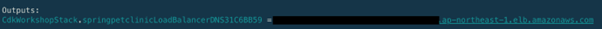

출력에서 로드 밸런서의 DNS 이름을 복사하여 새 브라우저 탭 또는 창에 붙여 넣습니다. 이제 애플리케이션이 AWS CDK를 사용하여 생성된 인프라를 사용하여 Fargate에서 실행되고 있습니다.

### 5) 데이터베이스 구성
이전 단계에서는 AWS CDK를 사용하여 Spring FarClinic 애플리케이션을 AWS Fargate에 배포했습니다. 기본 구성에서 PetClinic은 시작할 때 데이터가 채워지는 메모리 내 데이터베이스 (HSQLDB)를 사용하며, 메모리 내이므로 응용 프로그램이 종료되면 데이터가 손실됩니다. 이것은 실제 시나리오에서 원하는 것이 아닙니다. 데이터베이스는 어플리케이션 저장과 이 데이터베이스로 부터 데이터 복구에 사용됩니다.

이 섹션에서는 Amazon RDS에서 관리하는 MySQL 데이터베이스를 사용하여 AWS CDK를 사용하여 인프라에 프로비저닝 하는 방법을 살펴 보겠습니다.

데이터베이스를 사용하도록 애플리케이션 구성
여기서는 지속성을 위해 데이터베이스를 사용하도록 애플리케이션 구성을 업데이트해야합니다. spring-petclinic 디렉토리로 이동하여 src / main / resources / application.properties 파일을여십시오. 처음 몇 줄을 다음과 같이 수정하십시오.

```
# database init, supports mysql too
database=mysql
spring.datasource.url=${DB_CONN}
spring.datasource.username=${DB_USERNAME}
spring.datasource.password=${DB_PASSWORD}

spring.datasource.schema=classpath*:db/${database}/schema.sql
spring.datasource.data=classpath*:db/${database}/data.sql

# Web
spring.thymeleaf.mode=HTML

# JPA
spring.jpa.hibernate.ddl-auto=update
```

여기에서 데이터베이스를 mysql로 변경하고 데이터 소스 매개 변수도 지정했습니다. 데이터 소스 URL, 사용자 이름 및 비밀번호에 환경 변수를 사용하고 있습니다. 나중에 CDK 스택에서 Fargate 서비스를 정의할 때 이러한 값을 전달합니다.

CDK 스택에 데이터베이스 추가
CDK 스택에 코드를 추가하기 전에 먼저 필요한 구문 라이브러리를 설치 해야합니다.

```
npm install @aws-cdk/aws-secretsmanager
npm install @aws-cdk/aws-rds

lib / cdk-workshop-stack.ts로 돌아가서 코드를 업데이트하여 새로운 가져 오기 및 리소스를 추가하겠습니다.
import cdk = require('@aws-cdk/core');
import ec2 = require('@aws-cdk/aws-ec2');
import ecs = require('@aws-cdk/aws-ecs');
import ecs_patterns = require('@aws-cdk/aws-ecs-patterns');
import asm = require('@aws-cdk/aws-secretsmanager');
import rds = require('@aws-cdk/aws-rds');

export class CdkWorkshopStack extends cdk.Stack {
  constructor(scope: cdk.Construct, id: string, props?: cdk.StackProps) {
    super(scope, id, props);

    // The code that defines your stack goes here
    const vpc = new ec2.Vpc(this, "workshop", {
      maxAzs: 3 // Default is all AZs in region
    });

    const cluster = new ecs.Cluster(this, "fargate", {
      vpc: vpc
    });

    // Let's first generate a password for the database
    const dbSecretId = "petclinicDbPassword";
    const dbSecret = new asm.Secret(this, dbSecretId, {
      generateSecretString: {excludePunctuation: true, includeSpace: false}
    });

    const db = new rds.DatabaseInstance(this, "PetClinicDb", {
      engine: rds.DatabaseInstanceEngine.MYSQL,
      masterUsername: "root",
      masterUserPassword: dbSecret.secretValue,
      instanceIdentifier: "PetClinicDB",
      instanceClass: ec2.InstanceType.of(
          ec2.InstanceClass.BURSTABLE3, ec2.InstanceSize.MICRO // Using db.t3.micro here
        ),
      vpc: vpc,
      databaseName: "petclinic",
      deletionProtection: false, // Default is true, for this workshop we will turn it off
      multiAz: false // Default is true, for this workshop we will not use multiAZ
    });

    // Open port 3306 for MySQL RDS Security Group
    const dbSG = ec2.SecurityGroup.fromSecurityGroupId(this, "PetClinicDBSG", db.securityGroupId);
    dbSG.addIngressRule(ec2.Peer.ipv4(ec2.Vpc.DEFAULT_CIDR_RANGE), ec2.Port.tcp(3306), "Allow connection within the VPC");

    const dbHost = db.dbInstanceEndpointAddress;
    const dbPort = db.dbInstanceEndpointPort;
    const dbUrl = "jdbc:mysql://" + dbHost + ":" + dbPort + "/petclinic";

    // Create a load-balanced Fargate service and make it public
    new ecs_patterns.ApplicationLoadBalancedFargateService(this, "spring-petclinic", {
      cluster: cluster, // Required
      containerPort: 8080, // Port number on the container, default is 80
      cpu: 512, // Default is 256
      desiredCount: 2, // Default is 1
      environment: {
        "DB_CONN": dbUrl,
        "DB_USERNAME": "root"
      },
      secrets: {
        "DB_PASSWORD": ecs.Secret.fromSecretsManager(dbSecret)
      },
      image: ecs.ContainerImage.fromAsset("../spring-petclinic"), // Required
      memoryLimitMiB: 1024, // Default is 512
      publicLoadBalancer: true // Default is false
    });
  }
}
```

RDS 구문 라이브러리와는 별도로 여기서 Secrets Manager 구문 라이브러리를 사용했습니다. 이것이 CDK가 데이터베이스 암호와 같은 자격 증명을 비밀 저장소에 저장하여 모범 사례 패턴을 적용한 방법입니다. 이렇게 하면 암호를 코드에 일반 텍스트로 넣을 수 없습니다. 암호를 사전 생성하고 이를 AWS Secrets Manager에 저장한 다음 CDK에서 암호의 ARN을 참조하거나 여기에서 한 것과 같이 AWS Secrets Manager를 사용하여 직접 새 암호를 생성할 수 있습니다.

추가로 Fargate 서비스를 업데이트할 때 데이터베이스 연결 문자열 및 사용자 이름 (일반 텍스트 값)에 대한 값을 환경에 주입하고 데이터베이스 비밀번호에 대해서는 우리가 작성한 비밀 값을 참조하여 다른 접근 방식을 사용했습니다. 이전에는 비밀 관리자를 사용했습니다.

스택 업데이트
계속해서 터미널에서 기존 스택을 업데이트하고 cdk deploy 변경 사항이 배포 될 때까지 기다리십시오.

```
cdk deploy
```

스택이 업데이트되면 스택 출력의 URL을 사용하여 응용 프로그램을 방문할 수 있습니다. 그게 다야! 이제 Amazon RDS에서 관리하는 MySQL 데이터베이스를 기반으로하는 AWS Fargate에서 Spring Boot 애플리케이션을 실행하고 있습니다.

### 6)	CLEANUP
응용 프로그램을 계속 실행하려는 경우 그렇게 할 수 있습니다 하지만, 이제 마지막 섹션입니다. 이 섹션에서 생성된 모든 리소스를 정리하고 정리하려면 AWS CloudFormation Console로 이동하여 생성된 2 개의 CDK 스택을 삭제하십시오.
선택 CdkWorkshopStack를 누른 다음 삭제.

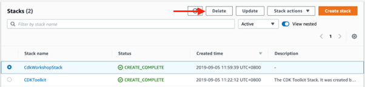

CDKToolkit 스택 의 경우 스택에서 생성 한 S3 버킷을 삭제하기 전에 비워야 합니다. 이동 아마존 S3 콘솔 로 시작 버킷 이름으로 탐색을 찾을 cdktoolkit-stagingbucket , 다음 선택 모든 폴더를 선택 액션을 다음과 삭제합니다. 그 후에 스택을 삭제할 수 있습니다.

## 5.	학습 마무리

나중에 Cloud9 환경에 액세스하려는 경우 기본적으로 30 분 후에 일시 중지됩니다. 일시 중지된 동안 할당된 스토리지 (~ $ 0.10 / GB / 월)에 대해서만 요금을 지불하고 계산에 대해서는 아무것도 지불하지 않습니다.
Cloud9 인스턴스를 종료하려면 다음 지침을 따르십시오.
-	Cloud9 환경으로 이동
-	환경 이름을 선택 실습 및 선택 삭제

## 6.	결론
이 실습에서는 Fargate 클러스터를 만들고 컨테이너를 구축하고 클러스터에 서비스를 배포했습니다. 이 실습의 목표는 컨테이너화된 응용 프로그램을 신속하게 설정하고 배포할 수 있는 환경을 만드는 것입니다.

## 7.	다음 단계
앞으로 이 실습에서 사용된 기술에 대해 더 배우기 위해 다음 작업을 고려할 수 있습니다.
-	AWS Fargate로 심층 분석
-	탄력적로드 밸런싱 : 심층 다이빙 및 모범 사례
-	완전한 CDK 실습을 통해 실행
