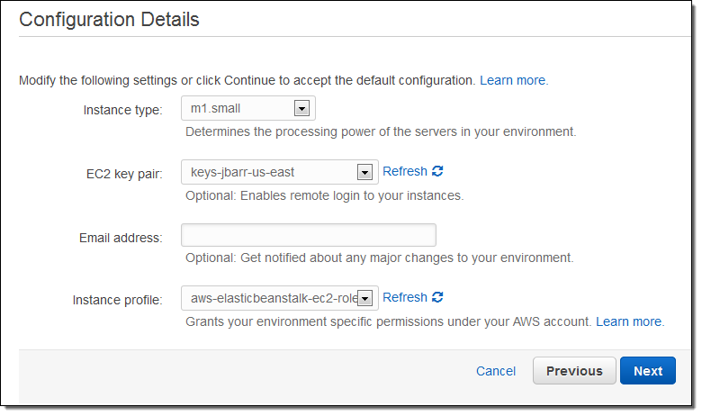

# Docker 용 AWS Elastic Beanstalk


AWS Elastic Beanstalk를 사용하면 AWS 클라우드에서 애플리케이션을 쉽게 배포하고 관리 할 수 ​​있습니다. 애플리케이션을 업로드 한 후 Elastic Beanstalk는 용량 ( Amazon EC2 인스턴스) 을 프로비저닝, 모니터링 및 확장 하는 동시에 모든 정상 인스턴스에서 수신 요청을로드 밸런싱합니다.

Docker 는 다양한 환경에서 실행할 수있는 가볍고 휴대 가능하며 자 급식 컨테이너 형태로 애플리케이션 배포를 자동화합니다. 컨테이너는 사전 빌드 된 Docker 이미지 또는 Dockerfile 이라는 간단한 레시피에서 채울 수 있습니다 .

Docker의 컨테이너 기반 모델은 매우 유연합니다. 예를 들어 컨테이너를 로컬에서 빌드 및 테스트 한 다음 배포 및 확장 성을 위해 AWS 클라우드 에 업로드 할 수 있습니다. Docker의 자동화 된 배포 모델은 애플리케이션을 호스팅하기로 결정한 위치에 관계없이 애플리케이션의 런타임 환경이 항상 올바르게 설치되고 구성되도록합니다.

오늘 우리는 Docker 이미지에 포함되거나 Dockerfiles에 설명 된 애플리케이션을 시작하는 기능을 통해 Elastic Beanstalk를 개선하고 있습니다. Docker는 기존 Node.JS, PHP, Python, .NET, Java 및 Ruby 환경에 합류하는 Elastic Beanstalk를위한 흥미롭고 강력한 새로운 런타임 환경으로 생각할 수 있습니다 .

## Beanstalk, Docker 만나기
오늘 출시와 함께 이제 로컬 데스크톱에서 애플리케이션을 빌드하고 테스트 한 다음 Elastic Beanstalk를 통해 AWS 클라우드에 배포 할 수 있습니다.

원하는 버전의 프로그래밍 언어, 웹 서버 및 응용 프로그램 서버를 사용할 수 있습니다. 원하는대로 구성 할 수 있으며 필요에 따라 추가 패키지와 라이브러리를 설치할 수 있습니다.

기존 공개 및 비공개 Docker 이미지를 시작할 수 있습니다 . 각 이미지에는 애플리케이션 및 해당 종속성의 스냅 샷이 포함되며 몇 가지 간단한 Docker 명령을 사용하여 로컬에서 생성 할 수 있습니다. Elastic Beanstalk에서 이미지를 사용하려면 Dockerrun.aws.json 이라는 파일을 생성합니다 . 이 파일은 사용할 이미지를 지정하고 호스트 환경에서 컨테이너로 매핑 할 볼륨과 노출 할 포트를 설정할 수도 있습니다. 당신이 개인 도커 이미지를 사용하는 경우, 당신은 또한 작성해야합니다 .dockercfg의 파일을 아마존 S3에 저장, 그리고 인증 섹션에서 참조 Dockerrun.aws.json .

Dockerfile을 사용할 수도 있습니다 . 이러한 파일에 포함 된 Docker 명령은 Elastic Beanstalk에서 설정 한 Auto Scaling 구성의 일부로 처리 및 실행됩니다. 즉, Elastic Beanstalk 애플리케이션을 호스팅하는 데 사용되는 새로 생성 된 각 EC2 인스턴스는 Dockerfile의 지시에 따라 구성됩니다.

어떤 옵션을 선택하든 항상 Elastic Beanstalk에 단일 파일을 업로드합니다. 이 업로드는 다음과 같습니다.

1. 일반 Dockerfile.  
2. 일반 Docker.aws.json 파일.  
3. 다른 애플리케이션 자산과 함께 Dockerfile 또는 Docker.aws.json이 포함 된 Zip 파일입니다.  

세 번째 옵션은 인스턴스에 많은 "움직이는 부품"이 있어야하는 응용 프로그램에 유용 할 수 있습니다. Dockerfile을 사용하는 경우 파일에 포함 된 셸 명령을 사용하여 이러한 부분을 가져 오도록 선택할 수도 있습니다.

## Docker 실행 Docker
Elastic Beanstalk를 사용하여 간단한 PHP 애플리케이션을 만들어 보겠습니다! 첫 번째 단계는 모든 Elastic Beanstalk 애플리케이션에서 동일합니다. 이름과 설명 만 입력하면 됩니다.


그런 다음 미리 정의 된 구성으로 Docker를 선택합니다. 이 애플리케이션은 매우 높게 확장 할 필요가 없으므로 단일 인스턴스 환경이 좋습니다.


움직이는 부분은 단일 디렉토리에 있으며 src 및 웹 하위 디렉토리와 루트에 Dockerfile 이 있습니다.

<!-->

-->

```
FROM ubuntu:12.04

# Install dependancies
RUN apt-get update -y
RUN apt-get install -y git apache2 php5 libapache2-mod-php5 php5-mcrypt php5-mysql

# Install composer
RUN curl -sS https://getcomposer.org/installer | php
RUN mv composer.phar /usr/bin/composer

# Install app
RUN rm -rf /var/www/*
ADD . /var/www
RUN cd /var/www && /usr/bin/composer install

# Configure apache 
RUN a2enmod rewrite
RUN chown -R www-data:www-data /var/www
ADD apache.conf /etc/apache2/sites-available/default
ENV APACHE_RUN _USER www-data
ENV APACHE_RUN _GROUP www-data
ENV APACHE_LOG_DIR /var/log/apache2

EXPOSE 80

CMD ["/usr/sbin/apache2", "-D", "FOREGROUND"]
```

나는 그것들을 이와 같은 단일 파일로 압축했습니다 ( .ebextensions 디렉토리 를 명시 적으로 언급해야 했습니다 ).


그런 다음 Elastic Beanstalk에 파일을 업로드합니다.


파일이 업로드되었으므로 이제 Elastic Beanstalk 환경을 생성 할 수 있습니다. 이것이 내 테스트 환경이 될 것입니다. 나중에 프로덕션을위한 별도의 환경을 만들 수 있습니다. Elastic Beanstalk를 사용하면 각 환경을 독립적으로 구성 할 수 있습니다. 각 환경에서 고유 한 버전의 애플리케이션 코드를 실행하도록 선택할 수도 있습니다.


PHP 애플리케이션은 MySQL 데이터베이스를 사용하므로 Elastic Beanstalk에 생성 해달라고 요청합니다 (1 ~ 2 단계로 구성하겠습니다).


이제 인스턴스 유형을 선택합니다. EC2 키 쌍을 지정할 수도 있습니다. 이렇게하면 SSH를 통해 애플리케이션의 EC2 인스턴스에 연결할 수 있으며 디버깅에 유용 할 수 있습니다.



Elastic Beanstalk 애플리케이션과 생성하는 AWS 리소스에 태그를 지정할 수도 있습니다 (이번 주 초에 출시 된 새로운 기능).


이제 RDS 인스턴스를 구성 할 수 있습니다. 사용자 이름과 암호는 환경 변수의 형태로 EC2 인스턴스에 제공됩니다.


다음 PHP 코드는 사용자 이름과 비밀번호를 검색합니다.

```
<?php
  define('DB_NAME', getenv('RDS_DB_NAME'));
  define('DB_USER', getenv('RDS_USERNAME'));
  define('DB_PASSWORD', getenv('RDS_PASSWORD'));
  define('DB_HOST', getenv('RDS_HOSTNAME'));
  define('DB_TABLE', 'urler');
?>
```

시작하기 전 마지막 단계는 모든 설정을 확인하는 것입니다.


Elastic Beanstalk는 동적 업데이트와 함께 애플리케이션 및 환경의 상태를 보여줍니다.


몇 분 후에 환경이 시작되어 실행됩니다.


응용 프로그램은 클릭 한 번이면됩니다.


환경을 만든 후 몇 초 만에 소스 코드를 업데이트하고 새 ZIP 파일을 만들어 환경에 배포 할 수 있습니다.


Docker 용 AWS Elastic Beanstalk는 모든 AWS 리전에서 사용할 수 있으며 지금 바로 사용할 수 있습니다!

