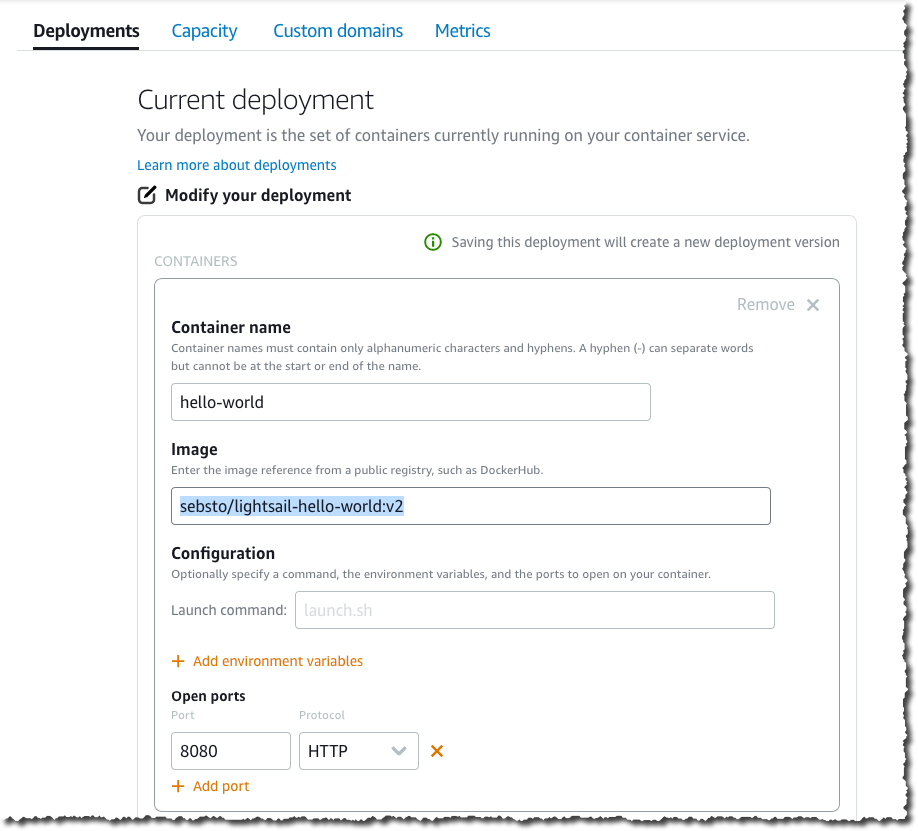
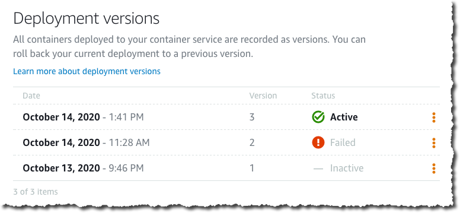

# Amazon Lightsail Container 출시 – 클라우드에서 컨테이너를 손쉽게 실행하는 방법

개발자를 대상으로 AWS 클라우드를 소개할 때 저는 보통 [Amazon Lightsail](https://aws.amazon.com/lightsail/) 을 언급하고 시연하는 데 시간을 어느 정도 할애합니다. AWS에서 작업을 시작하는 방법 중 이보다 쉬운 방법은 없습니다. 몇 분 만에 자체 가상 서버에서 애플리케이션을 실행할 수 있습니다. 현재 Amazon Lightsail에 컨테이너 기반 워크로드를 배포할 수 있는 기능을 추가하고 있습니다. 이제 이 가상 서버에서 제공하는 것과 동일한 번들 요금으로 컨테이너 이미지를 클라우드에 배포할 수 있습니다.

Amazon Lightsail은 애플리케이션 또는 웹 사이트를 배포하는 데 필요한 모든 항목을 제공하는 사용하기 쉬운 클라우드 서비스로, 경제적이고 알기 쉬운 월간 플랜으로 운영됩니다. 간단한 워크로드 또는 웹 사이트를 배포하거나 AWS를 시작하는 데 적합합니다. 일반적인 [Lightsail](https://aws.amazon.com/lightsail/) 고객은 개발자부터 클라우드와 AWS를 빠르게 시작하려는 중소기업 또는 스타트업에 이르기까지 다양합니다. 나중에 AWS 클라우드에 익숙해지면 언제든지 AWS 서비스를 폭넓게 도입할 수 있습니다.

내부적으로 [Lightsail](https://aws.amazon.com/lightsail/)은 Amazon Elastic Compute Cloud (EC2), Amazon Relational Database Service (RDS), Application Load Balancer 및 기타 AWS 서비스를 기반으로 합니다. AWS에서 기대하는 수준의 보안, 안정성 및 확장성을 제공합니다.

[Lightsail](https://aws.amazon.com/lightsail/) 에 배포할 때는 운영 체제 6종(Linux 배포판 4가지, FreeBSD 또는 Windows), 애플리케이션 7종(WordPress, Drupal, Joomla, Plesk 등), 스택 7종(Node.js, Lamp, GitLab, Django 등) 중에서 선택할 수 있습니다. 하지만 Docker 컨테이너의 경우는 어떨까요?

오늘부터 Amazon Lightsail은 개발자가 컨테이너를 클라우드에 배포할 수 있는 간단한 방법을 제공합니다. 고객이 컨테이너의 Docker 이미지만 제공하면 자동으로 컨테이너화됩니다. Amazon Lightsail은 클라우드 컨테이너에서 실행되는 애플리케이션을 지원하는 HTTPS 엔드포인트를 제공합니다. 로드 밸런싱된 TLS 엔드포인트를 자동으로 설정하고 TLS 인증서를 처리합니다. 응답하지 않는 컨테이너를 자동으로 교체하고 엔드포인트에 DNS 이름을 할당하며 새 버전이 정상적으로 작동하는 라이브 상태가 될 때까지 이전 버전을 유지합니다.

간단한 Python 웹 앱을 컨테이너로 배포하여 어떻게 작동하는지 살펴 보겠습니다. 랩톱에 AWS 명령 줄 인터페이스(CLI)와 [Docker](https://docs.docker.com/get-docker/) 가 설치되어 있다고 가정합니다. Python은 필요하지 않습니다. 컨테이너에만 설치됩니다.

먼저 [Flask의 간단한 애플리케이션 프레임워크](https://flask.palletsprojects.com/en/1.1.x/)를 사용하여 Python REST API를 생성합니다. 다른 모든 프로그래밍 언어와 컨테이너 내부에서 실행할 수 있는 프레임워크도 사용 가능합니다. 저는 간단하고 원활하게 작동하는 Python과 Flask를 선택했습니다.

다음 명령을 복사해 붙여 넣어도 됩니다.

```Bash
mkdir helloworld-python
cd helloworld-python
# helloworld.py에 간단한 Flask 애플리케이션을 생성합니다.
echo "

from flask import Flask, request
from flask_restful import Resource, Api

app = Flask(__name__)
api = Api(app)

class Greeting (Resource):
   def get(self):
      return { "message" : "Hello Flask API World!" }
api.add_resource(Greeting, '/') # Route_1

if __name__ == '__main__':
   app.run('0.0.0.0','8080')

"  > helloworld.py
```

그런 다음 컨테이너 이미지를 빌드하는 데 필요한 단계와 정보가 포함 된 Dockerfile을 생성합니다.

```Bash
# Dockerfile 생성
echo '
FROM python:3
ADD helloworld.py /
RUN pip install flask
RUN pip install flask_restful
EXPOSE 8080
CMD [ "python", "./helloworld.py"]
 '  > Dockerfile
```

이제 컨테이너를 빌드할 수 있습니다.

```Bash
docker build -t lightsail-hello-world .
```

build 명령은 컨테이너를 빌드하는 동안 여러 줄을 출력하며 결국 다음 메시지와 함께 종료됩니다(실제 ID는 다름).

```Bash
Successfully built 7848e055edff
Successfully tagged lightsail-hello-world:latest
```

랩톱에서 컨테이너를 실행하여 테스트합니다.

```Bash
docker run -it --rm -p 8080:8080 lightsail-hello-world
```

그리고 브라우저에서 localhost:8080에 연결합니다.


컨테이너에서 Flask API 테스트

앱에 만족하면 컨테이너를 Docker Hub로 푸시합니다.

```Bash
docker tag lightsail-hello-world sebsto/lightsail-hello-world
docker login
docker push sebsto/lightsail-hello-world
```

Docker Hub에 컨테이너가 준비되었으므로 Lightsail 컨테이너 서비스를 생성해 보겠습니다.

브라우저에서 Amazon Lightsail 콘솔에 접속합니다. 이미 배포된 컨테이너 서비스를 보고 관리할 수 있습니다. 새 서비스를 생성하려면 [컨테이너 서비스 생성: :Lighsail Container 콘솔(Create container service: Lighsail Container Console)]을 클릭합니다.


다음 화면에서 애플리케이션에 사용할 수 있는 vCPU 및 메모리와 관련하여 사용하려는 컨테이너의 크기를 선택합니다. 또한 고가용성 또는 확장성을 위해 병렬로 실행할 컨테이너 인스턴스의 수를 선택합니다. 서비스를 중단하지 않고 언제든지 컨테이너 인스턴스 수 또는 컴퓨팅 파워(vCPU 및 RAM)를 변경할 수 있습니다. 이 두 가지 파라미터 모두 AWS가 매월 청구하는 요금에 영향을 미칩니다. 요금은 다음 동영상과 같이 화면에 표시되고 동적으로 조정됩니다.


화면의 조금 아래쪽에서 우선은 배포를 건너 뛰도록 선택합니다. 서비스의 이름(“hello-world“)을 지정합니다. [컨테이너 서비스 생성(Create container service)]을 클릭합니다.


서비스가 생성되면 [첫 번째 배포 생성(Create your first deployment)]을 클릭하여 배포를 생성합니다. 배포는 방금 생성한 서비스에 배포할 특정 컨테이너 이미지와 버전의 조합입니다.

이미지의 이름을 선택하고 user/<my container name>:tag 형식을 사용하여 Docker Hub에 이미지 주소를 지정합니다. 또한 여기에 환경 변수, 포트 매핑 또는 실행 명령도 입력할 수 있습니다.

이 컨테이너는 포트 TCP 8080에서 네트워크 서비스를 제공하고 있으므로 해당 포트를 배포 구성에 추가합니다. [포트 열기(Open Port)] 구성은 컨테이너 네트워크의 다른 시스템에 개방할 포트와 프로토콜을 지정합니다. 포트를 콘솔에서 명시적으로 구성하거나 Dockerfile에서 EXPOSE할 경우에만 다른 컨테이너 또는 가상 머신이 이 컨테이너에 연결할 수 있습니다. 이러한 포트 중 어느 것도 공용 인터넷에 노출되지 않습니다.

그러나 이 예제에서는 Lightsail이 공용 인터넷에서 이 컨테이너로도 트래픽을 라우팅하도록 하려고 합니다. 따라서 이 컨테이너를 방금 생성한 hello-world 서비스의 엔드포인트로 추가합니다. 엔드포인트는 TLS에 대해 자동으로 구성되며, 인증서를 설치하거나 관리할 필요가 없습니다.

단일 배포에 대해 최대 10개의 컨테이너를 추가할 수 있습니다. 준비가 되면 [저장 및 배포(Save and deploy)]를 클릭합니다.


잠시 후 배포가 활성화되고 엔드포인트를 테스트할 수 있습니다.


엔드포인트 DNS 주소는 콘솔의 오른쪽 상단에서 확인할 수 있습니다. 필요한 경우 자체 DNS 도메인 이름을 구성할 수 있습니다.


브라우저에서 다른 탭을 열고 https 엔드포인트 URL에 접속합니다.


새 버전을 배포해야 하는 경우 콘솔을 다시 사용하여 배포를 수정합니다. 애플리케이션 코드를 수정하고 컨테이너의 새 버전을 빌드하고 푸시하는 방법은 여기서 자세히 설명하지 않겠습니다. sebsto/lightsail-hello-world:v2라는 이름의 사용 가능한 두 번째 컨테이너 이미지 버전이 있다고 가정해 보겠습니다. Amazon Lightsail 콘솔로 돌아가 [배포(Deployments)]를 클릭한 다음 [배포 수정(Modify your Deployments)]을 클릭합니다. 새 컨테이너 이미지 버전의 태그를 포함한 전체 이름을 입력하고 [저장 및 배포(Save and Deploy)]를 클릭합니다.



잠시 후 새 버전이 배포되고 자동으로 활성화됩니다.



브라우저에서 새 탭을 열고 Amazon Lightsail 콘솔의 오른쪽 상단에 있는 엔드포인트 URI에 접속합니다. JSON 버전이 다르다는 것을 확인할 수 있습니다. 이제 값이 2인 version 속성이 있습니다.


배포 중에 문제가 발생하면 Amazon Lightsail은 서비스 중단을 방지하기 위해 마지막 배포를 자동으로 활성 상태로 유지합니다. 이전 배포 버전을 수동으로 활성화하여 원치 않는 변경 사항을 되돌릴 수도 있습니다.

방금 Docker Hub에서 첫 번째 컨테이너 이미지를 배포했습니다. 또한 AWS 명령줄 인터페이스(CLI)를 사용하여 랩톱에서 서비스를 관리하고 로컬 컨테이너 이미지를 배포할 수도 있습니다. 랩톱에서 직접 Amazon Lightsail 컨테이너 서비스로 컨테이너 이미지를 푸시하려면 LightSail 컨트롤러 플러그인을 설치해야 합니다. (참고: curl, cp 및 chmod는 유용합니다. 컨테이너 내부에 CLI를 사용하기 위해 DockerFile도 유지합니다.)

컨테이너 서비스를 생성, 나열 또는 삭제하려면 다음을 입력합니다.

```Bash
aws lightsail create-container-service --service-name myservice --power nano --scale 1

aws lightsail get-container-services
{
   "containerServices": [{
      "containerServiceName": "myservice",
      "arn": "arn:aws:lightsail:us-west-2:012345678901:ContainerService/1b50c121-eac7-4ee2-9078-425b0665b3d7",
      "createdAt": "2020-07-31T09:36:48.226999998Z",
      "location": {
         "availabilityZone": "all",
         "regionName": "us-west-2"
      },
      "resourceType": "ContainerService",
      "power": "nano",
      "powerId": "",
      "state": "READY",
      "scale": 1,
      "privateDomainName": "",
      "isDisabled": false,
      "roleArn": ""
   }]
}

aws lightsail delete-container-service --service myservice
```

CLI를 사용하여 랩톱에서 직접 컨테이너 이미지를 배포할 수도 있습니다. lightsailctl이 설치되어 있는지 확인합니다.

```
# 이미지의 새 버전 생성(v3)
docker build -t sebsto/lightsail-hello-world:v3 .

# 새 이미지 푸시
aws lightsail push-container-image --service-name hello-world --label hello-world --image sebsto/lightsail-hello-world:v3
```

잠시 후 출력이 표시됩니다.

```
Image "sebsto/lightsail-hello-world:v3" registered.
Refer to this image as ":hello-world.hello-world.1" in deployments.
```

배포 구성의 세부 정보를 저장할 lc.json 파일을 생성합니다. 콘솔에 표시되는 옵션에 맞추어 정렬됩니다. image 속성에 이전 명령에서 지정된 이름을 보고합니다.

```
{
  "serviceName": "hello-world",
  "containers": {
     "hello-world": {
        "image": ":hello-world.hello-world.1",
        "ports": {
           "8080": "HTTP"
        }
     }
  },
  "publicEndpoint": {
     "containerName": "hello-world",
     "containerPort": 8080
  }
}
```

마지막으로 다음을 사용하여 새 서비스 버전을 생성합니다.

```
aws lightsail create-container-service-deployment --cli-input-json file://lc.json
```

다음을 사용하여 배포 상태를 쿼리할 수 있습니다.

```
aws lightsail get-container-services

...
"nextDeployment": {
   "version": 4,
   "state": "ACTIVATING",
   "containers": {
      "hello-world": {
      "image": ":hello-world.hello-world.1",
      "command": [],
      "environment": {},
      "ports": {
         "8080": "HTTP"
      }
     }
},
...
```

잠시 후 ACTIVE 상태로 전환되고 엔드포인트를 테스트할 수 있습니다.

```
curl https://hello-world.nxxxxxxxxxxx.lightsail.ec2.aws.dev/
{"message": "Hello Flask API World!", "version": 3}
```

나중에 변경할 필요 없이 컨테이너를 Amazon ECS 또는 Amazon Elastic Kubernetes Service 배포할 수 있습니다. Amazon Lightsail과 마찬가지로 리포지토리에서 컨테이너 이미지를 가져올 수 있습니다.

Amazon Lightsail을 사용할 수 있는 모든 AWS 리전에서 Lightsail에 컨테이너를 배포할 수 있습니다. 현재 미국 동부(오하이오), 미국 동부(버지니아 북부), 미국 서부(오레곤), 아시아 태평양(뭄바이), 아시아 태평양(서울), 아시아 태평양(싱가포르), 아시아 태평양(시드니), 아시아 태평양(도쿄), 캐나다(중부), 유럽(프랑크푸르트), 유럽(아일랜드), 유럽(런던), 유럽(파리) 리전 등입니다.

여타의 서비스와 마찬가지로 Amazon Lightsail 사용 시 요금은 이해하기 쉽고 예측할 수 있습니다. Amazon Lightsail 컨테이너는 컨테이너의 크기(사용하는 vCPU/메모리 조합)에 따라 컨테이너당 월별 고정 요금이 적용됩니다. 서비스를 계속 실행하는 시간을 기준으로 비례 배분하여 요금이 청구됩니다. 월별 요금은 24/7로 서비스를 실행할 때 부과되는 최고 요금입니다. 요금은 모든 AWS 리전에서 동일합니다. 요금은 나노 컨테이너(512MB 메모리 및 0.25개의 vCPU 코어)의 월 7 USD부터 X-라지 컨테이너(8GB 메모리 및 4개의 vCPU 코어)의 월 160 USD까지 다양합니다. 이 요금에는 컨테이너 자체뿐만 아니라 로드 밸런서, DNS 및 넉넉한 용량의 데이터 전송 계층도 포함됩니다. 다른 AWS 리전의 세부 정보 및 가격은 Lightsail 요금 페이지에 나와 있습니다.

