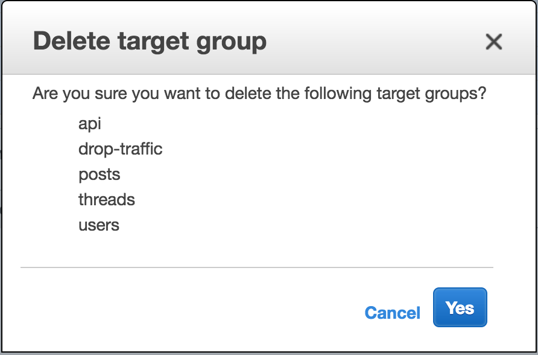

# 모듈 5 - 정리
이 모듈에서는 이 자습서에서 생성한 리소스를 종료합니다. Amazon ECS에서 서비스 실행을 정지하고, ALB를 삭제하고, AWS CloudFormation 스택을 삭제하여 모든 기본 EC2 인스턴스를 포함한 ECS 클러스터를 종료하게 됩니다.

정리 서비스가 필수는 아니지만, 이 서비스를 계속 실행하면 요금이 계속 발생하는 것을 방지할 수 있습니다.

## 정리 지침
아래의 지침에 따라 각 모듈에서 생성한 AWS 리소스를 삭제하십시오.

## 1단계. 서비스 끄기

클러스터에서 실행 중인 각 서비스(포스트, 스레드, abd 사용자)를 삭제하는 것으로 정리를 시작합니다.

- [Amazon ECS 콘솔](https://console.aws.amazon.com/ecs/home?)로 이동하여 [클러스터]를 선택합니다.

- BreakTheMonolith-Demo 클러스터를 선택합니다.

- [서비스] 탭에서 서비스를 선택한 다음, [삭제]를 선택합니다.

- 삭제를 확인합니다.

- 모든 서비스가 삭제될 때까지 단계를 반복합니다.

다음 단계로 넘어가기 전에 모든 실행 중인 작업이 종료될 때까지 기다리거나 [작업] 탭을 선택하고 [모두 중지]를 선택해야 합니다.

♻ 클러스터에 있는 각 서비스에 대해 이 단계를 반복합니다.

## 2단계. 리스너 끄기

- [EC2 콘솔의 [Load Balancer] 섹션](https://console.aws.amazon.com/ec2/v2/home?#LoadBalancers:)으로 이동합니다.

- [데모] 옆에 있는 확인란을 선택하고 [리스너] 탭을 선택합니다.

- 리스너를 선택한 다음, [삭제]를 선택합니다.

삭제를 확인합니다.

## 3단계. 대상 그룹 삭제

- EC2 콘솔에서 [[대상 그룹]](https://console.aws.amazon.com/ec2/v2/home?#TargetGroups:)으로 이동합니다.

- 목록 상단([이름] 옆)에 있는 확인란을 선택하여 모든 대상 그룹을 선택합니다.

- [작업]을 선택한 다음, [삭제]를 선택합니다.

- 삭제를 확인합니다.

## 4단계. CloudFormation 스택 삭제

- [AWS CloudFormation 콘솔](https://console.aws.amazon.com/cloudformation/home?)로 이동합니다.

- Cloudformation 스택 [BreakTheMonolith-Demo] 옆에 있는 확인란을 선택합니다.

- [작업]을 선택한 다음, [스택 삭제]를 선택합니다.

- 삭제를 확인합니다.

- 스택 상태가 DELETE_IN_PROGRESS로 변경되어야 합니다.

⚠ 경고! 스택을 실행 중인 상태로 두면 AWS 계정에 변경 사항이 발생합니다.

## 5단계. 작업 정의 등록 해제

- Amazon ECR 콘솔의 [[작업 정의]](https://console.aws.amazon.com/ecs/home?#/taskDefinitions)로 이동합니다.

- 작업 정의(api, 포스트, 스레드 또는 사용자)를 선택합니다.

- [작업 정의 이름] 페이지에서 작업 이름 옆의 확인란을 선택합니다.

- [작업]을 선택한 다음, 드롭다운 목록에서 [등록 해제]를 선택합니다.

- 작업을 확인합니다.

♻ 모든 4개의 작업 정의에 대해 이 단계를 반복합니다.

## 6단계. Amazon ECR 레포지토리 삭제

- Amazon ECR 콘솔에서 [[리포지토리]](https://console.aws.amazon.com/ecs/home?#/repositories)로 이동합니다.

- 리포지토리 옆에 있는 확인란을 선택한 다음, [삭제]를 선택합니다.

- 삭제를 확인합니다.

모든 리포지토리가 삭제될 때까지 단계를 반복합니다.

[이전: 소개](./README.md)