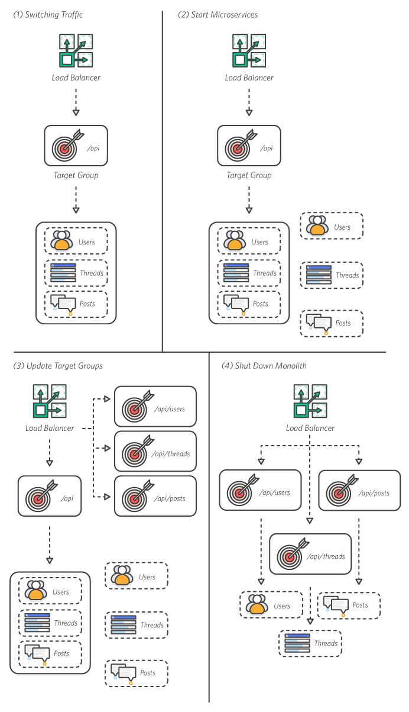
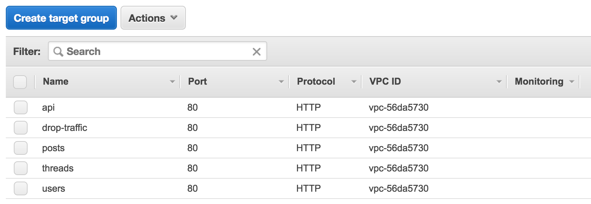
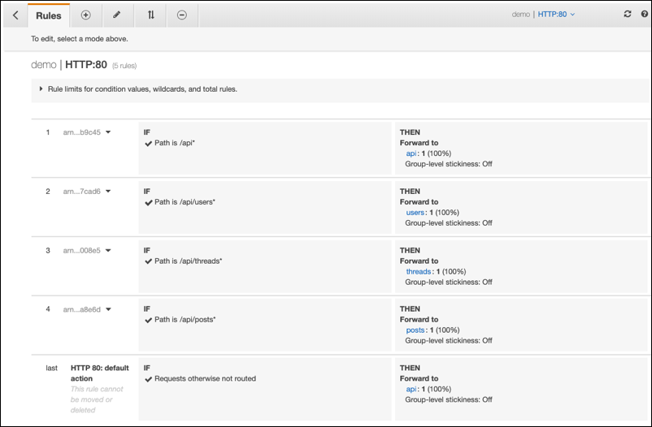
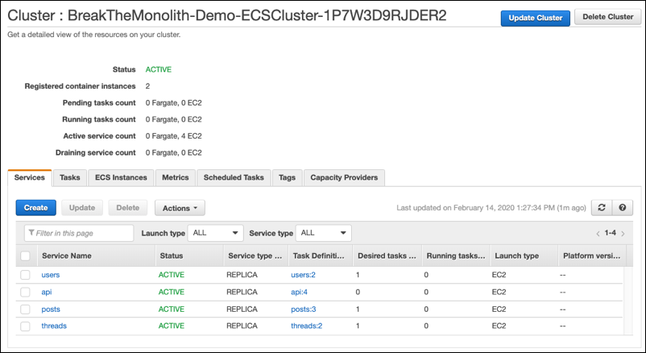
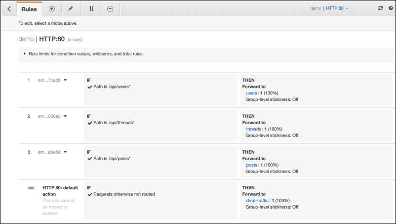
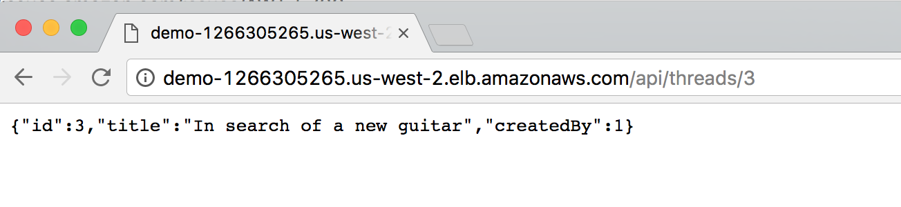

# 모듈 4 - 마이크로서비스 배포
이 모듈에서는 node.js 애플리케이션을 Application Load Balancer(ALB) 배후의 일련의 상호 연결 서비스로 배포합니다. 그런 다음, ALB를 사용하여 트래픽을 모놀리스에서 마이크로서비스로 원활하게 전환할 수 있습니다. 구축 시작

## 아키텍처 개요
이 프로세스는 마이크로서비스를 배포하고 애플리케이션의 트래픽을 모놀리스로부터 안전하게 전환할 때 수행하는 프로세스입니다.



1. 트래픽 전환

초기 구성입니다. Amazon ECS 컨테이너에서 실행되는 모놀리스 node.js 앱입니다.

2. 마이크로서비스 시작

이전 모듈에서 구축하여 Amazon ECR에 업로드한 세 개의 컨테이너 이미지를 사용하여 기존 Amazon ECS 클러스터에서 세 개의 마이크로서비스를 시작할 수 있습니다.

3. 대상 그룹 구성

모듈 2에서와 같이 각 서비스의 대상 그룹을 추가하고 ALB 규칙을 업데이트하여 새 마이크로서비스를 연결할 수 있습니다.

4. 모놀리스 차단

ALB의 규칙 하나를 변경하면 트래픽을 실행되는 마이크로서비스로 라우팅할 수 있습니다. 트래픽 다시 라우팅을 확인한 후에 모놀리스를 차단하십시오.

## 구현 지침
아래의 단계별 지침에 따라 마이크로서비스를 배포합니다. 각 단계 번호를 선택하면 섹션이 펼쳐집니다.

## 1단계. 서비스의 작업 정의를 작성합니다.
세 개의 새 서비스를 모듈 2에서 시작한 클러스터에 배포합니다. 모듈 2에서와 같이 각 서비스의 작업 정의를 작성합니다.

⚐ 참고: 다수의 컨테이너를 단일 작업 정의에 추가할 수 있습니다. 이는 세 개의 모든 마이크로서비스를 단일 서비스와 다른 컨테이너로 실행할 수 있다는 것을 의미합니다. 그러나 이 방법은 각 컨테이너를 서비스와 선형으로 확장해야 하기 때문에 여전히 모놀리스입니다. 사용자의 목표는 세 가지의 독립적인 서비스를 보유하는 것입니다. 각 서비스에는 해당 서비스의 이미지로 컨테이너를 실행하는 독자적인 작업 정의가 필요합니다.

이 작업 정의는 Amazon ECS 콘솔에서 생성하거나 JSON으로 작성함으로써 신속하게 생성할 수 있습니다. 작업 정의를 JSON 파일로 작성하려면 다음 단계를 수행합니다.

1. [Amazon 컨테이너 서비스 콘솔](https://console.aws.amazon.com/ecs/home/)에서 [Amazon ECS] 아래의 [작업 정의]를 선택합니다.

2. 작업 정의 페이지에서 [새 작업 정의 생성[ 버튼을 선택합니다.

3. 시작 유형 호환성 선택 페이지에서 [EC2] 옵션을 선택한 후에 [다음 단계]를 선택합니다.

4. 작업 및 컨테이너 정의 구성 페이지에서 [볼륨] 섹션으로 스크롤 이동하여 [JSON을 통한 구성] 버튼을 선택합니다.

5. 다음 코드 스니펫을 복사하여 JSON 필드에 붙여 넣어서 기존 코드를 대체합니다.

반드시 [서비스-이름], [계정-ID], [리전] 및 [태그] 플레이스홀더를 대체해야 합니다.

⚐ 참고: 작업 정의에 사용되는 매개변수는 다음과 같습니다.

- 이름 = [서비스-이름: 포스트, 스레드 및 사용자]

- 이미지 = [Amazon ECR 리포지토리 이미지 URL]:최근

- CPU = 256 

- 메모리 = 256 

- 컨테이너 포트 = 3000 

- 호스트 포스트 = 0

```
{
    "containerDefinitions": [
        {
            "name": "[service-name]",
            "image": "[account-id].dkr.ecr.[region].amazonaws.com/[service-name]:[tag]",
            "memoryReservation": "256",
            "cpu": "256",
            "essential": true,
            "portMappings": [
                {
                    "hostPort": "0",
                    "containerPort": "3000",
                    "protocol": "tcp"
                }
            ]
        }
    ],
    "volumes": [],
    "networkMode": "bridge",
    "placementConstraints": [],
    "family": "[service-name]"
}
```

♻ 단계를 반복하여 각 서비스의 작업 정의를 생성합니다.

- 포스트

- 스레드

- 사용자

## 2단계. Application Load Balancer 구성 : 대상 그룹

모듈 2에서와 같이 각 서비스(포스트, 스레드 및 사용자)의 대상 그룹을 구성합니다. 대상 그룹에 따라 트래픽이 지정된 서비스에 정확하게 도달할 수 있습니다. 대상 그룹은 AWS CLI를 사용하여 구성합니다. 그러나 진행하기 전에 VPC 이름이 이 자습서에 사용할 수 있는 올바른 이름인지 확인해야 합니다.

- EC2 콘솔의 [Load Balancer 섹션](https://console.aws.amazon.com/ec2/v2/home?#LoadBalancers:)으로 이동합니다.

- 데모 옆의 확인란을 선택하고 [설명] 탭을 선택한 후에 VPC 속성(형식: vpc-xxxxxxxxxxxxxxxxx)을 찾습니다.

⚐ 참고: 대상 그룹을 구성하려면 VPC 속성이 있어야 합니다.

대상 그룹 구성

터미널에서 다음 명령을 입력하여 각 서비스(포스트, 스레드 및 사용자)의 대상 그룹을 생성합니다. 대상 그룹은 또한 마이크로서비스를 완전히 실행한 후에 트래픽이 모놀리스에 도달하지 못하게 억제함으로써 생성할 수도 있습니다(트래픽 드랍). 반드시 [리전], [서비스-이름] 및 [vpc-속성] 플레이스 홀더를 대체해야 합니다.

서비스 이름: 포스트, 스레드, 사용자 및 트래픽 드랍.

```
aws elbv2 create-target-group --region [region] --name [service-name] --protocol HTTP --port 80 --vpc-id [vpc-attribute] --healthy-threshold-count 2 --unhealthy-threshold-count 2 --health-check-timeout-seconds 5 --health-check-interval-seconds 6
```



## 3단계. 리스너 규칙 구성

[리스너](http://docs.aws.amazon.com/elasticloadbalancing/latest/application/load-balancer-listeners.html)는 트래픽을 적절하게 라우팅하기 위해 ALB에 수신된 연결 요청을 검토합니다.

현재 모두 네 개의 서비스(모놀리스 및 세 개의 마이크로서비스)가 동일한 로드 밸런서 배후에서 실행되고 있습니다. 모놀리스에서 마이크로서비스로 전환하려면 마이크로서비스의 트래픽 라우팅을 시작하고 모놀리스의 트래픽 라우팅을 중단시켜야 합니다.

리스너 규칙 액세스

- EC2 콘솔의 Load Balancer 섹션으로 이동합니다.

- 데모라는 명칭의 Load Balancer를 찾아서 옆의 확인란을 선택하여 Load Balancer 세부 정보를 참조합니다.

[리스너] 탭을 선택합니다.

리스너 규칙 업데이트

이 탭에는 리스너 한 명만 열거되어 있어야 합니다. 리스너 규칙을 편집하려면 다음 단계를 수행합니다.

- [규칙] 열 아래에서 [규칙 보기/편집]을 선택합니다.

- [규칙] 페이지에서 플러스(+) 버튼을 선택합니다.

- [규칙 삽입] 옵션이 페이지에 표시됩니다. 

다음과 같은 규칙 템플릿을 사용하여 필요한 규칙, 즉 트래픽을 모놀리스에 유지하는 규칙과 각 마이크로서비스에 유지하는 규칙을 삽입합니다.

- IF 경로 = /api/[서비스-이름]* 다음에 [서비스-이름]으로 전송
예를 들어, IF 경로 = /api/포스트* 다음에 포스트로 전송

- 다음 순서로 규칙을 삽입합니다.

    - API: /api*는 api로 전송
    
    - 사용자: /api/users*는 users로 전송

    - 스레드: /api/threads*는 threads로 전송

    - 포스트: /api/posts*는 posts로 전송

- [저장]을 선택합니다.

- 페이지 좌측 상단의 뒤로가기 화살표를 선택하여 로드 밸런서 콘솔로 돌아갑니다.



## 4단계. 마이크로서비스 배포

세 개의 마이크로서비스(포스트, 스레드 및 사용자)를 클러스터에 배포합니다. 세 개의 각 마이크로서비스에 대해 이 단계를 반복 수행합니다.

- [Amazon ECS 콘솔](https://console.aws.amazon.com/ecs/home)로 이동하여 왼쪽 메뉴 바에서 [클러스터]를 선택합니다.

- [클러스터 모놀리스 나누기 – 데모]를 선택하고 [서비스] 탭을 선택한 후에 [생성]을 선택합니다.

- 서비스 구성 페이지에서 다음 매개변수를 편집합니다(그리고 아래에 열거되지 않은 매개변수는 기본값을 그대로 유지합니다).

    - [시작 유형]에서 [EC2]를 선택합니다.

    - [작업 정의]에서 [값 입력] 버튼을 선택하여 가장 높은 개정 값을 자동으로 선택합니다.
    예: api:1 

    - [서비스 이름]에서 서비스 이름(포스트, 스레드 또는 사용자)을 입력합니다.

    - [작업 수]에 1을 입력합니다.

- [다음 단계]를 선택합니다.

- [네트워크 구성] 페이지, [로드 밸런싱] 섹션에서 다음 작업을 수행합니다.
    
    - [Load Balancer 유형]에서 [애플리케이션 Load Balancer]를 선택합니다.

    - 서비스 IAM 역할에서 모놀리스 벗어나기-데모-ECSServiceRole을 선택합니다.

    - Load balancer 이름에서 [데모]가 선택되었는지 확인합니다.

    -   로드 밸런스 컨테이너 섹션에서 [로드 밸런서에 추가] 버튼을 선택하고 다음과 같은 편집 작업을 수행합니다.

        - [프로덕션 리스너 포트]에서 80:HTTP로 설정합니다.
        
        - 대상 그룹 이름에서 해당 그룹(포스트, 스레드 또는 사용자)을 선택합니다.

- [다음 단계]를 선택합니다.

- [자동 확장 설정] 페이지에서 [다음 단계]를 선택합니다.

- [검토] 페이지에서 [서비스 생성]을 선택합니다.

- [서비스 보기]를 선택합니다.

몇 초 이내에 모든 서비스를 시작해야 합니다. 진행하기 전에 모든 서비스 및 작업이 실행되고 활성화 상태인지 이중으로 확인하십시오.



## 5단계. 트래픽을 마이크로 서비스로 전환

마이크로서비스가 지금 실행되었지만 모든 트래픽은 여전히 모놀리스 서비스로 전송되고 있습니다. 트래픽을 마이크로서비스로 다시 라우팅하려면 다음 단계를 수행하여 리스너 규칙을 업데이트해야 합니다.

- [EC2 콘솔의 Load Balancer 섹션](https://console.aws.amazon.com/ec2/v2/home?#LoadBalancers:)으로 이동합니다.

- 데모 옆의 확인란을 선택하여 Load Balancer 세부 정보를 참조합니다.

- [리스너] 탭을 선택합니다.
리스너 한 명만 열거되어 있어야 합니다.

- [규칙] 열 아래에서 [규칙 보기/편집]을 선택합니다.

- [규칙] 페이지에서 상단 메뉴의 마이너스(-) 버튼을 선택합니다.

- [규칙] 옆의 확인란을 선택하여 첫 번째 규칙(/api* forwards to api)을 삭제합니다.

- [삭제]를 선택합니다.

- 기본 규칙을 업데이트하여 트래픽 드랍에 전송합니다.

    - 상단 메뉴에서 편집(연필 모양) 버튼을 선택합니다.
    
    - 기본 규칙 옆의 편집(연필 모양) 아이콘을 선택합니다(HTTP 80: 기본 액션).

    - [THEN] 열의 편집(연필 모양) 아이콘을 선택하여 수신 서비스를 편집합니다.

    - [대상 그룹] 입력 필드에서 트래픽-드랍을 선택합니다.

    - [업데이트] 버튼을 선택합니다.

다음 스크린샷을 통해 규칙 업데이트의 예제를 참조하십시오.



모놀리스 비활성화: 현재 트래픽이 마이크로서비스로 전송되는 상태에서 모놀리스 서비스를 비활성화할 수 있습니다.

- 다시 Amazon ECS 클러스터 모놀리스 나누기-데모- ECSCluster로 이동합니다.

- [서비스] 탭에서 [api] 옆의 확인란을 선택하고 [업데이트]를 선택합니다.

- [구성 서비스] 페이지에서 [작업 수]를 찾아서 0을 입력합니다.

- [검토로 건너뛰기]를 선택합니다.

- [서비스 업데이트]를 선택합니다.

Amazon ECS에서 서비스가 클러스터에 배포한 컨테이너에서 연결을 비운 다음, 컨테이너를 중지할 것입니다. 30초 후에 배포 또는 작업 목록을 새로 고침하면 작업 수가 0으로 떨어진 것을 확인하게 됩니다. 서비스가 아직 활성화되어 있어서 어떤 이유에서든 롤백이 필요한 경우, 업데이트하기만 하면 더 많은 작업을 배포할 수 있습니다.

또는, api 서비스를 삭제할 수도 있습니다. [서비스] 탭에서 [api] 옆의 확인란을 선택하고 [삭제]를 선택한 다음, 삭제를 확인합니다.

서비스 중단 없이 node.js를 모놀리스에서 마이크로서비스로 완전히 전환하였습니다!

## 6단계. 배포 검증

서비스 URL 찾기: 이 자습서의 모듈 2에서 사용했던 것과 동일한 URL입니다.

- [EC 콘솔의 [Load Balancers] 섹션](https://console.aws.amazon.com/ec2/v2/home?#LoadBalancers:)으로 이동합니다.

- 데모 옆의 확인란을 선택하여 Load Balancer 세부 정보를 참조합니다.

- [설명] 탭에서 DNS 이름을 찾고, URL 끝의 복사 아이콘을 선택합니다. 

- DNS 이름을 새 브라우저 탭이나 새 창에 붙여넣습니다.
'Ready to receive requests'라는 메시지가 표시되어야 합니다.

각 마이크로서비스의 값 확인: ALB가 요청 URL에 기반하여 트래픽을 라우팅합니다. 각 서비스를 보려면 서비스 이름을 DNS 이름 끝에 추가합니다.

- http://[DNS 이름]/api/users

- http://[DNS 이름]/api/threads

- http://[DNS 이름]/api/posts



⚐ 참고: 이 URL은 모놀리스를 배포했을 때와 정확히 동일하게 실행됩니다. 이 내용은 이 앱에 연결할 것으로 예상하는 API 또는 소비자가 개발자의 변경 사항에 영향을 받지 않기 때문에 매우 중요합니다. 모놀리스에서 마이크로서비스로 전환하더라도 인프라의 다른 부분을 변경할 필요가 없습니다.

API 테스트에 [Postman](https://www.getpostman.com/)과 같은 도구를 사용할 수도 있습니다.

[이전: 모놀리스 배포](./module-three.md) | [다음: 마이크로서비스 배포](./module-five.md)