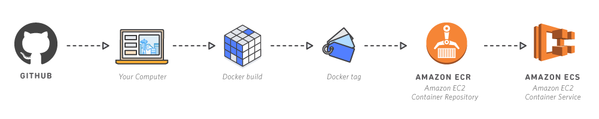
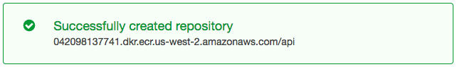
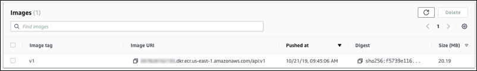

# 모듈 1 - 모놀리스 컨테이너화

이 모듈에서는 모놀리식 node.js 애플리케이션의 컨테이너 이미지를 구축하고 이를 Amazon Elastic Container Registry로 푸시합니다. 구축 시작

## 컨테이너란?
컨테이너를 사용하면 애플리케이션의 코드, 구성 및 종속 항목을 사용이 간편한 빌딩 블록으로 손쉽게 패키징할 수 있으며 빌딩 블록은 환경 일관성, 운영 효율성, 개발자 생산성, 버전 제어를 제공합니다. 컨테이너는 애플리케이션을 배포 환경과 관계없이 빠르고 안정적이며 일관되게 배포할 수 있도록 해줍니다.

## 왜 컨테이너를 사용하는가?
### 속도
상당한 배포 오버헤드 없이도 새로운 코드 릴리스로 컨테이너를 시작할 수 있습니다. 개발자의 로컬 컴퓨터에서 컨테이너에 구축된 코드를 컨테이너로 이동하는 것만으로 테스트 서버로 간단히 옮길 수 있으므로 운영 속도가 향상됩니다. 이 컨테이너는 구축 시 애플리케이션 스택을 실행하는 데 필요한 다른 컨테이너로 연결될 수 있습니다.

### 종속성 제어 및 개선된 파이프라인
Docker 컨테이너 이미지는 애플리케이션 코드와 종속성을 특정 시점에 캡처한 것입니다. 엔지니어링 조직은 이를 통해 애플리케이션 수명 주기에 맞는 표준 파이프라인을 생성할 수 있습니다. 예를 들면 다음과 같습니다.

1. 개발자가 로컬에서 컨테이너를 구축하고 실행합니다.

2. 지속적 통합 서버는 동일한 컨테이너를 실행하고 이에 대한 통합 테스트를 실행하여 기대를 충족하는지 확인합니다.

3. 동일한 컨테이너가 스테이징 환경으로 이동되고, 여기에서 부하 테스트 또는 수동 QA를 사용하여 런타임 동작을 확인할 수 있습니다.

4. 동일한 컨테이너가 프로덕션으로 이동됩니다.

통합 및 배포 파이프라인의 모든 단계에서 정확히 동일한 컨테이너를 구축, 테스트, 이동 및 실행할 수 있으므로 매우 손쉽게 고품질의 신뢰할 수 있는 애플리케이션이 제공됩니다.

### 밀도 및 리소스 효율성
컨테이너는 여러 개의 이질적 프로세스를 단일 시스템에서 실행시켜서 리소스 효율성을 향상합니다. 리소스 효율성은 컨테이너가 사용하는 분리와 할당 기술의 자연스러운 결과물입니다. 컨테이너는 호스트 CPU와 메모리 중에서 특정 용량만 사용하도록 제한할 수 있습니다. 컨테이너에 어떤 리소스가 필요하고, 기본 호스트 서버에서 어떤 리소스를 사용할 수 있는지 이해하면 작은 규모의 호스트로 사용하는 컴퓨팅 리소스를 적절히 조정하거나 큰 규모의 단일 호스트에서 실행되는 프로세스의 밀도를 높여 가용성을 향상하고 리소스 소비를 최적화할 수 있습니다.

### 유연성
Docker 컨테이너의 유연성은 이동성, 배포 편이성 및 작은 용량에 기반합니다. VM에서 설치와 구성이 필요한 것에 비해 컨테이너 내부의 패키징 서비스를 사용하면 손쉽게 호스트 사이를 이동하고, 다른 인접 서비스 장애와 분리되며, 호스트 시스템의 잘못된 패치나 소프트웨어 업그레이드로부터 보호받을 수 있습니다. 

## 구현 지침
이 자습서의 첫 부분에서는 모놀리식 node.js 애플리케이션의 Docker 컨테이너 이미지를 구축하고 이를 Amazon Elastic Container Registry(Amazon ECR)로 푸시합니다. 각 단계 번호를 선택하면 해당 섹션이 펼쳐집니다.

## 1단계. 설정
다음 몇 단계에서는 Docker, Github, Amazon Elastic Container Service(Amazon ECS), Amazon ECR을 사용하여 코드를 컨테이너에 배포할 것입니다. 이 단계를 완료하려면 다음 도구가 필요합니다.

1. AWS 계정 준비: 아직 AWS에 계정이 없다면 [여기에서 등록](https://portal.aws.amazon.com/gp/aws/developer/registration/index.html)할 수 있습니다. 이 자습서에 있는 모든 실습은 [AWS 프리 티어](https://aws.amazon.com/free/)에서 실행할 수 있도록 설계되었습니다.

- ⚐ 참고: 앞으로 사용하게 될 일부 서비스에서는 계정을 12시간 이상 활성화해야 할 수도 있습니다. 서비스 사용에 어려움이 있고 새로 생성된 계정이 있다면 몇 시간 기다렸다가 다시 시도하십시오.

2. Docker 설치: Docker를 사용하여 컨테이너에서 실행될 이미지 파일을 구축합니다. Docker는 오픈 소스 프로젝트입니다. [Mac](https://docs.docker.com/docker-for-mac/install/) 또는 [Windows](https://docs.docker.com/docker-for-windows/install/)용으로 다운로드할 수 있습니다.
Docker가 설치된 이후에는 터미널에 Docker --version을 입력하여 실행 중인지 확인할 수 있습니다. 버전 번호가 표시됩니다(예: Docker version 19.03.5, build 633a0ea).

3. AWS CLI 설치:Cloud9, Amazon Linux2 는 이미 설치되어 있습니다.

- AWS Command Line Interface(AWS CLI)를 사용하여 이미지를 Amazon ECR로 푸시합니다. AWS CLI에 대한 자세한 정보 및 다운로드는 [여기](http://docs.aws.amazon.com/cli/latest/userguide/installing.html)에서 확인할 수 있습니다.

- AWS CLI가 설치된 후에는 터미널에 **aws --version**을 입력하여 실행 중인지 확인합니다. 버전 번호가 표시됩니다(예: aws-cli/1.16.217 Python/2.7.16 Darwin/18.7.0 botocore/1.12.207).

- 이미 AWS CLI를 설치했다면 터미널에 **pip install awscli --upgrade --user** 명령을 실행하여 최신 버전으로 업데이트합니다.

- AWS CLI를 처음 사용하는 경우 [자격 증명](https://docs.aws.amazon.com/cli/latest/userguide/cli-chap-configure.html)을 구성해야 할 수도 있습니다.

4. 텍스트 편집기 준비: 코딩에 사용할 텍스트 편집기가 없다면 로컬 환경에 설치합니다. [Atom](https://atom.io/)은 개발자들이 많이 사용하고 GitHub에서 제공하는 간단한 오픈 소스 텍스트 편집기입니다.

## 2단계. 프로젝트 다운로드 및 열기

GitHub에서 [코드 다운로드](https://github.com/awslabs/amazon-ecs-nodejs-microservices/) 로 이동하고 [복제 또는 다운로드]를 선택하여 GitHub 리포지토리를 로컬 환경에 다운로드합니다. [GitHub Desktop](https://desktop.github.com/) 또는 [Git](https://git-scm.com/)를 사용하여 리포지토리를 복제할 수도 있습니다.

프로젝트 파일 열기: [Atom](https://atom.io)을 시작하고 [프로젝트 폴더 추가]를 선택한 다음, 리포지토리 amazon-ecs-nodejs-microservices를 저장한 폴더를 선택합니다. Atom에 프로젝트 전체가 추가되어 손쉽게 작업할 수 있습니다.

프로젝트 폴더에서 인프라와 서비스에 대한 폴더가 보일 것입니다. 인프라 폴더에는 다음 단계에서 사용할 AWS CloudFormation 인프라 구성 코드가 있습니다. 서비스 폴더에는 node.js 애플리케이션을 구성하는 코드가 포함되어 있습니다.

몇 분 동안 파일을 검토하면서 애플리케이션의 여러 가지 측면, 즉 데이터베이스 db.json, 서버 server.js, package.json 및 애플리케이션 Dockerfile에 대해 익힙니다.

## 3단계. 리포지토리 프로비저닝

리포지토리 생성:

- [Amazon ECR 콘솔](https://console.aws.amazon.com/ecs/home?#/repositories)로 이동합니다.

- [리포지토리] 페이지에서 [리포지토리 생성]을 선택합니다.

- [리포지토리 생성] 페이지에서 리포지토리 이름을 **api**로 입력합니다.

    ⚐ 참고: [태그 불변성]은 기본 설정으로 둡니다.

- 리포지토리 생성을 선택합니다.

리포지토리가 생성되고 나면 리포지토리 주소와 함께 확인 메시지가 표시됩니다. 리포지토리 주소의 형식은 [account-ID].dkr.ecr.[region].amazonaws.com/[repo-name]입니다. [account-ID], [region] 및 [repo-name]은 설정에 따라 달라집니다.

⚐ 참고: 이 자습서 전체에서 리포지토리 주소가 필요합니다.

## 4단계. Docker 이미지 구축 및 푸시

터미널에 액세스하고 **~/amazon-ecs-nodejs-microservices/2-containerized/services/api** 디렉터리로 이동합니다.

터미널을 사용하여 Docker 로그인 인증:

1. **$(aws ecr get-login --no-include-email --region [your-region])**을 실행합니다. [your-region]은 해당 리전으로 바꿉니다
(예: $(aws ecr get-login --no-include-email --region us-west-2)). 
필요한 경우 [자격 증명](http://docs.aws.amazon.com/cli/latest/userguide/cli-chap-getting-started.html)을 구성합니다.

인증에 성공하면 로그인 성공이라는 확인 메시지를 받게 됩니다.

2. 이미지를 구축하려면 터미널에서 **docker build -t api .** 명령을 실행합니다.

⚐ 참고: api 뒤에 마침표(.)를 입력해야 합니다.

3. 구축이 완료되면 이미지를 리포지토리로 푸시할 수 있도록 태그합니다. 예: docker tag api:latest [account-ID].dkr.ecr.[region].amazonaws.com/api:v1 

⚐ 참고: [account-ID]와 [region] 자리 표시자는 실제 정보로 바꿉니다.

⚐ 프로 팁: :v1은 이미지 구축 버전을 나타냅니다. 이미지를 구축할 때마다 이 버전 번호를 올려야 합니다. 스크립트를 사용할 경우, 타임스탬프 등의 자동 번호를 사용하여 이미지를 태그할 수 있습니다. 이는 나중에 이전의 컨테이너 이미지 빌드로 쉽게 되돌릴 수 있는 모범 사례입니다.

4. 이미지를 Amazon ECR로 푸시합니다. 예: docker push [account-id].dkr.ecr.[region].amazonaws.com/api:v1

⚐ 참고: [account-ID]와 [region] 자리 표시자는 실제 정보로 바꿉니다.

Amazon ECR 리포지토리로 이동하면 이미지가 v1로 태그된 것을 확인할 수 있습니다.

<!-- [이전: 소개](./README.md) | [다음: 모놀리스 배포](./module-two.md)