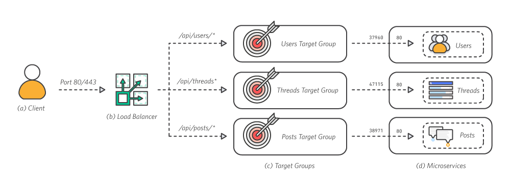

# 모듈 3 – 모놀리스 나누기
이 단계에서는 node.js 애플리케이션을 상호 연결된 여러 서비스로 분할하고 각 서비스의 이미지를 Amazon Elastic Container Registry(Amazon ECR) 리포지토리에 푸시합니다. 구축 시작

## 아키텍처 개요
최종 애플리케이션 아키텍처에서는 Amazon Elastic Container Service(Amazon ECS)와 Application Load Balancer(ALB)를 사용합니다. 

### a. 클라이언트
클라이언트는 트래픽 요청을 포트 80을 통해 제출합니다.

### b. 로드 밸런서
ALB는 외부 트래픽을 해당 서비스로 라우팅합니다. ALB는 클라이언트 요청을 검사하여 라우팅 규칙에 따라 해당 요청을 규칙에 부합하는 인스턴스 및 포트로 경로 설정합니다.

### c. 대상 그룹
각 서비스는 해당 서비스에 실행되는 각 컨테이너의 인스턴스 및 포트를 추적할 수 있는 대상 그룹이 있습니다.

### d. 마이크로서비스
Amazon ECS는 각 서비스를 EC2 클러스터 전체의 컨테이너로 배포합니다. 각 컨테이너는 단일 기능만 처리합니다.

## 왜 마이크로서비스인가?

### 고장 격리
최고의 엔지니어링 팀도 생산 현장에서 치명적인 고장을 겪을 수 있습니다. 고장을 적절하게 처리할 수 있는 표준 모범 사례를 준수하고 고장의 영향을 최소화할 수 있는 방법이 바로 마이크로서비스 구축입니다. 훌륭한 마이크로서비스 아키텍처는 서비스 중 미세한 마이크로 부분이 고장 나는 경우 고장이 해당 부분에만 격리된다는 것을 의미합니다. 서비스의 나머지 부분은 계속 정상적으로 작동합니다.

### 보안 격리
모놀리스 애플리케이션에서는 애플리케이션의 한 가지 기능이 보안을 위반하는 경우(예를 들어 원격 코드 실행을 허용하는 취약성이 존재하는 경우) 공격자가 시스템의 기타 모든 기능에도 액세스했다는 가능성을 열어 두어야 합니다. 이에 따라 아바타 업로드 기능이 보안 사고가 발생하여 사용자 비밀번호로 데이터베이스를 손상시키는 경우 위험한 상황이 초래될 수 있습니다. Amazon ECS를 사용하여 기능을 마이크로서비스로 분할하면 각 서비스에 자체 AWS Identity and Access Management(IAM) 역할을 할당함으로써 AWS 리소스에 대한 액세스의 보안을 유지할 수 있습니다. 마이크로서비스 모범 사례를 준수하면 공격자가 단일 서비스를 손상시키는 경우에도 해당 서비스의 리소스에만 액세스할 수 있을 뿐, 기타 서비스에 침입하지 못한 상태로 해당 서비스의 기타 리소스에 수평적으로 액세스할 수 없습니다.

### 확장의 독립성
기능을 마이크로서비스로 분할하는 경우에는 각 마이크로서비스 클래스가 사용하는 인프라 및 인스턴스의 수량을 독립적으로 확장하거나 축소할 수 있습니다. 이에 따라 특정 기능의 비용을 측정하고 먼저 최적화해야 하는 기능을 확인하는 작업을 간편하게 수행할 수 있습니다. 특정 기능이 리소스 조달의 문제를 겪더라도 기타 기능에는 아무런 영향을 미치지 못하면서 성능의 신뢰성을 그대로 유지할 수 있습니다.

### 개발 속도
마이크로서비스는 개발 위험을 낮춤으로써 팀의 개발을 가속화할 수 있습니다. 모놀리스 방식에서는 새로운 기능을 추가하면 모놀리스에 포함된 기타 모든 기능에 영향을 미칠 수 있습니다. 개발자는 추가하는 코드의 영향을 신중하게 검토해야 하며, 어떤 것도 파손해서는 안 됩니다. 반면에, 적절한 마이크로서비스 아키텍처에는 새 서비스로 진입하는 새 기능에 대한 새 코드가 있습니다. 개발자는 자신이 작성하는 코드와 기존의 다른 코드 간의 상관관계를 명시적으로 작성하는 경우를 제외하고는 둘 사이에 전혀 영향이 없음을 확신할 수 있습니다.

## 구현 지침
아래의 단계별 지침에 따라 모놀리스를 나눌 수 있습니다. 각 단계 번호를 선택하면 섹션이 펼쳐집니다.

## 1단계. ECR 리포지토리 프로비저닝
앞의 두 모듈에서는 애플리케이션을 단일 서비스 및 단일 컨테이너 이미지 리포지토리를 사용하는 모놀리스로 배포했습니다. 애플리케이션을 세 개의 마이크로서비스로 배포하려면 세 개의 리포지토리(서비스마다 하나씩)를 Amazon ECR에 프로비저닝해야 합니다.

Amazon의 세 가지 서비스는 다음과 같습니다.

- 사용자

- 스레드

- 포스트

서비스마다 다음 단계를 반복 수행하여 세 개의 리포지토리를 생성합니다.

- [Amazon ECR 콘솔](https://console.aws.amazon.com/ecs/home?#/repositories)로 이동합니다.

- [리포지토리 생성]을 선택합니다.

- [리포지토리 생성] 페이지의 [리포지토리 이름] 필드에서 해당 서비스의 리포지토리를 생성합니다(포스트, 스레드 또는 사용자).

⚐ 참고: [태그 불변성] 옵션은 기본 설정으로 남겨둡니다.

Amazon ECR에는 네 개의 리포지토리가 있어야 합니다. 생성한 각 마이크로서비스의 리포지토리 정보를 기록해 둡니다. 이 정보는 다음 단계에서 필요합니다. 필요한 정보의 형식은 다음과 같습니다.
[account-id].dkr.ecr.[region].amazonaws.com/[service-name]

## 2단계. Docker 를 AWS 로 인증합니다.(선택 사항)

각 서비스의 이미지를 구축하여 업로드하려면 Docker에 액세스해야 합니다. 다른 시점에 이 자습서 작업을 수행하면 Docker에서 로그아웃한 상태일 수 있습니다. 이 경우에는 다음 단계에 따라 Docker에 다시 로그인합니다.

- $(aws ecr get-login --no-include-email --region [your-region])을(를) 실행합니다.

[your-region]을 대체합니다(예: $(aws ecr get-login --no-include-email --region us-west-2)).

인증에 성공하면 로그인 성공이라는 확인 메시지를 받게 됩니다.

## 3단계. 각 서비스의 이미지를 구축하여 업로드합니다.

프로젝트 폴더 amazon-ecs-nodejs-microservices/3-microservices/services에 각 서비스의 파일이 든 폴더가 구성됩니다. 각 마이크로서비스가 이전 모놀리스 서비스의 복제물로 형성되는 과정에 유의하십시오.

지금은 각 서비스의 파일 db.json과 모놀리스 api 서비스를 비교함으로써 해당 서비스가 특화되는 과정을 볼 수 있습니다. 이전에는 포스트, 스레드 및 사용자가 모두 단일 데이터베이스 파일에 저장되었습니다. 이제 모두 각 서비스의 데이터베이스 파일에 저장됩니다.

터미널을 열고 경로를 ~/amazon-ecs-nodejs-microservices/3-microservices/services로 설정합니다.

각 이미지의 구축 및 태그 설정

- 터미널에서 docker build -t [service-name] ./[service-name]을(를) 실행합니다.
[service-name]을 대체합니다(예: docker build -t posts ./posts).

- 구축 작업이 완료되면 이미지를 리포지토리에 업로드할 수 있도록 태그를 설정합니다.
docker tag [service-name]:latest [account-ID].dkr.ecr.[region].amazonaws.com/[service-name]:v1
[service-name], [account-ID] 및 [region]을 대체합니다(예: docker tag posts:latest [account-id].dkr.ecr.us-west-2.amazonaws.com/posts:v1).

- 이미지를 ECR(docker push [account-id].dkr.ecr.[region].amazonaws.com/[service-name]:v1)에 업로드합니다.
[service-name], [account-ID] 및 [region]을 대체합니다.

ECR 리포지토리로 이동하는 경우 v1로 태그 설정된 이미지를 볼 수 있을 것입니다. 

♻ 각 마이크로서비스 이미지에 대해 이 단계를 반복 수행합니다.  

⚐ 참고: 반드시 세 개의 이미지를 모두 구축하고 태그 설정해야 합니다.

<!-- [이전: 모놀리스 배포](./module-two.md) | [다음: 마이크로서비스 배포](./module-four.md)