# 모듈 2 - 모놀리스 배포
이 모듈에서는 Amazon Elastic Container Service(Amazon ECS)를 사용하여 EC2 컴퓨팅 인스턴스의 관리형 클러스터를 인스턴스화하고 클러스터에서 실행되는 컨테이너로서 이미지를 배포합니다. 구축 시작

## 아키텍처 개요

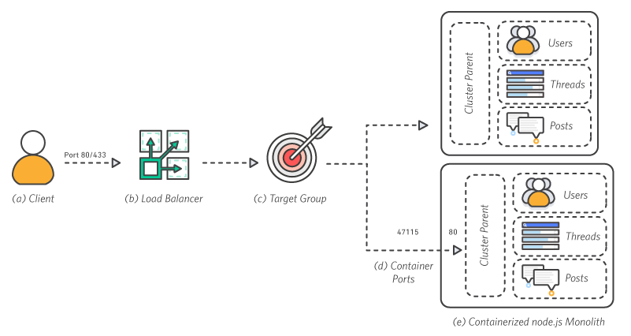

### a. 클라이언트
클라이언트가 포트 80을 통해 로드 밸런서로 요청을 보냅니다.

### b. 로드 밸런서
로드 밸런서가 사용 가능한 모든 포트로 요청을 분산합니다.

### c. 대상 그룹
애플리케이션의 대상 그룹에 인스턴스가 등록됩니다.

### d. 컨테이너 포트
각 컨테이너에서 node.js 클러스터 상위 항목을 네임스페이스의 포트 80에 바인딩하는 단일 애플리케이션 프로세스를 실행합니다.

### e. 컨테이너식 node.js Monolith
node.js 클러스터 상위 항목은 모놀리식 애플리케이션 내의 여러 작업자로 트래픽을 분산하는 역할을 합니다. 이 아키텍처는 컨테이너화되어 있지만 각 컨테이너에 나머지 컨테이너와 동일한 기능이 모두 있다는 점에서 모놀리식이기도 합니다.

## Amazon Elastic Container Service란 무엇입니까?
Amazon Elastic Container Service(Amazon ECS)는 확장성과 성능이 뛰어나며 Docker 컨테이너를 지원하는 컨테이너 관리 서비스로서, 이 서비스를 사용하여 Amazon EC2 인스턴스의 관리형 클러스터에서 애플리케이션을 손쉽게 실행할 수 있습니다. 간단한 API 호출로 Docker 지원 애플리케이션을 시작 및 중단하고, 클러스터의 전체 상태를 쿼리하며, 보안 그룹, Elastic Load Balancing, EBS 볼륨, IAM 역할 등 여러 익숙한 기능에 액세스할 수 있습니다.

리소스 필요 사항과 가용성 요구 사항에 따라 클러스터 전체에 컨테이너를 배치할 일정을 수립하는 데에도 Amazon ECS를 사용할 수 있습니다. 또는 비즈니스나 애플리케이션의 특정 요구 사항에 맞도록 자체 스케줄러나 서드파티 스케줄러를 통합할 수 있습니다.

Amazon ECS 사용에 따른 추가 요금은 없습니다. 애플리케이션을 저장하고 실행하기 위해 생성한 AWS 리소스(예: EC2 인스턴스 또는 EBS 볼륨)에 대한 비용만 지불하면 됩니다.

## 구현 지침
아래의 단계별 지침에 따라 Amazon ECS를 사용해 node.js 애플리케이션을 배포합니다. 각 단계 번호를 선택하면 섹션이 펼쳐집니다.

## 1단계 Cloudformation 을 사용하여 ECS 클러스터 시작

Application Load Balancer의 배후에 배포된 Amazon ECS 클러스터를 생성합니다.

1. [AWS CloudFormation 콘솔](https://console.aws.amazon.com/cloudformation/home)로 이동합니다.

2. [스택 생성]을 선택합니다.

3. [템플릿 파일 업로드]를 선택하고 amazon-ecs-nodejs-microservice/2-containerized/infrastructure/ecs.yml의 GitHub 프로젝트에서 [ecs.yml](https://github.com/awslabs/amazon-ecs-nodejs-microservices/blob/master/2-containerized/infrastructure/ecs.yml) 파일을 선택한 후 [다음]을 선택합니다.

4. 스택 이름으로 BreakTheMonolith-Demo를 입력합니다. 다른 파라미터에 다음 값이 있는지 확인합니다.

- Desired Capacity = 2

- InstanceType = t2.micro

- MaxSize = 2

5. [다음]을 선택합니다.

6. [스택 옵션 구성] 페이지에서 기본 옵션을 그대로 두고 아래로 스크롤하여 [다음]을 선택합니다.

7. [BreakTheMonolith-Demo 검토] 페이지에서 페이지 하단으로 스크롤한 후 확인란을 선택해 Capabilities 문을 확인하고 [스택 생성]을 선택합니다.

상태가 CREATE_IN_PROGRESS인 스택이 표시됩니다. 화면 오른쪽 상단에서 [새로 고침] 버튼을 선택하여 진행률을 확인할 수 있습니다. 이 프로세스는 일반적으로 5분 안에 완료됩니다.

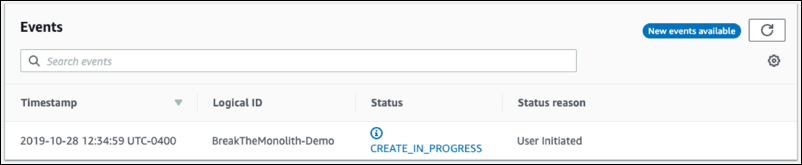

⚐ 참고: 원하는 경우 AWS Command Line Interface(AWS CLI)를 사용하여 AWS CloudFormation 스택을 배포할 수 있습니다. amazon-ecs-nodejs-microservices/3-microservices 폴더에서 터미널을 통해 다음 코드를 실행합니다. 이때 [region]을 사용자의 AWS 리전으로 바꿉니다.

```
$ aws cloudformation deploy \
   --template-file infrastructure/ecs.yml \
   --region [region] \
   --stack-name BreakTheMonolith-Demo \
   --capabilities CAPABILITY_NAMED_IAM
```

## 2단계 클러스터가 실행중인지 확인

- [Amazon ECS 콘솔](https://console.aws.amazon.com/ecs/home?)로 이동합니다.

목록에 클러스터가 표시됩니다.

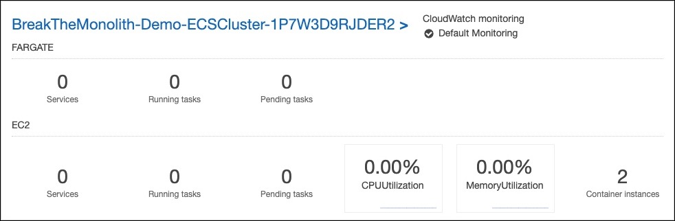

- [BreakTheMonolith-Demo] 클러스터를 선택한 후 [태스크] 탭을 선택하여 실행 중인 태스크가 없는지 확인합니다.

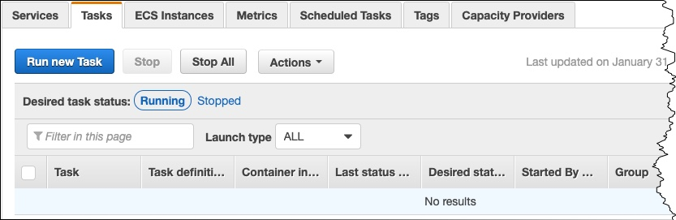

- [ECS 인스턴스] 탭을 선택하여 AWS CloudFormation 템플릿으로 생성된 2개의 Amazon EC2 인스턴스가 있는지 확인합니다.
    ⚐ 참고: ECS 에이전트가 최신 버전이 아니라는 메시지가 나타나면 [자세히 알아보기]를 선택하여 ECS 에이전트를 업데이트하는 방법에 대한 지침을 확인합니다.

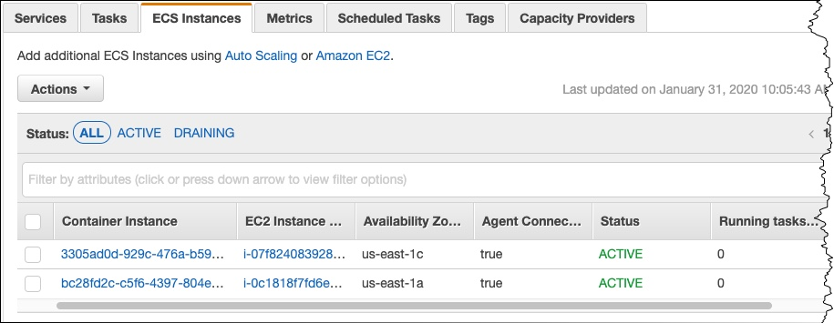

## 3단계. 테스크 정의 작성

태스크 정의는 클러스터에 Amazon ECS가 애플리케이션 컨테이너를 배포하는 방식을 지정합니다.

- Amazon ECS 왼쪽 탐색 메뉴에서 [태스크 정의]를 선택합니다.

- [새 태스크 정의 생성]을 선택합니다.

- [시작 유형 호환성 선택] 페이지에서 [EC2] 옵션을 선택한 후 [다음 단계]를 선택합니다.

- [태스크 및 컨테이너 정의 구성] 페이지에서 다음을 수행합니다.

    - [태스크 정의 이름] 필드에 api를 입력합니다.

    - [컨테이너 정의]가 표시될 때까지 아래로 스크롤하여 [컨테이너 추가]를 선택합니다.

    - [컨테이너 추가] 창에서 다음을 수행합니다.

        - 정의되지 않은 파라미터는 비어 있거나 기본 설정으로 구성되어 있습니다.

        - [컨테이너 이름] 필드에 api를 입력합니다.

        - [이미지] 필드에 [account-ID].dkr.ecr.[region].amazonaws.com/api:v1을 입력합니다. [account-ID]와 [region]을 실제 정보로 바꿉니다. v1 태그가 모듈 1에서 이미지에 태그를 지정하고 이미지를 푸시하는 데 사용한 값과 일치하는지 확인합니다. 이 값은 이전 모듈에서 생성한 ECR 리포지토리 이미지의 URL입니다.

        - [메모리 제한] 필드에서 [하드 제한]이 선택되어 있는지 확인하고 값으로 256을 입력합니다.

        - [포트 매핑]에서 호스트 포트는 0이고, 컨테이너 포트는 3000입니다.

        - [환경]으로 스크롤합니다. CPU 유닛은 256입니다.

- [추가]를 선택합니다. [태스크 및 컨테이너 정의 구성] 페이지로 돌아갑니다.

- 페이지 하단으로 스크롤하여 [생성]을 선택합니다. 

태스크 정의가 콘솔에 나열됩니다.

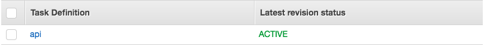

## 4단계. Application Load Balancer 구성 : 대상 그룹

[Application Load Balancer(ALB)](http://docs.aws.amazon.com/elasticloadbalancing/latest/application/introduction.html)는 서비스가 수신되는 트래픽을 수락할 수 있게 합니다. ALB는 클러스터에서 실행 중인 컨테이너 인스턴스를 [대상 그룹](http://docs.aws.amazon.com/elasticloadbalancing/latest/application/load-balancer-target-groups.html)으로 사용하여 이 인스턴스로 트래픽을 자동으로 라우팅합니다.

VPC 이름 확인: 이 AWS 계정을 이전에 사용한 적이 있는 경우 여러 VPC가 존재할 수 있습니다. 따라서 올바른 VPC를 사용하여 대상 그룹을 구성하는 것이 중요합니다.

- [EC2 콘솔의 [로드 밸런서] 섹션](https://console.aws.amazon.com/ec2/v2/home?#LoadBalancers:)으로 이동합니다.

- demo라는 로드 밸런서를 찾습니다.

- demo 옆의 확인란을 선택하여 Load Balancer 세부 정보를 참조합니다.

- [설명] 탭에서 VPC 속성(형식: vpc-xxxxxxxxxxxxxxxxx)을 찾습니다.
    ⚐ 참고: ALB 대상 그룹을 구성하려면 다음 단계에 VPC 속성이 필요합니다.

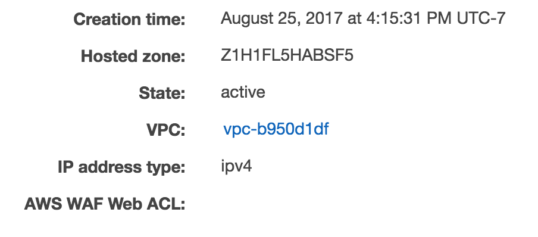

ALB 대상 그룹 구성

- [EC2 콘솔의 [대상 그룹] 섹션](https://console.aws.amazon.com/ec2/v2/home?#TargetGroups:)으로 이동합니다.

- [대상 그룹 생성]을 선택합니다.

- 다음 대상 그룹 파라미터를 구성합니다(아래에 나와 있지 않은 파라미터는 기본값 사용).

    - [대상 그룹 이름]에 api를 입력합니다.

    - [프로토콜]에서 [HTTP]를 선택합니다.

    - [포트]에 80을 입력합니다.

    - VPC에 대해 로드 밸런서 설명의 값과 일치하는 값을 선택합니다. 이 VPC는 기본 VPC가 아닐 가능성이 큽니다.
    
    - [고급 상태 확인 설정]에 액세스하여 필요에 따라 다음 파라미터를 편집합니다. 

        - [정상 임계값]에 2를 입력합니다.

        - [비정상 임계값]에 2를 입력합니다.

        - [제한 시간]에 5를 입력합니다.
        
        - [간격]에 6을 입력합니다.

        - [생성]을 선택합니다.

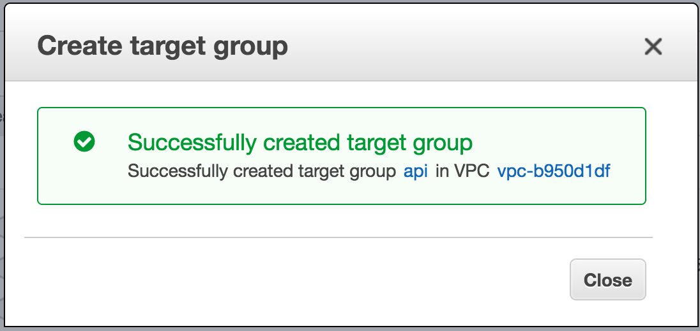

## 5단계. Application Load Balancer 구성 : 리스너

ALB [리스너](http://docs.aws.amazon.com/elasticloadbalancing/latest/application/load-balancer-listeners.html)는 ALB로 수신되는 연결 요청을 확인합니다.

ALB에 리스너 추가

- [EC2 콘솔의 [로드 밸런서] 섹션](https://console.aws.amazon.com/ec2/v2/home?#LoadBalancers:)으로 이동합니다.

- demo 옆의 확인란을 선택하여 Load Balancer 세부 정보를 참조합니다.

- [리스너] 탭을 선택합니다.

- [리스너 추가]를 선택하고 필요에 따라 다음 파라미터를 편집합니다.

- [Protocol:port]에서 [HTTP]를 선택하고 80을 입력합니다.

- [기본 작업]에서 [전달 대상]을 선택하고 [대상 그룹] 필드에 api를 입력합니다.

- [저장]을 선택합니다.

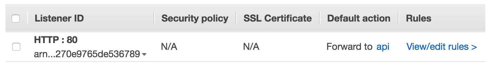

## 6단계. 서비스형 모놀리스 배포

클러스터에 서비스형 모놀리스를 배포합니다.

- [Amazon ECS 콘솔](https://console.aws.amazon.com/ecs/home?)로 이동하여 왼쪽 메뉴 모음에서 [클러스터]를 선택합니다.

- BreakTheMonolith-Demo 클러스터를 선택하고 [서비스] 탭을 선택한 후 [생성]을 선택합니다.

- 서비스 구성 페이지에서 다음 매개변수를 편집합니다(그리고 아래에 열거되지 않은 매개변수는 기본값을 그대로 유지합니다). 

    - [시작 유형]에서 [EC2]를 선택합니다.

    - [서비스 이름]에 api를 입력합니다. 

    - [태스크 수]에 1을 입력합니다.
    
    - [다음 단계]를 선택합니다.

- [네트워크 구성] 페이지의 [로드 밸런싱] 섹션에서 [Application Load Balancer]를 선택합니다.

- [서비스 IAM 역할] 및 [로드 밸런서 이름]이라는 추가 파라미터가 표시됩니다.

    - [서비스 IAM 역할]에서 BreakTheMonolith-Demo-ECSServiceRole을 선택합니다.

    - [로드 밸런서 이름]에 demo가 선택되어 있는지 확인합니다.

- [로드 밸런싱할 컨테이너] 섹션에서 [로드 밸런서에 추가]를 선택합니다.

[api:3000]이라는 추가 정보가 표시됩니다.

- [api:3000] 섹션에서 다음을 수행합니다.

    - [프로덕션 리스너 포트] 필드에서 [80:HTTP]를 선택합니다.

    - [대상 그룹 이름]에서 api 그룹을 선택합니다.

    - [다음 단계]를 선택합니다.

- [Auto Scaling 설정] 페이지에서 기본 설정을 그대로 두고 [다음 단계]를 선택합니다.

- [검토] 페이지에서 설정을 검토한 후 [서비스 생성]을 선택합니다.

- 서비스가 생성된 후 [서비스 보기]를 선택합니다.

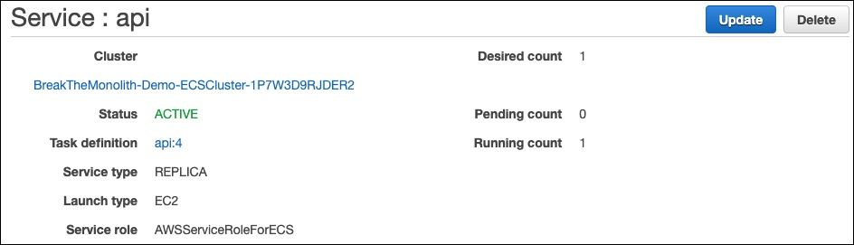

잘하셨습니다! 이제 서비스가 실행되고 있습니다. 컨테이너가 정상 상태로 등록되고 트래픽 수신을 시작하는 데 몇 분 정도 걸릴 수 있습니다.

## 7단계. 모놀리스 테스트

인터넷에서 서비스를 사용할 수 있는지 확인하고 Ping 테스트를 실행하여 배포를 검증합니다.

서비스 URL을 찾으려는 경우:

- EC 콘솔의 [[로드 밸런서]](https://console.aws.amazon.com/ec2/v2/home?#LoadBalancers:) 섹션으로 이동합니다.

- demo 로드 밸런서를 선택합니다.

- [설명] 탭에서 DNS 이름을 복사하여 새 브라우저 탭 또는 새 창에 붙여 넣습니다.

- [요청 수신 준비 완료]라는 메시지가 표시됩니다.

서비스의 각 부분 보기: node.js 애플리케이션은 URL에 따라 각 작업자로 트래픽을 라우팅합니다. 작업자를 보려면 다음과 같이 DNS 이름의 끝에 작업자 이름 api/[worker-name]을 추가하면 됩니다.

- http://[DNS name]/api/users

- http://[DNS name]/api/threads

- http://[DNS name]/api/posts

또한 URL의 끝에 레코드 번호를 추가하여 특정 레코드로 드릴다운할 수도 있습니다. 예: http://[DNS name]/api/posts/1 또는 http://[DNS name]/api/users/2

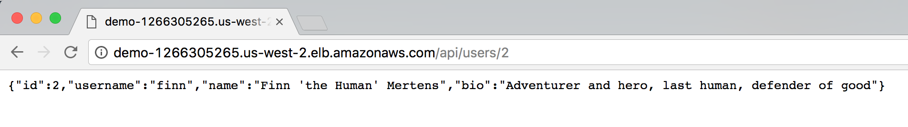

[이전: 모놀리스 배포](./module-one.md) | [다음: 모놀리스에서 벗어나기](./module-three.md)