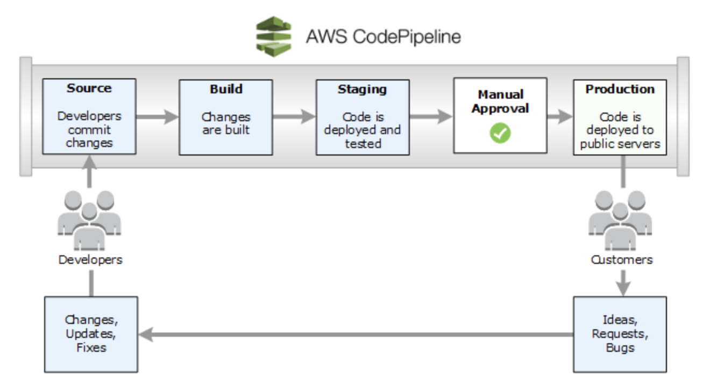
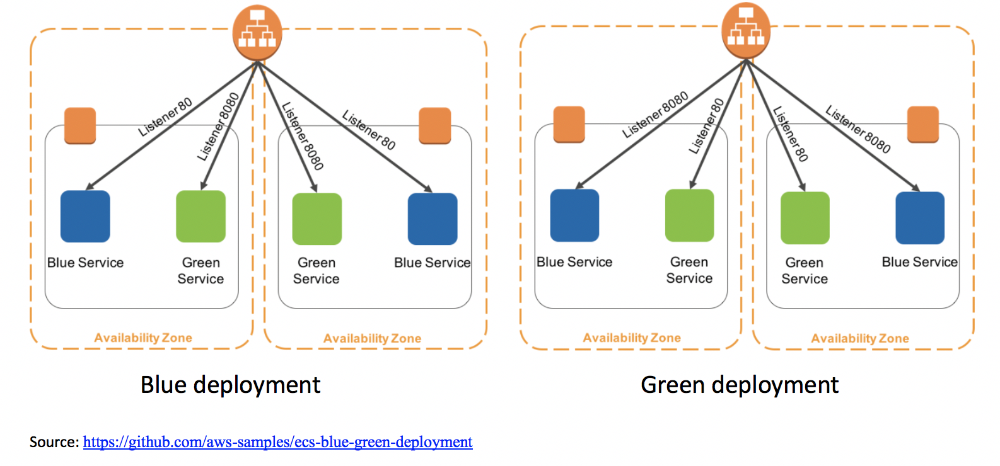

# ECS FARGATE의 블루/그린 배포

- [애플리케이션을 만나보세요](#애플리케이션을-만나보세요)

- [코드파이프라인 입문서](#코드파이프라인-입문서)

- [환경 구축](#환경-구축)

- [블루 배포 검토](#블루-배포-검토)

- [CodeCommit 리포지토리 업데이트](#codecommit-리포지토리-업데이트)

- [친환경 배포 검토](#친환경-배포-검토)

- [롤백 실패 배포](#롤백-실패-배포)

- [구성 검토](#구성-검토)

- [CLEAN UP](#대청소)

이 장에서는 ECS Fargate에 데모 애플리케이션을 배포하고 CodeDeploy 및 ECS의 Blue/Green 배포 기능을 사용하여 애플리케이션을 업데이트합니다.

블루/그린 배포는 동일한 애플리케이션의 다른 버전을 실행하는 두 개의 동일한 환경 간에 트래픽을 이동하여 애플리케이션을 릴리스하는 기술입니다. 블루/그린 배포는 다운타임 및 롤백 기능과 같은 소프트웨어 배포와 관련된 위험을 완화하므로 중요한 워크로드에 권장됩니다.

전통적으로 인플레이스(in-place) 업그레이드를 사용하면 애플리케이션의 이전 버전을 계속 실행하면서 프로덕션 배포에서 새 애플리케이션 버전을 검증하는 것이 어려웠습니다. 친환경 환경을 배포한 후에는 이를 검증할 수 있습니다. 녹색 환경이 예상대로 작동하지 않는 것을 발견하면 파란색 환경에 영향을 미치지 않습니다. 트래픽을 다시 해당 사이트로 라우팅하여 작동 장애 또는 가동 중지 시간을 최소화하고 충격 반경을 제한할 수 있습니다.

트래픽을 계속 작동하는 블루 환경으로 간단히 롤백할 수 있는 이 기능은 블루/그린 배포의 주요 이점입니다. 배포 프로세스 중 언제든지 블루 환경으로 롤백할 수 있습니다.

당신은 이것에 대해 더 읽을 수 있습니다 AWS 백서

시작하자…

## 애플리케이션을 만나보세요
ECS Fargate에 데모 애플리케이션을 배포할 것입니다.

이 애플리케이션은 NGINX에서 Fargate 서비스로 실행되는 정적 웹 페이지입니다.
CodePipeline은 CodeCommit, CodeBuild 및 CodeDeploy를 사용하여 블루/그린 배포를 실행하는 데 사용됩니다.
컨테이너 이미지는 Elastic Container Registry에 저장됩니다.
아래는 우리가 구축할 환경의 다이어그램입니다.


## 코드파이프라인 입문서
[AWS 코드 파이프라인](https://aws.amazon.com/codepipeline/) 완전 관리형입니다. [지속적인 전달](https://aws.amazon.com/devops/continuous-delivery/) 빠르고 안정적인 애플리케이션 및 인프라 업데이트를 위해 릴리스 파이프라인을 자동화하는 데 도움이 되는 서비스입니다. CodePipeline은 정의한 릴리스 모델을 기반으로 코드 변경이 있을 때마다 릴리스 프로세스의 빌드, 테스트 및 배포 단계를 자동화합니다.



블루/그린 배포를 통해 새로운 컨테이너 세트를 프로비저닝할 수 있습니다. 코드 배포최신 버전의 애플리케이션을 설치합니다. 그런 다음 [CodeDeploy](https://aws.amazon.com/codedeploy)는 이전 버전의 애플리케이션을 실행하는 기존 컨테이너 집합에서 최신 버전을 실행하는 새 컨테이너 집합으로 로드 밸런서 트래픽을 다시 라우팅합니다. 트래픽이 새 컨테이너로 다시 라우팅된 후 기존 컨테이너를 종료할 수 있습니다. 블루/그린 배포를 통해 프로덕션 트래픽을 보내기 전에 새 애플리케이션 버전을 테스트할 수 있습니다.



[GITHUB](https://github.com/aws-samples/ecs-blue-green-deployment)

새로 배포된 애플리케이션 버전에 문제가 있는 경우 전체 배포보다 더 빠르게 이전 버전으로 롤백할 수 있습니다. 또한 블루/그린 배포를 위해 프로비저닝된 컨테이너는 새 구성이므로 최신 서버 구성을 반영합니다.

## 환경 구축
전제 조건 설치

```
sudo yum install -y jq
npm i -g -f aws-cdk@1.128.0
nvm install 16.10.0
nvm use 16.10.0
```

리포지토리로 이동

```
git clone https://github.com/aws-containers/ecs-workshop-blue-green-deployments ~/environment/ecs-workshop-blue-green-deployments
cd ~/environment/ecs-workshop-blue-green-deployments
```

스택 빌드

```
npm install
npm run build
npm run test
```

컨테이너 이미지 스택 배포
- 이 스크립트는 AWS 계정의 CDK를 부트스트랩합니다.

- CodeCommit 리포지토리 및 Codebuild 프로젝트를 빌드하여 컨테이너 이미지 생성

```
./bin/scripts/deploy-container-image-stack.sh
```

컨테이너 이미지 스택에 대한 코드 검토
이전 환경과 마찬가지로 AWS CDK를 사용하여 환경을 구축할 때도 동일한 형식을 따릅니다.

뛰어들자

nginx 코드 샘플을 CodeCommit 리포지토리로 푸시해 보겠습니다.

- 소스 코드를 사용할 수 있습니다여기

- 그만큼 [buildspec.yml](https://github.com/aws-containers/ecs-workshop-blue-green-deployments/blob/blue-green-deployment/nginx-sample/buildspec.yml)변수에 대한 자리 표시자가 있습니다.

- 아래 단계에 따라 이전에 생성한 CodeCommit 리포지토리에 코드를 업로드합니다.

```
export AWS_DEFAULT_REGION=$(aws configure get region)
export CODE_REPO_NAME=nginx-sample
export CODE_REPO_URL=codecommit::$AWS_DEFAULT_REGION://$CODE_REPO_NAME
cd ~/environment && git clone $CODE_REPO_URL && cd $CODE_REPO_NAME
cp ~/environment/ecs-workshop-blue-green-deployments/nginx-sample/* .
git checkout -b main
git remote -v
git add .
git commit -m "First commit"
git push --set-upstream origin main
```

파이프라인 스택 배포

이 스크립트는 아래 단계를 실행합니다.

- CodeBuild를 사용하여 CodeCommit에서 코드용 컨테이너 이미지 빌드
- 블루/그린 배포를 위한 CodeDeploy 및 CodePipeline 리소스 배포
- 컨테이너 이미지를 사용하여 AWS Fargate 서비스 배포

```
cd ~/environment/ecs-workshop-blue-green-deployments
./bin/scripts/deploy-pipeline-stack.sh
```

파이프라인 스택의 코드 검토
이전 환경과 마찬가지로 AWS CDK를 사용하여 환경을 구축할 때도 동일한 형식을 따릅니다.

뛰어들자

- 작업 정의 만들기

```
// Creating the task definition
const taskDefinition = new ecs.FargateTaskDefinition(this, 'apiTaskDefinition', {
    family: props.apiName,
    cpu: 256,
    memoryLimitMiB: 1024,
    taskRole: props.ecsTaskRole,
    executionRole: props.ecsTaskRole
});
taskDefinition.addContainer('apiContainer', {
    image: ecs.ContainerImage.fromEcrRepository(props.ecrRepository!),
    logging: new ecs.AwsLogDriver({
        logGroup: new log.LogGroup(this, 'apiLogGroup', {
            logGroupName: '/ecs/'.concat(props.apiName!),
            removalPolicy: RemovalPolicy.DESTROY
        }),
        streamPrefix: EcsBlueGreenService.PREFIX
    }),
}).addPortMappings({
    containerPort: props.containerPort!,
    protocol: Protocol.TCP
})
```

- 로드 밸런서 및 대상 그룹 생성

```
// Creating an application load balancer, listener and two target groups for Blue/Green deployment
this.alb = new elb.ApplicationLoadBalancer(this, 'alb', {
    vpc: props.vpc!,
    internetFacing: true
});
this.albProdListener = this.alb.addListener('albProdListener', {
    port: 80
});
this.albTestListener = this.alb.addListener('albTestListener', {
    port: 8080
});

this.albProdListener.connections.allowDefaultPortFromAnyIpv4('Allow traffic from everywhere');
this.albTestListener.connections.allowDefaultPortFromAnyIpv4('Allow traffic from everywhere');

// Target group 1
this.blueTargetGroup = new elb.ApplicationTargetGroup(this, 'blueGroup', {
    vpc: props.vpc!,
    protocol: ApplicationProtocol.HTTP,
    port: 80,
    targetType: TargetType.IP,
    healthCheck: {
        path: '/',
        timeout: Duration.seconds(30),
        interval: Duration.seconds(60),
        healthyHttpCodes: '200'
    }
});

// Target group 2
this.greenTargetGroup = new elb.ApplicationTargetGroup(this, 'greenGroup', {
    vpc: props.vpc!,
    protocol: ApplicationProtocol.HTTP,
    port: 80,
    targetType: TargetType.IP,
    healthCheck: {
        path: '/',
        timeout: Duration.seconds(30),
        interval: Duration.seconds(60),
        healthyHttpCodes: '200'
    }
});
```

- CloudWatch 경보 생성

```
// CloudWatch Metrics for UnhealthyHost and 5XX errors
const blueUnhealthyHostMetric = EcsServiceAlarms.createUnhealthyHostMetric(props.blueTargetGroup!, props.alb!);
const blue5xxMetric = EcsServiceAlarms.create5xxMetric(props.blueTargetGroup!, props.alb!);
const greenUnhealthyHostMetric = EcsServiceAlarms.createUnhealthyHostMetric(props.greenTargetGroup!, props.alb!);
const green5xxMetric = EcsServiceAlarms.create5xxMetric(props.greenTargetGroup!, props.alb!);

// CloudWatch Alarms for UnhealthyHost and 5XX errors
const blueGroupUnhealthyHostAlarm = this.createAlarm(blueUnhealthyHostMetric, 'blue', 'UnhealthyHost', 2);
const blueGroup5xxAlarm = this.createAlarm(blue5xxMetric, 'blue', '5xx', 1);
const greenGroupUnhealthyHostAlarm = this.createAlarm(greenUnhealthyHostMetric, 'green', 'UnhealthyHost', 2);
const greenGroup5xxAlarm = this.createAlarm(green5xxMetric, 'green', '5xx', 1);
```

- CodeDeploy의 DeploymentGroup에 대해 사용자 지정 리소스를 사용했습니다. CDK 구성은 현재 ECS 배포 그룹 생성을 지원하지 않습니다. 먼저 다음을 사용하여 람다를 생성합니다.new lambda.Function, 다음을 사용하여 사용자 지정 리소스를 만듭니다.new CustomResource

```
// Creating the ecs application
const ecsApplication = new codeDeploy.EcsApplication(this, 'ecsApplication');

// Creating the code deploy service role
const codeDeployServiceRole = new iam.Role(this, 'ecsCodeDeployServiceRole', {
    assumedBy: new ServicePrincipal('codedeploy.amazonaws.com')
});

codeDeployServiceRole.addManagedPolicy(ManagedPolicy.fromAwsManagedPolicyName('AWSCodeDeployRoleForECS'));

// IAM role for custom lambda function
const customLambdaServiceRole = new iam.Role(this, 'codeDeployCustomLambda', {
    assumedBy: new ServicePrincipal('lambda.amazonaws.com')
});

const inlinePolicyForLambda = new iam.PolicyStatement({
    effect: Effect.ALLOW,
    actions: [
        'iam:PassRole',
        'sts:AssumeRole',
        'codedeploy:List*',
        'codedeploy:Get*',
        'codedeploy:UpdateDeploymentGroup',
        'codedeploy:CreateDeploymentGroup',
        'codedeploy:DeleteDeploymentGroup'
    ],
    resources: ['*']
});

customLambdaServiceRole.addManagedPolicy(ManagedPolicy.fromAwsManagedPolicyName('service-role/AWSLambdaBasicExecutionRole'))
customLambdaServiceRole.addToPolicy(inlinePolicyForLambda);

// Custom resource to create the deployment group
const createDeploymentGroupLambda = new lambda.Function(this, 'createDeploymentGroupLambda', {
    code: lambda.Code.fromAsset(
        path.join(__dirname, 'custom_resources'),
        {
            exclude: ['**', '!create_deployment_group.py']
        }),
    runtime: lambda.Runtime.PYTHON_3_8,
    handler: 'create_deployment_group.handler',
    role: customLambdaServiceRole,
    description: 'Custom resource to create ECS deployment group',
    memorySize: 128,
    timeout: cdk.Duration.seconds(60)
});

new CustomResource(this, 'customEcsDeploymentGroup', {
    serviceToken: createDeploymentGroupLambda.functionArn,
    properties: {
        ApplicationName: ecsApplication.applicationName,
        DeploymentGroupName: props.deploymentGroupName,
        DeploymentConfigName: props.deploymentConfigName,
        ServiceRoleArn: codeDeployServiceRole.roleArn,
        BlueTargetGroup: props.blueTargetGroupName,
        GreenTargetGroup: props.greenTargetGroupName,
        ProdListenerArn: props.prodListenerArn,
        TestListenerArn: props.testListenerArn,
        TargetGroupAlarms: JSON.stringify(props.targetGroupAlarms),
        EcsClusterName: props.ecsClusterName,
        EcsServiceName: props.ecsServiceName,
        TerminationWaitTime: props.terminationWaitTime
    }
});

this.ecsDeploymentGroup = codeDeploy.EcsDeploymentGroup.fromEcsDeploymentGroupAttributes(this, 'ecsDeploymentGroup', {
    application: ecsApplication,
    deploymentGroupName: props.deploymentGroupName!,
    deploymentConfig: EcsDeploymentConfig.fromEcsDeploymentConfigName(this, 'ecsDeploymentConfig', props.deploymentConfigName!)
});
```

- 블루/그린 배포를 위한 코드 파이프라인. 이 파이프라인에는 소스, 빌드 및 배포의 세 단계가 있습니다.

```
const pipeline = new codePipeline.Pipeline(this, 'ecsBlueGreen', {
    role: codePipelineRole,
    artifactBucket: artifactsBucket,
    stages: [
        {
            stageName: 'Source',
            actions: [
                new codePipelineActions.CodeCommitSourceAction({
                    actionName: 'Source',
                    repository: codeRepo,
                    output: sourceArtifact,
                    branch: 'main'
                }),
            ]
        },
        {
            stageName: 'Build',
            actions: [
                new codePipelineActions.CodeBuildAction({
                    actionName: 'Build',
                    project: codeBuildProject,
                    input: sourceArtifact,
                    outputs: [buildArtifact]
                })
            ]
        },
        {
            stageName: 'Deploy',
            actions: [
                new codePipelineActions.CodeDeployEcsDeployAction({
                    actionName: 'Deploy',
                    deploymentGroup: ecsBlueGreenDeploymentGroup.ecsDeploymentGroup,
                    appSpecTemplateInput: buildArtifact,
                    taskDefinitionTemplateInput: buildArtifact,
                })
            ]
        }
    ]
});
```

- 로드 밸런서 URL 내보내기

```
export ALB_DNS=$(aws cloudformation describe-stacks --stack-name BlueGreenPipelineStack --query 'Stacks[*].Outputs[?ExportName==`ecsBlueGreenLBDns`].OutputValue' --output text)
```

배포된 애플리케이션 버전을 살펴보겠습니다.

## 블루 배포 검토
브라우저에서 서비스 열기
로드 밸런서 URL을 통해 배포된 블루 버전에 액세스할 수 있습니다. 브라우저에서 열어봅시다.

다음 명령을 실행하여 URL을 가져옵니다.

```
echo "http://$load_balancer_url"
```

결과
엔드포인트는 배포된 애플리케이션의 버전(파란색)을 표시합니다.


이제 Green 배포를 위해 CodeCommit에서 git 리포지토리를 설정할 차례입니다.

## CODECOMMIT 리포지토리 업데이트
index.html로 변경하려면 편집하십시오 background-color.green

```
cd ~/environment/nginx-sample/
vim index.html
```

```
<head>
  <title>Demo Application</title>
</head>
<body style="background-color: green;">
  <h1 style="color: white; text-align: center;">
    Demo application - hosted with ECS
  </h1>
</body>
```

CodeCommit 리포지토리에 코드 푸시

```
git add .
git commit -m "Changed background to green"
git push
```

CodePipeline으로 이동

- 코드 푸시가 파이프라인 실행을 트리거했습니다.
- 파이프라인에는 세 단계가 있습니다.
    - 원천
        - git 저장소에서 코드 풀다운
        - 빌드 단계에 대한 코드 패키징
    - 짓다
        - 코드에서 Docker 이미지 빌드
        - ECR 저장소로 푸시
        - 배포 단계에 대한 아티팩트 패키징
    - 배포
        - ECS 서비스에 대한 블루/그린 배포 시작


다음으로 배포를 검토하겠습니다.

## 친환경 배포 검토
파이프라인의 배포 단계를 클릭합니다.

- 그러면 ECS 서비스의 배포 상태로 이동합니다.


- 1단계:taskdef.json 빌드 단계에서 생성된 새 이미지를 기반으로 대체 작업 세트를 배포합니다.
- 2단계: 새 작업을 설정하고 포트에서 테스트 수신기를 활성화합니다.8080
- 일단 2 단계 : 완료,로드 밸런서 테스트 리스너 포트에 브라우저에서 서비스를 엽니 다8080

다음은 url을 가져오는 명령입니다.

```
echo "http://$load_balancer_url:8080"
```

배경색이 녹색으로 변경된 데모 애플리케이션이 표시됩니다.


- 3단계: 블루에서 그린 배포로 트래픽 이동 시작
    - 배포 구성을 사용하여 파란색에서 녹색으로 원활한 트래픽 이동이 있습니다 CodeDeployDefault.ECSLinear10PercentEvery1Minutes. 모든 트래픽이 전환될 때까지 1분마다 트래픽의 10%를 전환합니다.
    - 완료되면 포트 80에 Green Deployment 가 표시됩니다.

다음은 url을 가져오는 명령입니다.

```
echo "http://$load_balancer_url"
```

- 4단계 는 이전 작업 세트가 10분 동안 유지되는 곳입니다. 이 기간은 CDK 스택을 통해 구성할 수 있습니다.
- 5단계 는 원래 작업 세트를 종료합니다.

Blue/Green 배포를 성공적으로 완료했습니다. 이제 실패한 배포를 롤백해 보겠습니다.

## 롤백 실패 배포
주요 변경 사항 도입
여기에서 404 응답 코드를 반환하여 자동화된 롤백을 트리거합니다. 일반적으로 Application Load Balancer는 이 오류를 포착하지만 데모를 위해 허용 가능한 상태 확인 응답으로 허용합니다.

nginx.conf기본값 대신 404 오류를 반환하도록 index.html 편집
/location 지시문을 다음과 같이 수정합니다.

```
listen  80;
root    /usr/share/nginx/html;
include /etc/nginx/mime.types;

location / {
    return 500;
}
```

전체 nginx.conf를 보려면 확장하십시오.

```
# Run as a less privileged user for security reasons.
user nginx;

# Number of worker_threads to run;
# "auto" sets it to the #CPU_cores available in the system, and
# offers the best performance.
worker_processes    auto;

events { worker_connections 1024; }

http {
    server {
        # Hide nginx version information.
        server_tokens off;

        listen  80;
        root    /usr/share/nginx/html;
        include /etc/nginx/mime.types;

        location / {
            return 500;
        }

        gzip            on;
        gzip_vary       on;
        gzip_http_version  1.0;
        gzip_comp_level 5;
        gzip_types
                        application/atom+xml
                        application/javascript
                        application/json
                        application/rss+xml
                        application/vnd.ms-fontobject
                        application/x-font-ttf
                        application/x-web-app-manifest+json
                        application/xhtml+xml
                        application/xml
                        font/opentype
                        image/svg+xml
                        image/x-icon
                        text/css
                        text/plain
                        text/x-component;
        gzip_proxied    no-cache no-store private expired auth;
        gzip_min_length 256;
        gunzip          on;
    }
}
```

CodeCommit 리포지토리에 코드 푸시

```
cd ~/environment/nginx-sample
git add .
git commit -m "Returning 500 error"
git push
```

코드 푸시는 CodePipeline을 트리거합니다.


- CodeDeploy는 이전과 같이 배포를 시작합니다.

- 한때 3 단계 트래픽 이동이 시작되고, 우리는로드 밸런서 포트에 브라우저에서 서비스를 엽니 다80

다음은 url을 가져오는 명령입니다.

```
echo "http://$load_balancer_url"
```

- 500 내부 서버 오류 를 반환하는 페이지를 볼 수 있습니다.

- ELB 대상 그룹에서 5XX 오류를 찾는 CloudWatch 경보를 구성했습니다.

확장하여 코드 보기

```
private static create5xxMetric(targetGroup: ApplicationTargetGroup, alb: ApplicationLoadBalancer) {
    return new cloudWatch.Metric({
        namespace: 'AWS/ApplicationELB',
        metricName: 'HTTPCode_Target_5XX_Count',
        dimensions: {
            TargetGroup: targetGroup.targetGroupFullName,
            LoadBalancer: alb.loadBalancerFullName
        },
        statistic: cloudWatch.Statistic.SUM,
        period: Duration.seconds(300)
    });
}

private createAlarm(metric: Metric, targetGroupName: string, errorType: string, evaluationPeriods: number) {
    const alarmName = this.prefix.concat(targetGroupName).concat(errorType).concat('Alarm');
    return new cloudWatch.Alarm(this, alarmName, {
        alarmName: alarmName,
        alarmDescription: 'CloudWatch Alarm for the '.concat(errorType).concat(' errors of ').concat(targetGroupName).concat(' target group'),
        metric: metric,
        threshold: 1,
        evaluationPeriods: evaluationPeriods
    });
}
```

- CodeDeploy는 CloudWatch 경보가 경보 상태인 경우 자동 롤백을 시작하도록 구성됩니다.

- CodeDeploy가 배포를 중지합니다.

- CodeDeploy는 이제 프로덕션 트래픽을 원래 작업 세트로 다시 라우팅합니다.

- 마지막으로 CodeDeploy는 대체 작업 세트를 종료합니다.

- 브라우저에서 서비스를 새로 고치면 원래의 녹색 배경 배포가 표시됩니다.

블루/그린 배포를 성공적으로 완료하고 실패한 배포의 자동 롤백을 수행했습니다. 이제 구성 파일을 검토해 보겠습니다.

## 구성 검토
CodeCommit 리포지토리 열기


CodeBuild는 buildspec.yml도커 이미지를 빌드하고 Elastic Container Registry로 푸시하는 데 사용합니다.
- buildspec.yml소스 코드 저장소의 루트에 보관하십시오 .

buildspec.yml을 보려면 펼치십시오.

```
version: 0.2

phases:
  pre_build:
    commands:
      - echo Logging in to Amazon ECR...
      - aws --version
      - aws ecr get-login-password | docker login --username AWS --password-stdin $REPOSITORY_URI
      - COMMIT_HASH=$(echo $CODEBUILD_RESOLVED_SOURCE_VERSION | cut -c 1-7)
      - IMAGE_TAG=${COMMIT_HASH:=latest}
  build:
    commands:
      - echo Docker build and tagging started on `date`
      - docker build -t $REPOSITORY_URI:latest -t $REPOSITORY_URI:$IMAGE_TAG .
      - echo Docker build and tagging completed on `date`
  post_build:
    commands:
      - echo Build completed on `date`
      - echo Pushing the docker images...
      - docker push $REPOSITORY_URI:latest
      - docker push $REPOSITORY_URI:$IMAGE_TAG
      - echo Update the REPOSITORY_URI:IMAGE_TAG in task definition...
      - echo Container image to be used $REPOSITORY_URI:$IMAGE_TAG
      - sed -i 's@REPOSITORY_URI@'$REPOSITORY_URI'@g' taskdef.json
      - sed -i 's@IMAGE_TAG@'$IMAGE_TAG'@g' taskdef.json
      - echo update the REGION in task definition...
      - sed -i 's@AWS_REGION@'$AWS_REGION'@g' taskdef.json
      - echo update the roles in task definition...
      - sed -i 's@TASK_EXECUTION_ARN@'$TASK_EXECUTION_ARN'@g' taskdef.json
artifacts:
  files:
    - "appspec.yaml"
    - "taskdef.json"
```

- 아티팩트 appspec.yaml및 taskdef.jsonCodeDeploy에서 사용됩니다.

- Amazon ECS 컴퓨팅 플랫폼 애플리케이션의 경우 AppSpec file은 CodeDeploy에서 Amazon ECS 작업 정의 파일을 결정하는 데 사용됩니다. TASK_DEFINITION플레이스홀더는 새로운 taskdef.json. TASK_FAMILY빌드 단계에서 교체합니다 .

appspec.yaml을 보려면 펼치십시오.

```
version: 0.0
Resources:
  - TargetService:
      Type: AWS::ECS::Service
      Properties:
        TaskDefinition: "<TASK_DEFINITION>"
        LoadBalancerInfo:
          ContainerName: "TASK_FAMILY"
          ContainerPort: 80
```

- ECS 작업 정의 taskdef.json 입니다. 각 배포에 대해 CodeDeploy에 의해 새 버전이 생성됩니다. CodePipeline의 CodeBuild 단계에서 아래 자리 표시자를 교체합니다.

    - AWS_REGION
    - REPOSITORY_URI:IMAGE_TAG
    - TASK_EXECUTION_ARN

taskdef.json을 보려면 펼치십시오.

```
{
  "containerDefinitions": [
    {
      "name": "nginx-sample",
      "image": "REPOSITORY_URI:IMAGE_TAG",
      "portMappings": [
        {
          "containerPort": 80,
          "protocol": "tcp"
        }
      ],
      "essential": true,
      "dockerLabels": {
        "name": "nginx-sample"
      },
      "logConfiguration": {
        "logDriver": "awslogs",
        "options": {
          "awslogs-group": "/ecs/nginx-sample",
          "awslogs-region": "AWS_REGION",
          "awslogs-stream-prefix": "nginx-sample"
        }
      }
    }
  ],
  "taskRoleArn": "TASK_EXECUTION_ARN",
  "executionRoleArn": "TASK_EXECUTION_ARN",
  "family": "nginx-sample",
  "networkMode": "awsvpc",
  "requiresCompatibilities": [
    "FARGATE"
  ],
  "cpu": "256",
  "memory": "1024"
}
```

buildspec.yml의 자리 appspec.yaml와는 taskdef.json으로 대체되고있다
CodeBuild 작업에는 ENVIRONMENTCDK 스택에서 변수로 사용할 수 있는 필수 값이 있습니다.

CodeBuild 구성을 보려면 펼치십시오.

```
// Creating the code build project
const demoAppCodeBuild = new codeBuild.Project(this, "demoAppCodeBuild", {
    role: codeBuildServiceRole,
    description: "Code build project for the demo application",
    environment: {
        buildImage: codeBuild.LinuxBuildImage.STANDARD_4_0,
        computeType: ComputeType.SMALL,
        privileged: true,
        environmentVariables: {
            REPOSITORY_URI: {
                value: ecrRepo.repositoryUri,
                type: BuildEnvironmentVariableType.PLAINTEXT
            },
            TASK_EXECUTION_ARN: {
                value: ecsTaskRole.roleArn,
                type: BuildEnvironmentVariableType.PLAINTEXT
            },
            TASK_FAMILY: {
                value: BlueGreenUsingEcsStack.ECS_TASK_FAMILY_NAME,
                type: BuildEnvironmentVariableType.PLAINTEXT
            }
        }
    },
    source: codeBuild.Source.codeCommit({
        repository: codeRepo
    })
});
```

CodeDeploy 및 ECS를 사용한 블루/그린 배포 검토를 완료했습니다. 리소스를 정리합시다.

## 대청소

```
cd ~/environment/ecs-codepipeline-demo
cdk destroy -f
```

S3 버킷과 ECR 리포지토리는 비어 있지 않으므로 수동으로 삭제해야 합니다.
