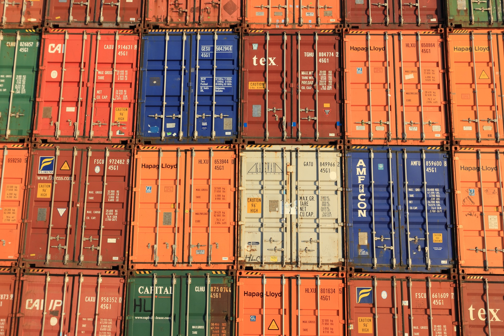

# ECS(ELASTIC CONTAINER SERVICE) 소개


이 워크샵은 Fargate, ECS 및 Docker 컨테이너 워크플로에 익숙하지 않은 엔지니어를 교육하기 위해 설계되었습니다.


이 장에서는 ECS 및 ECS에 서비스를 배포하는 데 관련된 구성 요소에 대한 기본 소개를 제공합니다.

왜 컨테이너인가? ECS 개요

## 왜 컨테이너인가?

개발자는 컨테이너를 사용하여 빠른 속도로 반복하고 애플리케이션의 요구 사항을 충족하도록 확장할 수 있는 속도를 제공할 수 있습니다. 먼저 컨테이너가 무엇이며 팀이 더 빠르게 이동할 수 있도록 하는 방법을 이해하는 것이 중요합니다.

## 컨테이너 란 무엇입니까?



컨테이너는 애플리케이션의 코드, 구성 및 종속성을 단일 개체로 패키징하는 표준 방법을 제공합니다. 컨테이너는 서버에 설치된 운영 체제를 공유하고 리소스 격리된 프로세스로 실행되어 환경에 관계없이 빠르고 안정적이며 일관된 배포를 보장합니다. 랩톱에 로컬로 배포하든 프로덕션 환경에 배포하든 경험은 동일하게 유지됩니다(물론 비밀 및 기타 환경적 가치는 예외입니다!).

## 도커란?

도커 애플리케이션을 빠르게 구축, 테스트 및 배포할 수 있는 소프트웨어 플랫폼입니다. Docker는 라이브러리, 시스템 도구, 코드 및 런타임을 포함하여 소프트웨어를 실행하는 데 필요한 모든 것을 포함하는 컨테이너라는 표준화된 단위로 소프트웨어를 패키징합니다. Linux, Windows 또는 macOS에서 실행 중인지 여부에 관계없이 컨테이너를 실행할 수 있습니다!

## 컨테이너의 이점

컨테이너는 개발자가 애플리케이션을 패키징하고 배포할 수 있는 강력한 방법입니다. 가볍고 어디에서나 쉽게 실행하고 확장할 수 있는 응용 프로그램을 위한 일관되고 이식 가능한 소프트웨어 환경을 제공합니다. 머신 러닝 애플리케이션을 위한 마이크로서비스 구축 및 배포, 배치 작업 실행, 기존 애플리케이션을 클라우드로 이동하는 것은 컨테이너의 인기 있는 사용 사례 중 일부일 뿐입니다. 컨테이너의 다른 이점은 다음과 같습니다.

속도 워크로드 격리 로컬에서 프로덕션으로 테스트하는 단일 아티팩트, 드리프트 방지

## ECS 개요


Amazon Elastic Container Service(Amazon ECS) Docker 컨테이너를 지원하고 AWS에서 컨테이너화된 애플리케이션을 쉽게 실행하고 확장할 수 있는 확장성이 뛰어난 고성능 컨테이너 오케스트레이션 서비스입니다.

Amazon ECS를 사용하면 자체 컨테이너 오케스트레이션 소프트웨어를 설치 및 운영하거나, 가상 머신 클러스터를 관리 및 확장하거나, 해당 가상 머신에서 컨테이너를 예약할 필요가 없습니다.

ECS는 AWS 에코시스템의 나머지 부분에도 깊이 통합되어 있습니다.


이 섹션에서는 다음 주제를 다룹니다.

CLUSTER 작업 정의 작업 및 일정 잡기 서비스 파게이트 서비스 발견

### CLUSTER

Amazon ECS 클러스터는 작업 또는 서비스의 논리적 그룹입니다.

EC2 시작 유형을 사용하는 작업 또는 서비스를 실행하는 경우 클러스터는 컨테이너 인스턴스의 그룹이기도 합니다. 용량 공급자를 사용하는 경우 클러스터는 용량 공급자의 논리적 그룹이기도 합니다. 클러스터는 Fargate 및 EC2 시작 유형의 조합일 수 있습니다. Amazon ECS를 처음 사용할 때 기본 클러스터가 자동으로 생성되지만 계정에 여러 클러스터를 생성하여 리소스를 별도로 유지할 수 있습니다.

ECS 클러스터에 대한 자세한 내용은 다음을 참조하십시오.

### 작업 정의

Amazon ECS에서 실행할 애플리케이션을 준비하려면 작업 정의를 생성합니다. 작업 정의는 애플리케이션을 구성하는 하나 이상의 컨테이너(최대 10개)를 설명하는 JSON 형식의 텍스트 파일입니다.

응용 프로그램의 청사진으로 생각할 수 있습니다. 작업 정의는 애플리케이션에 대한 다양한 매개변수를 지정합니다. 작업 정의 매개변수의 예는 사용할 컨테이너, 사용할 시작 유형, 애플리케이션에 대해 열어야 하는 포트, 작업의 컨테이너와 함께 사용해야 하는 데이터 볼륨입니다. 작업 정의에 사용할 수 있는 특정 매개변수는 사용 중인 시작 유형에 따라 다릅니다. 작업 정의 생성에 대한 자세한 내용은 다음을 참조하십시오.Amazon ECS 작업 정의.

다음은 Fargate 시작 유형을 사용하여 NGINX 웹 서버를 실행하는 단일 컨테이너를 포함하는 작업 정의의 예입니다. 작업 정의에서 여러 컨테이너의 사용을 보여주는 더 확장된 예는 다음을 참조하세요.예제 작업 정의.

```
{
    "family": "webserver",
    "containerDefinitions": [
        {
            "name": "web",
            "image": "nginx",
            "memory": "100",
            "cpu": "99"
        }
    ],
    "requiresCompatibilities": [
        "FARGATE"
    ],
    "networkMode": "awsvpc",
    "memory": "512",
    "cpu": "256"
}
```

### 작업 및 일정 잡기

작업은 클러스터 내에서 작업 정의의 인스턴스화입니다. Amazon ECS 내에서 애플리케이션에 대한 작업 정의를 생성한 후 클러스터에서 실행할 작업 수를 지정할 수 있습니다.

Fargate 시작 유형을 사용하는 각 작업에는 자체 격리 경계가 있으며 기본 커널, CPU 리소스, 메모리 리소스 또는 탄력적 네트워크 인터페이스를 다른 작업과 공유하지 않습니다.

Amazon ECS 작업 스케줄러는 클러스터 내에 작업을 배치하는 역할을 합니다. 몇 가지 다른 일정 옵션을 사용할 수 있습니다. 예를 들어 지정된 수의 작업을 동시에 실행하고 유지 관리하는 서비스를 정의할 수 있습니다. 사용 가능한 다양한 일정 옵션에 대한 자세한 내용은 다음을 참조하십시오.

### 서비스

Amazon ECS를 사용하면 Amazon ECS 클러스터에서 작업 정의의 지정된 수의 인스턴스를 동시에 실행하고 유지 관리할 수 있습니다. 이것을 서비스라고 합니다. 어떤 이유로든 작업이 실패하거나 중지해야 하는 경우 Amazon ECS 서비스 스케줄러는 작업 정의의 다른 인스턴스를 시작하여 이를 대체하고 사용된 예약 전략에 따라 서비스에서 원하는 작업 수를 유지합니다.

서비스에서 원하는 작업 수를 유지하는 것 외에도 선택적으로 로드 밸런서 뒤에서 서비스를 실행할 수 있습니다. 로드 밸런서는 서비스와 연결된 작업에 트래픽을 분산합니다.

두 가지 서비스 스케줄러 전략을 사용할 수 있습니다.

REPLICA:

복제본 스케줄링 전략은 클러스터 전체에 원하는 수의 작업을 배치하고 유지합니다. 기본적으로 서비스 스케줄러는 가용 영역 전체에 작업을 분산합니다. 작업 배치 전략 및 제약 조건을 사용하여 작업 배치 결정을 사용자 정의할 수 있습니다. 자세한 내용은레플리카. 악마:

DAEMON:

스케줄링 전략은 클러스터에서 지정하는 모든 작업 배치 제약 조건을 충족하는 각 활성 컨테이너 인스턴스에 정확히 하나의 작업을 배포합니다. 서비스 스케줄러는 실행 중인 작업에 대한 작업 배치 제약 조건을 평가하고 배치 제약 조건을 충족하지 않는 작업을 중지합니다. 이 전략을 사용할 때 원하는 작업 수, 작업 배치 전략을 지정하거나 Service Auto Scaling 정책을 사용할 필요가 없습니다. 자세한 내용은악마.

## 파게이트


AWS 파게이트서버나 클러스터를 관리할 필요 없이 컨테이너를 실행할 수 있는 Amazon ECS용 기술입니다. AWS Fargate를 사용하면 더 이상 컨테이너를 실행하기 위해 가상 머신의 클러스터를 프로비저닝, 구성 및 확장할 필요가 없습니다. 이렇게 하면 서버 유형을 선택하거나 클러스터를 확장할 시기를 결정하거나 클러스터 패킹을 최적화할 필요가 없습니다.

AWS Fargate를 사용하면 서버 또는 클러스터와 상호 작용하거나 이에 대해 생각할 필요가 없습니다. Fargate를 사용하면 애플리케이션을 실행하는 인프라를 관리하는 대신 애플리케이션을 설계하고 구축하는 데 집중할 수 있습니다.

### 서비스 발견

컨테이너는 본질적으로 변경할 수 없기 때문에 정기적으로 변동될 수 있으며 최신 버전의 서비스로 교체될 수 있습니다. 이는 새 서비스를 등록하고 이전/불건전한 서비스를 등록 취소할 필요가 있음을 의미합니다. 이 작업을 스스로 수행하는 것은 어렵기 때문에 서비스 검색이 필요합니다.

AWS Cloud Map은 클라우드 리소스 검색 서비스입니다. Cloud Map을 사용하면 애플리케이션 리소스에 대한 사용자 지정 이름을 정의할 수 있으며 동적으로 변경되는 리소스의 업데이트된 위치를 유지 관리합니다. 웹 서비스가 항상 리소스의 최신 위치를 검색하기 때문에 애플리케이션 가용성이 높아집니다.

Cloud Map은 기본적으로 ECS와 통합되며 워크샵에서 서비스를 구축할 때 이를 직접 확인할 수 있습니다. ECS를 통한 서비스 검색에 대한 자세한 내용은 다음을 참조하십시오.여기.


