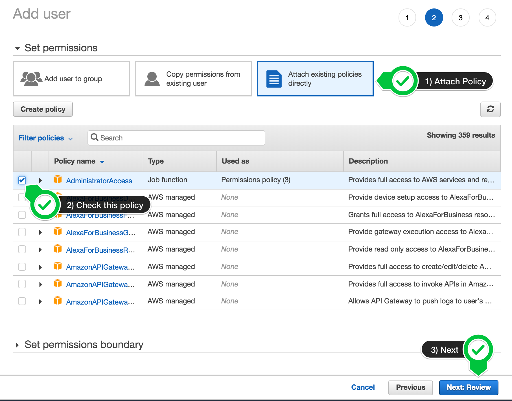
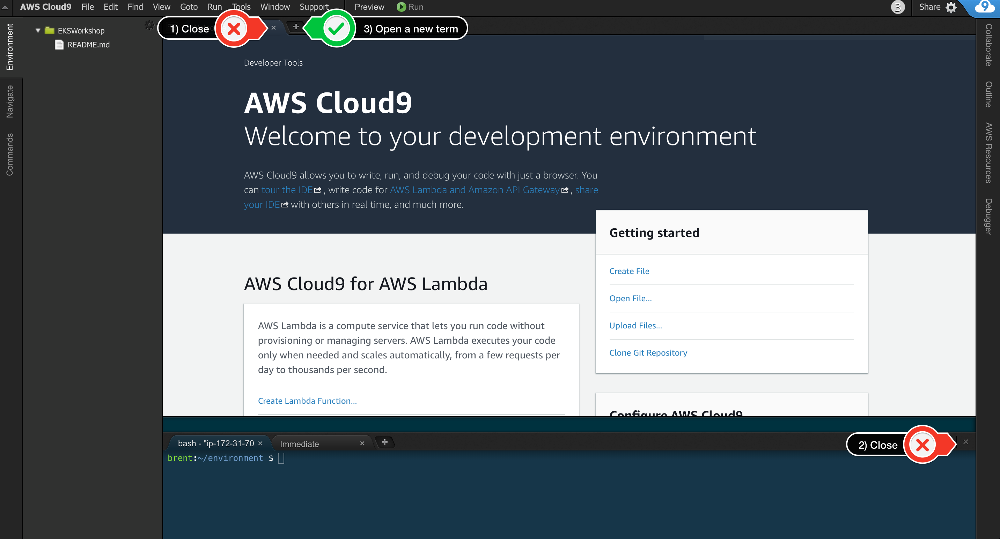
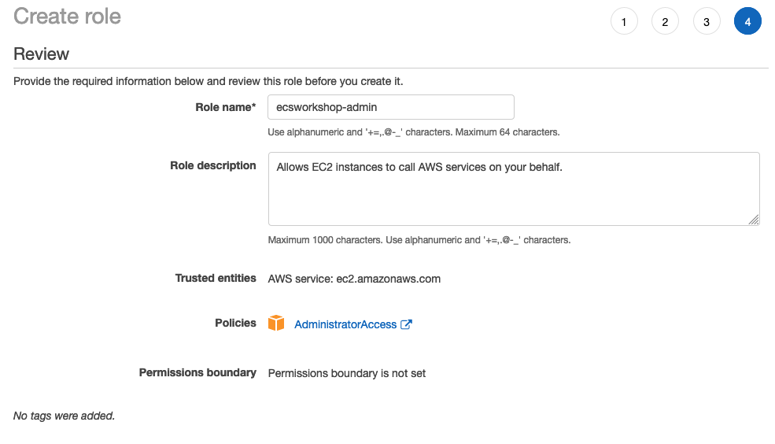
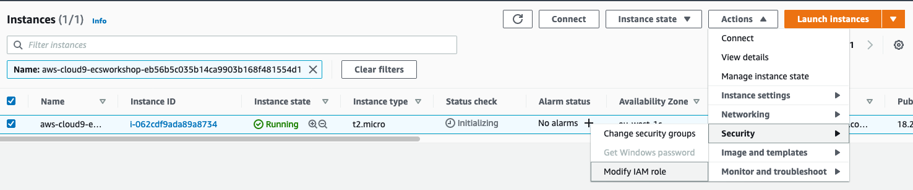
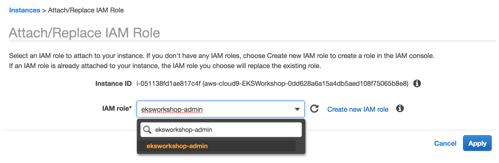

## 워크샵 시작 준비

## 워크샵을 직접 운영

### AWS 계정 생성

1. 관리자 액세스 권한이 있는 AWS 계정이 아직 없는 경우:[여기를 클릭하여 지금 생성](https://aws.amazon.com/ko/premiumsupport/knowledge-center/create-and-activate-aws-account/)

2. AWS 계정이 있으면 AWS 계정에 대한 관리자 액세스 권한이 있는 IAM 사용자로서 나머지 워크샵 단계를 따르고 있는지 확인하십시오. 워크샵에 사용할 새 IAM 사용자 생성

3. 사용자 세부 정보 입력:사용자 생성


4. AdministratorAccess IAM 정책을 연결합니다.정책 첨부



5. 새 사용자를 만들려면 클릭하십시오.사용자 확인


6. 로그인 URL을 기록해 두고 다음을 저장합니다.로그인 URL


### 작업 공간 생성

- 주의  
    Cloud9 작업 공간은 루트 계정 사용자가 아닌 관리자 권한이 있는 IAM 사용자가 빌드해야 합니다. 루트 계정 사용자가 아닌 IAM 사용자로 로그인했는지 확인하십시오.

- 참조  
    Cloud9 도메인에 대해 광고 차단기, 자바스크립트 비활성화기 및 추적 차단기를 비활성화해야 합니다. 그렇지 않으면 작업 공간에 대한 연결이 영향을 받을 수 있습니다. Cloud9에는 타사 쿠키가 필요합니다. 당신은 화이트리스트에특정 도메인.

### Cloud9 생성

- 가장 가까운 지역에서 Cloud9을 시작합니다.

- AWS 콘솔에 로그인합니다.

- Cloud9 환경 생성:https://ap-northeast-1.console.aws.amazon.com/cloud9/home?region=ap-northeast-2

- `환경 만들기` 선택

- 이름을 `ecsworkshop` 으로 지정하고 `다음 단계` 를 `선택` 합니다.

- 인스턴스 유형을 `t3.small` 로 변경하고 다음 단계 를 선택 합니다.

- 마지막으로 `환경 만들기` 를 선택합니다.

- 표시되면 `시작 탭` 과 `하단 작업 영역` 을 닫고 `기본 작업 영역` 에서 `새 터미널 탭` 을 열어 환경을 사용자 지정합니다.



- 이제 작업 공간은 다음과 같아야 합니다.


이 테마가 마음 에 들면 `Cloud9 작업 공간 메뉴` 에서 `보기 / 테마 / Solarized / Solarized Dark` 를 선택하여 직접 선택할 수 있습니다 .

#### IAM 역할을 생성하여 Cloud9 인스턴스에 연결
- 다음 이 [링크](https://console.aws.amazon.com/iam/home#/roles$new?step=review&commonUseCase=EC2%2BEC2&selectedUseCase=EC2&policies=arn:aws:iam::aws:policy%2FAdministratorAccess)를 사용하여 관리자 액세스 권한이 있는 IAM 역할을 생성합니다.

- `AWS 서비스 및 EC2` 가 선택 되었는지 확인하고 `다음` 을 클릭 하여 권한을 봅니다.

- `AdministratorAccess` 가 선택 되었는지 확인하고 `다음: 태그` 를 클릭하여 태그 를 할당합니다.

- `기본값` 을 사용하고 `다음: 검토` 를 클릭하여 검토합니다.

- 이름에 `ecsworkshop-admin` 을 입력 하고 `역할 생성` 을 클릭 합니다.생성 역할



Cloud9 EC2 인스턴스를 찾기 위한 [링크](https://console.aws.amazon.com/ec2/v2/home?#Instances:tag:Name=aws-cloud9-ecsworkshop;sort=desc:launchTime)

- 인스턴스를 선택한 다음 `작업 / 보안 / IAM 역할 수정` 을 선택합니다.



- `IAM 역할` 드롭다운 에서 `ecsworkshop-admin` 을 `선택` 하고 `저장` 을 선택합니다.



`json` 출력과 상호 작용할 때 워크샵 전체에서 이것을 꽤 많이 사용할 것이기 때문에 `jq` 를 설치하십시오.

```
sudo yum install -y jq
```

[AWS 문서](https://docs.aws.amazon.com/cli/latest/userguide/install-cliv2-linux.html)의 지침에 따라 AWS CLI를 업그레이드하십시오..

```
curl "https://awscli.amazonaws.com/awscli-exe-linux-x86_64.zip" -o "awscliv2.zip"
unzip awscliv2.zip
sudo ./aws/install
```

임시 자격 증명이 아직 없는지 확인하기 위해 기존 자격 증명 파일을 제거하고 Cloud9에 대한 AWS 관리형 임시 자격 증명 을 비활성화합니다.

```
aws cloud9 update-environment  --environment-id $C9_PID --managed-credentials-action DISABLE
rm -vf ${HOME}/.aws/credentials
```

현재 리전을 기본값으로 사용하여 [aws cli](https://docs.aws.amazon.com/cli/latest/userguide/install-cliv2-linux.html)를 구성해야 합니다.

```
echo "export AWS_DEFAULT_REGION=$(curl -s 169.254.169.254/latest/dynamic/instance-identity/document | jq -r .region)" >> ~/.bashrc
echo "export AWS_REGION=\$AWS_DEFAULT_REGION" >> ~/.bashrc
echo "export AWS_ACCOUNT_ID=$(aws sts get-caller-identity --query Account --output text)" >> ~/.bashrc
source ~/.bashrc
```

AWS_REGION이 원하는 지역으로 설정되어 있는지 확인

```
test -n "$AWS_REGION" && echo AWS_REGION is "$AWS_REGION" || echo AWS_REGION is not set
```

bash_profile에 저장하자

```
echo "export AWS_ACCOUNT_ID=${AWS_ACCOUNT_ID}" | tee -a ~/.bash_profile
echo "export AWS_REGION=${AWS_REGION}" | tee -a ~/.bash_profile
aws configure set default.region ${AWS_REGION}
aws configure get default.region
```

### IAM 역할 검증
사용 [GetCallerIdentity](https://docs.aws.amazon.com/cli/latest/reference/sts/get-caller-identity.html) Cloud9 IDE가 올바른 IAM 역할을 사용하고 있는지 확인하는 CLI 명령.

```
aws sts get-caller-identity --query Arn | grep ecsworkshop-admin -q && echo "IAM role valid" || echo "IAM role NOT valid"
```

IAM 역할이 유효하지 않으면 DO NOT PROCEED . 돌아가서 이 페이지의 단계를 확인하십시오.

### Cloud9 인스턴스에서 디스크 크기 늘리기

```
$ sudo vi resize.sh
```

```
#!/bin/bash
pip3 install --user --upgrade boto3
export instance_id=$(curl -s http://169.254.169.254/latest/meta-data/instance-id)
python -c "import boto3
import os
from botocore.exceptions import ClientError 
ec2 = boto3.client('ec2')
volume_info = ec2.describe_volumes(
    Filters=[
        {
            'Name': 'attachment.instance-id',
            'Values': [
                os.getenv('instance_id')
            ]
        }
    ]
)
volume_id = volume_info['Volumes'][0]['VolumeId']
try:
    resize = ec2.modify_volume(    
            VolumeId=volume_id,    
            Size=30
    )
    print(resize)
except ClientError as e:
    if e.response['Error']['Code'] == 'InvalidParameterValue':
        print('ERROR MESSAGE: {}'.format(e))"
if [ $? -eq 0 ]; then
    sudo reboot
fi
```

```
$ sudo chmod 755 resize.sh
$ sudo ./resize.sh
```

아래 디스크 정보를 보는 리눅스 명령어인 `df -h` 를 실행하여 디스크 용량이 30G 가 되었는 지 확인합니다.

```
$ df -h
```

<!--
## 설치 및 사전 설정

### Install and Setup CDK
```cdk
# Install prerequisite packages
sudo yum -y install jq nodejs python36

# Install ecs cli for local testing
sudo curl -so /usr/local/bin/ecs-cli https://s3.amazonaws.com/amazon-ecs-cli/ecs-cli-linux-amd64-latest
sudo chmod +x /usr/local/bin/ecs-cli

# Setting CDK Version
export AWS_CDK_VERSION="1.41.0"

# Install aws-cdk
npm install -g --force aws-cdk@$AWS_CDK_VERSION

# For container insights and service autoscaling load generation
curl -C - -O http://download.joedog.org/siege/siege-4.0.5.tar.gz
tar -xvf siege-4.0.5.tar.gz
pushd siege-*
./configure
make all
sudo make install 
popd

# Install cdk packages
pip install --user --upgrade aws-cdk.core==$AWS_CDK_VERSION \
aws-cdk.aws_ecs_patterns==$AWS_CDK_VERSION \
aws-cdk.aws_ec2==$AWS_CDK_VERSION \
aws-cdk.aws_ecs==$AWS_CDK_VERSION \
aws-cdk.aws_servicediscovery==$AWS_CDK_VERSION \
aws_cdk.aws_iam==$AWS_CDK_VERSION \
aws_cdk.aws_efs==$AWS_CDK_VERSION \
awscli \
awslogs

# Setting environment variables required to communicate with AWS API's via the cli tools
echo "export AWS_DEFAULT_REGION=$(curl -s 169.254.169.254/latest/dynamic/instance-identity/document | jq -r .region)" >> ~/.bashrc
echo "export AWS_REGION=\$AWS_DEFAULT_REGION" >> ~/.bashrc
echo "export AWS_ACCOUNT_ID=$(aws sts get-caller-identity --query Account --output text)" >> ~/.bashrc
source ~/.bashrc
```

### Install and Setup ECS-CLI

```ecs-cli
sudo curl -so /usr/local/bin/ecs-cli https://s3.amazonaws.com/amazon-ecs-cli/ecs-cli-linux-amd64-latest
sudo chmod +x /usr/local/bin/ecs-cli

sudo yum -y install jq gettext

# For container insights and service autoscaling load generation
curl -C - -O http://download.joedog.org/siege/siege-4.0.5.tar.gz
tar -xvf siege-4.0.5.tar.gz
pushd siege-*
./configure
make all
sudo make install 
popd
```

```configure ecs-cli
export AWS_REGION=$(curl -s 169.254.169.254/latest/dynamic/instance-identity/document | jq -r .region)
echo "export AWS_REGION=${AWS_REGION}" >> ~/.bash_profile
aws configure set default.region ${AWS_REGION}
aws configure get default.region
```

참고 : 위 명령은 Cloud9이 실행되는 EC2 인스턴스의 루트 볼륨에 디스크 공간을 추가하는 것입니다. 명령이 완료되면 IDE가 다시 온라인 상태가 되는 데 1~2분 정도 걸릴 수 있는 인스턴스를 재부팅합니다.
-->