## 컨테이너 및 환경 모니터링
이 장에서는 Cloudwatch Container Insights를 사용하여 ECS 환경 및 컨테이너를 모니터링하고 Amazon Managed Grafana를 사용하여 Amazon Managed Prometheus를 모니터링하는 방법을 안내합니다.

- [CloudWatch 컨테이너 인사이트](#ecs-클러스터에-대한-cloudwatch-container-insights-구성)

- [Prometheus-Grafana용 Amazon Managed Service 를 사용한 모니터링](#ecs-클러스터용-prometheus-grafana용-amazon-managed-service-구성)

### ECS 클러스터에 대한 CLOUDWATCH CONTAINER INSIGHTS 구성

### 소개
이 장에서는 [Amazon CloudWatch Container Insights](https://docs.aws.amazon.com/AmazonECS/latest/developerguide/cloudwatch-container-insights.html)를 통해 ECS 환경에 대한 모니터링을 설정하는 방법에 대해 알아봅니다.

당신이 사용할 수있는 수집할 CloudWatch Container Insights, 컨테이너화된 애플리케이션 및 마이크로서비스의 메트릭 및 로그를 집계 및 요약합니다. Container Insights는 Amazon Elastic Container Service, Amazon Elastic Kubernetes Service 및 Amazon EC2의 Kubernetes 플랫폼에서 사용할 수 있습니다. 메트릭에는 CPU, 메모리, 디스크 및 네트워크와 같은 리소스에 대한 사용률이 포함됩니다. Container Insights는 또한 문제를 격리하고 신속하게 해결할 수 있도록 컨테이너 다시 시작 실패와 같은 진단 정보를 제공합니다.

Amazon CloudWatch 및 AWS X-Ray를 사용하는 관찰 가능성 기능에 대해 모두 알아보려면 다음을 참조하십시오. [observability-workshop](https://observability.workshop.aws/en/)

---

## 도구 설치 및 구성

Cloud9 작업 영역에서 다음 명령을 실행합니다.

설치 및 설정 전제 조건

```
# Install prerequisite packages
sudo yum -y install jq gettext
```

jq는 JSON 파일에 저장된 데이터를 추출하고 변환하는 데 사용할 수 있는 도구입니다.

gettext 패키지에는 환경 변수 값을 입력 스트림으로 대체하는 데 사용할 수 있는 envsubst 유틸리티가 포함되어 있습니다.

Linux 유틸리티 sed와 함께 이러한 도구를 사용하여 워크샵 전반에 걸쳐 다양한 파일에 속성 값을 삽입하거나 교체할 것입니다. 이렇게 하면 가능한 한 수동으로 텍스트를 편집할 필요가 없습니다.

```
# Setting environment variables required to communicate with AWS API's via the cli tools
echo "export AWS_DEFAULT_REGION=$(curl -s 169.254.169.254/latest/dynamic/instance-identity/document | jq -r .region)" >> ~/.bashrc
echo "export AWS_REGION=\$AWS_DEFAULT_REGION" >> ~/.bashrc
echo "export AWS_ACCOUNT_ID=$(aws sts get-caller-identity --query Account --output text)" >> ~/.bashrc
source ~/.bashrc
```

---

## 환경 구축

Cloud9 작업 영역에서 다음 명령을 실행합니다.

- 로드 밸런서 및 ECS에 대한 서비스 연결 역할이 있는지 확인합니다.

```
aws iam get-role --role-name "AWSServiceRoleForElasticLoadBalancing" || aws iam create-service-linked-role --aws-service-name "elasticloadbalancing.amazonaws.com"

aws iam get-role --role-name "AWSServiceRoleForECS" || aws iam create-service-linked-role --aws-service-name "ecs.amazonaws.com"
```

### 애플리케이션 설정
이 섹션에서는 컨테이너 인사이트를 설정합니다. 시작하려면 ECS에 환경과 프런트엔드 서비스를 배포해야 합니다. 이전 장에서 마이크로서비스를 배포했다면 이 단계를 건너뛰고 다음 페이지로 넘어갈 수 있습니다.

### 저장소 복제
서비스 저장소를 복제합니다.

```
cd ~/environment
git clone https://github.com/brentley/container-demo
git clone https://github.com/brentley/ecsdemo-frontend
git clone https://github.com/brentley/ecsdemo-nodejs
git clone https://github.com/brentley/ecsdemo-crystal
```

### 플랫폼 구축
먼저 프론트엔드 서비스가 실행될 환경을 구축해야 합니다. 우리가 만들고 있는 것에 대한 자세한 내용은 여기에서 코드를 검토할 수 있습니다.플랫폼.

```
cd ~/environment/container-demo/cdk
pip install -r requirements.txt
cdk context --clear && cdk deploy --require-approval never
```

### 마이크로서비스 배포
다음으로 3계층 다중 언어 웹 앱을 ECS 클러스터에 배포합니다. 배포 중인 항목에 대한 자세한 내용은 다음 [마이크로서비스 워크샵 섹션](./3.microservices.md)을 참조하십시오.

```
cd ~/environment/ecsdemo-frontend/cdk
pip install -r requirements.txt
cdk context --clear && cdk deploy --require-approval never

cd ~/environment/ecsdemo-nodejs/cdk
pip install -r requirements.txt
cdk context --clear && cdk deploy --require-approval never

cd ~/environment/ecsdemo-crystal/cdk
pip install -r requirements.txt
cdk context --clear && cdk deploy --require-approval never
```

---

## 컨테이너 인사이트 설정

### 애플리케이션 설정
이 섹션에서는 방금 구축한 ECS 클러스터에 대한 컨테이너 통찰력을 설정합니다.

### 클러스터 이름 가져오기
다음 명령을 실행합니다. 그러면 계정 및 리전에 있는 ECS 클러스터가 나열되고 Container Insights를 활성화하는 데 필요한 클러스터 이름이 표시됩니다.

```
cluster_arn=$(aws ecs list-clusters | jq -r '.clusterArns[] | select(contains("container-demo"))')
clustername=$(aws ecs describe-clusters --clusters $cluster_arn | jq -r '.clusters[].clusterName')
```

### 컨테이너 인사이트 활성화
다음 명령을 실행하여 클러스터에서 Container Insights를 활성화합니다. 이 명령은 ECS 클러스터에서 서비스 및 클러스터 수준 통찰력을 활성화합니다.

```
aws ecs update-cluster-settings --cluster ${clustername}  --settings name=containerInsights,value=enabled --region ${AWS_REGION}
```

### 인스턴스 수준 통찰력 활성화
다음 명령은 ECS 클러스터에 인스턴스 수준 통찰력을 설치합니다.

```
aws cloudformation create-stack --stack-name CWAgentECS-$clustername-${AWS_REGION} --template-body "$(curl -Ls https://raw.githubusercontent.com/aws-samples/amazon-cloudwatch-container-insights/latest/ecs-task-definition-templates/deployment-mode/daemon-service/cwagent-ecs-instance-metric/cloudformation-quickstart/cwagent-ecs-instance-metric-cfn.json)" --parameters ParameterKey=ClusterName,ParameterValue=$clustername ParameterKey=CreateIAMRoles,ParameterValue=True --capabilities CAPABILITY_NAMED_IAM --region ${AWS_REGION}
```

### ECS 클러스터에서 Container Insights 유효성 검사가 활성화되었습니다.
다음 명령을 실행

```
aws ecs describe-clusters --cluster ${clustername}
```

출력은 아래의 것과 유사해야 합니다. JSON의 설정 섹션에서 Container Insights가 활성화된 것을 볼 수 있습니다.

```
{
    "clusters": [
        {
            "status": "ACTIVE", 
            "statistics": [], 
            "tags": [], 
            "clusterName": "container-demo-ECSCluster-1E4H2VVHM9D2R", 
            "settings": [
                {
                    "name": "containerInsights", 
                    "value": "enabled"
                }
            ], 
            "registeredContainerInstancesCount": 0, 
            "pendingTasksCount": 0, 
            "runningTasksCount": 9, 
            "activeServicesCount": 3, 
            "clusterArn": "arn:aws:ecs:us-west-2:1234567899:cluster/container-demo-ECSCluster-1E4H2VVHM9D2R"
        }
    ], 
    "failures": []
}
```

---

## 컨테이너 인사이트 살펴보기

### 로그가 CloudWatch Logs로 스트리밍되는지 확인
CloudWatch 로그로 이동 그리고 아래 형식의 로그 그룹을 볼 수 있는지 확인하십시오.

/aws/ecs/containerinsights/ 클러스터 이름 /성능

### CloudWatch Container Insights 살펴보기
Amazon CloudWatch 로 이동. 아래와 같이 홈 페이지의 드롭다운에서 Container Insights를 선택합니다.


첫 번째 드롭다운에서 ECS 클러스터를 선택 하고 두 번째 드롭다운에서 생성한 ECS 클러스터를 선택합니다. 아래와 같이 기본 대시보드에서 CPU 사용률, 메모리 사용률, 네트워크 및 기타 정보와 같은 다양한 클러스터 수준 메트릭을 보여주는 여러 내장 차트를 볼 수 있습니다.

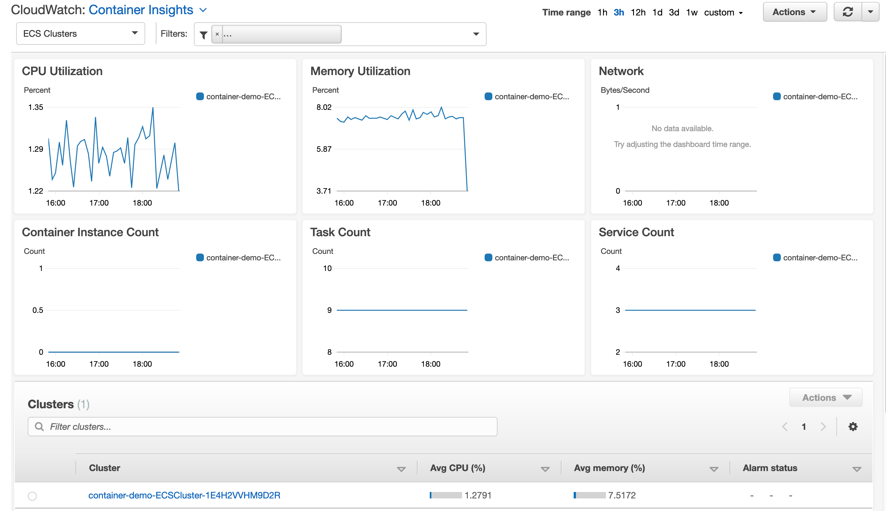

클러스터 이름을 선택하고 아래와 같이 작업 드롭다운을 클릭하여 성능 로그를 볼 수도 있습니다.

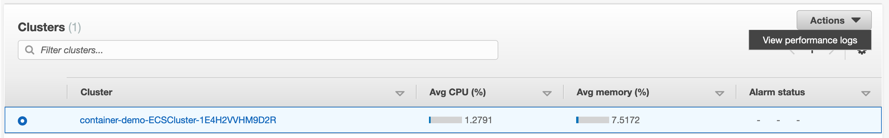

또한 아래와 같이 첫 번째 드롭다운에서 ECS 서비스를 선택하기만 하면 클러스터를 드릴다운하고 서비스 수준에서 메트릭을 볼 수 있습니다. 대시보드는 작업 정보, 배포 정보와 같은 ECS 서비스와 관련된 차트를 표시하도록 조정됩니다.

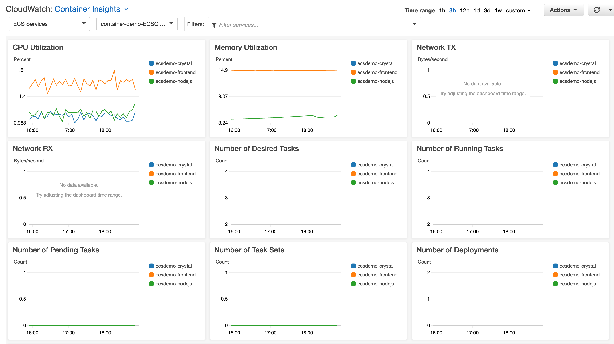

아래로 스크롤하여 나열된 서비스의 일부인 모든 작업을 확인합니다. 목록에서 작업을 선택 하고 작업 드롭다운을 클릭하여 작업별 애플리케이션 로그, X-Ray 추적 및 성능 로그를 볼 수 있습니다.


첫 번째 드롭다운에서 ECS 작업 을 선택 하고 두 번째 드롭다운에서 생성한 ECS 클러스터를 선택합니다. 아래와 같이 기본 대시보드에서 CPU 사용률, 메모리 사용률, 네트워크, 실행 중인 작업 수, 보류 중인 작업 수 및 기타 정보와 같은 다양한 작업 수준 메트릭을 보여주는 여러 내장 차트를 볼 수 있습니다.

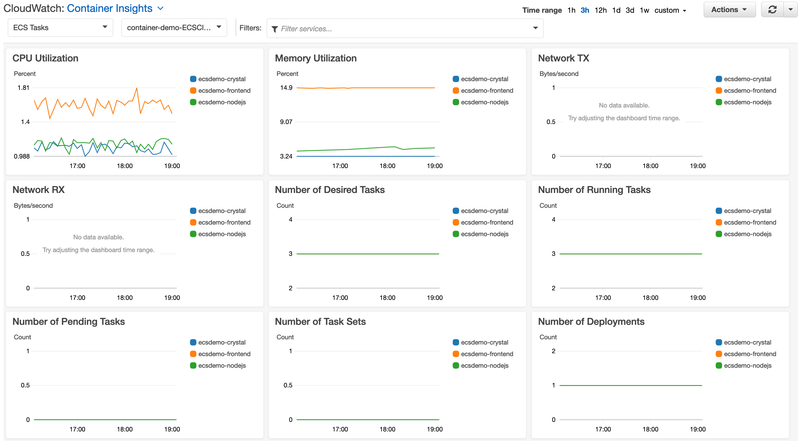

서비스에서 작업의 일부인 모든 컨테이너를 보려면 아래로 스크롤합니다. 목록에서 컨테이너를 선택하고 작업 드롭다운을 클릭하여 컨테이너별 애플리케이션 로그, X-Ray 추적 및 성능 로그를 볼 수 있습니다.


인스턴스 수준 통찰력도 설치했기 때문에 첫 번째 드롭다운에서 ECS 인스턴스 를 선택하여 인스턴스 수준에서 통찰력을 볼 수 있습니다.


---

## 부하 테스트 설정
### 부하 테스트 준비
이제 ECS 환경에 대한 모니터링이 활성화되었습니다. Container Insights를 사용하여 메트릭이 어떻게 표시되는지 확인하기 위해 환경에 수동 로드를 유도해 보겠습니다. 부하 테스트를 수행하기 위해 Siege를 사용할 것입니다.

```
# Install Siege for load testing
sudo yum -y install siege
```

터미널 창에 아래를 입력하여 Siege가 작동하는지 확인하십시오.

```
siege --version
```


---

## 부하 테스트 수행
### Siege를 실행하여 애플리케이션 로드 테스트
로드 테스트를 시작하기 위해 로드 밸런서 URL을 잡아봅시다.

```
alb_url=$(aws cloudformation describe-stacks --stack-name container-demo-alb --query 'Stacks[0].Outputs[?OutputKey==`ExternalUrl`].OutputValue' --output text 2> /dev/null || aws cloudformation describe-stacks --stack-name ecsworkshop-frontend | jq -r '.Stacks[].Outputs[] | select(.OutputKey | contains("FrontendFargateLBServiceServiceURL")) | .OutputValue')
```

참고 : 오류가 표시되는 경우

Siege 디렉터리의 터미널 창에서 다음 명령을 실행합니다.

```
siege -c 200 -i $alb_url
```

이 명령은 다양한 URL에서 ECS 애플리케이션에 대한 200개의 동시 연결을 실행하도록 Siege에 지시합니다. 아래와 같은 출력이 표시되어야 합니다. 처음에는 사이트 루트에 대한 연결이 표시되고 사이트의 다양한 URL로 이동하는 것을 볼 수 있어야 합니다.

이 테스트를 15-20초 동안 실행한 다음 터미널 창에서 ctrl+c로 종료할 수 있습니다. 더 오래 실행할 수 있지만 약 30초 이내에 클러스터의 열린 연결이 최대화되고 자체적으로 종료됩니다.


---

## 부하 테스트 측정항목
Container Insights 홈 페이지로 이동하여 아래와 같이 시간 범위를 15분 으로 선택합니다.


아래 스크린샷에서 메트릭이 그래프 위젯에 표시되기 시작하는 것을 볼 수 있습니다. 특히, Siege가 애플리케이션의 로드를 증가시키면 CPU 사용률이 증가하는 것을 확인하십시오.

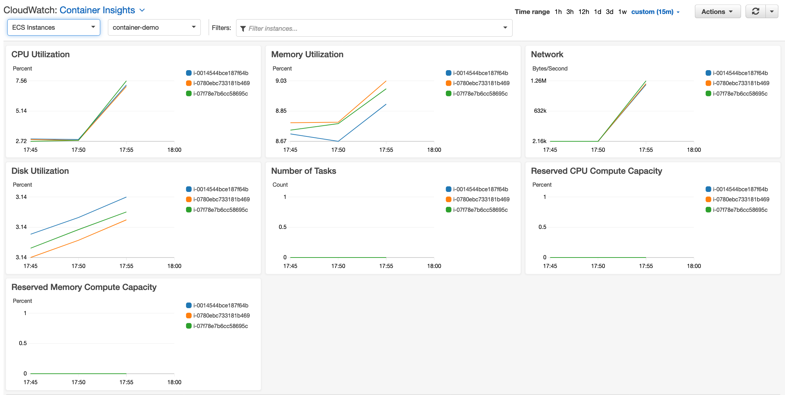


---

## CLOUDWATCH 지표에 대한 경보 설정
### CloudWatch 경보
Container Insights를 통해 캡처된 메트릭은 환경 동작의 이상에 대한 알림을 받도록 경보를 설정하는 데 사용할 수 있습니다.

CloudWatch Container Insights에서는 드릴다운하여 애플리케이션의 CPU 사용률을 위한 CloudWatch를 사용하여 경보를 생성하겠습니다. ECS Services를 선택 하고 CPU Utilization 상자의 오른쪽 상단에 있는 세 개의 수직 점을 클릭합니다. 그리고 메트릭 에서 보기를 선택 합니다.

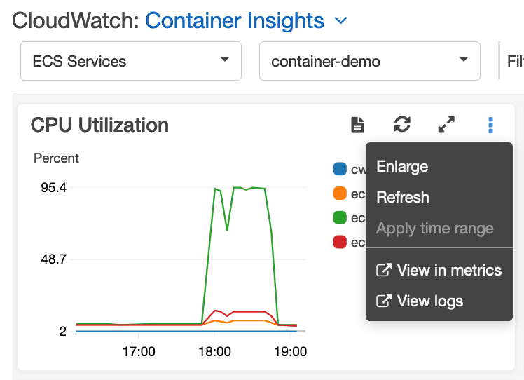

그러면 아래와 같은 화면으로 이동합니다. ecsdemo-frontend 서비스의 CPU 사용률 스파이크가 꽤 있음을 알 수 있습니다 . ecsdemo-frontend 라인 항목에 해당하는 🔔 아이콘을 클릭하여 이 메트릭에 대한 경보를 설정해 보겠습니다 .

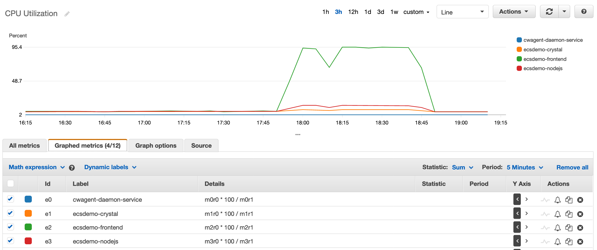

메트릭 조건 지정 화면, 기본값으로 휴가 모두를 입력합니다 (50) 에서 임계 값을 정의 화면. 이렇게 하면 경보에 대한 CPU 사용률 임계값을 50%로 설정합니다. 다음 선택


구성 작업 화면, 선택 새 항목 만들기 옵션 및 경보 알림을 보낼 할 수있는 이메일 ID를 입력합니다. 다음 선택

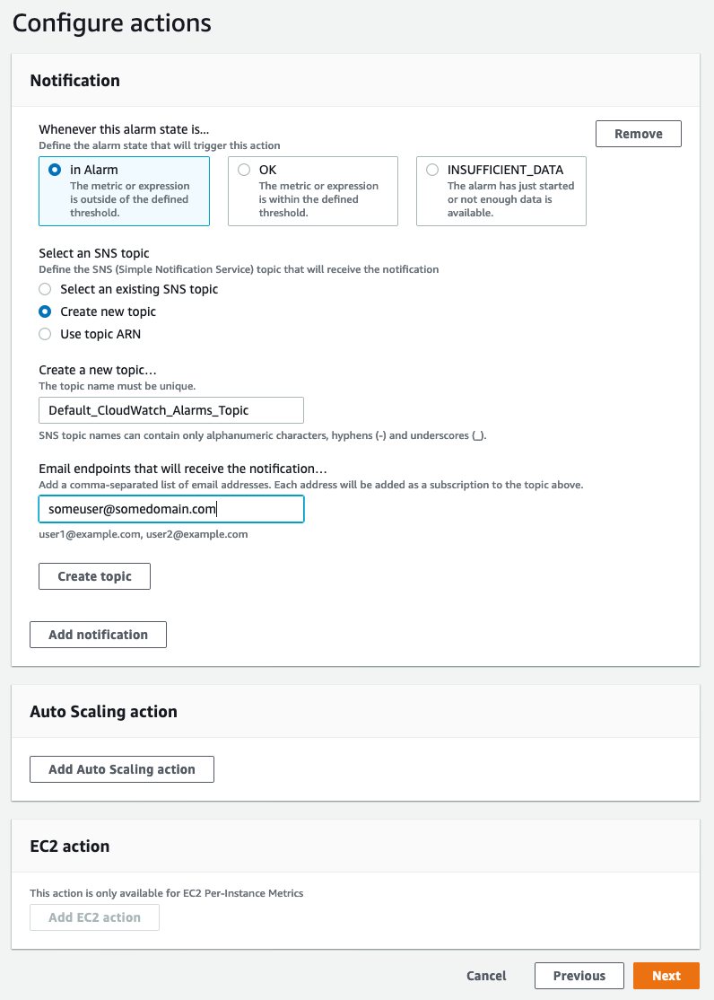

설명의 추가 화면, 알람의 이름을 입력하고 선택 다음을


검토 화면에서 알람 생성을 선택하여 알람 을 생성합니다. 완료되면 아래와 같은 화면을 볼 수 있어야 합니다.


이제 입력한 이메일 받은 편지함으로 이동하여 확인 이메일을 찾아 CloudWatch에서 경보 알림을 수신할 것임을 확인합니다.

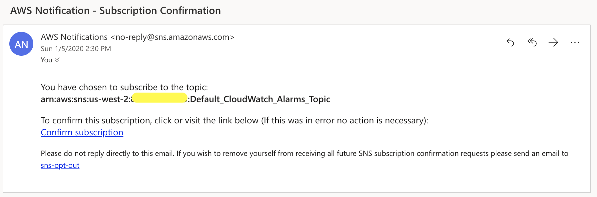

구독 확인 을 클릭하면 아래와 같은 확인 화면이 표시됩니다.

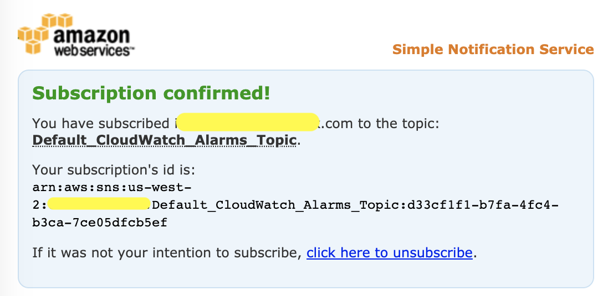

---

## CLOUDWATCH 경보 트리거

### CloudWatch 경보를 트리거할 부하 생성
우리는 다시 한번 Siege를 사용하여 환경에 부하를 생성하여 경보가 트리거될 수 있도록 할 것입니다.

Cloud9 Workspace에서 다음 명령을 실행하고 CPU 사용률이 올라가는지 확인합니다.

```
alb_url=$(aws cloudformation describe-stacks --stack-name container-demo-alb --query 'Stacks[0].Outputs[?OutputKey==`ExternalUrl`].OutputValue' --output text 2> /dev/null || aws cloudformation describe-stacks --stack-name ecsworkshop-frontend | jq -r '.Stacks[].Outputs[] | select(.OutputKey | contains("FrontendFargateLBServiceServiceURL")) | .OutputValue')

siege -c 200 -i $alb_url
```

약 5분 정도 후에 아래와 같이 CPU 사용률이 50% 표시를 넘는 것을 볼 수 있습니다.


그러면 이전에 구성한 알람이 트리거됩니다. 알람의 상태는 아래와 같이 In 알람 입니다.


또한 아래와 같은 이메일 알림을 받게 됩니다.


---

## CLOUDWATCH LOGS INSIGHTS
### 로그 인사이트란 무엇입니까?
CloudWatch Logs InsightsCloudWatch를 위한 완전히 통합된 대화형 종량제 로그 분석 서비스입니다. CloudWatch Logs Insights를 사용하면 즉시 로그를 탐색, 분석 및 시각화할 수 있으므로 운영 문제를 쉽게 해결할 수 있습니다.

### ECS에서 로그 쿼리
CloudWatch Logs Insights 로 이동 선택 /aws/ecs/containerinsights/ cluster-name /performance Log Group을 선택합니다.

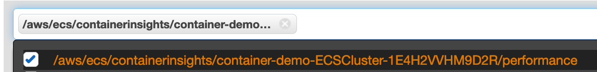

다음 쿼리를 복사하여 텍스트 상자에 붙여넣고 쿼리 실행을 클릭합니다.

```
stats count_distinct(TaskId) as Number_of_Tasks by ServiceName
```

이 쿼리는 아래와 같이 서비스에서 실행 중인 작업 수를 보여주는 테이블을 반환합니다.


다음 쿼리는 filter 명령을 사용하여 5분마다 작업에서 사용한 평균 메모리 및 CPU를 보여주는 테이블을 반환합니다.

```
stats avg(MemoryUtilized) as Avg_Memory, avg(CpuUtilized) as Avg_CPU by bin(5m) | filter Type="Task"
```


시각화 탭을 클릭하기만 하면 그래프에서 출력을 시각화할 수도 있습니다 . 다음 스크린샷은 동일한 보고서의 막대 차트를 보여줍니다.


---

## 리소스 정리
보시다시피 CloudWatch Container Insights를 작동시키고 CPU 및 기타 지표에 대한 경보를 설정하는 것은 매우 쉽습니다. CloudWatch Container Insights를 사용하면 자체 모니터링 인프라를 관리 및 업데이트할 필요가 없으며 플랫폼을 관리할 필요가 없는 기본 AWS 솔루션을 사용할 수 있습니다.

### 컨테이너 인사이트 비활성화
ECS 클러스터에 대한 컨테이너 통찰력을 비활성화하려면 다음 명령을 실행합니다.

```
aws ecs update-cluster-settings --cluster ${clustername} --settings name=containerInsights,value=disabled --region ${AWS_REGION}
```

출력은 아래와 유사해야 합니다.

```
{
    "cluster": {
        "status": "ACTIVE", 
        "statistics": [], 
        "tags": [], 
        "clusterName": "container-demo-ECSCluster-1E4H2VVHM9D2R", 
        "settings": [
            {
                "name": "containerInsights", 
                "value": "disabled"
            }
        ], 
        "registeredContainerInstancesCount": 0, 
        "pendingTasksCount": 0, 
        "runningTasksCount": 0, 
        "activeServicesCount": 0, 
        "clusterArn": "arn:aws:ecs:us-west-2:123456789:cluster/container-demo-ECSCluster-1E4H2VVHM9D2R"
    }
}
```

[CloudFormation](https://console.aws.amazon.com/cloudformation/home) 으로 이동, 인스턴스 수준 통찰력을 활성화하기 위해 생성된 스택을 삭제합니다.

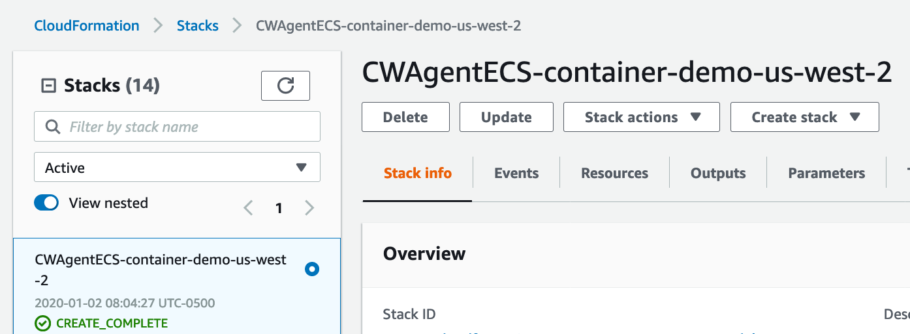

프런트엔드 서비스 스택과 플랫폼 스택을 삭제합니다.

```
cd ~/environment/ecsdemo-frontend/cdk
cdk destroy -f

cd ~/environment/ecsdemo-nodejs/cdk
cdk destroy -f

cd ~/environment/ecsdemo-crystal/cdk
cdk destroy -f

cd ~/environment/container-demo/cdk
cdk destroy -f

python -c "import boto3
c = boto3.client('logs')
services = ['ecsworkshop-frontend', 'ecsworkshop-nodejs', 'ecsworkshop-crystal']
for service in services:
    frontend_logs = c.describe_log_groups(logGroupNamePrefix=service)
    print([c.delete_log_group(logGroupName=x['logGroupName']) for x in frontend_logs['logGroups']])"
```

---

## ECS 클러스터용 PROMETHEUS-GRAFANA용 AMAZON MANAGED SERVICE 구성

## 소개
이 장에서는 Prometheus/Grafana용 Amazon Managed Service를 사용하여 ECS 환경에 대한 모니터링을 설정하고 OpenTelemetry용 AWS Distro를 사용하여 지표를 수집하는 방법에 대해 알아봅니다.

### Prometheus(AMP)용 Amazon 관리형 서비스
Amazon Managed Service for Prometheus는 오픈 소스 Prometheus 프로젝트와 호환되는 지표에 대한 모니터링 서비스로, 컨테이너 환경을 더 쉽게 안전하게 모니터링할 수 있습니다. AMP는 인기 있는 CNCF(Cloud Native Computing Foundation) Prometheus 프로젝트를 기반으로 하는 컨테이너 모니터링 솔루션입니다. AMP는 Prometheus 메트릭에 대한 수집, 저장, 쿼리 및 경고를 위한 수평 확장성을 추가하는 오픈 소스 CNCF 프로젝트인 Cortex로 구동됩니다. AMP는 Amazon Elastic Kubernetes Service 및 Amazon Elastic Container Service는 물론 자체 관리형 Kubernetes 클러스터 전반에서 애플리케이션 모니터링을 시작하는 데 필요한 무거운 작업을 줄여줍니다. AMP는 모니터링 요구 사항이 증가함에 따라 자동으로 확장됩니다. 고가용성 다중 가용 영역 배포를 제공하고 AWS 보안 및 규정 준수 기능을 통합합니다.

[AMP에 대해 자세히 알아보기](https://aws.amazon.com/prometheus/faqs/)

### Grafana용 Amazon 관리형 서비스(AMG)
Grafana용 Amazon Managed Service는 고객이 여러 데이터 원본에 대한 지표, 로그 및 추적을 분석, 모니터링 및 경보하는 데 도움이 되는 풍부한 대화형 데이터 시각화가 포함된 완전 관리형 서비스입니다. 자동으로 확장되고 가용성이 높은 엔터프라이즈 보안 서비스를 사용하여 대화형 대시보드를 만들고 조직의 모든 사람과 공유할 수 있습니다. Grafana용 Amazon Managed Service를 사용하면 AWS 계정, AWS 리전 및 데이터 원본에서 대시보드에 대한 사용자 및 팀 액세스를 관리할 수 있습니다. Grafana용 Amazon Managed Service는 직관적인 리소스 검색 경험을 제공하여 여러 리전에서 AWS 계정을 쉽게 온보딩하고 Amazon CloudWatch, AWS X-Ray, Amazon Elasticsearch Service, Amazon Timestream, AWS IoT SiteWise 및 Amazon과 같은 AWS 서비스에 안전하게 액세스할 수 있도록 지원합니다. Prometheus를 위한 관리형 서비스.

[AMG에 대해 자세히 알아보기](https://aws.amazon.com/grafana/faqs/)]

### OpenTelemetry용 AWS Distro
OpenTelemetry용 AWS Distro는 OpenTelemetry 프로젝트의 안전한 프로덕션 준비 AWS 지원 배포입니다. Cloud Native Computing Foundation의 일부인 OpenTelemetry는 애플리케이션 모니터링을 위한 분산 추적 및 메트릭을 수집하는 오픈 소스 API, 라이브러리 및 에이전트를 제공합니다.

OpenTelemetry용 AWS Distro를 사용하면 애플리케이션을 한 번만 계측하여 상관 관계가 있는 지표와 추적을 여러 모니터링 솔루션으로 보낼 수 있습니다. 자동 계측 에이전트를 사용하여 코드를 변경하지 않고 추적을 수집합니다. OpenTelemetry용 AWS Distro는 또한 AWS 리소스 및 관리형 서비스에서 메타데이터를 수집하므로 애플리케이션 성능 데이터를 기본 인프라 데이터와 상호 연관시켜 문제 해결에 걸리는 평균 시간을 단축할 수 있습니다.

OpenTelemetry용 AWS Distro를 사용하여 온프레미스는 물론 EC2의 Amazon Elastic Compute Cloud(EC2), Amazon Elastic Container Service(ECS), Amazon Elastic Kubernetes Service(EKS), AWS Fargate에서 실행되는 애플리케이션을 계측하십시오.

[OpenTelemetry용 AWS Distro에 대해 자세히 알아보기](https://aws-otel.github.io/docs/introduction/)

AWS Observability Services 및 도구에 대해 자세히 알아보려면 다음을 확인하십시오.

[AWS Observability Services 워크샵](https://observability.workshop.aws/)

## 도구 설치 및 구성

Cloud9 작업 공간을 설정하지 않은 경우 다음으로 이동하십시오. 작업 공간 생성 섹션을 설정하고 설정합니다.

Cloud9 작업 영역에서 다음 명령을 실행합니다.

설치 및 설정 전제 조건

```
#  Clone application repository
cd ~/environment
git clone https://github.com/aws-samples/ecsdemo-amp.git

# Create Python virtual environment and install required CDK dependencies
cd ~/environment/ecsdemo-amp/cdk
virtualenv .env
source .env/bin/activate
pip install -r requirements.txt

# Bootstrap CDK toolkit stack
cdk bootstrap aws://$AWS_ACCOUNT_ID/$AWS_DEFAULT_REGION
```

## AMP 작업 공간 만들기

새 AMP 작업 공간 만들기
AMP 콘솔로 이동. AMP 작업 공간의 이름을 입력하고 Create


또는 AWS CLI를 사용하여 다음 명령을 사용하여 작업 공간을 생성할 수도 있습니다.

```
aws amp create-workspace --alias ecs-workshop --region $AWS_REGION
```

AMP 작업 공간은 몇 초 만에 생성됩니다. 생성되면 아래와 같이 작업 공간을 볼 수 있습니다.


## 샘플 애플리케이션 배포

이 장에서는 ECS 클러스터에서 Prometheus 메트릭 수집을 활성화합니다. 이 시나리오에서는 Prometheus Receiver를 사용하여 애플리케이션에서 스크랩하고 AWS ECS Container Metrics Receiver를 사용하여 인프라 메트릭을 스크랩합니다.

ADOT Collector와 Prometheus 메트릭 이미터가 있는 샘플 앱을 배포합니다.

ADOT 수집기 구성에는 두 개의 파이프라인이 포함됩니다.

애플리케이션 지표를 스크랩하기 위해 정적 호스트에서 애플리케이션 지표를 스크랩하고 AWS Prometheus 원격 쓰기 내보내기를 사용하여 지표를 내보내도록 Prometheus Receiver를 구성합니다.
Amazon ECS 지표를 스크랩하기 위해 ECS 지표를 수집하도록 AWS ECS Container Metrics Receiver를 구성하고 지표를 내보내도록 다른 AWS Prometheus 원격 쓰기 내보내기를 구성합니다.
Cloud9 작업 영역에서 다음 명령을 실행합니다.

이전 단계에서 생성된 AMP 원격 쓰기 엔드포인트를 가져오도록 환경 변수를 설정하고 ADOT 구성 파일에 추가합니다.

```
cd ~/environment/ecsdemo-amp/cdk

export AMP_WORKSPACE_ID=$(aws amp list-workspaces --query 'workspaces[*].workspaceId' --output text)
export AMP_Prometheus_Endpoint=$(aws amp describe-workspace --workspace-id $AMP_WORKSPACE_ID --query 'workspace.prometheusEndpoint' --output text)
export AMP_Prometheus_Remote_Write_Endpoint='"'${AMP_Prometheus_Endpoint}api/v1/remote_write'"'

sed -i -e "s~{{endpoint}}~$AMP_Prometheus_Remote_Write_Endpoint~" ecs-fargate-adot-config.yaml
sed -i -e "s~{{region}}~$AWS_REGION~" ecs-fargate-adot-config.yaml
```

cdk가 어셈블리 CloudFormation 템플릿을 합성할 수 있는지 확인

```
cdk synth
```

cdk가 환경에서 구축 및/또는 변경을 제안하는 내용을 검토합니다.

```
cdk diff
```

샘플 애플리케이션 배포

```
cdk deploy --require-approval never
```

코드 검토
Prometheus 샘플 애플리케이션 배포 코드
Prometheus 샘플 애플리케이션의 경우 단순히 도커 이미지에서 컨테이너를 실행하고 싶지만 이를 배포하고 스케줄러 뒤에 가져오는 방법을 파악해야 합니다. 이를 자체적으로 수행하려면 VPC, ECS 클러스터, 작업 정의 및 ECS 서비스를 구축해야 합니다. 이러한 구성 요소를 자체적으로 구축하는 것은 수백 줄의 CloudFormation과 동일하지만 cdk가 제공하는 더 높은 수준의 구성을 사용하면 80줄의 코드로 모든 것을 구축할 수 있습니다.

```
class AmpService(cdk.Stack):

    def __init__(self, scope: cdk.Stack, id: str, **kwargs):
        super().__init__(scope, id, **kwargs)

        # This construct builds Amazon VPC
        self.vpc = ec2.Vpc(self, "VPC")

        # This construct creates Amazon ECS cluster in previously built Amazon VPC
        self.ecs_cluster = ecs.Cluster(self, "DemoCluster", vpc=self.vpc)

        # Reading ADOT Collector configuration file
        with open("ecs-fargate-adot-config.yaml", 'r') as f:
            adot_config = f.read()

        # Amazon ECS Fargate Task Definition
        self.fargate_task_def = ecs.TaskDefinition(
            self, "aws-otel-FargateTask",
            compatibility=ecs.Compatibility.EC2_AND_FARGATE,
            cpu='256',
            memory_mib='1024'
        )

        # Creating Amazon CloudWatch Log groups and setting them to be deleted upon stack removal
        self.adot_log_grp = logs.LogGroup(
            self, "AdotLogGroup",
            removal_policy=cdk.RemovalPolicy.DESTROY
        )

        self.app_log_grp = logs.LogGroup(
            self, "AppLogGroup",
            removal_policy=cdk.RemovalPolicy.DESTROY
        )
        # ADOT Collector container configuration. Here we pull container image from Public Amazon ECR repository
        self.otel_container = self.fargate_task_def.add_container(
            "aws-otel-collector",
            image=ecs.ContainerImage.from_registry("public.ecr.aws/aws-observability/aws-otel-collector:latest"),
            memory_reservation_mib=512,
            logging=ecs.LogDriver.aws_logs(
                stream_prefix='/ecs/ecs-aws-otel-sidecar-collector-cdk',
                log_group=self.adot_log_grp
            ),
            environment={
                "REGION": getenv('AWS_REGION'),
                "AOT_CONFIG_CONTENT": adot_config
            },
        )
        # Sample Prometheus metric emitter container configuration. Here we build image from Docker file and push it to Amazon ECR repository
        self.prom_container = self.fargate_task_def.add_container(
            "prometheus-sample-app",
            image=ecs.ContainerImage.from_docker_image_asset(
                asset=ecr_a.DockerImageAsset(
                    self, "PromAppImage",
                    directory='../prometheus'
                )
            ),
            memory_reservation_mib=256,
            logging=ecs.LogDriver.aws_logs(
                stream_prefix='/ecs/prometheus-sample-app-cdk',
                log_group=self.app_log_grp
            ),
            environment={
                "REGION": getenv('AWS_REGION')
            },
        )
        # Amazon ECS Service Definition
        self.fargate_service = ecs.FargateService(
            self, "AmpFargateService",
            service_name='aws-otel-FargateService',
            task_definition=self.fargate_task_def,
            cluster=self.ecs_cluster,
            desired_count=1,
        )
        # Here we add required IAM permissions for Amazon ECS Task Role
        self.fargate_task_def.add_to_task_role_policy(
            iam.PolicyStatement(
                actions=[
                    "logs:PutLogEvents",
                    "logs:CreateLogGroup",
                    "logs:CreateLogStream",
                    "logs:DescribeLogStreams",
                    "logs:DescribeLogGroups",
                    "ssm:GetParameters",
                    "aps:RemoteWrite"
                ],
                resources=['*']
            )
        )
```

## AMG 작업 공간 생성

전제 조건
AMG를 사용하려면 계정에서 활성화된 AWS SSO가 필요합니다. AWS SSO는 AMG 작업 공간에 로그인하기 위한 인증 공급자로 사용됩니다.

계정에서 AWS SSO를 활성화하려면 아래 단계를 따르십시오.
AWS Organizations 관리 계정 자격 증명을 사용하여 AWS Management 콘솔에 로그인합니다.
열기 AWS SSO 콘솔.
를 선택합니다 Enable AWS SSO.
아직 AWS Organizations를 설정하지 않은 경우 조직을 생성하라는 메시지가 표시됩니다. Create AWS organization이 프로세스를 완료 하려면 선택하십시오 .

이제 계속해서 나중에 AMG 작업 공간에 대한 액세스를 제공하는 데 사용할 새 AWS SSO 사용자를 생성하십시오.

Users AWS SSO 콘솔 왼쪽에서 선택 하고 Add user 


다음 화면에서 다음 필수 정보 제공


선택하다 Next:Groups
Add user우측 하단 클릭

AMG 작업 공간 생성
로 이동 AMG 콘솔 아래와 같이 작업 공간 이름을 제공하십시오.


페이지 Service managed에서 선택 Configure Settings하고 를 클릭 Next합니다. 이 옵션을 선택하면 마법사가 나중에 선택할 AWS 서비스를 기반으로 권한을 자동으로 프로비저닝할 수 있습니다.

에서 Service managed permission settings화면이 여러 AWS에 도달 Grafana을 작업 공간을 작성하는 경우 동일한 계정에서 자원을 모니터하거나 허용하는 Grafana를 구성하려면 선택하여 계정을 선택할 수 있습니다 Organization옵션을하고 필요한 OU ID를 제공한다.


옵션을 그대로 두고 Current account모든 데이터 소스와 알림 채널을 선택 하기만 하면 됩니다 . 딸깍 하는 소리Next


검토 화면에서 옵션을 살펴보고 Create workspace

사용자 추가
AMG 작업 공간이 로 바뀌면 을 ACTIVE클릭 Assign user하고 이전에 만든 SSO 사용자를 선택합니다. 딸깍 하는 소리Assign user


기본적으로 새로 할당된 모든 사용자는 ViewersGrafana에 대한 읽기 전용 권한만 제공 하므로 추가됩니다 . 사용자를 관리자로 설정하려면 아래에서 사용자를 Users선택하고 을 선택 Make admin합니다. 이제 사용자가 관리자임을 확인해야 합니다.


## AMG 작업 공간에 로그인
AMG 작업 공간에 로그인
요약 섹션에서 Grafana 작업 공간 URL을 클릭하십시오.


그러면 사전 요구 사항의 일부로 생성한 UserId 및 Password를 제공할 수 있는 AWS SSO 로그인 화면으로 이동합니다.


## 메트릭 시각화
AMP 데이터 소스 구성
선택 AWS services당신이 선택할 수있는 모든 AWS 데이터 소스를 사용할 보여주는 아래 그림과 같이 화면에 당신을 데려 갈 것이다 왼쪽 탐색 모음에있는 AWS 로고에서.


목록에서 Amazon Managed Service for Prometheus를 선택하고 AMP 작업 영역을 생성한 AWS 리전을 선택합니다. 그러면 아래와 같이 해당 지역에서 사용 가능한 AMP 작업 공간이 자동으로 채워집니다.


목록에서 AMP 작업 공간을 선택하고 을 클릭하기만 하면 Add data sources됩니다.

메트릭 시각화
이 섹션에서는 ECS 환경에서 지표를 시각화할 수 있는 샘플 Grafana 대시보드를 가져올 것입니다.

제공된 샘플 대시보드를 로컬로 컴퓨터에 다운로드합니다(Cloud9를 사용하지 않음). curl이 설치되어 있지 않다면 Github 저장소로 직접 이동하여 수동으로 파일을 다운로드하십시오.

```
curl https://raw.githubusercontent.com/aws-samples/ecsdemo-amp/main/grafana/AMP_ECS_Task_Monitoring.json -o AMP_ECS_Task_Monitoring.json
```

plus왼쪽 탐색 모음 의 기호로 이동하여 을 선택 Import합니다.


가져오기 화면에서 JSON 파일 업로드를 클릭하고 방금 다운로드한 대시보드 파일을 선택하고 하단의 드롭다운에서 AMP 데이터 소스를 선택했는지 확인 하고 Import


완료되면 아래와 같이 AMP 데이터 소스를 통해 ECS 클러스터의 메트릭을 보여주는 Grafana 대시보드를 볼 수 있습니다.

이 샘플 대시보드는 작업 수준에서 Amazon ECS 지표를 시각화하고 실행 중인 Amazon ECS 작업 수, 총 메모리 및 vCPU 사용량도 표시합니다.


사용자 지정 대시보드를 만들고 AMP를 데이터 소스로 연결하는 패널을 추가하여 PromQL을 사용하여 자신만의 사용자 지정 대시보드를 만들 수도 있습니다.

## CLEAN UP
샘플 Prometheus 애플리케이션 및 플랫폼 삭제

```
cd ~/environment/ecsdemo-amp/cdk
cdk destroy -f
```

AMP 작업 공간 삭제

```
aws amp delete-workspace --workspace-id $AMP_WORKSPACE_ID
```

AMG 작업 영역 삭제
AMG 작업 공간을 삭제하려면:

다음 위치에서 AMG 콘솔을 엽니다. https://console.aws.amazon.com/grafana/

탐색 창에서 메뉴 아이콘을 선택합니다.

모든 작업 영역을 선택합니다.

ecs-workshop 작업 공간을 선택합니다.

삭제를 선택합니다.

삭제를 확인하려면 작업 공간의 이름을 입력하고 삭제를 선택합니다.

