# Portainer 설치 및 설정 (Docker Web UI 관리툴)
<!--
[원본](https://help.iwinv.kr/manual/read.html?idx=548)
-->
Portainer 는 Docker 를 웹상에서 관리할 수 있게 도와주는 툴 입니다.

오픈소스로 배포되고 있어 무료로 사용이 가능하며, 쉘프롬프트에서 Docker 명령을 일일이 수행할 필요가 없이 Web UI 로 손쉽게 관리 할 수 있습니다.

본 매뉴얼에서는 Docker 가 설치되어있지 않는 서버 기준으로 Docker 와 Portainer 설치 방법을 기술하였습니다.

주로 사용하는 image 다운로드, container 생성, volume 생성, 호스트와 Docker 간 포트 매칭, 자동 구동 설정에 대한 방법을 담고 있으므로 필요로 하는 사용자분은 본 매뉴얼을 참고하셔서 활용하시기 바랍니다.

(Docker 이미지로 설치하신 분은 설치 단계를 건너뛰고, '3. Portainer 로그인' 단계부터 보시면 됩니다)

## **설치 환경 : CentOS 7.x**

1. Docker 설치

Portainer 를 설치하기 전에 우선 Docker 가 설치되어있고 구동 상태로 되어 있어야 합니다.

기본 Docker 말고 별도의 Docker 공식 repogitory 를 등록하여 최신 버전의 docker-ce 를 설치합니다.

```
# yum install -y yum-utils device-mapper-persistent-data lvm2

# yum-config-manager --add-repo https://download.docker.com/linux/centos/docker-ce.repo

# yum install -y docker-ce
```

Docker 를 가동하고, 부팅시에도 자동 구동 되도록 설정합니다.

```
# service docker start

# systemctl enable docker

# docker info
```

처음 설치된 Docker 는 별도의 포트 사용 설정이 없으면 netstat 명령으로 확인이 되지 않고 ps 명령으로 구동 상태를 확인할 수 있습니다.

설치된 Docker 의 버전을 확인합니다. 작성일 (2018-11-05) 기준 Docker CE 18.06.1 버전 입니다.

```
# docker version

# docker info
```

2. Portainer 설치

먼저 Portainer 에서 사용할 Volume 을 생성합니다.

```
# docker volume create portainer_data
```

Portainer 는 컨테이너 형태로 제공 되며, 컨테이너 생성 전에 이미지를 다운로드 받아야 합니다.

Docker 에서는 컨테이너 생성시에 필요한 이미지가 없을 경우 자동으로 다운로드 받게 되므로 아래와 같이 구동 명령을 통해

이미지 다운로드, 컨테이너 생성까지 한 번에 실행하도록 합니다.

또한 명령 실행시 옵션 (--restart=always) 을 주게되면 추후 docker 를 재시작 했을 경우 Portainer 컨테이너 또한 자동으로 구동 됩니다.

 

-p 9000:9000 옵션은 Docker 에서 사용하는 포트 9000번을 (Docker가 설치된) 호스트 포트 9000 번과 매칭 시키는 옵션입니다.

이로써 외부에서도 9000 포트를 통해 Portainer 관리 페이지에 접근할 수 있게 됩니다.

```
# docker run -d -p 9000:9000 -v /var/run/docker.sock:/var/run/docker.sock -v portainer_data:/data --restart=always portainer/portainer
```

3. Portainer 로그인

웹브라우저를 통해 Portainer (Docker 관리 Web UI) 서버에 접근합니다.

ex) http://서버IP:9000

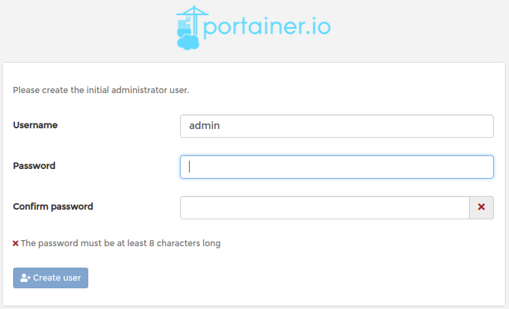

초기 접속시 admin 계정의 패스워드를 설정하게 됩니다. 8자 이상의 길이로 사용할 패스워드를 입력한 후 'Create user' 버튼을 누릅니다.

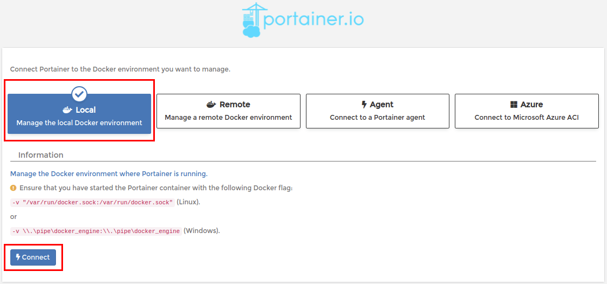

원격지의 Docker 도 관리 할 수 있으나 (기본 선택), 현재는 Portainer 를 통한 Docker 이용법을 알아보고 있으므로, Local 을 선택한 후 'Connect' 버튼을 눌러 접속합니다.

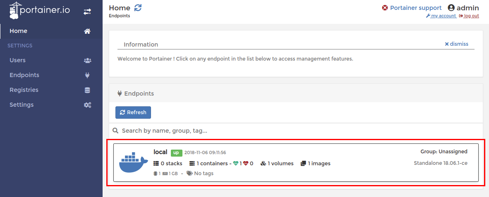

초기 접속시 Endpoint 리스트가 출력되는데, 좀 전에 선택하였던 'Local'  영역의 요약 정보를 확인할 수 있습니다.

컨테이너 1 (구동중 1), 이미지 1, 볼륨 1개가 보이는데 이것은 Portainer 가 사용하는 것들 입니다.

'Local' 박스를 누릅니다.

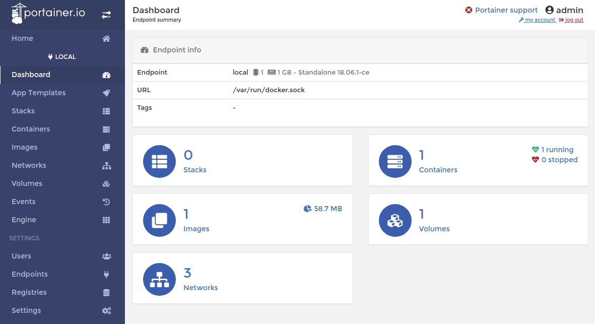

Endpoint 'Local' 의 기본 화면 입니다. 요약 정보에서 보았던 내용이 메인 페이지에서도 보입니다.

좌측에는 Docker 를 관리하기 위한 기능들이 메뉴로 나열되어 있습니다.

이제 httpd 이미지를 다운로드 받아 서비스 구동까지 진행해보도록 하겠습니다.

좌측 메뉴의 'Images' 를 선택합니다.

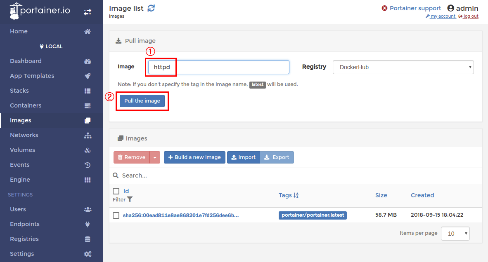

4. 이미지 생성 

① 에서는 '내가 알아볼 수 있는 (내가 정하는)' 별칭이 아닌 이미지의 공식 이름을 입력해야 합니다.

우측의 Registry 에 등록되어진 이미지를 다운로드 받을 수 있으며, 이미지 리스트는 DockerHub 에서 확인이 가능합니다. (https://hub.docker.com/explore/)

Registry 는 DockerHub 가 아닌 사설 서버를 이용할 수 있으며, 풀다운 메뉴에서 선택하기 위해서는 좌측 메뉴의 Registries 메뉴에서 먼저 등록을 해야 선택이 가능해집니다.

여기서는 httpd 를 DockerHub 에서 다운로드 받는것으로 진행합니다. 별도의 버전 명시 없이 httpd 라고 입력하면 'latest' 버전인 최신버전이 설치 됩니다.

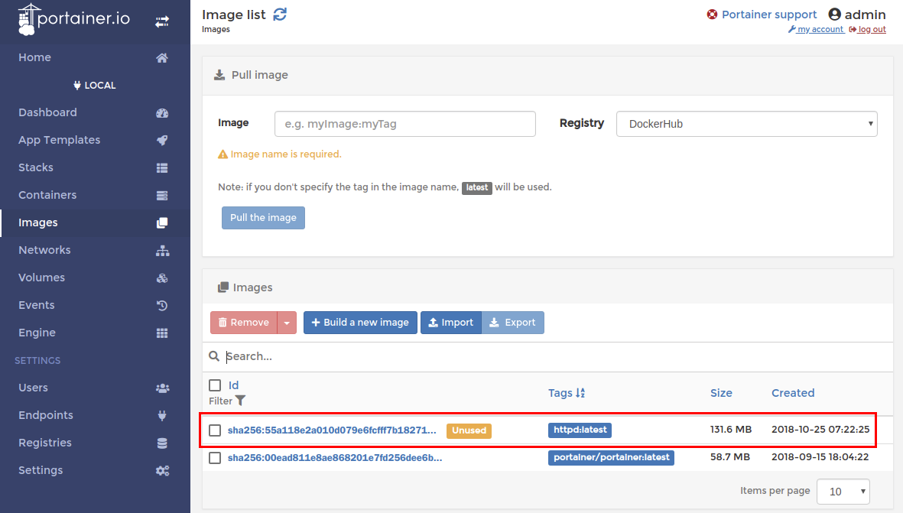

다운로드 된것이 확인되었습니다. Tags 를 보면 'httpd:latest' 라고 표시됩니다.

httpd 에서 사용할 볼륨을 생성하기 위해 좌측의 'Volumes' 메뉴를 선택합니다.

볼륨 생성의 장점은 컨테이너 삭제시 데이터도 같이 삭제하는 것을 방지하기 위한 목적도 있으며,

추가 디스크와 같은 형태로 생성하기 때문에 볼륨을 다른 컨테이너로 옮겨 사용이 가능하고, 심지어 여러 컨테이너에서도 볼륨을 공유하여 사용할 수 있습니다.

5. 볼륨 생성 

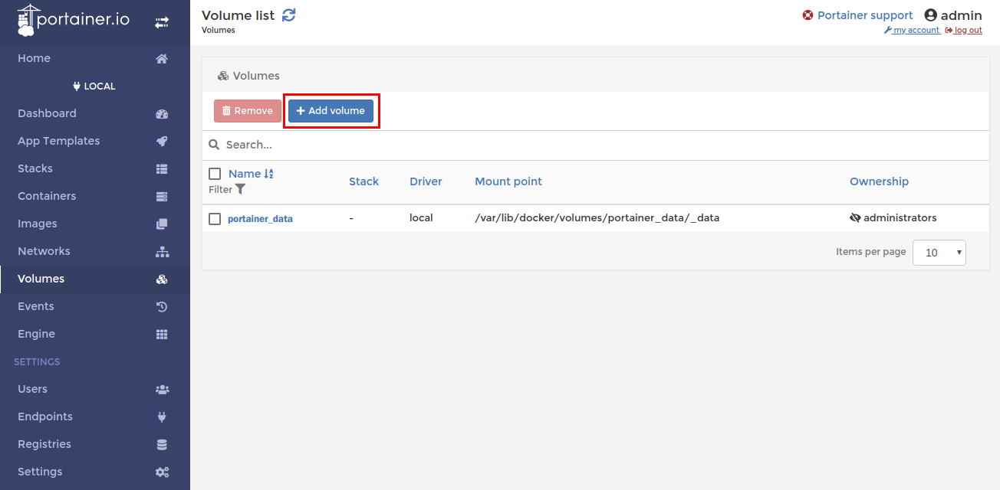

Portainer 설정 정보를 담고 있는 기본 Portainer_data 볼륨이 보입니다.

그 위에 'Add volumes' 버튼을 누릅니다.


① 에서 볼륨의 이름을 입력해줍니다. httpd 에서 사용할 것이므로, 볼륨을 구분하기 쉽게 'httpd_data' 로 이름을 지어줍니다.

일반적인 볼륨을 생성하기 위해 다른 설정은 건드리지 않고 ② 'Create the volume' 을 눌러 생성합니다.

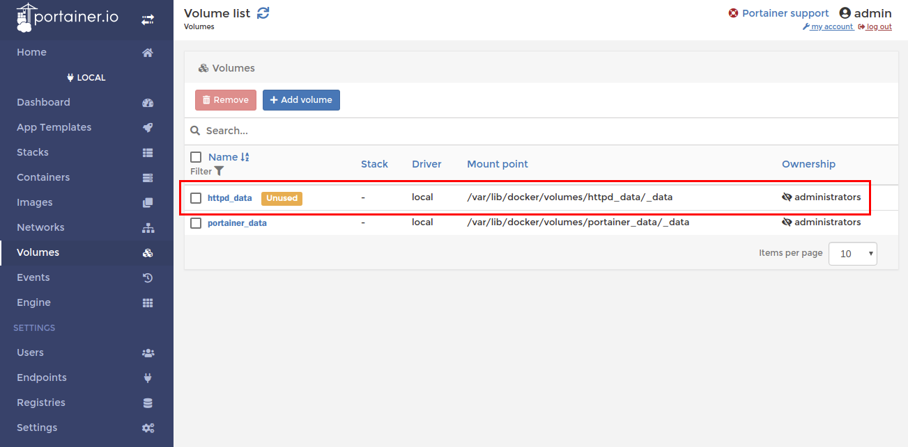

httpd_data 이름의 볼륨이 생성된것이 확인되었습니다.

이제 컨테이너를 생성하기 위해 좌측의 'Containers' 메뉴를 선택합니다.

6. 컨테이너 생성

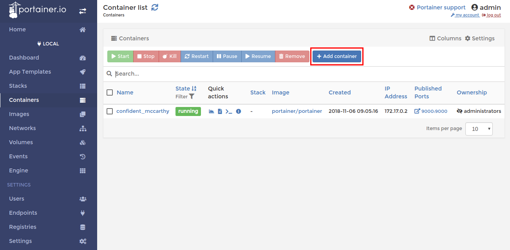

기존에 생성되어 있는 Portainer 컨테이너가 보입니다. 이름이 confident_mccarthy 로 되어 있는데 임의 이름으로 자동으로 생성된 것이며,

Portainer 의 컨테이너를 반복해서 생성하면 이름이 바뀌는것을 알 수 있습니다.

사용자가 인지 가능한 이름으로 변경하고 싶다면, confident_mccarthy 라는 이름을 누르고 Container status 의 이름 항목에서 'Edit container name' 이미지를 클릭 후 원하는 이름을 새로 넣어주면 됩니다.

이제 httpd 컨테이너를 생성하기 위해 'Add container' 버튼을 누릅니다.

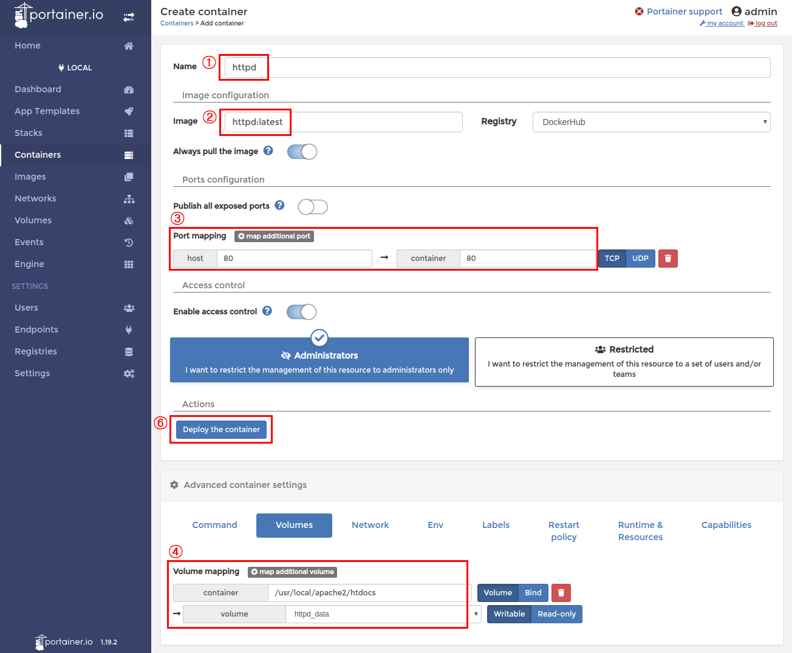

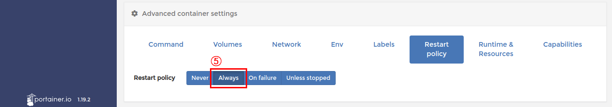

① 에서 사용자가 알아보기 위한 컨테이너의 이름을 입력합니다.

② 에서는 다운로드 받은 이미지 이름을 입력합니다. httpd 까지만 입력해도 사용 가능한 이미지 이름이 자동 검색되어집니다.

이미지를 미리 다운로드 받지 않은 상태여도 이 칸에 이미지명을 httpd 로 입력해두면 우측에 Registry 에서 선택한 DockerHub 에서 자동으로 이미지를 다운로드 받고 컨테이너를 생성하게 됩니다.

③ Docker 의 포트와 Docker 가 설치된 서버의 포트를 매칭 시켜줘야 외부 서비스가 가능합니다. 동일하게 80 번 포트를 양쪽에 기입해줍니다.

④ 하단의 'Volumes' 탭을 눌러 미리 생성하였던 볼륨을 연결합니다. 매뉴얼에서는 홈페이지 소스 기본 디렉토리 /usr/local/apache2/htdocs 로 연결을 해보겠습니다.

마운트할 디렉토리를 입력하고 생성한 볼륨을 선택해줍니다.

⑤ 하단의 'Restart policy' 탭에서 재시작 정책을 'Always' 로 선택해주어 Docker 가 서버에서 재구동 될때에도 컨테이너 또한 같이 구동 되도록 해줍니다.

이미지에 표시는 안해두었지만 아래와 같은 기능도 있습니다.

=> 'Runtime & Resources' 탭에서는 컨테이너가 사용할 메모리, CPU 를 제한 할 수 있습니다.

      컨테이너의 과도한 자원 사용으로 인해 호스트 서버에 문제가 되지 않도록 적절히 설정 하시면 됩니다.

=> 좌측의 'Users' 메뉴에서 사용자 및 그룹을 생성하였다면, Restricted 버튼을 눌러 현재 생성하려는 컨테이너의 관리를 개인 사용자 또는 그룹으로 한정지어 설정이 가능합니다.

⑥ 마지막으로 'Deploy the container' 를 눌러 컨테이너를 생성합니다.

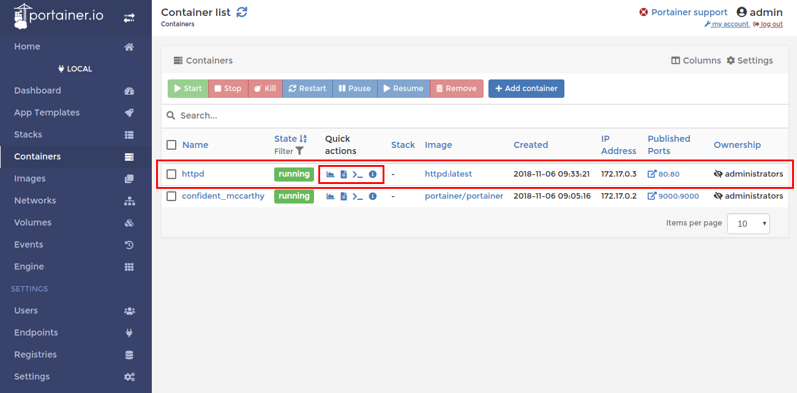 

httpd 컨테이너가 생성되었으며, 구동 되어있는 상태를 확인할 수 있습니다. 

가운데 'Quick actions' 에 작은 아이콘들이 있는데 좌측에서 부터 간략히 설명드리면 아래와 같습니다.

- 자원 사용량 (메모리, CPU, 네트워크 Input / Output) : 최소 5초 단위로 갱신

- 해당 컨테이너 로그

- 해당 컨테이너 쉘프롬프트 연결

- 컨테이너의 상세 정보

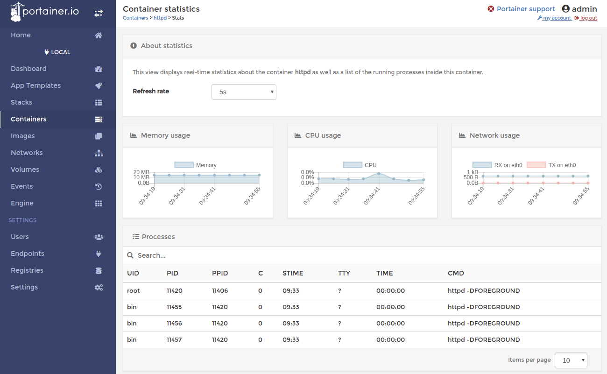

여기에서는 자원 사용량을 최소 5초 단위로 체크 하여 곡선 그래프로 보여줍니다.

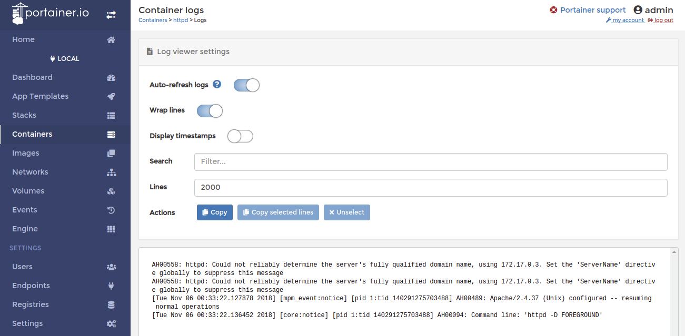

해당 컨테이너의 구동 로그 입니다.

7. 외부 접근 테스트

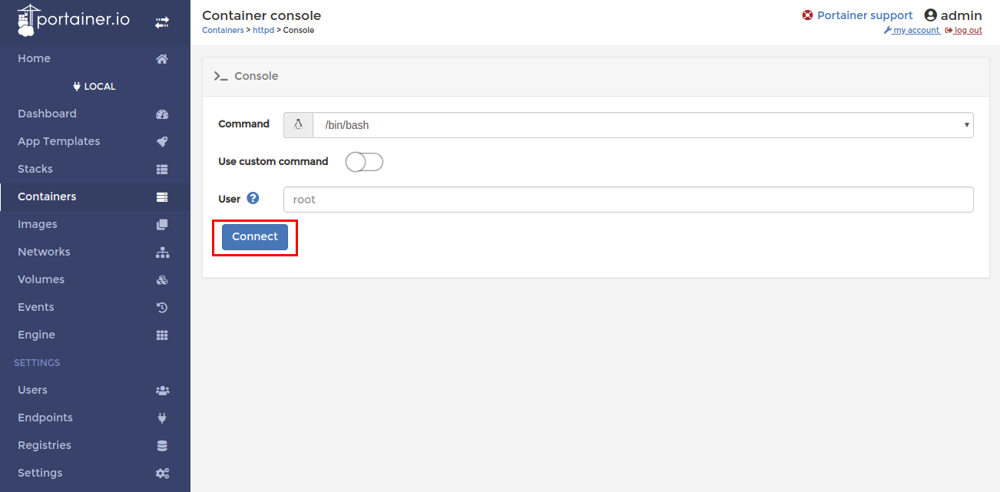

전에 생성하였던 httpd 컨테이너 서비스가 외부에서도 접속이 잘 되는지 확인하기 위해 임의의 html 파일을 생성해봅니다.

'Connect' 버튼을 눌러 컨테이너에 콘솔 접속을 합니다.

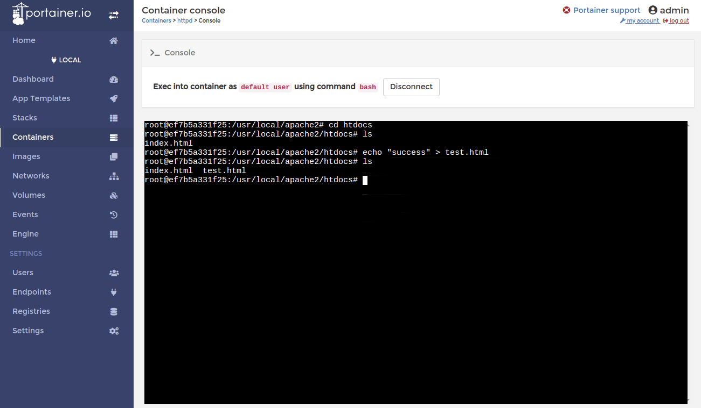 

접속 후 위와 같은 명령으로 httpd .기본 디렉토리인 /usr/local/apache2/htdocs 에 test.html 파일을 생성하였으며,

최종적으로, 아래와 같이 웹브라우저를 통해 html 파일이 열린것을 확인하였습니다.

ex) http://서버IP/test.html

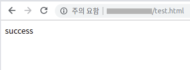