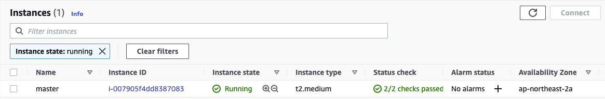

# Kubernetes 설치

## 1. 설치 환경

- AWS EC2 t2-medium 3대(master 1대, worker 2대)

- 선정 근거: 공식 문서에 최소 권장 사양이 CPU 2Core에 Memory 2GB이기 때문

[참고 공식 문서](https://kubernetes.io/docs/setup/production-environment/tools/kubeadm/install-kubeadm/)

## 2. Master node 생성

- EC2 생성
- 생성정보
    - Instance type: t2.medium
    - OS: Ubuntu 20.10
    - SSD: 30GB
    - Name: Master
    - Security Group: 공식 문서의 권장 포트는 모두 해제



- hostname 변경
    - 경로: /etc/hostname
    - 기존: ip-10-0-1-228
    - 변경: Master
    - reboot

## 3. Container Runtime Interface 설치

- 지원 CRI
    - Docker (설치)
    - Containered
    - CRI-O

[참고 공식 문서](https://docs.docker.com/engine/install/ubuntu/)

- 설치 요약

```
sudo apt-get remove docker docker-engine docker.io containerd runc
sudo apt-get update
sudo apt-get install  apt-transport-https  ca-certificates  curl  gnupg lsb-release
curl -fsSL https://download.docker.com/linux/ubuntu/gpg | sudo gpg --dearmor -o /usr/share/keyrings/docker-archive-keyring.gpg
sudo apt-get update
sudo apt-get install docker-ce docker-ce-cli containerd.io
```

- 아래 명령어를 통해 containerd의 default values가 들어있는 파일을 생성 합니다

```
sudo containerd config default > /etc/containerd/config.toml
sudo systemctl restart containerd
sudo systemctl is-enabled containerd disabled 
sudo systemctl enable containerd
Created symlink /etc/systemd/system/multi-user.target.wants/containerd.service → /usr/lib/systemd/system/containerd.service.
```

## 4. kubeadm 설치

```
sudo apt-get update
sudo apt-get install -y apt-transport-https ca-certificates curl
sudo curl -fsSLo /usr/share/keyrings/kubernetes-archive-keyring.gpg https://packages.cloud.google.com/apt/doc/apt-key.gpg
echo "deb [signed-by=/usr/share/keyrings/kubernetes-archive-keyring.gpg] https://apt.kubernetes.io/ kubernetes-xenial main" | sudo tee /etc/apt/sources.list.d/kubernetes.list
sudo apt-get update
sudo apt-get install -y kubelet kubeadm kubectl
sudo apt-mark hold kubelet kubeadm kubectl
```

## 5. AMI 생성

- kubelet kubeadm kubectl이 설치된 EC2를 AMI로 생성


- 생성된 AMI로 work1, work2 용 EC2 생성


## 6. kubeadm init 수행

- /etc/containerd/config.toml 파일에서 

disabled_plugins 항목에서 CRI 제거한 뒤

```
$ systemctl restart containerd
```

- 마스터 노드에서 root 계정으로 kubeadm init 수행 

```
$ kubeadm init
```

- 마스터 노드에서 아래 스크립트 수행 

```
mkdir -p $HOME/.kube
  sudo cp -i /etc/kubernetes/admin.conf $HOME/.kube/config
  sudo chown $(id -u):$(id -g) $HOME/.kube/config
```

## 7. worker 노드 추가

worker 노드에서 아래 스크립트 수행하여 worker 노드 추가

```
kubeadm join 10.0.1.228:6443 --token nh1mww.vw7fq72f53m6jcba \
	--discovery-token-ca-cert-hash sha256:53c88cb516b751cd5a87f44ff8b4027c043953b77d02c7d7deec0640702b53c5
```

## 8. Cluster Networking 설정

weave net 설치 해 봤으니 이번엔 calico 설치
calico는 kubernetes 유형별 설치 방법이 다양하게 존재함
이 중 "Install Calico networking and network policy for on-premises deployments" 참고
 
[Install Calico](https://docs.projectcalico.org/getting-started/kubernetes/self-managed-onprem/onpremises)

- calico 설치 확인 

```
$ curl https://docs.projectcalico.org/manifests/calico.yaml -O
```

9. 최종 상태 확인 

```
ubuntu@master:~$ kubectl get pod -n kube-system
NAME                                       READY   STATUS              RESTARTS   AGE
calico-kube-controllers-78d6f96c7b-7jkzf   1/1     Running             0          37s
calico-node-qmrml                          0/1     Running             0          37s
calico-node-th24k                          0/1     Running             0          37s
calico-node-w7hvr                          0/1     Running             0          37s
coredns-558bd4d5db-g42l8                   0/1     ContainerCreating   0          57m
coredns-558bd4d5db-gdmhx                   0/1     ContainerCreating   0          57m
etcd-master                                1/1     Running             0          57m
kube-apiserver-master                      1/1     Running             0          57m
kube-controller-manager-master             1/1     Running             0          57m
kube-proxy-26l5j                           1/1     Running             0          57m
kube-proxy-k544z                           1/1     Running             0          46m
kube-proxy-s86n4                           1/1     Running             0          46m
kube-scheduler-master                      1/1     Running             0          57m
```

```
ubuntu@master:~$ kubectl get nodes
NAME     STATUS   ROLES                  AGE   VERSION
master   Ready    control-plane,master   57m   v1.21.1
work1    Ready    <none>                 47m   v1.21.1
work2    Ready    <none>                 47m   v1.21.1
```

<!-- [출처](https://sftth.tistory.com/41)