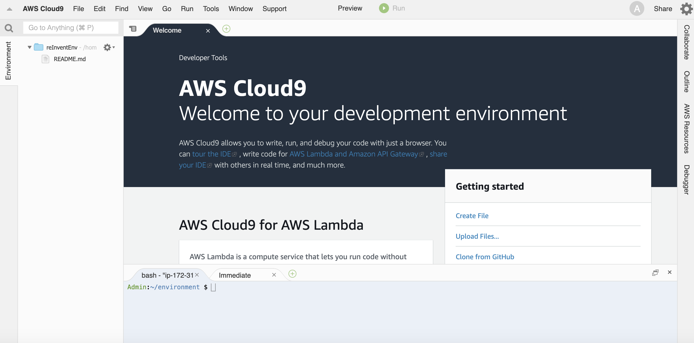
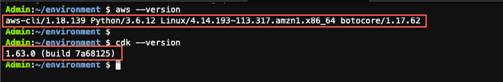
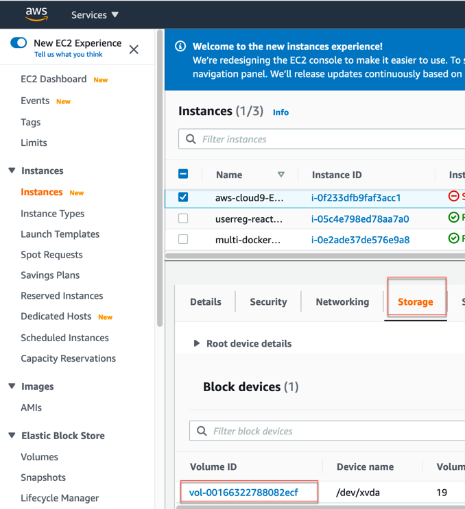
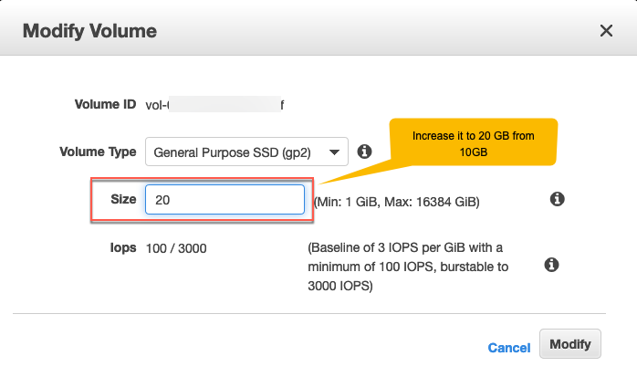
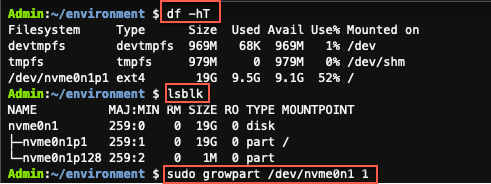

# AWS Cloud9 환경 설정
AWS Cloud 9 서비스를 사용하여 AWS CLI 패키지, git 및 기타 여러 유용한 유틸리티가 내장된 IDE 기능과 함께 사전 설치된 환경을 설정하는 것이 좋습니다. 로그인하면 이 브라우저 기반 IDE를 코딩에 사용하고 bash 셸을 사용하여 Linux 명령을 실행할 수 있습니다. Cloud9 환경을 생성하는 동안 최대 절전 모드 설정이 하루 종일 구성되어 있는지 확인하십시오.

## AWS Cloud9 환경 사용
1. [AWS Cloud9](https://console.aws.amazon.com/cloud9) 서비스에 액세스

2. 환경 생성 선택


3. 환경 이름 워크샵 입력

4. 비용 절약 설정에서 하루 후 옵션을 선택합니다.

5. 다음 단계 선택

6. 검토 페이지에서 환경 만들기 를 선택합니다 . AWS Cloud9이 생성되는 동안 기다리십시오.

7. 워크샵 환경 중 하나에 로그인하면 IDE에 액세스할 수 있습니다.



## 개발 환경 설정
(클라우드 9 환경에서는 AWS CLI 및 CDK가 사전 설치됩니다. 이 단계는 무시할 수 있습니다. ) 다음 명령을 실행하여 이를 확인할 수 있습니다 .

```
aws --version
cdk --version
```



## 자신의 머신에서 실행
자체 환경을 실행 중인 경우 1단계와 2단계에 따라 AWS CLI 및 CDK를 설치할 수 있습니다.

1. https://docs.aws.amazon.com/cli/latest/userguide/cli-chap-install.html 에 따라 AWS CLI를 설치 및 구성합니다.

2. 터미널에서 `npm install -g aws-cdk` 를 실행하여 CDK를 설치합니다.

3. https://docs.aws.amazon.com/elasticbeanstalk/latest/dg/eb-cli3-install.html 

## (선택 사항) Cloud9 인스턴스의 디스크 공간 늘리기
본 워크숍 중 언제든지 Cloud9 환경에서 디스크 공간 오류가 발생하면 다음 단계에 따라 디스크 크기를 늘리 십시오 .

1. [아마존 EC2 콘솔](https://console.aws.amazon.com/ec2/v2/home)에 액세스.

2. 볼륨을 확장하려면 EC2 콘솔에서 cloud9 인스턴스(접두사 aws-cloud9 )를 찾아 연결된 EBS 볼륨을 식별합니다.



3. 식별되면 볼륨을 선택하고 작업 >> 볼륨 수정 을 클릭합니다.

4. 볼륨 수정 화면에서 볼륨 크기를 10GB에서 20GB로 늘립니다.



5. 수정 을 선택 하고 예 를 확인 합니다.

6. AWS Cloud9 터미널로 돌아가 EC2 인스턴스를 다시 시작하십시오.

```
sudo reboot
```

7. EC2 인스턴스가 다시 시작된 후 각 볼륨의 파일 시스템을 확인하고 df -hT 명령을 사용합니다.

```
df -hT
```

8. 볼륨에 확장해야 하는 파티션이 있는지 확인하려면 lsblk 명령을 사용하여 인스턴스에 연결된 NVMe 블록 장치에 대한 정보를 표시하십시오.

```
lsblk
```

9. (선택 사항) 파티션 크기가 여전히 10GB이면 다음 Growpart 명령을 사용합니다. 장치 이름과 파티션 번호 사이에 공백이 있습니다.

```
sudo growpart /dev/nvme0n1 1
```



10. (선택 사항) 변경 사항을 적용하려면 인스턴스를 다시 재부팅해야 합니다.
