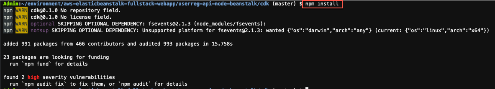
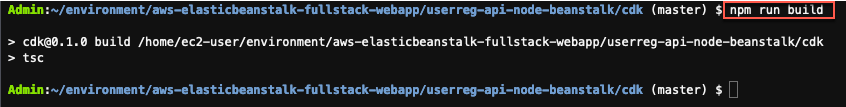
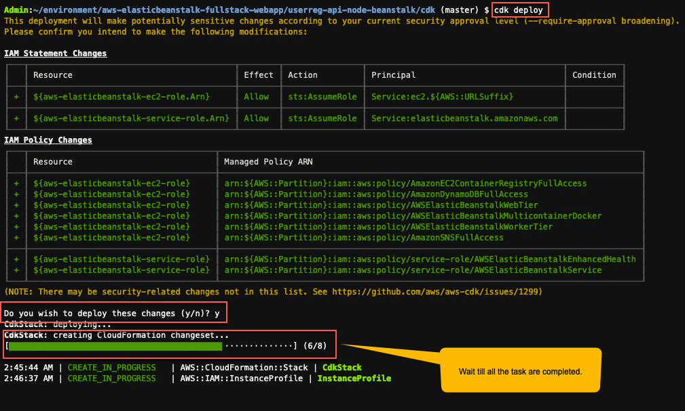
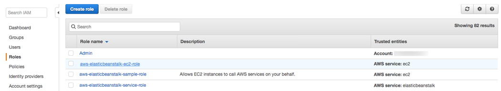
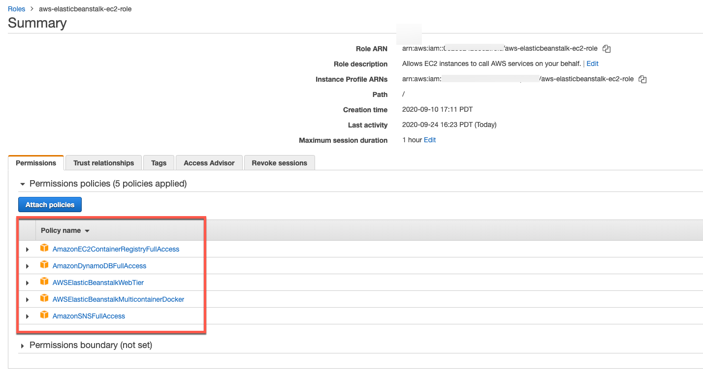

# AWS Elastic Beanstalk 환경 설정
CDK를 사용하여 DynamoDB 데이터베이스, ECR, Elastic Beanstalk IAM 및 서비스 역할을 설정합니다.

## CDK 애플리케이션 빌드
AWS Cloud9 터미널 사용:

1. webapp 저장소 복제

```
git clone https://github.com/aws-samples/aws-elasticbeanstalk-fullstack-webapp
```

2. AWS Cloud9 환경에서 "aws-elasticbeanstalk-fullstack-webapp/userreg-api-node-beanstalk/cdk" 폴더로 이동합니다.

```
cd aws-elasticbeanstalk-fullstack-webapp/userreg-api-node-beanstalk/cdk
```

3. 이 명령은 필요한 패키지와 해당 종속성을 다운로드합니다.

```
npm install 
```



4. CDK 애플리케이션 빌드, Typescript를 Javascript 파일로 변환

```
npm run build
```



5. AWS CDK 명령을 환경(계정/리전)에 처음 사용하는 경우 "부트스트랩 스택"을 설치해야 합니다. 이 스택에는 툴킷의 작동에 필요한 리소스가 포함됩니다.

```
cdk bootstrap
```

6. cdk deploy 명령은 해당 AWS 계정 및 리전에 애플리케이션 스택을 배포합니다.

```
cdk deploy
```

변경 사항을 배포하기 전에 y 를 입력 하여 확인합니다. 아래 이미지를 참조하세요.



이 CDK 앱은 클라우드 포메이션을 생성합니다. DynamoDB 테이블, ECR 리포지토리 및 IAM 역할이 생성됩니다.

## IAM 역할 확인
1. AWS Management 콘솔 → 서비스 메뉴 → 보안, 자격 증명 및 규정 준수 헤드라인에서 → IAM 을 클릭 합니다.

2. 왼쪽 탐색 창에서 역할 을 클릭 합니다.

3. 목록에서 aws-elasticbeanstalk-ec2-role 을 클릭 합니다.



4. 권한 탭에서 다음 정책이 연결되어 있는지 확인합니다 .



5. Cloud9 IDE 환경 으로 돌아가십시오 .
