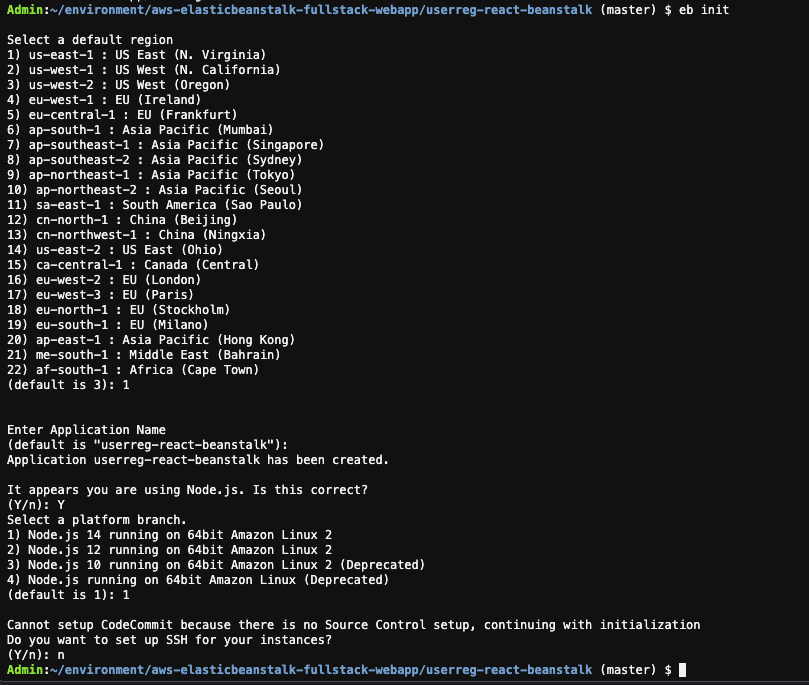
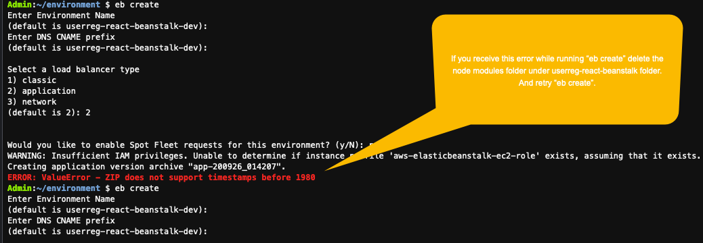
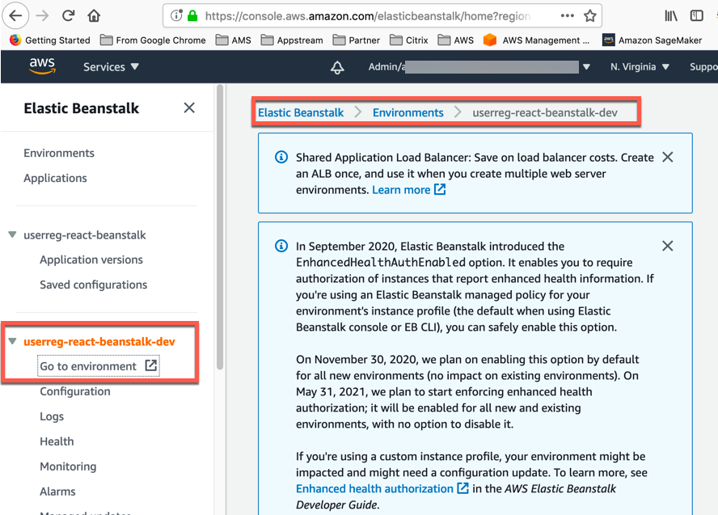
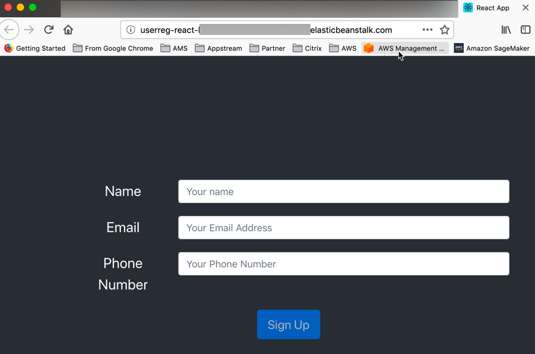

# React 애플리케이션 설정 및 배포
AWS Elastic Beanstalk를 사용하면 애플리케이션을 위한 새 환경을 쉽게 생성할 수 있습니다. 개발, 테스트 및 프로덕션 사용을 위해 별도의 환경을 만들고 관리할 수 있으며 모든 버전의 애플리케이션을 모든 환경에 배포할 수 있습니다.

## AWS Elastic Beanstalk CLI를 사용하여 배포
1. AWS Elastic Beanstalk CLI 설치

```
pip install awsebcli --upgrade --user
```

2. Cloud9 IDE 환경에서 "aws-elasticbeanstalk-fullstack-webapp/userreg-react-beanstalk"로 이동합니다.

```
cd ~/environment/aws-elasticbeanstalk-fullstack-webapp/userreg-react-beanstalk
npm install
```

3. 선택한 리전의 AWS 계정에서 Elastic Beanstalk 애플리케이션 초기화

```
eb init
```

4. 해당 지역 및 응용 프로그램 이름을 선택합니다. ( 이전 단계에서 선택한 지역을 선택했는지 확인하십시오. )

Node.js 질문에 "Y"를 입력하고 플랫폼 분기를 선택합니다.

CodeCommit에 대해 아니요를 선택하고 SSH에 대한 기존 키 페어를 생성하거나 선택할 수 있습니다.



5. 응용 프로그램이 초기화되면 터미널에서 아래 명령을 실행하십시오.

```
eb create
```

이 명령은 Elastic Beanstalk 애플리케이션을 위한 환경을 생성합니다. 환경 이름과 DNS CNAME 접두사를 입력하고 애플리케이션 유형을 로드 밸런서로 선택합니다. 스팟 집합 요청을 활성화하도록 선택할 수 있습니다. 이것은 당신의 환경을 만들 것입니다.

환경을 만드는 데 몇 분 정도 걸립니다.



6. 환경이 생성되고 EB CLI가 성공으로 응답하면 Elastic Beanstalk 환경 으로 이동합니다. userreg-react* 환경을 선택 → 환경으로 이동을 클릭합니다.





배포되는 사용자 인터페이스 샘플 애플리케이션입니다.

다음 단계에서 API를 생성한 후 이 애플리케이션으로 돌아와 .env 파일을 업데이트해야 합니다.

배포를 위해 API를 설정할 다음 단계로 진행하십시오.

