# ECS에 마이크로서비스 배포

워크샵에서 무엇을 할 것인가?

우리가 배울 일을 하고 조직에서 작동 할 수와 같은 전형적인 3 계층 수개 국어의 microservice 스택을 구축 할 것입니다.

<!--
- [도구 설치 및 구성](#도구-설치-및-구성)
- [서비스 저장소 복제](#서비스-저장소-복제)
- [플랫폼](#플랫폼-구축)
- [프론트엔드 레일즈 앱](#프론트엔드-레일즈-앱)
- [Nodes.JS 백엔드 API](#nodejs-백엔드-api)
- [크리스털 백엔드 API](#크리스탈-백엔드-api)
- [리소스 정리](#컴퓨팅-리소스를-정리합니다)
-->

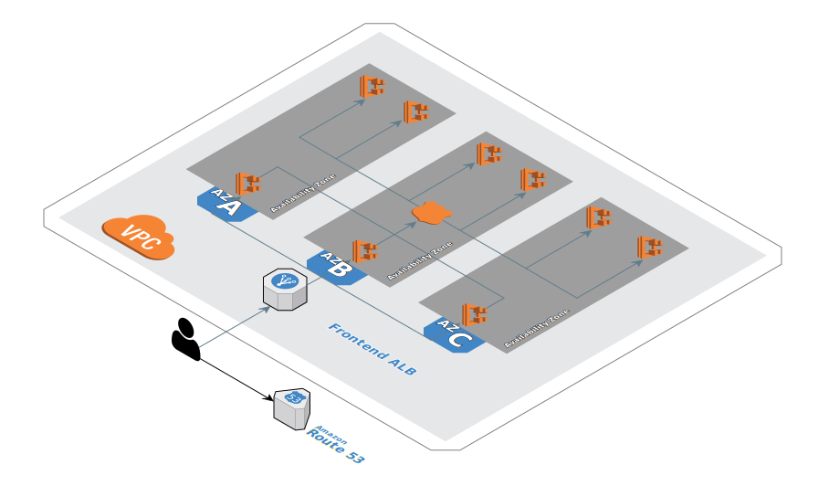

---

## 도구 설치 및 구성
Cloud9 작업 공간에서 다음 명령을 실행합니다(참고: 아래 탭에서 하나의 설치 방법을 선택하고 튜토리얼의 나머지 부분에서 동일한 방법을 따릅니다).

### copilot-cli

<details>
<summary>copilot-cli</summary>
<div markdown="1">

#### 설치 및 설정 전제 조건

```
# Install prerequisites 
sudo yum install -y jq

pip install --user --upgrade awscli

# Install copilot-cli
sudo curl -Lo /usr/local/bin/copilot https://github.com/aws/copilot-cli/releases/latest/download/copilot-linux && sudo chmod +x /usr/local/bin/copilot && copilot --help

# Setting environment variables required to communicate with AWS API's via the cli tools
echo "export AWS_DEFAULT_REGION=$(curl -s 169.254.169.254/latest/dynamic/instance-identity/document | jq -r .region)" >> ~/.bashrc
source ~/.bashrc

mkdir -p ~/.aws

cat << EOF > ~/.aws/config
[default]
region = ${AWS_DEFAULT_REGION}
output = json
role_arn = $(aws iam get-role --role-name ecsworkshop-admin | jq -r .Role.Arn)
credential_source = Ec2InstanceMetadata
EOF
```

</div>
</details>

### CDK

<details>
<summary>CDK</summary>
<div markdown="1">

#### 설치 및 설정 전제 조건

```
# Install prerequisite packages
sudo yum -y install jq nodejs python36 siege

# Install ecs cli for local testing
sudo curl -so /usr/local/bin/ecs-cli https://s3.amazonaws.com/amazon-ecs-cli/ecs-cli-linux-amd64-latest
sudo chmod +x /usr/local/bin/ecs-cli

# Setting CDK Version
export AWS_CDK_VERSION="1.122.0"

# Install aws-cdk
npm install -g --force aws-cdk@$AWS_CDK_VERSION

# Install cdk packages
pip3 install --user --upgrade aws-cdk.core==$AWS_CDK_VERSION \
aws-cdk.aws_ecs_patterns==$AWS_CDK_VERSION \
aws-cdk.aws_ec2==$AWS_CDK_VERSION \
aws-cdk.aws_ecs==$AWS_CDK_VERSION \
aws-cdk.aws_servicediscovery==$AWS_CDK_VERSION \
aws_cdk.aws_iam==$AWS_CDK_VERSION \
aws_cdk.aws_efs==$AWS_CDK_VERSION \
aws_cdk.aws_appmesh==$AWS_CDK_VERSION \
awscli \
awslogs

# Setting environment variables required to communicate with AWS API's via the cli tools
echo "export AWS_DEFAULT_REGION=$(curl -s 169.254.169.254/latest/dynamic/instance-identity/document | jq -r .region)" >> ~/.bashrc
echo "export AWS_REGION=\$AWS_DEFAULT_REGION" >> ~/.bashrc
echo "export AWS_ACCOUNT_ID=$(aws sts get-caller-identity --query Account --output text)" >> ~/.bashrc
source ~/.bashrc

```
</div>
</details>


### ecs-cli

<details>
<summary>ecs-cli</summary>
<div markdown="1">

#### 설치 및 설정 전제 조건

먼저 ECS CLI(및 일부 다른 텍스트 유틸리티 포함)를 설치합니다.

```
sudo curl -so /usr/local/bin/ecs-cli https://s3.amazonaws.com/amazon-ecs-cli/ecs-cli-linux-amd64-latest
sudo chmod +x /usr/local/bin/ecs-cli
sudo yum -y install jq gettext
```

다음으로 현재 리전을 기본값으로 사용하여 AWS cli를 구성합니다.

```
export AWS_REGION=$(curl -s 169.254.169.254/latest/dynamic/instance-identity/document | jq -r .region)
echo "export AWS_REGION=${AWS_REGION}" >> ~/.bash_profile
aws configure set default.region ${AWS_REGION}
aws configure get default.region
```

</div>
</details>

---

## 서비스 저장소 복제
서비스 저장소를 작업 영역에 복제합니다.

```
cd ~/environment
git clone https://github.com/aws-containers/ecsdemo-platform
git clone https://github.com/aws-containers/ecsdemo-frontend
git clone https://github.com/aws-containers/ecsdemo-nodejs
git clone https://github.com/aws-containers/ecsdemo-crystal
```

---

## 플랫폼 구축

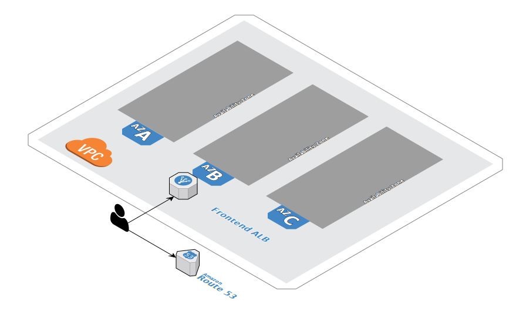

모놀리스를 마이크로서비스로 나누는 것이 좋은 생각이라면 앱 플랫폼을 관리하는 코드를 작고 단순하게 유지하는 것도 합리적입니다.

이 워크샵에서는 이 리포지토리로 인프라를 관리하고 각 서비스는 자체 별도의 리포지토리에서 유지 관리됩니다.

이 리포지토리는 배포할 마이크로서비스의 기본 환경을 구축하는 데 사용됩니다.

- copilot-cli 경로  
    애플리케이션을 초기화할 때 플랫폼 리소스를 구축하는 환경을 생성합니다. 애플리케이션 전반에 걸쳐 구축되고 공유될 플랫폼 리소스는 VPC, 서브넷, 보안 그룹, IAM 역할/정책, ECS 클러스터, 클라우드 맵 네임스페이스(서비스 검색), Cloudwatch 로그/메트릭 등입니다!

- CDK 경로  
    이 리포지토리는 배포할 마이크로서비스의 기준 플랫폼을 구축합니다. 여기에는 VPC, ECS 클러스터 및 Cloud Map 서비스 검색 네임스페이스가 포함됩니다. AWS CDK는 이를 달성하는 데 사용되는 메커니즘입니다.

AWS CDK를 계속 사용하여 이 클러스터에 애플리케이션을 배포할 것입니다.

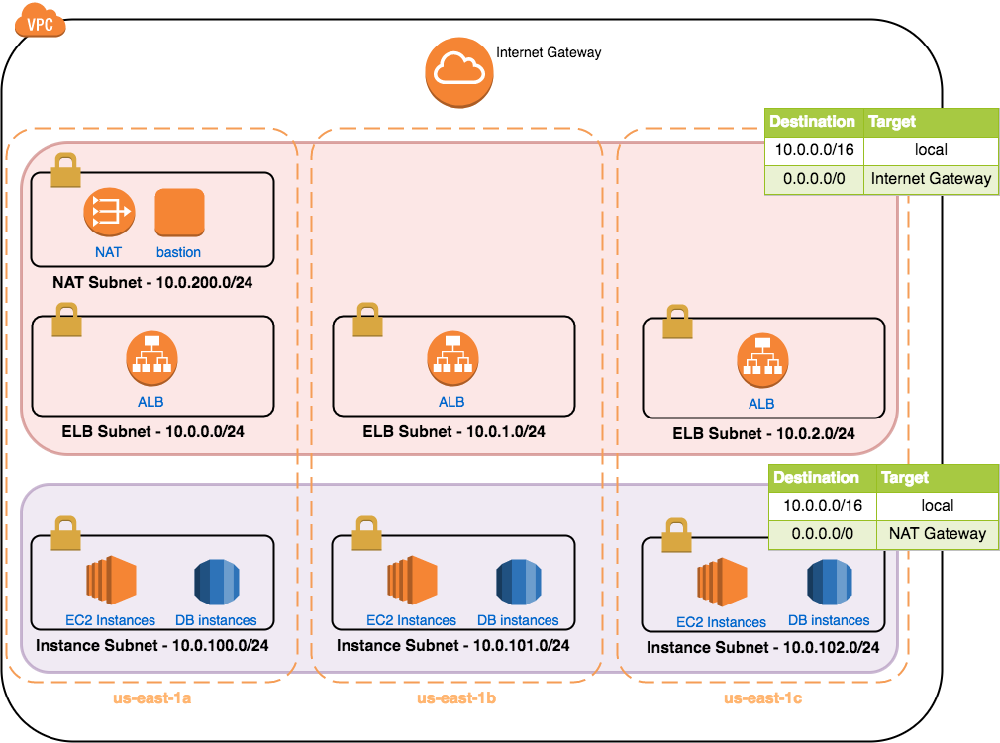

---

## 환경 구축

Cloud9 작업 영역에서 다음 명령을 실행합니다.

- 로드 밸런서 및 ECS에 대한 서비스 연결 역할이 있는지 확인합니다.

```
aws iam get-role --role-name "AWSServiceRoleForElasticLoadBalancing" || aws iam create-service-linked-role --aws-service-name "elasticloadbalancing.amazonaws.com"

aws iam get-role --role-name "AWSServiceRoleForECS" || aws iam create-service-linked-role --aws-service-name "ecs.amazonaws.com"
```

- "오류가 발생했습니다(NoSuchEntity)"가 표시될 수 있으며 괜찮습니다! 필요한 역할이 존재하지 않는 경우 생성합니다. 이는 ||운영자 이후에 발생합니다.

- nodejs 및 crystal services를 로드 테스트하는 데 사용할 임시 EC2 인스턴스에 연결할 수 있도록 세션 관리자 플러그인을 cloud9에 설치합니다.

```
curl "https://s3.amazonaws.com/session-manager-downloads/plugin/latest/linux_64bit/session-manager-plugin.rpm" -o "session-manager-plugin.rpm"
sudo yum install -y session-manager-plugin.rpm
session-manager-plugin
```

### copilot-cli

<details>
<summary>copilot-cli</summary>
<div markdown="1">

### 개요
copilot-cli의 장점은 플랫폼 구축과 모든 리소스를 함께 연결하는 방법에 대해 생각할 필요가 없다는 것입니다. 도구의 독단적인 특성 때문에 간단히 정의하여 시작합니다.애플리케이션나머지는 부조종사가 처리합니다(필요에 따라 구성을 조정/수정하는 기능 포함). 나머지는 정확히 무엇을 의미합니까? 이는 귀하의 작업에 필요한 모든 기본 리소스를 배포한다는 것을 의미합니다.서비스에/함께 실행합니다. 배포되는 리소스에는 VPC, 서브넷, 보안 그룹, Application Load Balancer(필요한 경우), 서비스 검색 네임스페이스(필요한 경우) 등이 포함됩니다.

copilot-cli 개념에 대해 자세히 알아보려면 다음을 확인하십시오.선적 서류 비치.

플랫폼 섹션은 여기까지입니다! 응용 프로그램을 만들고 프런트엔드 서비스를 배포해 보겠습니다.

</div>
</details>

### CDK

<details>
<summary>CDK</summary>
<div markdown="1">

#### 플랫폼 리포지토리로 이동

```
cd ~/environment/ecsdemo-platform/cdk
```

#### cdk가 어셈블리 CloudFormation 템플릿을 합성할 수 있는지 확인

```
cdk synth
```

재미있는 운동! cdk로 작성된 코드와 CloudFormation으로 생성된 총 라인을 비교하기 위해 총 라인 수를 계산해 보겠습니다. 솔루션을 보려면 여기를 확장하십시오.

```
echo -e "Cloudformation Lines==$(cdk synth |wc -l)\nCDK Lines==$(cat app.py|wc -l)"
```

최종 결과는 다음과 같아야 합니다.

```
Cloudformation Lines==470
CDK Lines==82
```

#### 제안된 환경 변경 사항 보기

```
cdk diff
```

#### 환경에 변경 사항 배포

```
cdk deploy --require-approval never
```

무엇을 만들고 있는지 살펴보겠습니다. 스택에 정의된 모든 것이 100% 파이썬 코드로 작성되었음을 알 수 있습니다. 우리는 또한 잘 설계된 관행을 기반으로 구성 요소를 구축할 수 있도록 함으로써 cdk의 독단적인 특성으로부터 이익을 얻습니다. 이것은 또한 리소스(예: 서브넷, nat 게이트웨이 등)를 만들고 연결하기 위해 모든 기본 구성 요소에 대해 생각할 필요가 없다는 것을 의미합니다. cdk 코드를 배포하면 cdk가 기본 Cloudformation 템플릿을 생성하고 배포합니다.

```
class BaseVPCStack(core.Stack):

    def __init__(self, scope: core.Stack, id: str, **kwargs):
        super().__init__(scope, id, **kwargs)

        # This resource alone will create a private/public subnet in each AZ as well as nat/internet gateway(s)
        self.vpc = aws_ec2.Vpc(
            self, "BaseVPC",
            cidr='10.0.0.0/24',

        )

        # Creating ECS Cluster in the VPC created above
        self.ecs_cluster = aws_ecs.Cluster(
            self, "ECSCluster",
            vpc=self.vpc,
            cluster_name="container-demo",
            container_insights=True
        )

        # Adding service discovery namespace to cluster
        self.ecs_cluster.add_default_cloud_map_namespace(
            name="service.local",
        )

        # Namespace details as CFN output
        self.namespace_outputs = {
            'ARN': self.ecs_cluster.default_cloud_map_namespace.private_dns_namespace_arn,
            'NAME': self.ecs_cluster.default_cloud_map_namespace.private_dns_namespace_name,
            'ID': self.ecs_cluster.default_cloud_map_namespace.private_dns_namespace_id,
        }

        # Cluster Attributes
        self.cluster_outputs = {
            'NAME': self.ecs_cluster.cluster_name,
            'SECGRPS': str(self.ecs_cluster.connections.security_groups)
        }

        # When enabling EC2, we need the security groups "registered" to the cluster for imports in other service stacks
        if self.ecs_cluster.connections.security_groups:
            self.cluster_outputs['SECGRPS'] = str([x.security_group_id for x in self.ecs_cluster.connections.security_groups][0])

        # Frontend service to backend services on 3000
        self.services_3000_sec_group = aws_ec2.SecurityGroup(
            self, "FrontendToBackendSecurityGroup",
            allow_all_outbound=True,
            description="Security group for frontend service to talk to backend services",
            vpc=self.vpc
        )

        # Allow inbound 3000 from ALB to Frontend Service
        self.sec_grp_ingress_self_3000 = aws_ec2.CfnSecurityGroupIngress(
            self, "InboundSecGrp3000",
            ip_protocol='TCP',
            source_security_group_id=self.services_3000_sec_group.security_group_id,
            from_port=3000,
            to_port=3000,
            group_id=self.services_3000_sec_group.security_group_id
        )

        # Creating an EC2 bastion host to perform load test on private backend services
        amzn_linux = aws_ec2.MachineImage.latest_amazon_linux(
            generation=aws_ec2.AmazonLinuxGeneration.AMAZON_LINUX_2,
            edition=aws_ec2.AmazonLinuxEdition.STANDARD,
            virtualization=aws_ec2.AmazonLinuxVirt.HVM,
            storage=aws_ec2.AmazonLinuxStorage.GENERAL_PURPOSE
        )

        # Instance Role/profile that will be attached to the ec2 instance
        # Enabling service role so the EC2 service can use ssm
        role = aws_iam.Role(self, "InstanceSSM", assumed_by=aws_iam.ServicePrincipal("ec2.amazonaws.com"))

        # Attaching the SSM policy to the role so we can use SSM to ssh into the ec2 instance
        role.add_managed_policy(aws_iam.ManagedPolicy.from_aws_managed_policy_name("service-role/AmazonEC2RoleforSSM"))

        # Reading user data, to install siege into the ec2 instance.
        with open("stresstool_user_data.sh") as f:
            user_data = f.read()

        # Instance creation
        self.instance = aws_ec2.Instance(self, "Instance",
            instance_name="{}-stresstool".format(stack_name),
            instance_type=aws_ec2.InstanceType("t3.medium"),
            machine_image=amzn_linux,
            vpc = self.vpc,
            role = role,
            user_data=aws_ec2.UserData.custom(user_data),
            security_group=self.services_3000_sec_group
                )

        # All Outputs required for other stacks to build
        core.CfnOutput(self, "NSArn", value=self.namespace_outputs['ARN'], export_name="NSARN")
        core.CfnOutput(self, "NSName", value=self.namespace_outputs['NAME'], export_name="NSNAME")
        core.CfnOutput(self, "NSId", value=self.namespace_outputs['ID'], export_name="NSID")
        core.CfnOutput(self, "FE2BESecGrp", value=self.services_3000_sec_group.security_group_id, export_name="SecGrpId")
        core.CfnOutput(self, "ECSClusterName", value=self.cluster_outputs['NAME'], export_name="ECSClusterName")
        core.CfnOutput(self, "ECSClusterSecGrp", value=self.cluster_outputs['SECGRPS'], export_name="ECSSecGrpList")
        core.CfnOutput(self, "ServicesSecGrp", value=self.services_3000_sec_group.security_group_id, export_name="ServicesSecGrp")
        core.CfnOutput(self, "StressToolEc2Id",value=self.instance.instance_id)
        core.CfnOutput(self, "StressToolEc2Ip",value=self.instance.instance_private_ip)
```

스택 빌드가 완료되면 기본 CloudFormation 스택에 대한 모든 출력이 인쇄됩니다. 이러한 출력은 마이크로 서비스를 배포할 때 기본 플랫폼을 참조하는 데 사용하는 것입니다. 다음은 출력의 예입니다.

```
   ecsworkshop-base

Outputs:
ecsworkshop-base.NSName = service
ecsworkshop-base.NSId = ns-jxsmy6sggusms4vr
ecsworkshop-base.ECSClusterName = ecsworkshop-base-ECSCluster7D463CD4-123JC9IHENY94
ecsworkshop-base.FE2BESecGrp = sg-0681f217a4d567ece
ecsworkshop-base.NSArn = arn:aws:servicediscovery:us-west-2:123456789:namespace/ns-jxsmy6sggusms4vr
ecsworkshop-base.ServicesSecGrp = sg-0681f217a4d567ece
ecsworkshop-base.ECSClusterSecGrp = []

Stack ARN:
arn:aws:cloudformation:us-west-2:123456789:stack/ecsworkshop-base/afe381b0-58e1-11ea-8997-02e1301110e6
```

이게 다입니다. 우리는 기본 플랫폼을 배포했습니다. 이제 마이크로 서비스 배포로 넘어 갑시다.

<!--
### ecs-cli Fargate 모드
VPC, ECS 클러스터 및 ALB를 구축합니다.

```
cd ~/environment/container-demo

aws cloudformation deploy --stack-name container-demo --template-file cluster-fargate-private-vpc.yml --capabilities CAPABILITY_IAM

aws cloudformation deploy --stack-name container-demo-alb --template-file alb-external.yml
```

### ecs-cli ec2 모드
VPC, ECS 클러스터 및 ALB를 구축합니다.

```
cd ~/environment/container-demo

aws cloudformation deploy --stack-name container-demo --template-file cluster-ec2-private-vpc.yml --capabilities CAPABILITY_IAM

aws cloudformation deploy --stack-name container-demo-alb --template-file alb-external.yml
```
-->

</div>
</details>

---

## 프론트엔드 레일즈 앱

### copilot-cli

<details>
<summary>copilot-cli</summary>
<div markdown="1">

### 애플리케이션, 서비스 및 환경 배포
프론트엔드 서비스 리포지토리로 이동합니다.

```
cd ~/environment/ecsdemo-frontend
```

시작하려면 애플리케이션을 초기화하고 첫 번째 서비스를 만듭니다. copilot-cli의 컨텍스트에서 애플리케이션은 관련 서비스, 환경 및 파이프라인의 그룹입니다. 시작하려면 다음 명령을 실행하세요.

```
copilot init
```

애플리케이션 및 서비스와 관련된 일련의 질문이 표시됩니다. 다음과 같이 질문에 답하십시오.

- 애플리케이션 이름: ecsworkshop  
- 서비스 유형: 로드 밸런싱된 웹 서비스  
- 이 로드 밸런싱된 웹 서비스의 이름을 ecsdemo-frontend로 지정하시겠습니까?  
- 도커파일: ./도커파일

질문에 답하면 애플리케이션 및 서비스에 대한 몇 가지 기본 리소스를 만드는 프로세스가 시작됩니다. 여기에는 원하는 서비스 배포 상태를 정의하는 프런트엔드 서비스의 매니페스트 파일이 포함됩니다. 로드 밸런싱된 웹 서비스 매니페스트에 대한 자세한 내용은부조종사 문서.

다음으로 테스트 환경을 배포하라는 메시지가 표시됩니다. 환경은 ECS에서 컨테이너 실행을 지원하는 데 필요한 모든 리소스를 포함합니다. 여기에는 네트워킹 스택(VPC, 서브넷, 보안 그룹 등), ECS 클러스터, 로드 밸런서(필요한 경우), 서비스 검색 네임스페이스(CloudMap을 통해) 등이 포함됩니다.

계속 진행하기 전에 애플리케이션이 예상대로 작동하려면 몇 가지 작업을 수행해야 합니다. 먼저 백엔드 서비스 URL을 환경 변수로 정의해야 합니다. 이것이 프론트엔드가 그들과 통신하는 방식입니다. 이러한 URL은 AWS Cloud Map에서 서비스 검색을 사용하는 Copilot에서 백엔드 서비스를 배포할 때 생성됩니다. 매니페스트 파일은 서비스의 배포 구성을 변경할 수 있는 곳입니다. 매니페스트 파일을 환경 변수로 업데이트합시다.

```
cat << EOF >> copilot/ecsdemo-frontend/manifest.yml
variables:
  CRYSTAL_URL: "http://ecsdemo-crystal.test.ecsworkshop.local:3000/crystal"
  NODEJS_URL: "http://ecsdemo-nodejs.test.ecsworkshop.local:3000"
EOF
```

다음으로 애플리케이션은 배포된 애플리케이션의 버전을 표시하기 위해 git 해시를 제공합니다. 우리가 해야 할 일은 시작 시 애플리케이션이 읽을 수 있도록 해시를 파일에 저장하기 위해 아래 명령을 실행하는 것입니다.

```
git rev-parse --short=7 HEAD > code_hash.txt
```

이제 환경을 배포할 준비가 되었습니다. 시작하려면 다음 명령을 실행하세요.

```
copilot env init --name test --profile default --default-config
```

이 부분은 생성 중인 모든 리소스로 인해 몇 분 정도 걸립니다. 이것은 서비스를 배포할 때마다 실행하는 작업이 아니라 환경을 시작하고 실행하는 데 한 번일 뿐입니다.

다음으로 서비스를 배포하겠습니다!

```
copilot svc deploy
```

이 시점에서 copilot은 Dockerfile을 빌드하고 서비스를 실행하는 데 필요한 리소스를 배포합니다.

다음은 cli 상호 작용의 예입니다.

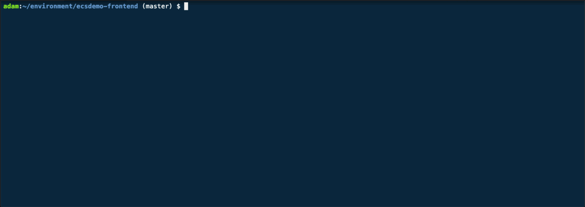

좋습니다. 이게 다입니다! 몇 가지 질문에 답하기만 하면 프론트엔드 서비스가 환경에 배포됩니다!

로드 밸런서 URL을 가져와 브라우저에 붙여넣습니다.

```
copilot svc show -n ecsdemo-frontend --json | jq -r .routes[].url
```

프론트엔드 서비스가 실행되고 있는 것을 볼 수 있습니다. 앱이 이상하게 보이거나 제대로 작동하지 않는 것처럼 보일 수 있습니다. 이는 우리 서비스가 현재 액세스할 수 없는 AWS 서비스와 통신하는 기능에 의존하기 때문입니다. 앱은 서비스가 실행되는 가용 영역에 대한 세부 정보가 포함된 아키텍처 다이어그램을 표시해야 합니다. 이 수정 사항은 이 장의 뒷부분에서 다룰 것입니다. 이제 프론트엔드 서비스가 배포되었으므로 환경 및 서비스와 어떻게 상호 작용합니까? 그 질문에 답해 봅시다.

### 애플리케이션과 상호 작용
애플리케이션과 상호 작용하려면 터미널에서 다음을 실행하세요.

```
copilot app
```

그러면 아래 이미지와 같은 도움말 메시지가 나타납니다.

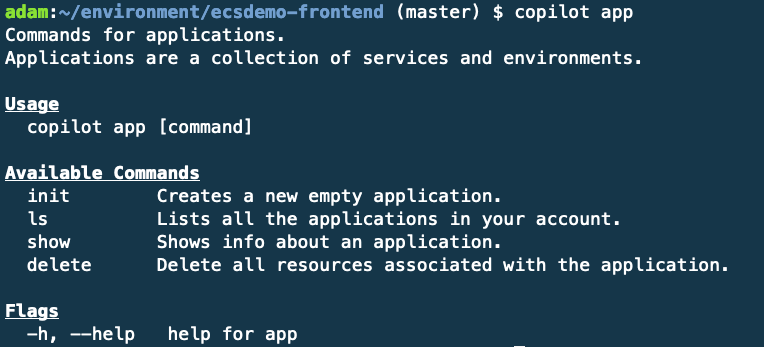

사용 가능한 명령을 볼 수 있으므로 먼저 배포한 응용 프로그램을 살펴보겠습니다.

```
copilot app ls
```

출력에는 하나의 애플리케이션이 표시되어야 하며 "ecsworkshop"이라는 이름이 지정되어야 합니다. 이 이름은 초기 copilot init를 실행할 때 이름을 지정했습니다. Copilot으로 여러 응용 프로그램을 관리하기 시작하면 모든 응용 프로그램에 대한 통찰력을 얻을 수 있는 단일 명령으로 사용됩니다.

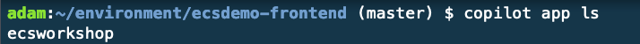

이제 애플리케이션을 보았으므로 애플리케이션에 포함된 환경과 서비스에 대해 자세히 살펴보겠습니다.

```
copilot app show ecsworkshop
```

결과는 다음과 같아야 합니다.

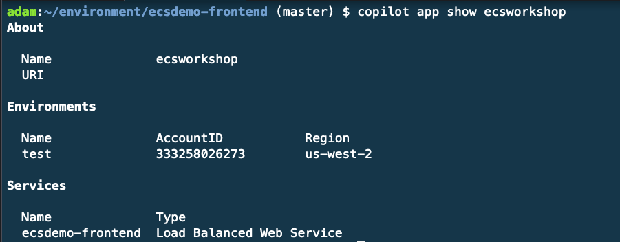

출력을 검토하면 애플리케이션 아래에 배포된 환경과 서비스가 표시됩니다. 실제 시나리오에서는 테스트와 완전히 격리된 프로덕션 환경을 배포하려고 합니다. 이상적으로는 다른 계정에도 있습니다. 이 보기를 통해 애플리케이션이 배포된 계정 및 지역을 확인할 수 있습니다.

### 환경과의 상호작용
이제 테스트 환경을 더 자세히 살펴보겠습니다. 환경과 상호 작용하기 위해 copilot env명령을 사용합니다.

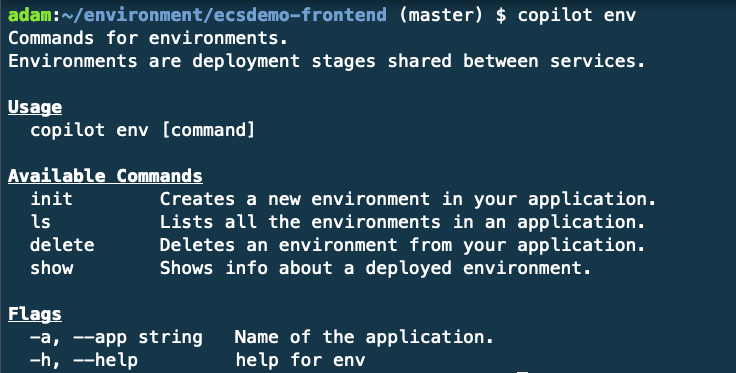

환경을 나열하려면 다음을 실행합니다.

```
copilot env ls
```

테스트와 함께 응답이 돌아오므로 다음을 실행하여 테스트 환경에 대한 자세한 내용을 알아보겠습니다.

```
copilot env show -n test
```

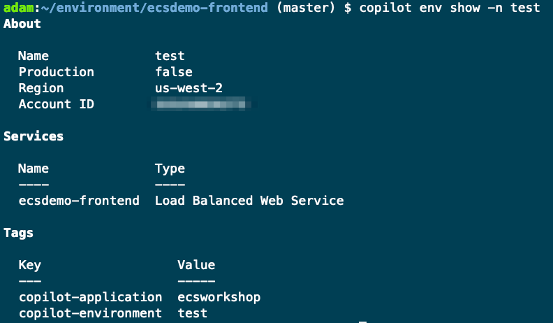

이 보기를 통해 애플리케이션의 테스트 환경에 배포된 모든 서비스를 볼 수 있습니다. 우리가 더 많은 서비스를 추가함에 따라 이것이 증가하는 것을 보게 될 것입니다. 여기에서 지적할 몇 가지 깔끔한 사항:

- 환경과 관련된 태그입니다. 기본 태그에는 애플리케이션 이름과 환경이 있습니다.  
- 계정 ID, 지역 및 환경이 프로덕션으로 간주되는지 여부와 같은 환경에 대한 세부 정보입니다.

### 프론트엔드 서비스와 상호작용

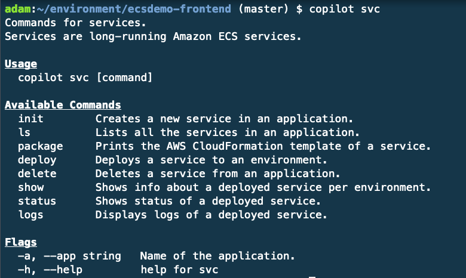

명령 에는 많은 힘이 있습니다 copilot svc. 위 이미지에서 볼 수 있듯이 서비스와 상호 작용할 때 우리가 할 수 있는 일이 꽤 있습니다.

몇 가지 명령을 살펴보겠습니다.

- 패키지: copilot-cli는 CloudFormation을 사용하여 환경 및 서비스 상태를 관리합니다. 서비스 배포를 위한 CloudFormation 템플릿을 얻으려면 간단히 copilot svc package. 이는 배포를 직접 관리하기 위해 CloudFormation으로 이동하기로 결정한 경우 특히 유용할 수 있습니다.
- deploy: 간단히 말해서 서비스를 배포합니다. 로컬 개발의 경우 이를 통해 서비스 변경 사항을 원하는 환경까지 로컬로 푸시할 수 있습니다. 물론 프로덕션에 배포할 때가 되면 CI/CD와 통합된 적절한 git 워크플로가 최선의 경로가 될 것입니다. 나중에 파이프라인을 배포할 것입니다!
- status: 이 명령은 서비스에 대한 자세한 보기를 제공합니다. 여기에는 상태 정보, 작업 정보 및 세부 정보가 포함된 활성 작업 수가 포함됩니다.
- 로그: 마지막으로 명령줄에서 서비스 로그를 쉽게 볼 수 있는 방법입니다.

이제 프론트엔드 서비스의 상태를 확인해보자.

운영:

```
copilot svc status -n ecsdemo-frontend
```

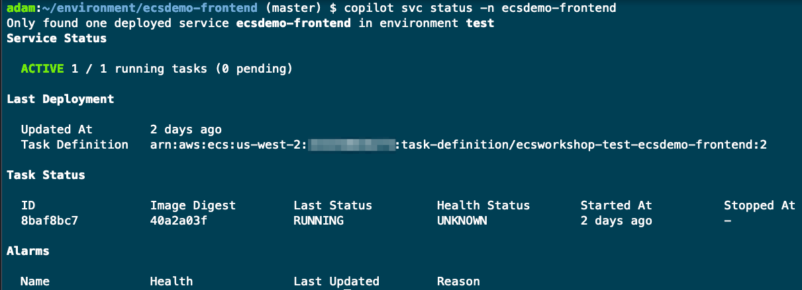

하나의 활성 실행 작업과 세부 정보가 있음을 알 수 있습니다.

#### 작업 수 확장
아직 논의하지 않은 한 가지는 서비스 구성을 관리/제어하는 방법입니다. 이것은 매니페스트 파일을 통해 수행됩니다. 매니페스트는 서비스의 원하는 상태를 정의하는 선언적 yaml 템플릿입니다. 설정 마법사(copilot init 실행)를 실행할 때 자동으로 생성되었으며 도커 이미지, 포트, 로드 밸런서 요구 사항, 환경 변수/비밀, 리소스 할당과 같은 세부 정보가 포함됩니다. Dockerfile과 독창적이고 정상적인 기본값을 기반으로 이 파일을 동적으로 채웁니다.

매니페스트 파일(./copilot/ecsdemo-frontend/manifest.yml)을 열고 count 키의 값을 1에서 3으로 바꿉니다. 이는 서비스 상태를 1 task에서 3으로 변경한다고 선언하는 것입니다. 자유롭게 매니페스트 파일을 탐색하여 익숙해집니다.

```
# Number of tasks that should be running in your service.
count: 3
```

완료하고 변경 사항을 저장했으면 다음을 실행합니다.

```
copilot svc deploy
```

Copilot은 이 명령으로 다음을 수행합니다.

- 로컬에서 이미지 빌드
- 서비스의 ECR 저장소로 푸시
- 매니페스트 파일을 CloudFormation으로 변환
- 추가 인프라를 CloudFormation에 패키징
- 업데이트된 서비스 및 리소스를 CloudFormation에 배포

배포를 확인하기 위해 먼저 copilot-cli를 통해 서비스 세부 정보를 확인하겠습니다.

```
copilot svc status -n ecsdemo-frontend
```

이제 세 가지 작업이 실행되는 것을 볼 수 있습니다! 이제 로드 밸런서 URL로 돌아가면 요청에 응답하는 프런트엔드 서비스에 따라 다른 IP 주소를 표시하는 서비스가 표시되어야 합니다. 아직 전체 다이어그램이 표시되지 않습니다. 곧 수정할 예정입니다.

#### 서비스 로그 검토
Copilot을 통해 배포하는 서비스는 기본적으로 Cloudwatch 로그에 자동으로 로그를 전달합니다. 콘솔을 통해 로그를 탐색하고 검토하는 대신 copilot cli를 사용하여 해당 로그를 로컬에서 볼 수 있습니다. 프런트엔드 서비스에 대한 로그를 추적해 보겠습니다.

```
copilot svc logs -a ecsworkshop -n ecsdemo-frontend --follow
```

로그를 검토하려는 서비스의 동일한 디렉터리에 있는 경우 아래 명령을 입력하기만 하면 됩니다. 물론 특정 환경에서 서비스에 대한 로그를 검토하려면 환경 이름과 함께 -플래그를 전달해야 합니다.

```
copilot svc logs
```

마지막으로 언급할 것은 라이브 테일링 로그에 국한되지 않고 copilot svc logs --help명령줄에서 로그를 검토하는 다양한 방법을 보려면 입력해야 한다는 것입니다.

</div>
</details>

### CDK

<details>
<summary>CDK</summary>
<div markdown="1">

#### 배포 구성 확인

```
cd ~/environment/ecsdemo-frontend/cdk
```

cdk가 어셈블리 CloudFormation 템플릿을 합성할 수 있는지 확인

```
cdk synth
```

cdk가 환경에서 구축 및/또는 변경을 제안하는 내용을 검토합니다.

```
cdk diff
```

#### 프런트엔드 웹 서비스 배포

```
cdk deploy --require-approval never
```

배포가 완료되면 두 개의 출력이 표시됩니다. 프런트엔드 URL 출력을 찾아 새 탭에서 해당 링크를 엽니다. 이 시점에서 프론트엔드 웹사이트가 실행되고 있는 것을 볼 수 있습니다. 다음은 예제 출력입니다.

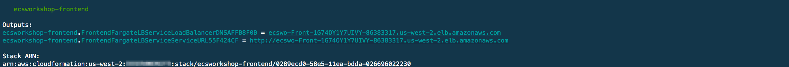

#### 코드 검토
플랫폼 빌드에서 언급했듯이 코드를 통해 배포 구성을 정의합니다. cdk가 배포되는 방식을 더 잘 이해하기 위해 코드를 살펴보겠습니다.

기본 플랫폼 스택에서 기본 구성 값 가져오기
자체 스택에 플랫폼을 구축했기 때문에 배포되는 모든 서비스에서 재사용해야 하는 특정 환경적 가치가 있습니다. 이 사용자 지정 구성에서는 기본 플랫폼 스택에서 VPC, ECS 클러스터 및 Cloud Map 네임스페이스를 가져옵니다. 이를 사용자 정의 구성으로 래핑하여 서비스 배포 논리에서 플랫폼 가져오기를 분리합니다.

```
class BasePlatform(core.Construct):
    
    def __init__(self, scope: core.Construct, id: str, **kwargs):
        super().__init__(scope, id, **kwargs)

        # The base platform stack is where the VPC was created, so all we need is the name to do a lookup and import it into this stack for use
        self.vpc = aws_ec2.Vpc.from_lookup(
            self, "ECSWorkshopVPC",
            vpc_name='ecsworkshop-base/BaseVPC'
        )
        
        # Importing the service discovery namespace from the base platform stack
        self.sd_namespace = aws_servicediscovery.PrivateDnsNamespace.from_private_dns_namespace_attributes(
            self, "SDNamespace",
            namespace_name=core.Fn.import_value('NSNAME'),
            namespace_arn=core.Fn.import_value('NSARN'),
            namespace_id=core.Fn.import_value('NSID')
        )
        
        # Importing the ECS cluster from the base platform stack
        self.ecs_cluster = aws_ecs.Cluster.from_cluster_attributes(
            self, "ECSCluster",
            cluster_name=core.Fn.import_value('ECSClusterName'),
            security_groups=[],
            vpc=self.vpc,
            default_cloud_map_namespace=self.sd_namespace
        )

        # Importing the security group that allows frontend to communicate with backend services
        self.services_sec_grp = aws_ec2.SecurityGroup.from_security_group_id(
            self, "ServicesSecGrp",
            security_group_id=core.Fn.import_value('ServicesSecGrp')
        )
```

프런트엔드 서비스 배포 코드
프론트엔드 서비스의 경우 프론트엔드 서비스로 제공하기 위해 구축해야 하는 구성 요소가 꽤 있습니다. 이러한 구성 요소는 Application Load Balancer, 대상 그룹, ECS 작업 정의 및 ECS 서비스입니다. 이러한 구성 요소를 자체적으로 구축하는 것은 수백 줄의 CloudFormation과 동일하지만 cdk가 제공하는 더 높은 수준의 구성을 사용하면 18줄의 코드로 모든 것을 구축할 수 있습니다.

```
class FrontendService(core.Stack):
    
    def __init__(self, scope: core.Stack, id: str, **kwargs):
        super().__init__(scope, id, **kwargs)

        self.base_platform = BasePlatform(self, self.stack_name)

        # This defines some of the components required for the docker container to run
        self.fargate_task_image = aws_ecs_patterns.ApplicationLoadBalancedTaskImageOptions(
            image=aws_ecs.ContainerImage.from_registry("brentley/ecsdemo-frontend"),
            container_port=3000,
            environment={
                "CRYSTAL_URL": "http://ecsdemo-crystal.service:3000/crystal",
                "NODEJS_URL": "http://ecsdemo-nodejs.service:3000"
            },
        )

        # This high level construct will build everything required to ensure our container is load balanced and running as an ECS service
        self.fargate_load_balanced_service = aws_ecs_patterns.ApplicationLoadBalancedFargateService(
            self, "FrontendFargateLBService",
            cluster=self.base_platform.ecs_cluster,
            cpu=256,
            memory_limit_mib=512,
            desired_count=1,
            public_load_balancer=True,
            cloud_map_options=self.base_platform.sd_namespace,
            task_image_options=self.fargate_task_image
        )

        # Utilizing the connections method to connect the frontend service security group to the backend security group
        self.fargate_load_balanced_service.service.connections.allow_to(
            self.base_platform.services_sec_grp,
            port_range=aws_ec2.Port(protocol=aws_ec2.Protocol.TCP, string_representation="frontendtobackend", from_port=3000, to_port=3000)
        )
```

#### 서비스 로그 검토
명령줄에서 서비스 로그를 검토합니다.

- 솔루션을 보려면 여기를 확장하십시오.

- 먼저 cdk가 우리를 대신하여 로그 그룹을 생성했기 때문에 서비스 이름을 기반으로 로그 그룹의 이름을 가져와야 합니다. 다음으로 터미널에서 CloudWatch의 활성 로그를 추적합니다. 우리는 이라는 오픈 소스 도구를 사용하여 이를 달성합니다.awslogs.

```
log_group=$(awslogs groups -p ecsworkshop-frontend)
awslogs get -G -S --timestamp --start 1m --watch $log_group
```

다음은 출력의 예입니다.


콘솔에서 서비스 로그를 검토합니다.

- 솔루션을 보려면 여기를 확장하십시오.

먼저 콘솔에서 ECS로 이동하고 서비스를 드릴다운하여 자세한 정보를 얻습니다. 보시다시피 로드 밸런서 세부 정보, 실행 중인 작업 수 및 로그와 같이 서비스 자체에 대해 수집할 수 있는 많은 정보가 있습니다. 실행 중인 서비스에 대한 로그를 검토하려면 로그 탭을 클릭합니다.


다음으로 거의 실시간으로 서비스 로그를 검토할 수 있습니다. 1주일까지 시간을 되돌리거나 지난 30초로 드릴다운할 수 있습니다. 아래 예에서는 30초를 선택합니다.


### 서비스 확장
수동 확장

- 솔루션을 보려면 여기를 확장하십시오.

- 서비스를 수동으로 확장하려면 다음에서 코드를 수정하면 됩니다. app.py 원하는 개수를 1에서 3으로 변경

```
self.fargate_load_balanced_service = aws_ecs_patterns.ApplicationLoadBalancedFargateService(
    self, "FrontendFargateLBService",
    cluster=self.base_platform.ecs_cluster,
    cpu=256,
    memory_limit_mib=512,
    desired_count=3,
    #desired_count=1,
    public_load_balancer=True,
    cloud_map_options=self.base_platform.sd_namespace,
    task_image_options=self.fargate_task_image
)
```

- 코드를 업데이트했으면 변경 사항이 적용되는지 확인하겠습니다.

```
cdk diff
```

- 출력은 다음과 같아야 합니다.

```
diff-service-count
```

- 변경 사항이 좋아 보이는 것을 확인했으므로 이제 배포해 보겠습니다.

```
cdk deploy
```

- 출력은 다음과 같아야 합니다.

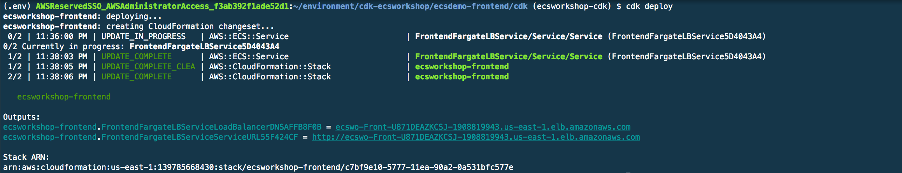

### 자동 확장

- 솔루션을 보려면 여기를 확장하십시오.

#### 자동 크기 조정이 필요한 이유
- 간단히 말해서 - 그것은 인간이 서비스를 확장하거나 오케스트레이터입니다.
    - 수동으로 수행하도록 선택하면 로드가 증가함에 따라 로드에 맞게 서비스를 확장하기 위해 수행 중인 작업을 중지해야 합니다(로드가 해결되면 결국 다시 축소해야 함은 말할 것도 없습니다). 이것은 지루하고 고통스러울 수 있으므로 자동 크기 조정이 존재하는 이유입니다.
    - 오케스트레이터가 서비스의 확장 및 축소를 처리하도록 하면 운영상의 부담을 줄이고 지속적인 개선에 집중할 수 있습니다. 자동 크기 조정 설정을 얻으려면 먼저 자동 크기 조정 결정으로 사용할 측정항목을 알아야 합니다. 조정에 대한 몇 가지 예시적인 메트릭은 CPU 사용률, 메모리 사용률 및 대기열 깊이입니다.

#### 코드에서 자동 크기 조정 설정

- 선택한 편집기를 사용하여 cdk 디렉토리에서 app.py를 엽니다.

- 검색 Enable Service Autoscaling 서비스에 대한 자동 크기 조정을 활성화할 코드를 찾습니다.

- self.autoscale 이하 코드에서 주석(#)을 제거합니다. 제거하면 다음과 같이 표시됩니다.

```
# Enable Service Autoscaling
self.autoscale = self.fargate_load_balanced_service.service.auto_scale_task_count(
    min_capacity=1,
    max_capacity=10
)

self.autoscale.scale_on_cpu_utilization(
    "CPUAutoscaling",
    target_utilization_percent=50,
    scale_in_cooldown=core.Duration.seconds(30),
    scale_out_cooldown=core.Duration.seconds(30)
)
```

#### 코드 검토
자동 크기 조정 논리 모델링을 시작하려면 먼저 상한과 하한을 설정합니다. 이것은 우리가 항상 최소 1개의 작업과 최대 10개의 작업에 있음을 보장합니다.

```
# Enable Service Autoscaling
self.autoscale = self.fargate_load_balanced_service.service.auto_scale_task_count(
    min_capacity=1,
    max_capacity=10
)
```

ECS 서비스가 배포되면 CPU 사용률과 같은 Cloudwatch 지표가 기본적으로 활성화됩니다. 우리는 이 메트릭을 활용하여 확장 목표로 사용할 것입니다. 이 방법에서 우리는 목표 CPU 사용률이 얼마인지, 그리고 스케일 활동 사이에 다른 작업을 추가/제거하기 전에 대기할 시간을 설정하고 있습니다.

```
self.autoscale.scale_on_cpu_utilization(
    "CPUAutoscaling",
    target_utilization_percent=50,
    scale_in_cooldown=core.Duration.seconds(30),
    scale_out_cooldown=core.Duration.seconds(30)
)
```

#### 자동 확장 배포
이제 자동 크기 조정 코드가 준비되었으므로 배포해 보겠습니다.

현재 상태와 제안된 환경 변경 사항의 차이점을 살펴보겠습니다. 다음을 실행합니다.

```
cdk diff
```

두 개의 리소스가 추가된 것을 볼 수 있습니다(아래 이미지). ECS는 Application Autoscaling 서비스를 활용하여 ECS 작업의 확장을 관리하고 있습니다. 요컨대, 이것은 만들 것입니다대상 추적 정책, 확장 및 축소에 대한 원하는 대상(이 경우 CPU 사용률)을 설정하고 ECS 서비스에 연결합니다.

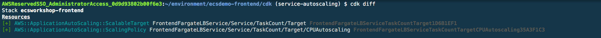

배포 시간!

```
cdk deploy --require-approval never
```

부하 테스트  
다음으로 프론트엔드에 로드를 생성해 보겠습니다.

```
alb_url=$(aws cloudformation describe-stacks --stack-name ecsworkshop-frontend --query "Stacks" --output json | jq -r '.[].Outputs[] | select(.OutputKey |contains("LoadBalancer")) | .OutputValue')
siege -c 20 -i $alb_url&
```

- siege가 백그라운드에서 실행되는 동안 콘솔로 이동하거나 명령줄에서 자동 크기 조정을 모니터링합니다

명령줄

- 실행 중인 작업과 원하는 작업을 비교합니다. 프론트엔드 서비스의 로드가 증가함에 따라 이러한 수가 결국 10까지 증가하는 것을 볼 수 있습니다. 이것은 실시간으로 발생하는 자동 크기 조정입니다. 이 단계는 몇 분 정도 소요됩니다. 한 터미널에서 자유롭게 실행하고 다른 터미널에서 다음 단계로 이동하십시오.

```
while true; do sleep 3; aws ecs describe-services --cluster container-demo --services ecsdemo-frontend | jq '.services[] | "Tasks Desired: \(.desiredCount) vs Tasks Running: \(.runningCount)"'; done 
```

- 이제 서비스가 자동 확장되는 것을 보았으므로 실행 중인 while 루프를 중지하겠습니다. `control + c` 를 누르기만 하면 취소합니다.

- 부하 테스트를 취소할 시간입니다. 중지하려면 다음 `control + c` 을 입력하십시오.

- 참고: 애플리케이션 가용성을 보장하기 위해 서비스는 가능한 한 빨리 메트릭에 비례하여 확장되지만 더 점진적으로 축소됩니다.

</div>
</details>

### ecs-cli Fargate/EC2 모드

<details>
<summary>ecs-cli Fargate 모드</summary>
<div markdown="1">

빌드에서 환경 변수 설정

```
export clustername=$(aws cloudformation describe-stacks --stack-name container-demo --query 'Stacks[0].Outputs[?OutputKey==`ClusterName`].OutputValue' --output text)

export target_group_arn=$(aws cloudformation describe-stack-resources --stack-name container-demo-alb | jq -r '.[][] | select(.ResourceType=="AWS::ElasticLoadBalancingV2::TargetGroup").PhysicalResourceId')

export vpc=$(aws cloudformation describe-stacks --stack-name container-demo --query 'Stacks[0].Outputs[?OutputKey==`VpcId`].OutputValue' --output text)

export ecsTaskExecutionRole=$(aws cloudformation describe-stacks --stack-name container-demo --query 'Stacks[0].Outputs[?OutputKey==`ECSTaskExecutionRole`].OutputValue' --output text)

export subnet_1=$(aws cloudformation describe-stacks --stack-name container-demo --query 'Stacks[0].Outputs[?OutputKey==`PrivateSubnetOne`].OutputValue' --output text)

export subnet_2=$(aws cloudformation describe-stacks --stack-name container-demo --query 'Stacks[0].Outputs[?OutputKey==`PrivateSubnetTwo`].OutputValue' --output text)

export subnet_3=$(aws cloudformation describe-stacks --stack-name container-demo --query 'Stacks[0].Outputs[?OutputKey==`PrivateSubnetThree`].OutputValue' --output text)

export security_group=$(aws cloudformation describe-stacks --stack-name container-demo --query 'Stacks[0].Outputs[?OutputKey==`ContainerSecurityGroup`].OutputValue' --output text)

cd ~/environment
```

구성 ecs-cli 클러스터와 대화하려면 다음 안내를 따르세요.

```
ecs-cli configure --region $AWS_REGION --cluster $clustername --default-launch-type FARGATE --config-name container-demo
```

명령을 실행할 때 해당 지역을 참조할 수 있도록 기본 지역을 설정합니다.

트래픽 승인:

```
aws ec2 authorize-security-group-ingress --group-id "$security_group" --protocol tcp --port 3000 --source-group "$security_group"
```

컨테이너가 포트 3000에서 통신한다는 것을 알고 있으므로 보안 그룹에서 해당 트래픽을 승인합니다.

프론트엔드 애플리케이션 배포:

```
cd ~/environment/ecsdemo-frontend
envsubst < ecs-params.yml.template >ecs-params.yml

ecs-cli compose --project-name ecsdemo-frontend service up \
    --create-log-groups \
    --target-group-arn $target_group_arn \
    --private-dns-namespace service \
    --enable-service-discovery \
    --container-name ecsdemo-frontend \
    --container-port 3000 \
    --cluster-config container-demo \
    --vpc $vpc
```

여기에서 디렉토리를 프론트엔드 애플리케이션 코드 디렉토리로 변경합니다. NSenvsubst 명령 템플릿 ecs-params.yml현재 값으로 파일을 만듭니다. 그런 다음 ECS 클러스터에서 프론트엔드 서비스를 시작합니다(기본 시작 유형은 Fargate).

참고: ecs-cli는 서비스 검색을 위한 프라이빗 dns 네임스페이스 및 Cloudwatch 로그의 로그 그룹 구축을 처리합니다.

실행 중인 컨테이너를 보고 나중에 사용할 수 있도록 작업 ID의 출력을 env 변수로 저장합니다.

```
ecs-cli compose --project-name ecsdemo-frontend service ps \
    --cluster-config container-demo

task_id=$(ecs-cli compose --project-name ecsdemo-frontend service ps --cluster-config container-demo | awk -F \/ 'FNR == 2 {print $2}')
```

하나의 작업을 등록해야 합니다.

연결 가능성 확인(브라우저에서 URL 열기):

```
alb_url=$(aws cloudformation describe-stacks --stack-name container-demo-alb --query 'Stacks[0].Outputs[?OutputKey==`ExternalUrl`].OutputValue' --output text)
echo "Open $alb_url in your browser"
```

이 명령은 수신 ALB의 URL을 조회하고 출력합니다. 클릭하여 열거나 브라우저에 복사하여 붙여넣을 수 있어야 합니다.

로그 보기:

```
# Referencing task id from above ps command
ecs-cli logs --task-id $task_id \
    --follow --cluster-config container-demo
```

로그를 보려면 이전 ps명령 에서 작업 ID를 찾아 이 명령에서 사용합니다. 작업의 로그를 따를 수도 있습니다.

작업 확장:

```
ecs-cli compose --project-name ecsdemo-frontend service scale 3 \
    --cluster-config container-demo
ecs-cli compose --project-name ecsdemo-frontend service ps \
    --cluster-config container-demo
```

이제 컨테이너가 3개의 가용 영역 모두에 고르게 분산되었음을 알 수 있습니다.

### ecs-cli ec2 모드

빌드에서 환경 변수 설정

```
export clustername=$(aws cloudformation describe-stacks --stack-name container-demo --query 'Stacks[0].Outputs[?OutputKey==`ClusterName`].OutputValue' --output text)
export target_group_arn=$(aws cloudformation describe-stack-resources --stack-name container-demo-alb | jq -r '.[][] | select(.ResourceType=="AWS::ElasticLoadBalancingV2::TargetGroup").PhysicalResourceId')
export vpc=$(aws cloudformation describe-stacks --stack-name container-demo --query 'Stacks[0].Outputs[?OutputKey==`VpcId`].OutputValue' --output text)
export ecsTaskExecutionRole=$(aws cloudformation describe-stacks --stack-name container-demo --query 'Stacks[0].Outputs[?OutputKey==`ECSTaskExecutionRole`].OutputValue' --output text)
export subnet_1=$(aws cloudformation describe-stacks --stack-name container-demo --query 'Stacks[0].Outputs[?OutputKey==`PrivateSubnetOne`].OutputValue' --output text)
export subnet_2=$(aws cloudformation describe-stacks --stack-name container-demo --query 'Stacks[0].Outputs[?OutputKey==`PrivateSubnetTwo`].OutputValue' --output text)
export subnet_3=$(aws cloudformation describe-stacks --stack-name container-demo --query 'Stacks[0].Outputs[?OutputKey==`PrivateSubnetThree`].OutputValue' --output text)
export security_group=$(aws cloudformation describe-stacks --stack-name container-demo --query 'Stacks[0].Outputs[?OutputKey==`ContainerSecurityGroup`].OutputValue' --output text)

cd ~/environment
```

구성 ecs-cli 클러스터와 대화하려면 다음 안내를 따르세요.

```
ecs-cli configure --region $AWS_REGION --cluster $clustername --default-launch-type EC2 --config-name container-demo
```

명령을 실행할 때 해당 지역을 참조할 수 있도록 기본 지역을 설정합니다.

트래픽 승인:

```
aws ec2 authorize-security-group-ingress --group-id "$security_group" --protocol tcp --port 3000 --source-group "$security_group"
```

컨테이너가 포트 3000에서 통신한다는 것을 알고 있으므로 보안 그룹에서 해당 트래픽을 승인합니다.

프론트엔드 애플리케이션 배포:

```
cd ~/environment/ecsdemo-frontend
envsubst < ecs-params.yml.template >ecs-params.yml

ecs-cli compose --project-name ecsdemo-frontend service up \
    --create-log-groups \
    --target-group-arn $target_group_arn \
    --private-dns-namespace service \
    --enable-service-discovery \
    --container-name ecsdemo-frontend \
    --container-port 3000 \
    --cluster-config container-demo \
    --vpc $vpc
```

여기에서 디렉토리를 프론트엔드 애플리케이션 코드 디렉토리로 변경합니다. NSenvsubst 명령 템플릿 ecs-params.yml현재 값으로 파일을 만듭니다. 그런 다음 ECS 클러스터에서 프론트엔드 서비스를 시작합니다(기본 시작 유형은 Fargate).

참고: ecs-cli는 서비스 검색을 위한 프라이빗 dns 네임스페이스 및 Cloudwatch 로그의 로그 그룹 구축을 처리합니다.

실행 중인 컨테이너를 보고 나중에 사용할 수 있도록 작업 ID의 출력을 env 변수로 저장합니다.

```
ecs-cli compose --project-name ecsdemo-frontend service ps \
    --cluster-config container-demo

task_id=$(ecs-cli compose --project-name ecsdemo-frontend service ps --cluster-config container-demo | awk -F \/ 'FNR == 2 {print $2}')
```

하나의 작업을 등록해야 합니다.

연결 가능성 확인(브라우저에서 URL 열기):

```
alb_url=$(aws cloudformation describe-stacks --stack-name container-demo-alb --query 'Stacks[0].Outputs[?OutputKey==`ExternalUrl`].OutputValue' --output text)
echo "Open $alb_url in your browser"
```

이 명령은 수신 ALB의 URL을 조회하고 출력합니다. 클릭하여 열거나 브라우저에 복사하여 붙여넣을 수 있어야 합니다.

로그 보기:

```
# Referencing task id from above ps command
ecs-cli logs --task-id $task_id \
    --follow --cluster-config container-demo
```

로그를 보려면 이전 ps명령 에서 작업 ID를 찾아 이 명령에서 사용합니다. 작업의 로그를 따를 수도 있습니다.

작업 확장:

```
ecs-cli compose --project-name ecsdemo-frontend service scale 3 \
    --cluster-config container-demo
ecs-cli compose --project-name ecsdemo-frontend service ps \
    --cluster-config container-demo
```

이제 컨테이너가 3개의 가용 영역 모두에 고르게 분산되었음을 알 수 있습니다.

</div>
</details>

---

## NODE.JS 백엔드 API

### copilot-cli

<details>
<summary>copilot-cli</summary>
<div markdown="1">

#### Nodejs 백엔드 서비스 배포
nodejs 서비스 리포지토리로 이동하여 마이크로 서비스에 필요한 git 해시 파일을 채웁니다.

```
cd ~/environment/ecsdemo-nodejs
git rev-parse --short=7 HEAD > code_hash.txt
```

이전 섹션에서는 애플리케이션, 테스트 환경 및 프런트엔드 서비스를 배포했습니다.

시작하려면 ecsworkshop 애플리케이션에서 nodejs 서비스를 생성해야 합니다.

다음 명령은 서비스를 애플리케이션에 추가하라는 프롬프트를 엽니다.

```
copilot init
```

배포하려는 애플리케이션, 환경 및 서비스와 관련된 일련의 질문이 표시됩니다. 다음과 같이 질문에 답하십시오.

- 기존 애플리케이션 중 하나를 사용하시겠습니까? "와이"
- 어떤 기존 애플리케이션에 새 서비스를 추가하시겠습니까? "ecworkshop"을 선택하고 Enter 키를 누릅니다.
- 서비스 아키텍처를 가장 잘 나타내는 서비스 유형은 무엇입니까? "백엔드 서비스"를 선택하고 Enter 키를 누릅니다.
- 이 백엔드 서비스의 이름을 무엇으로 지정하시겠습니까: ecsdemo-nodejs
- 도커파일: ./도커파일

질문에 답하면 서비스에 대한 몇 가지 기본 리소스를 만드는 프로세스가 시작됩니다. 여기에는 이 서비스의 원하는 상태를 정의하는 매니페스트 파일도 포함됩니다. 매니페스트 파일에 대한 자세한 내용은부조종사-cli 문서.

다음으로 테스트 환경을 배포하라는 메시지가 표시됩니다. 환경은 ECS에서 컨테이너 실행을 지원하는 데 필요한 모든 리소스를 포함합니다. 여기에는 네트워킹 스택(VPC, 서브넷, 보안 그룹 등), ECS 클러스터, 로드 밸런서(필요한 경우) 등이 포함됩니다.

"y"를 입력하고 Enter 키를 누릅니다. 테스트 환경이 이미 존재하는 경우 copilot은 계속해서 도커 이미지를 빌드하고 ECR에 푸시하고 백엔드 서비스를 배포합니다.

다음은 cli 상호 작용의 예입니다.


이게 다입니다! 배포가 완료되면 프론트엔드 URL로 다시 이동하면 이미지에 백엔드 Nodejs 서비스가 표시됩니다.

#### 애플리케이션과 상호 작용

ecsworkshop 응용 프로그램 세부 정보를 확인합시다.

```
copilot app show ecsworkshop
```

결과는 다음과 같아야 합니다.

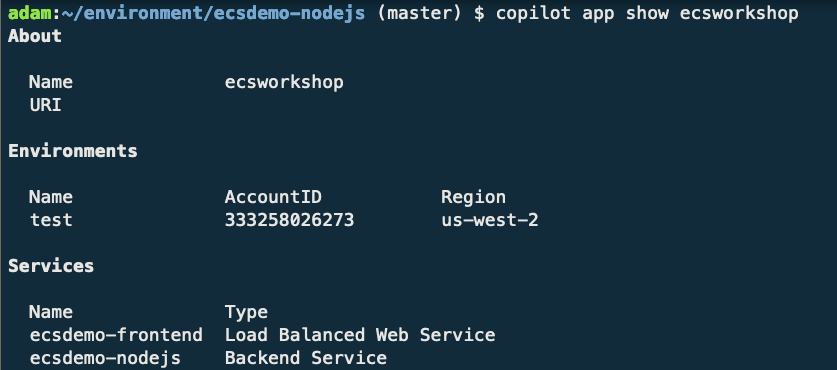

최근에 배포한 Nodejs 서비스가 ecsworkshop 애플리케이션에서 백엔드 서비스로 표시되는 것을 볼 수 있습니다.

#### 환경과의 상호작용
nodejs 서비스를 생성할 때 테스트 환경을 배포했으므로 테스트 환경의 세부 정보를 표시해 보겠습니다.

```
copilot env show -n test
```

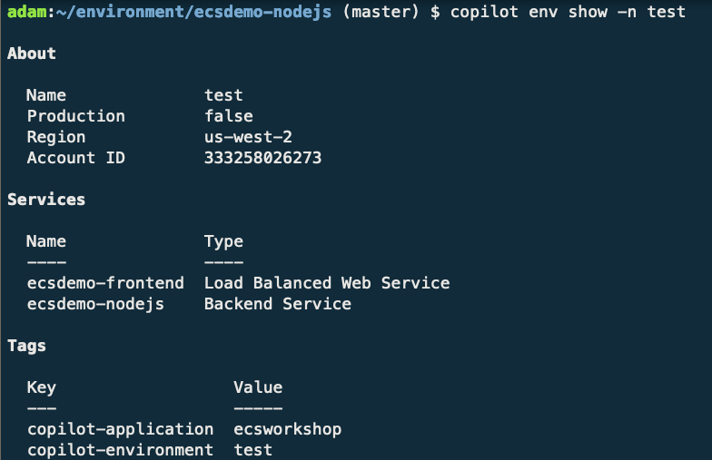

이제 테스트 환경에서 새로 배포된 서비스를 볼 수 있습니다!

#### Nodejs 서비스와 상호 작용
이제 nodejs 서비스의 상태를 확인해보자.

운영:

```
copilot svc status -n ecsdemo-nodejs
```

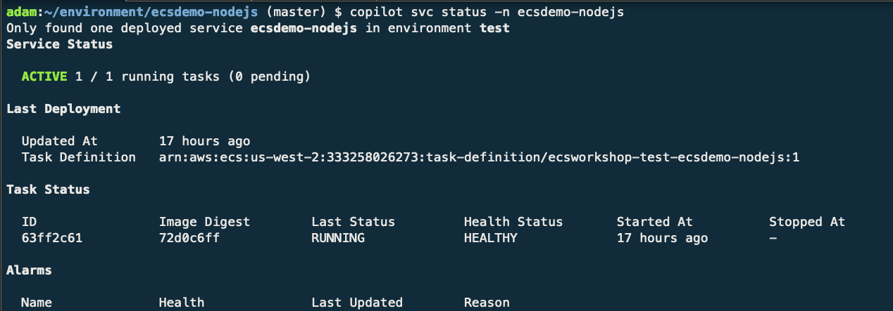

몇 가지 추가 세부 정보와 함께 하나의 활성 실행 중인 작업이 있음을 알 수 있습니다.

작업 수 확장

작업 수를 늘리자! 이를 위해 이전에 서비스를 초기화할 때 생성된 매니페스트 파일을 업데이트할 것입니다. 매니페스트 파일(./copilot/ecsdemo-nodejs/manifest.yml)을 열고 count 키의 값을 1에서 3으로 바꿉니다. 이것은 서비스 상태가 1 task에서 3으로 변경됨을 선언하는 것입니다. 자유롭게 매니페스트 파일을 탐색하여 익숙해집니다.

```
# Number of tasks that should be running in your service.
count: 3
```

완료하고 변경 사항을 저장했으면 다음을 실행합니다.

```
copilot svc deploy
```

Copilot은 이 명령으로 다음을 수행합니다.

- 로컬에서 이미지 빌드
- 서비스의 ECR 저장소로 푸시
- 매니페스트 파일을 CloudFormation으로 변환
- 추가 인프라를 CloudFormation에 패키징
- 업데이트된 서비스 및 리소스를 CloudFormation에 배포

배포를 확인하기 위해 먼저 copilot-cli를 통해 서비스 세부 정보를 확인하겠습니다.

```
copilot svc status -n ecsdemo-nodejs
```

이제 세 가지 작업이 실행되는 것을 볼 수 있습니다!

이제 로드 밸런서 URL로 돌아가서 세 nodejs 작업 사이에 다이어그램이 번갈아 표시되어야 합니다.

#### 서비스 로그 검토
Copilot을 통해 배포하는 서비스는 기본적으로 Cloudwatch 로그에 자동으로 로그를 전달합니다. 콘솔을 통해 로그를 탐색하고 검토하는 대신 copilot cli를 사용하여 해당 로그를 로컬에서 볼 수 있습니다. nodejs 서비스에 대한 로그를 추적해 보겠습니다.

```
copilot svc logs -a ecsworkshop -n ecsdemo-nodejs --follow
```

로그를 검토하려는 서비스의 동일한 디렉터리에 있는 경우 아래 명령을 입력하기만 하면 됩니다. 물론 특정 환경에서 서비스에 대한 로그를 검토하려면 환경 이름과 함께 -플래그를 전달해야 합니다.

```
copilot svc logs
```

마지막으로 언급할 것은 라이브 테일링 로그에 국한되지 않고 copilot svc logs --help명령줄에서 로그를 검토하는 다양한 방법을 보려면 입력해야 한다는 것입니다.

다음 단계
nodejs 백엔드 서비스 배포를 공식적으로 완료했습니다. 다음 섹션에서는 Crystal 백엔드 서비스를 추가하여 애플리케이션을 확장합니다.

</div>
</details>


### CDK

<details>
<summary>CDK</summary>
<div markdown="1">

#### 배포 구성 확인

```
cd ~/environment/ecsdemo-nodejs/cdk
```

cdk가 어셈블리 CloudFormation 템플릿을 합성할 수 있는지 확인

```
cdk synth
```

cdk가 환경에서 구축 및/또는 변경을 제안하는 내용을 검토합니다.

```
cdk diff
```

Nodejs 백엔드 서비스 배포

```
cdk deploy --require-approval never
```

#### 코드 검토
플랫폼 빌드에서 언급했듯이 코드를 통해 배포 구성을 정의합니다. cdk가 배포되는 방식을 더 잘 이해하기 위해 코드를 살펴보겠습니다.

기본 플랫폼 스택에서 기본 구성 값 가져오기
자체 스택에 플랫폼을 구축했기 때문에 배포되는 모든 서비스에서 재사용해야 하는 특정 환경적 가치가 있습니다. 이 사용자 지정 구성에서는 기본 플랫폼 스택에서 VPC, ECS 클러스터 및 Cloud Map 네임스페이스를 가져옵니다. 이를 사용자 정의 구성으로 래핑하여 서비스 배포 논리에서 플랫폼 가져오기를 분리합니다.

```
class BasePlatform(core.Construct):
    
    def __init__(self, scope: core.Construct, id: str, **kwargs):
        super().__init__(scope, id, **kwargs)

        # The base platform stack is where the VPC was created, so all we need is the name to do a lookup and import it into this stack for use
        self.vpc = aws_ec2.Vpc.from_lookup(
            self, "ECSWorkshopVPC",
            vpc_name='ecsworkshop-base/BaseVPC'
        )
        
        # Importing the service discovery namespace from the base platform stack
        self.sd_namespace = aws_servicediscovery.PrivateDnsNamespace.from_private_dns_namespace_attributes(
            self, "SDNamespace",
            namespace_name=core.Fn.import_value('NSNAME'),
            namespace_arn=core.Fn.import_value('NSARN'),
            namespace_id=core.Fn.import_value('NSID')
        )
        
        # Importing the ECS cluster from the base platform stack
        self.ecs_cluster = aws_ecs.Cluster.from_cluster_attributes(
            self, "ECSCluster",
            cluster_name=core.Fn.import_value('ECSClusterName'),
            security_groups=[],
            vpc=self.vpc,
            default_cloud_map_namespace=self.sd_namespace
        )

        # Importing the security group that allows frontend to communicate with backend services
        self.services_sec_grp = aws_ec2.SecurityGroup.from_security_group_id(
            self, "ServicesSecGrp",
            security_group_id=core.Fn.import_value('ServicesSecGrp')
        )
```

#### Nodejs 백엔드 서비스 배포 코드
백엔드 서비스의 경우 도커 이미지에서 컨테이너를 실행하고 싶지만 이를 배포하고 스케줄러 뒤에 가져오는 방법을 파악해야 합니다. 이를 자체적으로 수행하려면 작업 정의, ECS 서비스를 구축하고 서비스 검색을 위해 CloudMap 뒤에서 이를 가져오는 방법을 알아내야 합니다. 이러한 구성 요소를 자체적으로 구축하는 것은 수백 줄의 CloudFormation과 동일하지만 cdk가 제공하는 더 높은 수준의 구성을 사용하면 30줄의 코드로 모든 것을 구축할 수 있습니다.

```
class NodejsService(core.Stack):
    
    def __init__(self, scope: core.Stack, id: str, **kwargs):
        super().__init__(scope, id, **kwargs)

        # Importing our shared values from the base stack construct
        self.base_platform = BasePlatform(self, self.stack_name)

        # The task definition is where we store details about the task that will be scheduled by the service
        self.fargate_task_def = aws_ecs.TaskDefinition(
            self, "TaskDef",
            compatibility=aws_ecs.Compatibility.EC2_AND_FARGATE,
            cpu='256',
            memory_mib='512',
        )
        
        # The container definition defines the container(s) to be run when the task is instantiated
        self.container = self.fargate_task_def.add_container(
            "NodeServiceContainerDef",
            image=aws_ecs.ContainerImage.from_registry("brentley/ecsdemo-nodejs"),
            memory_reservation_mib=512,
            logging=aws_ecs.LogDriver.aws_logs(
                stream_prefix='ecsworkshop-nodejs'
            )
        )
        
        # Serve this container on port 3000
        self.container.add_port_mappings(
            aws_ecs.PortMapping(
                container_port=3000
            )
        )

        # Build the service definition to schedule the container in the shared cluster
        self.fargate_service = aws_ecs.FargateService(
            self, "NodejsFargateService",
            task_definition=self.fargate_task_def,
            cluster=self.base_platform.ecs_cluster,
            security_group=self.base_platform.services_sec_grp,
            desired_count=1,
            cloud_map_options=aws_ecs.CloudMapOptions(
                cloud_map_namespace=self.base_platform.sd_namespace,
                name='ecsdemo-nodejs'
            )
        )
```

#### 서비스 로그 검토
명령줄에서 서비스 로그를 검토합니다.

- 솔루션을 보려면 여기를 확장하십시오.

먼저 cdk가 우리를 대신하여 로그 그룹을 생성했기 때문에 서비스 이름을 기반으로 로그 그룹의 이름을 가져와야 합니다. 다음으로 터미널에서 CloudWatch의 활성 로그를 추적합니다. 우리는 이라는 오픈 소스 도구를 사용하여 이를 달성합니다.awslogs.

```
log_group=$(awslogs groups -p ecsworkshop-nodejs)
awslogs get -G -S --timestamp --start 1m --watch $log_group
```

다음은 출력의 예입니다.


#### 콘솔에서 서비스 로그를 검토합니다.

- 솔루션을 보려면 여기를 확장하십시오.

먼저 콘솔에서 ECS로 이동하고 서비스를 드릴다운하여 자세한 정보를 얻습니다. 보시다시피 서비스 검색 세부 정보, 실행 중인 작업 수 및 로그와 같이 서비스 자체에 대해 수집할 수 있는 많은 정보가 있습니다. 실행 중인 서비스에 대한 로그를 검토하려면 로그 탭을 클릭합니다.


다음으로 거의 실시간으로 서비스 로그를 검토할 수 있습니다. 1주일까지 시간을 되돌리거나 지난 30초로 드릴다운할 수 있습니다. 아래 예에서는 30초를 선택합니다.콘솔 서비스 


#### 서비스 확장
수동 확장

- 솔루션을 보려면 여기를 확장하십시오.

서비스를 수동으로 확장하려면 다음에서 코드를 수정하면 됩니다. app.py 원하는 개수를 1에서 3으로 변경

```
self.fargate_service = aws_ecs.FargateService(
    self, "NodejsFargateService",
    task_definition=self.fargate_task_def,
    cluster=self.base_platform.ecs_cluster,
    security_group=self.base_platform.services_sec_grp,
    desired_count=3,
    #desired_count=1,
    cloud_map_options=aws_ecs.CloudMapOptions(
        cloud_map_namespace=self.base_platform.sd_namespace,
        name='ecsdemo-nodejs'
    )
)
```

코드를 업데이트했으면 변경 사항이 적용되는지 확인하겠습니다.

```
cdk diff
```

출력은 다음과 같아야 합니다.

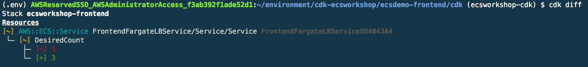

변경 사항이 좋아 보이는 것을 확인했으므로 이제 배포해 보겠습니다.

```
cdk deploy
```

출력은 다음과 같아야 합니다.


자동 확장

- 솔루션을 보려면 여기를 확장하십시오.

자동 크기 조정이 필요한 이유

- 간단히 말해서 - 그것은 서비스 또는 오케스트레이터를 확장하는 사람입니다.
    - 수동으로 수행하도록 선택하면 부하가 증가함에 따라 부하를 충족하도록 서비스를 확장하기 위해 수행 중인 작업을 중지해야 합니다(그리고 부하가 해결되면 결국 다시 축소해야 함은 말할 것도 없습니다). 이것은 지루하고 고통스러울 수 있으므로 자동 크기 조정이 존재하는 이유입니다.
    - 오케스트레이터가 서비스의 확장 및 축소를 처리하도록 하면 운영상의 부담을 줄이고 지속적인 개선에 집중할 수 있습니다. 자동 크기 조정 설정을 얻으려면 먼저 자동 크기 조정에 대한 결정으로 사용할 측정항목을 알아야 합니다. 조정에 대한 몇 가지 예시적인 메트릭은 CPU 사용률, 메모리 사용률 및 대기열 깊이입니다.

코드에서 자동 크기 조정 설정

- 원하는 편집기를 사용하여 cdk 디렉토리에서 '~/environment/ecsdemo-nodejs/cdk/app.py'를 엽니다.

- 검색 `Enable Service Autoscaling` 서비스에 대한 자동 크기 조정을 활성화할 코드를 찾습니다.

- `self.autoscale` 이하의 코드에서 주석(#)을 제거합니다. 제거하면 다음과 같이 표시됩니다.

```
# Enable Service Autoscaling
self.autoscale = self.fargate_service.auto_scale_task_count(
    min_capacity=1,
    max_capacity=10
)

self.autoscale.scale_on_cpu_utilization(
    "CPUAutoscaling",
    target_utilization_percent=50,
    scale_in_cooldown=core.Duration.seconds(30),
    scale_out_cooldown=core.Duration.seconds(30)
)
```

#### 코드 검토

자동 크기 조정 논리 모델링을 시작하려면 먼저 상한 및 하한을 설정합니다. 이것은 우리가 항상 최소 1개의 작업과 최대 10개의 작업에 있음을 보장합니다.

```
# Enable Service Autoscaling
self.autoscale = self.fargate_service.auto_scale_task_count(
    min_capacity=1,
    max_capacity=10
)
```

ECS 서비스가 배포되면 CPU 사용률과 같은 Cloudwatch 지표가 기본적으로 활성화됩니다. 우리는 이 메트릭을 활용하여 확장 목표로 사용할 것입니다. 이 방법에서 우리는 목표 CPU 사용률이 얼마인지, 그리고 스케일 활동 사이에서 다른 작업을 추가/제거하기 전에 대기할 시간을 설정하고 있습니다.

```
self.autoscale.scale_on_cpu_utilization(
    "CPUAutoscaling",
    target_utilization_percent=50,
    scale_in_cooldown=core.Duration.seconds(30),
    scale_out_cooldown=core.Duration.seconds(30)
)
```

자동 확장 배포

- 이제 자동 크기 조정 코드가 준비되었으므로 배포해 보겠습니다.

- 현재 상태와 제안된 환경 변경 사항의 차이점을 살펴보겠습니다. 다음을 실행합니다.

```
cdk diff
```

두 개의 리소스가 추가된 것을 볼 수 있습니다(아래 이미지). ECS는 Application Autoscaling 서비스를 활용하여 ECS 작업의 확장을 관리합니다. 요컨대, 이것은 만들 것입니다대상 추적 정책, 확장 및 축소에 대한 원하는 대상(이 경우 CPU 사용률)을 설정하고 ECS 서비스에 연결합니다.

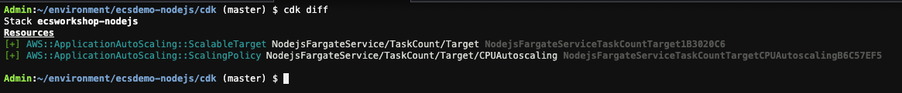

배포 시간!

```
cdk deploy --require-approval never
```

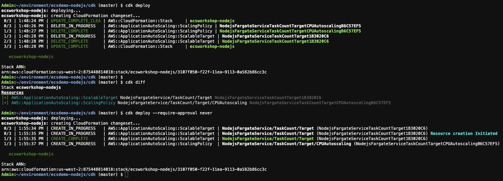

부하 테스트

- Nodejs Fargate 서비스에 로드를 도입하려면 해당 서비스 엔드포인트에 도달할 수 있어야 합니다. 서비스가 프라이빗 서브넷에 있으므로 동일한 VPC 내에 배포된 EC2 인스턴스를 사용합니다. 인스턴스는 플랫폼/빌드 환경 단계에서 생성되었습니다.

- Autoscaling을 배포했으면 플랫폼 배포 중에 생성된 인스턴스 ID를 복사하고 SSM 에이전트를 사용하여 임시 ec2에 들어가거나 다음 코드를 사용합니다.

```
ec2InstanceId=$(aws cloudformation describe-stacks --stack-name ecsworkshop-base --query "Stacks" --output json | jq -r '.[].Outputs[] | select(.OutputKey |contains("StressToolEc2Id")) | .OutputValue')
aws ssm start-session --target "$ec2InstanceId"
```

ec2 인스턴스에 있으면 nodejs 서비스에 대한 부하 테스트를 생성합니다. 로드 테스트의 URL은 CloudMap 서비스 또는 ECS 클러스터에서 실행 중인 서비스에서 검색할 수 있습니다.

```
siege -c 100 -i http://ecsdemo-nodejs.service.local:3000
```

siege가 백그라운드에서 실행되는 동안 콘솔로 이동하거나 새 cloud9 터미널의 명령줄에서 자동 크기 조정을 모니터링합니다.

명령줄
실행 중인 작업과 원하는 작업을 비교합니다. nodejs 서비스의 부하가 증가함에 따라 이러한 개수가 결국 10까지 증가하는 것을 볼 수 있습니다. 이것은 실시간으로 발생하는 자동 크기 조정입니다. 이 단계는 몇 분 정도 소요됩니다. 한 터미널에서 자유롭게 실행하고 다른 터미널에서 다음 단계로 이동하십시오.

```
while true; do sleep 3; aws ecs describe-services --cluster container-demo --services ecsdemo-nodejs | jq '.services[] | "Tasks Desired: \(.desiredCount) vs Tasks Running: \(.runningCount)"'; done
```

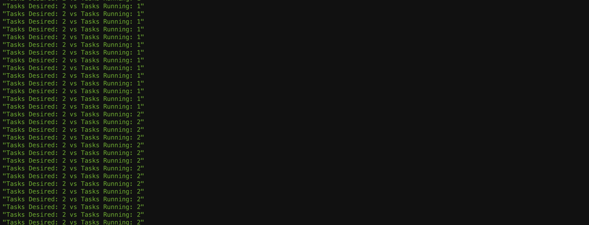

이제 서비스가 자동 확장되는 것을 보았으므로 실행 중인 while 루프를 중지하겠습니다. 누르기만 하면control + c취소합니다.

부하 테스트를 취소할 시간입니다. 중지하려면 다음을 입력하십시오.control + c
참고: 애플리케이션 가용성을 보장하기 위해 서비스는 가능한 한 빨리 메트릭에 비례하여 확장되지만 더 점진적으로 축소됩니다. 자세한 내용은선적 서류 비치

콘솔

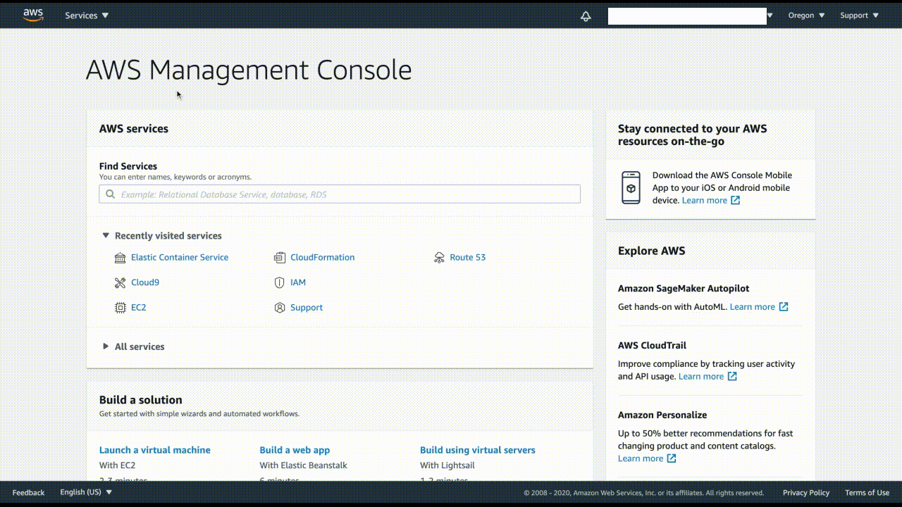

</div>
</details>

### ecs-cli ec2 모드

<details>
<summary>ecs-cli ec2 모드</summary>
<div markdown="1">

NodeJS 백엔드 API를 불러오자!

NodeJS 백엔드 애플리케이션 배포:

```
cd ~/environment/ecsdemo-nodejs
envsubst < ecs-params.yml.template >ecs-params.yml

ecs-cli compose --project-name ecsdemo-nodejs service up \
    --create-log-groups \
    --private-dns-namespace service \
    --enable-service-discovery \
    --cluster-config container-demo \
    --vpc $vpc
```

여기에서 디렉토리를 nodejs 애플리케이션 코드 디렉토리로 변경합니다. NSenvsubst 명령 템플릿 ecs-params.yml현재 값으로 파일을 만듭니다. 그런 다음 ECS 클러스터에서 nodejs 서비스를 시작합니다(기본 시작 유형은 Fargate).

참고: ecs-cli는 서비스 검색을 위한 프라이빗 dns 네임스페이스 및 Cloudwatch 로그의 로그 그룹 구축을 처리합니다.

실행 중인 컨테이너를 보고 나중에 사용할 수 있도록 작업 ID의 출력을 env 변수로 저장합니다.

```
ecs-cli compose --project-name ecsdemo-nodejs service ps \
    --cluster-config container-demo

task_id=$(ecs-cli compose --project-name ecsdemo-nodejs service ps --cluster-config container-demo | awk -F \/ 'FNR == 2 {print $2}')
```

하나의 작업을 등록해야 합니다.

연결 가능성 확인(브라우저에서 URL 열기):

```
alb_url=$(aws cloudformation describe-stacks --stack-name container-demo-alb --query 'Stacks[0].Outputs[?OutputKey==`ExternalUrl`].OutputValue' --output text)
echo "Open $alb_url in your browser"
```

이 명령은 수신 ALB의 URL을 조회하고 출력합니다. 클릭하여 열거나 브라우저에 복사하여 붙여넣을 수 있어야 합니다.

로그 보기:

```
# Referencing task id from above ps command
ecs-cli logs --task-id $task_id \
    --follow --cluster-config container-demo
```

로그를 보려면 이전 ps명령 에서 작업 ID를 찾아 이 명령에서 사용합니다. 작업의 로그를 따를 수도 있습니다.

작업 확장:

```
ecs-cli compose --project-name ecsdemo-nodejs service scale 3 \
    --cluster-config container-demo
ecs-cli compose --project-name ecsdemo-nodejs service ps \
    --cluster-config container-demo
```

이제 컨테이너가 3개의 가용 영역 모두에 고르게 분산되었음을 알 수 있습니다.

</div>
</details>

---

## 크리스탈 백엔드 API

## Crystal 백엔드 서비스 배포

<details>
<summary>Crystal 백엔드 서비스 배포</summary>
<div markdown="1">

crystal service repo로 이동하여 마이크로 서비스에 필요한 git 해시 파일을 채웁니다.

```
cd ~/environment/ecsdemo-crystal
git rev-parse --short=7 HEAD > code_hash.txt
```

이전 섹션에서는 애플리케이션, 테스트 환경, 프론트엔드 서비스 및 nodejs 서비스를 배포했습니다.

이전 섹션에서 했던 것처럼 먼저 ecsworkshop 애플리케이션에서 크리스탈 서비스를 생성해야 합니다.

다음 명령은 서비스를 애플리케이션에 추가하라는 프롬프트를 엽니다.

```
copilot init
```

배포하려는 애플리케이션, 환경 및 서비스와 관련된 일련의 질문이 표시됩니다. 다음과 같이 질문에 답하십시오.

- 기존 애플리케이션 중 하나를 사용하시겠습니까? "와이"
- 어떤 기존 애플리케이션에 새 서비스를 추가하시겠습니까? "ecworkshop"을 선택하고 Enter 키를 누릅니다.
- 서비스 아키텍처를 가장 잘 나타내는 서비스 유형은 무엇입니까? "백엔드 서비스"를 선택하고 Enter 키를 누릅니다.
- 이 백엔드 서비스의 이름을 무엇으로 지정하시겠습니까: ecsdemo-crystal
- 도커파일: ./도커파일

질문에 답하면 서비스에 대한 몇 가지 기본 리소스를 만드는 프로세스가 시작됩니다. 여기에는 이 서비스의 원하는 상태를 정의하는 매니페스트 파일도 포함됩니다. 매니페스트 파일에 대한 자세한 내용은부조종사-cli 문서.

다음으로 테스트 환경을 배포하라는 메시지가 표시됩니다. 환경은 ECS에서 컨테이너 실행을 지원하는 데 필요한 모든 리소스를 포함합니다. 여기에는 네트워킹 스택(VPC, 서브넷, 보안 그룹 등), ECS 클러스터, 로드 밸런서(필요한 경우) 등이 포함됩니다.

"y"를 입력하고 Enter 키를 누릅니다. 테스트 환경이 이미 존재하는 경우 copilot은 계속해서 도커 이미지를 빌드하고 ECR에 푸시하고 백엔드 서비스를 배포합니다.

다음은 cli 상호 작용의 예입니다.

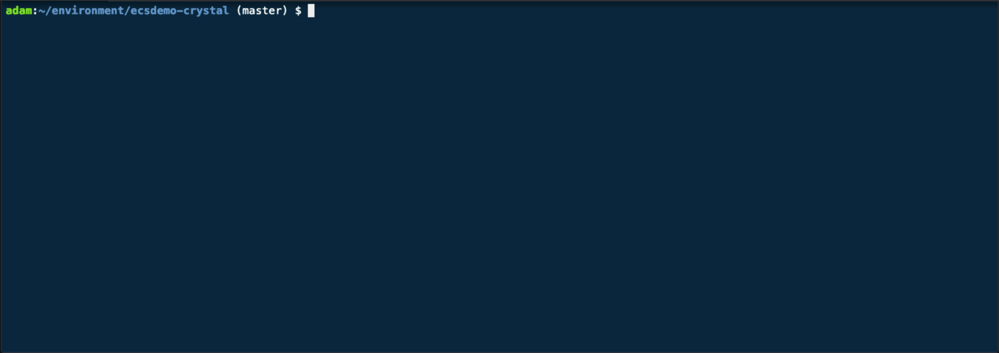

이게 다입니다! 배포가 완료되면 프런트엔드 URL로 다시 이동하면 이제 이미지에 백엔드 Crystal 서비스가 표시됩니다.

#### 애플리케이션과 상호 작용
ecsworkshop 응용 프로그램 세부 정보를 확인합시다.

```
copilot app show ecsworkshop
```

결과는 다음과 같아야 합니다.

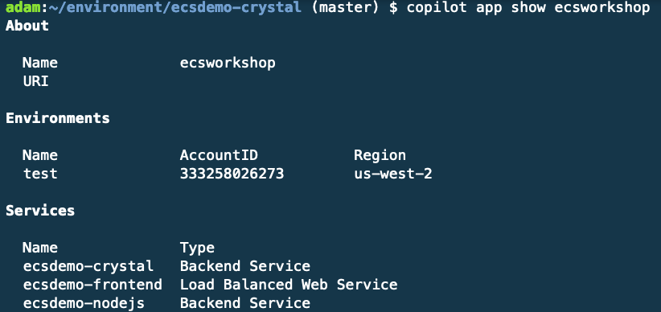

최근에 배포한 크리스탈 서비스가 ecsworkshop 애플리케이션에서 백엔드 서비스로 표시되는 것을 볼 수 있습니다.

#### 환경과의 상호작용
프론트엔드 서비스를 생성할 때 테스트 환경을 배포했으므로 테스트 환경에 대한 세부 정보를 표시해 보겠습니다.

```
copilot env show -n test
```

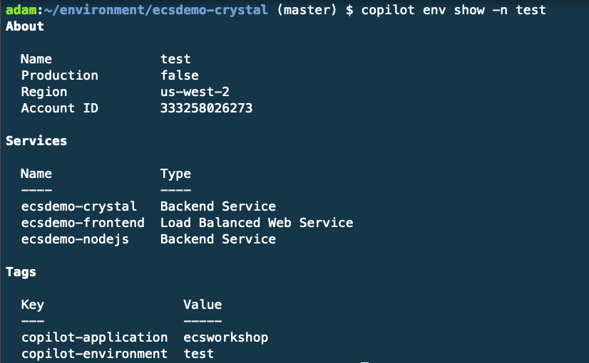

이제 테스트 환경에서 새로 배포된 서비스를 볼 수 있습니다!

#### 크리스탈 서비스와 상호작용
이제 프론트엔드 서비스의 상태를 확인해보자.

운영:

```
copilot svc status -n ecsdemo-crystal
```

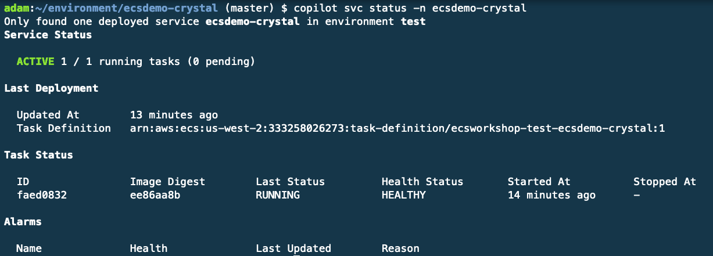

몇 가지 추가 세부 정보와 함께 하나의 활성 실행 중인 작업이 있음을 알 수 있습니다.

작업 수 확장
작업 수를 늘리자! 이를 위해 이전에 서비스를 초기화할 때 생성된 매니페스트 파일을 업데이트할 것입니다. 매니페스트 파일(./copilot/ecsdemo-crystal/manifest.yml)을 열고 count 키 값을 1에서 3으로 바꿉니다. 이는 서비스 상태가 1 task에서 3으로 변경됨을 선언하는 것입니다. 자유롭게 매니페스트 파일을 탐색하여 익숙해집니다.

```
# Number of tasks that should be running in your service.
count: 3
```

완료하고 변경 사항을 저장했으면 다음을 실행합니다.

```
copilot svc deploy
```

Copilot은 이 명령으로 다음을 수행합니다.

- 로컬에서 이미지 빌드
- 서비스의 ECR 저장소로 푸시
- 매니페스트 파일을 CloudFormation으로 변환
- 추가 인프라를 CloudFormation에 패키징
- 업데이트된 서비스 및 리소스를 CloudFormation에 배포

배포를 확인하기 위해 먼저 copilot-cli를 통해 서비스 세부 정보를 확인하겠습니다.

```
copilot svc status -n ecsdemo-crystal
```

이제 세 가지 작업이 실행되는 것을 볼 수 있습니다!

이제 로드 밸런서 URL로 돌아가면 세 가지 프론트엔드 작업 간에 다이어그램이 번갈아 표시되어야 합니다.

서비스 로그 검토
Copilot을 통해 배포하는 서비스는 기본적으로 Cloudwatch 로그에 자동으로 로그를 전달합니다. 콘솔을 통해 로그를 탐색하고 검토하는 대신 copilot cli를 사용하여 해당 로그를 로컬에서 볼 수 있습니다. Crystal 서비스에 대한 로그를 추적해 보겠습니다.

```
copilot svc logs -a ecsworkshop -n ecsdemo-crystal --follow
```

로그를 검토하려는 서비스의 동일한 디렉터리에 있는 경우 아래 명령을 입력하기만 하면 됩니다. 물론 yuo가 특정 환경에서 서비스에 대한 로그를 검토하려면 환경 이름과 함께 -e 플래그를 전달해야 합니다.

```
copilot svc logs
```

마지막으로 언급할 것은 라이브 테일링 로그에 국한되지 않고 copilot svc logs --help명령줄에서 로그를 검토하는 다양한 방법을 보려면 입력해야 한다는 것입니다.

#### 다음 단계
우리는 해냈다! ECS에 3계층, 다중 언어, 마이크로서비스 애플리케이션을 성공적으로 배포했습니다!

</div>
</details>

### CDK

<details>
<summary>CDK</summary>
<div markdown="1">

#### 배포 구성 확인

```
cd ~/environment/ecsdemo-crystal/cdk
```

cdk가 어셈블리 CloudFormation 템플릿을 합성할 수 있는지 확인

```
cdk synth
```

cdk가 환경에서 구축 및/또는 변경을 제안하는 내용을 검토합니다.

```
cdk diff
```

크리스탈 백엔드 서비스 배포

```
cdk deploy --require-approval never
```

코드 검토
플랫폼 빌드에서 언급했듯이 코드를 통해 배포 구성을 정의합니다. cdk가 배포되는 방식을 더 잘 이해하기 위해 코드를 살펴보겠습니다.

기본 플랫폼 스택에서 기본 구성 값 가져오기
자체 스택에 플랫폼을 구축했기 때문에 배포되는 모든 서비스에서 재사용해야 하는 특정 환경적 가치가 있습니다. 이 사용자 지정 구성에서는 기본 플랫폼 스택에서 VPC, ECS 클러스터 및 Cloud Map 네임스페이스를 가져옵니다. 이를 사용자 정의 구성으로 래핑하여 서비스 배포 논리에서 플랫폼 가져오기를 분리합니다.

```
class BasePlatform(core.Construct):
    
    def __init__(self, scope: core.Construct, id: str, **kwargs):
        super().__init__(scope, id, **kwargs)

        # The base platform stack is where the VPC was created, so all we need is the name to do a lookup and import it into this stack for use
        self.vpc = aws_ec2.Vpc.from_lookup(
            self, "ECSWorkshopVPC",
            vpc_name='ecsworkshop-base/BaseVPC'
        )
        
        # Importing the service discovery namespace from the base platform stack
        self.sd_namespace = aws_servicediscovery.PrivateDnsNamespace.from_private_dns_namespace_attributes(
            self, "SDNamespace",
            namespace_name=core.Fn.import_value('NSNAME'),
            namespace_arn=core.Fn.import_value('NSARN'),
            namespace_id=core.Fn.import_value('NSID')
        )
        
        # Importing the ECS cluster from the base platform stack
        self.ecs_cluster = aws_ecs.Cluster.from_cluster_attributes(
            self, "ECSCluster",
            cluster_name=core.Fn.import_value('ECSClusterName'),
            security_groups=[],
            vpc=self.vpc,
            default_cloud_map_namespace=self.sd_namespace
        )

        # Importing the security group that allows frontend to communicate with backend services
        self.services_sec_grp = aws_ec2.SecurityGroup.from_security_group_id(
            self, "ServicesSecGrp",
            security_group_id=core.Fn.import_value('ServicesSecGrp')
        )
```

Crystal 백엔드 서비스 배포 코드
백엔드 서비스의 경우 도커 이미지에서 컨테이너를 실행하고 싶지만 이를 배포하고 스케줄러 뒤에 가져오는 방법을 파악해야 합니다. 이를 자체적으로 수행하려면 작업 정의, ECS 서비스를 구축하고 서비스 검색을 위해 CloudMap 뒤에서 이를 가져오는 방법을 알아내야 합니다. 이러한 구성 요소를 자체적으로 구축하는 것은 수백 줄의 CloudFormation과 동일하지만 cdk가 제공하는 더 높은 수준의 구성을 사용하면 30줄의 코드로 모든 것을 구축할 수 있습니다.

```
class CrystalService(core.Stack):
    
    def __init__(self, scope: core.Stack, id: str, **kwargs):
        super().__init__(scope, id, **kwargs)

        # Importing our shared values from the base stack construct
        self.base_platform = BasePlatform(self, self.stack_name)

        # The task definition is where we store details about the task that will be scheduled by the service
        self.fargate_task_def = aws_ecs.TaskDefinition(
            self, "TaskDef",
            compatibility=aws_ecs.Compatibility.EC2_AND_FARGATE,
            cpu='256',
            memory_mib='512',
        )
        
        # The container definition defines the container(s) to be run when the task is instantiated
        self.container = self.fargate_task_def.add_container(
            "CrystalServiceContainerDef",
            image=aws_ecs.ContainerImage.from_registry("brentley/ecsdemo-crystal"),
            memory_reservation_mib=512,
            logging=aws_ecs.LogDriver.aws_logs(
                stream_prefix='ecsworkshop-crystal'
            )
        )
        
        # Serve this container on port 3000
        self.container.add_port_mappings(
            aws_ecs.PortMapping(
                container_port=3000
            )
        )

        # Build the service definition to schedule the container in the shared cluster
        self.fargate_service = aws_ecs.FargateService(
            self, "CrystalFargateService",
            task_definition=self.fargate_task_def,
            cluster=self.base_platform.ecs_cluster,
            security_group=self.base_platform.services_sec_grp,
            desired_count=1,
            cloud_map_options=aws_ecs.CloudMapOptions(
                cloud_map_namespace=self.base_platform.sd_namespace,
                name='ecsdemo-crystal'
            )
        )
```

#### 서비스 로그 검토
명령줄에서 서비스 로그를 검토합니다.

- 솔루션을 보려면 여기를 확장하십시오.

먼저 cdk가 우리를 대신하여 로그 그룹을 생성했기 때문에 서비스 이름을 기반으로 로그 그룹의 이름을 가져와야 합니다. 다음으로 터미널에서 CloudWatch의 활성 로그를 추적합니다. 우리는 이라는 오픈 소스 도구를 사용하여 이를 달성합니다.awslogs.

```
log_group=$(awslogs groups -p ecsworkshop-crystal)
awslogs get -G -S --timestamp --start 1m --watch $log_group
```

다음은 출력의 예입니다.


콘솔에서 서비스 로그를 검토합니다.

- 솔루션을 보려면 여기를 확장하십시오.

먼저 콘솔에서 ECS로 이동하고 서비스를 드릴다운하여 자세한 정보를 얻습니다. 보시다시피 서비스 검색 세부 정보, 실행 중인 작업 수 및 로그와 같이 서비스 자체에 대해 수집할 수 있는 많은 정보가 있습니다. 실행 중인 서비스에 대한 로그를 검토하려면 로그 탭을 클릭합니다.


다음으로 거의 실시간으로 서비스 로그를 검토할 수 있습니다. 1주일까지 시간을 되돌리거나 지난 30초로 드릴다운할 수 있습니다. 아래 예에서는 30초를 선택합니다.콘솔 


#### 서비스 확장

수동 확장

- 솔루션을 보려면 여기를 확장하십시오.

서비스를 수동으로 확장하려면 다음에서 코드를 수정하면 됩니다. app.py 원하는 개수를 1에서 3으로 변경

```
self.fargate_service = aws_ecs.FargateService(
    self, "CrystalFargateService",
    task_definition=self.fargate_task_def,
    cluster=self.base_platform.ecs_cluster,
    security_group=self.base_platform.services_sec_grp,
    desired_count=3,
    #desired_count=1,
    cloud_map_options=aws_ecs.CloudMapOptions(
        cloud_map_namespace=self.base_platform.sd_namespace,
        name='ecsdemo-crystal'
    )
)
```

코드를 업데이트했으면 변경 사항이 적용되는지 확인하겠습니다.

```
cdk diff
```

출력은 다음과 같아야 합니다.

```
diff-service-count
```

변경 사항이 좋아 보이는 것을 확인했으므로 이제 배포해 보겠습니다.

```
cdk deploy
```

출력은 다음과 같아야 합니다.


#### 자동 확장

- 솔루션을 보려면 여기를 확장하십시오.

자동 크기 조정이 필요한 이유

- 간단히 말해서 - 그것은 서비스 또는 오케스트레이터를 확장하는 사람입니다.

    - 수동으로 수행하도록 선택하면 부하가 증가함에 따라 부하를 충족하도록 서비스를 확장하기 위해 수행 중인 작업을 중지해야 합니다(그리고 부하가 해결되면 결국 다시 축소해야 함은 말할 것도 없습니다). 이것은 지루하고 고통스러울 수 있으므로 자동 크기 조정이 존재하는 이유입니다.
    - 오케스트레이터가 서비스의 확장 및 축소를 처리하도록 하면 운영상의 부담을 줄이고 지속적인 개선에 집중할 수 있습니다. 자동 크기 조정 설정을 얻으려면 먼저 자동 크기 조정에 대한 결정으로 사용할 측정항목을 알아야 합니다. 조정에 대한 몇 가지 예시적인 메트릭은 CPU 사용률, 메모리 사용률 및 대기열 깊이입니다.

코드에서 자동 크기 조정 설정
- 원하는 편집기를 사용하여 cdk 디렉토리에서 '~/environment/ecsdemo-crystal/cdk/app.py'를 엽니다.

- 검색Enable Service Autoscaling서비스에 대한 자동 크기 조정을 활성화할 코드를 찾습니다.

- self.autoscale 이하의 코드에서 주석(#)을 제거합니다. 제거하면 다음과 같이 표시됩니다.

```
# Enable Service Autoscaling
self.autoscale = self.fargate_service.auto_scale_task_count(
    min_capacity=1,
    max_capacity=10
)

# We will use target_utilization_percent=20% for testing purposes
self.autoscale.scale_on_cpu_utilization(
    "CPUAutoscaling",
    target_utilization_percent=20,
    scale_in_cooldown=core.Duration.seconds(30),
    scale_out_cooldown=core.Duration.seconds(30)
)
```

#### 코드 검토
자동 크기 조정 논리 모델링을 시작하려면 먼저 상한 및 하한을 설정합니다. 이것은 우리가 항상 최소 1개의 작업과 최대 10개의 작업에 있음을 보장합니다.

```
# Enable Service Autoscaling
self.autoscale = self.fargate_service.auto_scale_task_count(
    min_capacity=1,
    max_capacity=10
)
```

ECS 서비스가 배포되면 CPU 사용률과 같은 Cloudwatch 지표가 기본적으로 활성화됩니다. 우리는 이 메트릭을 활용하여 확장 목표로 사용할 것입니다. 이 방법에서 우리는 목표 CPU 사용률이 얼마인지, 그리고 스케일 활동 사이에서 다른 작업을 추가/제거하기 전에 대기할 시간을 설정하고 있습니다.

```
# We will use target_utilization_percent=20% for testing purposes
self.autoscale.scale_on_cpu_utilization(
    "CPUAutoscaling",
    target_utilization_percent=20,
    scale_in_cooldown=core.Duration.seconds(30),
    scale_out_cooldown=core.Duration.seconds(30)
)
```

자동 확장 배포

- 이제 자동 크기 조정 코드가 준비되었으므로 배포해 보겠습니다.

- 현재 상태와 제안된 환경 변경 사항의 차이점을 살펴보겠습니다. 다음을 실행합니다.

```
cdk diff
```

- 두 개의 리소스가 추가된 것을 볼 수 있습니다(아래 이미지). ECS는 Application Autoscaling 서비스를 활용하여 ECS 작업의 확장을 관리합니다. 요컨대, 이것은 만들 것입니다대상 추적 정책, 확장 및 축소에 대한 원하는 대상(이 경우 CPU 사용률)을 설정하고 ECS 서비스에 연결합니다.

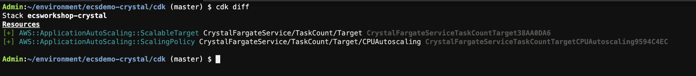

- 배포 시간!

```
cdk deploy --require-approval never
```

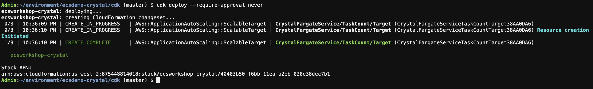

#### 부하 테스트

- Crystal Fargate 서비스에 로드를 도입하려면 해당 서비스 엔드포인트에 도달할 수 있어야 합니다. 서비스가 프라이빗 서브넷에 있으므로 동일한 VPC 내에 배포된 EC2 인스턴스를 사용합니다. 인스턴스는 플랫폼/빌드 환경 단계에서 생성되었습니다.

- Autoscaling을 배포했으면 플랫폼 배포 중에 생성된 인스턴스 ID를 복사하고 SSM 에이전트를 사용하여 임시 ec2에 들어가거나 다음 코드를 사용합니다.

```
ec2InstanceId=$(aws cloudformation describe-stacks --stack-name ecsworkshop-base --query "Stacks" --output json | jq -r '.[].Outputs[] | select(.OutputKey |contains("StressToolEc2Id")) | .OutputValue')
aws ssm start-session --target "$ec2InstanceId"
```

- ec2 인스턴스에 있으면 크리스탈 서비스에 대한 부하 테스트를 생성합니다. 로드 테스트의 URL은 CloudMap 서비스 또는 ECS 클러스터에서 실행 중인 서비스에서 검색할 수 있습니다.

```
siege -c 200 -i http://ecsdemo-crystal.service.local:3000/crystal
```

siege가 백그라운드에서 실행되는 동안 콘솔로 이동하거나 새 cloud9 터미널의 명령줄에서 자동 크기 조정을 모니터링합니다.

명령줄

- 실행 중인 작업과 원하는 작업을 비교합니다. 크리스탈 서비스에 대한 부하가 증가함에 따라 이러한 카운트가 결국 10까지 증가하는 것을 볼 수 있습니다. 이것은 실시간으로 발생하는 자동 크기 조정입니다. 이 단계는 몇 분 정도 소요됩니다. 한 터미널에서 자유롭게 실행하고 다른 터미널에서 다음 단계로 이동하십시오.

```
while true; do sleep 3; aws ecs describe-services --cluster container-demo --services ecsdemo-crystal | jq '.services[] | "Tasks Desired: \(.desiredCount) vs Tasks Running: \(.runningCount)"'; done
```

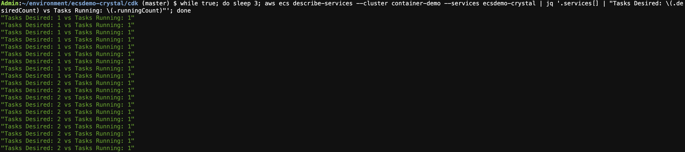

#### 부하 테스트 출력으로 작업

이제 서비스가 자동 확장되는 것을 보았으므로 실행 중인 while 루프를 중지하겠습니다. 누르기만 하면control + c취소합니다.

부하 테스트를 취소할 시간입니다. 중지하려면 다음을 입력하십시오.control + c
참고: 애플리케이션 가용성을 보장하기 위해 서비스는 가능한 한 빨리 메트릭에 비례하여 확장되지만 더 점진적으로 축소됩니다. 자세한 내용은선적 서류 비치

콘솔

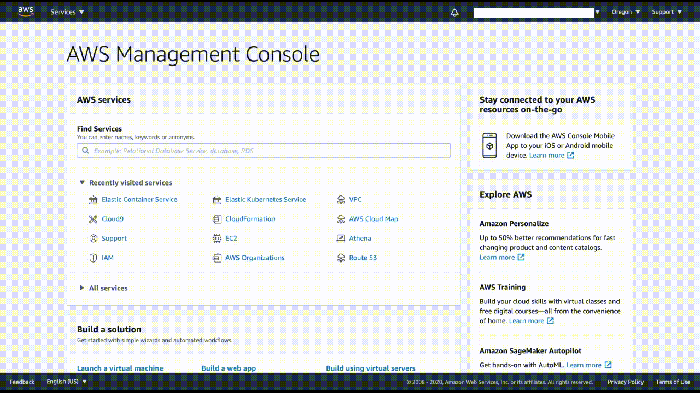

</div>
</details>

### ecs-cli Fargate 모드

<details>
<summary>ecs-cli Fargate/EC2 모드</summary>
<div markdown="1">

Crystal Backend API를 불러오겠습니다!

크리스탈 애플리케이션 배포:

```
cd ~/environment/ecsdemo-crystal
envsubst < ecs-params.yml.template >ecs-params.yml

ecs-cli compose --project-name ecsdemo-crystal service up \
    --create-log-groups \
    --private-dns-namespace service \
    --enable-service-discovery \
    --cluster-config container-demo \
    --vpc $vpc
```

여기에서 디렉토리를 크리스탈 애플리케이션 코드 디렉토리로 변경합니다. NSenvsubst 명령 템플릿 ecs-params.yml현재 값으로 파일을 만듭니다. 그런 다음 ECS 클러스터에서 크리스탈 서비스를 시작합니다(기본 시작 유형은 Fargate).

참고: ecs-cli는 서비스 검색을 위한 프라이빗 dns 네임스페이스 및 Cloudwatch 로그의 로그 그룹 구축을 처리합니다.

실행 중인 컨테이너를 보고 나중에 사용할 수 있도록 작업 ID의 출력을 env 변수로 저장합니다.

```
ecs-cli compose --project-name ecsdemo-crystal service ps \
    --cluster-config container-demo

task_id=$(ecs-cli compose --project-name ecsdemo-crystal service ps --cluster-config container-demo | awk -F \/ 'FNR == 2 {print $2}')
```

하나의 작업을 등록해야 합니다.

연결 가능성 확인(브라우저에서 URL 열기):

```
alb_url=$(aws cloudformation describe-stacks --stack-name container-demo-alb --query 'Stacks[0].Outputs[?OutputKey==`ExternalUrl`].OutputValue' --output text)
echo "Open $alb_url in your browser"
```

이 명령은 수신 ALB의 URL을 조회하고 출력합니다. 클릭하여 열거나 브라우저에 복사하여 붙여넣을 수 있어야 합니다.

로그 보기:

```
# Referencing task id from above ps command
ecs-cli logs --task-id $task_id \
    --follow --cluster-config container-demo
```

로그를 보려면 이전 ps명령 에서 작업 ID를 찾아 이 명령에서 사용합니다. 작업의 로그를 따를 수도 있습니다.

작업 확장:

```
ecs-cli compose --project-name ecsdemo-crystal service scale 3 \
    --cluster-config container-demo
ecs-cli compose --project-name ecsdemo-crystal service ps \
    --cluster-config container-demo
```

이제 컨테이너가 3개의 가용 영역 모두에 고르게 분산되었음을 알 수 있습니다.

</div>
</details>

---

## 컴퓨팅 리소스를 정리합니다.

먼저 컴퓨팅 리소스를 정리하겠습니다.

서비스, ​​ALB, ECS 클러스터, VPC 등으로 시작하여 컴퓨팅 리소스를 삭제합니다.

```
cd ~/environment/ecsdemo-frontend

ecs-cli compose --project-name ecsdemo-crystal service rm --cluster-config container-demo
ecs-cli compose --project-name ecsdemo-nodejs service rm --cluster-config container-demo
ecs-cli compose --project-name ecsdemo-frontend service rm --delete-namespace --cluster-config container-demo

aws cloudformation delete-stack --stack-name container-demo-alb
aws cloudformation wait stack-delete-complete --stack-name container-demo-alb
aws cloudformation delete-stack --stack-name container-demo
```

## 우리는 무엇을 성취했는가
우리는 다음을 가지고 있습니다:

업계 모범 사례를 사용하여 3계층 다중 언어 응용 프로그램 배포
CloudWatchLogs에 대한 각 마이크로 서비스의 중앙 집중식 로그
CloudFormation을 사용하여 코드로서의 인프라 구성
ecs-cli를 사용하여 기본 제공되는 AWS 모범 사례를 사용하여 배포
구성, 관리, 패치 또는 재부팅을 위해 단일 서버를 배포하지 않았습니다!

