# AMAZON ECS 클러스터 용량 공급자

- [도구 설치 및 구성](#도구-설치-및-구성)

- [환경 구축](#환경-구축)

- [용량 제공자 입문서](#용량-제공자-입문서)

- [FARGATE 용량 공급자 전략 배포](#fargate-용량-공급자-전략-배포)

- [ECS 클러스터 AUTO SCALING 배포](#ecs-클러스터-auto-scaling-배포)

- [EC2 스팟 용량 공급자 배포](#ec2-스팟-용량-공급자-배포)

- [CLEAN UP](#clean-up)

이 장에서는 용량 공급자가 EC2 지원 작업에 대한 Autoscaling을 관리하는 데 어떻게 도움을 줄 수 있는지와 Fargate 스팟 및 EC2 스팟 인스턴스에서 작업을 실행하는 AWS에서 예비 컴퓨팅 용량을 활용하여 비용 절감을 구현하는 방법을 이해하게 될 것입니다. 클러스터에서 세 가지 용량 공급자 전략을 구현할 것입니다.

Fargate 지원 ECS 서비스의 경우 Fargate와 Fargate Spot 간의 혼합으로 해당 서비스를 배포하는 전략을 구현할 것입니다.

EC2 지원 ECS 서비스의 경우 서비스의 작업 수를 사용 가능한 용량 이상으로 늘려 Cluster Auto Scaling을 구현합니다. 이를 위해서는 ECS Cluster Autoscaling이 처리할 수요에 맞게 확장할 수 있는 백엔드 EC2 인프라가 필요합니다.

마지막으로 EC2 스팟 인스턴스에서 지원하는 두 번째 EC2 용량 공급자를 추가하고 온디맨드 및 스팟 EC2 인스턴스 모두에서 EC2 지원 서비스를 확장합니다. 이를 통해 클러스터 자동 확장이 기본 인프라의 확장을 처리하는 동안 서비스 비용을 효과적으로 확장할 수 있습니다.

시작하자!

## 도구 설치 및 구성

Cloud9 작업 영역에서 다음 명령을 실행합니다.

설치 및 설정 전제 조건

```
# Install prerequisite packages
sudo yum -y install jq nodejs python36

# Setting CDK Version
export AWS_CDK_VERSION="1.41.0"

# Install aws-cdk
npm install -g --force aws-cdk@$AWS_CDK_VERSION

# Install cdk packages
pip3 install --user --upgrade aws-cdk.core==$AWS_CDK_VERSION \
aws-cdk.aws_ecs_patterns==$AWS_CDK_VERSION \
aws-cdk.aws_ec2==$AWS_CDK_VERSION \
aws-cdk.aws_ecs==$AWS_CDK_VERSION \
aws-cdk.aws_servicediscovery==$AWS_CDK_VERSION \
aws-cdk.aws_iam==$AWS_CDK_VERSION \
aws-cdk.aws_efs==$AWS_CDK_VERSION \
aws-cdk.aws_autoscaling==$AWS_CDK_VERSION \
aws-cdk.aws_ssm==$AWS_CDK_VERSION \
awscli \
awslogs

# Setting environment variables required to communicate with AWS API's via the cli tools
echo "export AWS_DEFAULT_REGION=$(curl -s 169.254.169.254/latest/dynamic/instance-identity/document | jq -r .region)" >> ~/.bashrc
echo "export AWS_REGION=\$AWS_DEFAULT_REGION" >> ~/.bashrc
echo "export AWS_ACCOUNT_ID=$(aws sts get-caller-identity --query Account --output text)" >> ~/.bashrc
source ~/.bashrc
```

## 환경 구축

Cloud9 작업 영역에서 다음 명령을 실행합니다.

ECS에 대한 서비스 연결 역할 생성:

```
aws iam get-role --role-name "AWSServiceRoleForECS" || aws iam create-service-linked-role --aws-service-name "ecs.amazonaws.com"
```

플랫폼 리포지토리 복제
서비스 저장소를 복제합니다.

```
cd ~/environment
git clone https://github.com/brentley/container-demo
git clone https://github.com/adamjkeller/ecsdemo-capacityproviders
```

플랫폼 구축
먼저 프론트엔드 서비스가 실행될 환경을 구축해야 합니다. 우리가 만들고 있는 것에 대한 자세한 내용은 여기에서 코드를 검토할 수 있습니다.플랫폼.

```
cd ~/environment/container-demo/cdk
cdk context --clear && cdk deploy --require-approval never
```

## 용량 제공자 입문서
개요
Amazon ECS 클러스터 용량 공급자는 작업에 사용할 인프라를 결정합니다. 각 클러스터에는 하나 이상의 용량 공급자와 선택적 기본 용량 공급자 전략이 있습니다. 용량 공급자 전략은 작업이 용량 공급자 간에 분산되는 방식을 결정합니다. 작업을 실행하거나 서비스를 생성할 때 클러스터의 기본 용량 공급자 전략을 사용하거나 클러스터의 기본 전략을 재정의하는 용량 공급자 전략을 지정할 수 있습니다.

자세한 내용은, 공식 AWS 설명서를 확인하십시오.

개념
용량 공급자는 ECS Fargate 작업 및 ECS EC2 지원 작업에 사용할 수 있습니다.

Fargate 용량 공급자를 사용하면 Amazon ECS 작업에서 Fargate 및 Fargate 스팟 용량을 모두 사용할 수 있습니다. Fargate Spot은 여분의 컴퓨팅 용량을 사용 하며 Fargate와 비교하여 최대 70% 절감 효과를 제공 합니다 . AWS에 다시 용량이 필요하면 2분 경고와 함께 작업이 중단됩니다. Fargate Spot을 사용하면 적은 비용으로 중단 허용 Amazon ECS 작업을 실행할 수 있습니다. 자세한 내용은,공식 AWS 설명서를 확인하십시오.

EC2 용량 공급자의 Amazon ECS를 사용하면 고객이 Cluster Auto Scaling을 사용할 수 있으므로 고객의 초점이 백엔드 인프라 관리에서 애플리케이션 지원으로 전환될 수 있습니다. EC2 용량 제공업체를 통해 고객은 다른 Auto Scaling 그룹에 작업을 분산할 수도 있습니다. 예를 들어 주문형 Auto Scaling 그룹과 EC2 스팟 인스턴스로 구성된 Auto Scaling 그룹에 작업을 분산할 수 있습니다. 자세한 내용은,공식 AWS 설명서를 확인하십시오.

## FARGATE 용량 공급자 전략 배포
CDK
기존 클러스터에서 Fargate 용량 공급자 활성화
먼저 Fargate 용량 공급자를 활성화하도록 ECS 클러스터를 업데이트합니다. 클러스터가 이미 존재하기 때문에 현재 기존 클러스터의 콘솔을 통해 수행할 수 없으므로 CLI를 통해 수행합니다.

AWS CLI를 사용하여 다음 명령을 실행합니다.

```
aws ecs put-cluster-capacity-providers \
--cluster container-demo \
--capacity-providers FARGATE FARGATE_SPOT \
--default-capacity-provider-strategy \
capacityProvider=FARGATE,weight=1,base=1 \
capacityProvider=FARGATE_SPOT,weight=4
```

이 명령을 사용하여 Fargate 및 Fargate 스팟 용량 공급자를 ECS 클러스터에 추가합니다. 각 매개변수별로 분류해 보겠습니다.

--cluster: 용량 공급자 전략을 업데이트하려는 클러스터 이름을 전달하기만 하면 됩니다.
--capacity-providers: 여기에서 클러스터에서 활성화하려는 용량 공급자를 전달합니다. EC2 지원 ECS 작업을 사용하지 않기 때문에 이 전에 클러스터 용량 공급자를 생성할 필요가 없습니다. 하지만 Fargate를 사용할 때는 두 가지 옵션만 있습니다.
--default-capacity-provider-strategy: 클러스터에서 기본 전략을 설정하는 것입니다. 즉, 작업 또는 서비스가 전략 및 시작 유형 설정 없이 클러스터에 배포되면 기본값이 됩니다. 더 나은 이해를 위해 기본/무게를 분해해 보겠습니다.
기본 값은 지정된 용량 공급자에서 실행할 최소한의 작업 수를 지정합니다. 용량 공급자 전략에서 하나의 용량 공급자만 기준을 정의할 수 있습니다.

가중치 값은 지정된 용량 공급자를 사용해야 하는 시작된 총 작업 수의 상대적 백분율을 지정합니다. 예를 들어 두 개의 용량 공급자가 포함된 전략이 있고 둘 다 가중치가 1인 경우 기본이 충족되면 작업이 두 개의 용량 공급자에 균등하게 분할됩니다. 동일한 논리를 사용하여 capacityProviderA에 가중치를 1로 지정하고 capacityProviderB에 가중치를 4로 지정하면 capacityProviderA를 사용하여 실행되는 모든 하나의 작업에 대해 네 개의 작업이 capacityProviderB를 사용합니다.

우리가 실행한 명령에서 우리는 최소 1개의 Fargate 작업을 기본으로 하고 그 후에는 Fargate 전략을 사용하는 모든 작업에 대해 4개의 작업이 Fargate Spot을 사용한다고 명시하고 있습니다.

다음으로 서비스 리포지토리와 fargate디렉터리로 이동해 보겠습니다 . 여기에서 나머지 작업을 수행합니다.

```
cd ~/environment/ecsdemo-capacityproviders/fargate
```

애플리케이션을 만나보세요
우리가 배포하는 응용 프로그램은 클러스터에서 실행 중인 작업과 사용 중인 공급자를 반환하는 간단한 API입니다. 마지막으로 애플리케이션은 우리가 착륙한 컨테이너의 ARN과 사용 중인 공급자를 알려줍니다. 실행 중인 전략을 실시간으로 볼 수 있는 간단한 애플리케이션입니다.

다음은 애플리케이션을 배포한 후 로드 밸런서 URL에 도달했을 때 표시되는 내용입니다.

```
{"ALL_TASKS":{"arn:aws:ecs:us-west-2:123456789012:task/418624db-7260-4ba8-8704-4b057982b571":"FARGATE_SPOT","arn:aws:ecs:us-west-2:123456789012:task/722e89d9-ad20-43ff-8f1c-14f532cbf197":"FARGATE_SPOT","arn:aws:ecs:us-west-2:123456789012:task/73f5e189-ffed-4e3c-ba47-71b37faf2427":"FARGATE_SPOT","arn:aws:ecs:us-west-2:123456789012:task/9dd917d2-34fd-439b-b11f-10b3d7cf9e33":"FARGATE_SPOT","arn:aws:ecs:us-west-2:123456789012:task/a2c3e7f9-0609-4dbb-9a66-cc35a612d821":"FARGATE_SPOT","arn:aws:ecs:us-west-2:123456789012:task/b3c05d52-bc25-4e86-aa52-48da5e03cefa":"FARGATE_SPOT","arn:aws:ecs:us-west-2:123456789012:task/ce7072f1-7c9e-474b-b56b-daf7f3812f05":"FARGATE","arn:aws:ecs:us-west-2:123456789012:task/cf9221af-2de4-4902-92e7-13ede592fbb5":"FARGATE","arn:aws:ecs:us-west-2:123456789012:task/d238d331-fed7-454a-a220-35e2abd11696":"FARGATE","arn:aws:ecs:us-west-2:123456789012:task/de884884-5f84-4e09-ab1e-78e56c5a57d8":"FARGATE"},"MY_ARN":"arn:aws:ecs:us-west-2:123456789012:task/418624db-7260-4ba8-8704-4b057982b571","MY_STRATEGY":"FARGATE_SPOT"}
```

이전 서비스와 마찬가지로 CDK를 사용하여 배포합니다. 계속해서 배포한 다음 코드를 자세히 살펴보고 검토해 보겠습니다.

배포
제안된 변경 사항 검토:

```
cdk diff
```

서비스 배포

```
cdk deploy --require-approval never
```

코드 검토
 뛰어들자
배포 후
배포가 완료되면 로드 밸런서 URL을 복사하여 브라우저에 붙여넣습니다. 출력은 다음과 같아야 합니다.

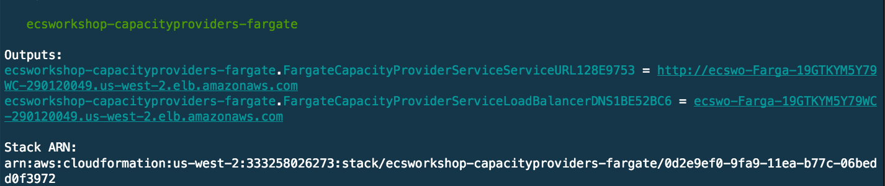

브라우저에서 URL로 직접 이동하여 json 응답을 볼 수 있습니다. 또는 명령줄에서 보고 싶다면 로드 밸런서를 컬링할 수 있습니다.

다음은 명령줄에서 출력을 보기 위해 실행해야 하는 내용입니다.

```
curl -s <paste-load-balancer-url-here> | jq
```

명령줄 출력은 다음과 같아야 합니다.

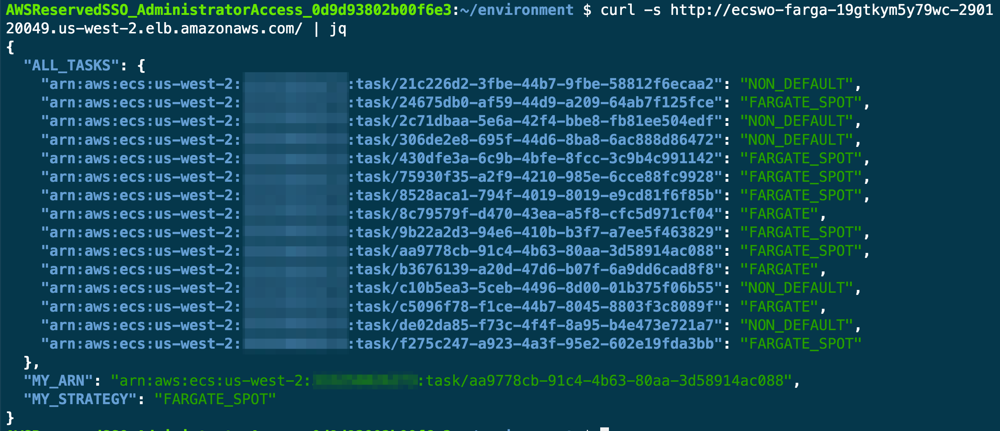

브라우저에서 또는 명령줄을 사용하든 관계없이 계속해서 몇 번 새로고침하십시오. 각각의 새 요청에서 로드 밸런서를 통해 다른 컨테이너로 라우팅되는 것을 확인해야 합니다. 응답하는 컨테이너는 Fargate 또는 Fargate 스팟 용량 공급자에서 실행됩니다.

클러스터 관리자의 관점에서 다음 CLI 명령을 사용하여 작업이 용량 공급자 간에 어떻게 분산되어 있는지 쉽게 확인할 수도 있습니다.

```
aws ecs describe-tasks --cluster container-demo \
                       --tasks \
                         $(aws ecs list-tasks --cluster container-demo --query 'taskArns[]' --output text) \
                       --query 'sort_by(tasks,&capacityProviderName)[].{ 
                                          Id: taskArn, 
                                          AZ: availabilityZone, 
                                          CapacityProvider: capacityProviderName, 
                                          LastStatus: lastStatus, 
                                          DesiredStatus: desiredStatus}' \
                        --output table
```

출력은 다음과 유사합니다.

```
---------------------------------------------------------------------------------------------------------------------------------------------------
|                                                                  DescribeTasks                                                                  |
+------------+-------------------+----------------+--------------------------------------------------------------------------------+--------------+
|     AZ     | CapacityProvider  | DesiredStatus  |                                      Id                                        | LastStatus   |
+------------+-------------------+----------------+--------------------------------------------------------------------------------+--------------+
|  us-west-2a|  FARGATE          |  RUNNING       |  arn:aws:ecs:us-west-2:012345678910:task/00fd41c9-6b7b-41a3-8b37-fb2404b58cb8  |  RUNNING     |
|  us-west-2b|  FARGATE          |  RUNNING       |  arn:aws:ecs:us-west-2:012345678910:task/56e5e043-be66-4d18-ac52-7156c2eadd6c  |  RUNNING     |
|  us-west-2c|  FARGATE          |  RUNNING       |  arn:aws:ecs:us-west-2:012345678910:task/9dad79c0-fd66-4785-a11e-a6b4c586157b  |  RUNNING     |
|  us-west-2b|  FARGATE_SPOT     |  RUNNING       |  arn:aws:ecs:us-west-2:012345678910:task/36a51210-a869-4933-b028-c8ee9b3243dd  |  RUNNING     |
|  us-west-2c|  FARGATE_SPOT     |  RUNNING       |  arn:aws:ecs:us-west-2:012345678910:task/3a864ba5-fe60-42f8-83b2-4de8838a99ac  |  RUNNING     |
|  us-west-2a|  FARGATE_SPOT     |  RUNNING       |  arn:aws:ecs:us-west-2:012345678910:task/665ecef8-c0a5-45db-8fcf-f06c02cfe16b  |  RUNNING     |
|  us-west-2c|  FARGATE_SPOT     |  RUNNING       |  arn:aws:ecs:us-west-2:012345678910:task/69361c15-f76d-4765-b1c9-236f1124c28f  |  RUNNING     |
|  us-west-2a|  FARGATE_SPOT     |  RUNNING       |  arn:aws:ecs:us-west-2:012345678910:task/dd0aa6dc-3a5e-4692-9e10-f5d7a169c4d6  |  RUNNING     |
|  us-west-2c|  FARGATE_SPOT     |  RUNNING       |  arn:aws:ecs:us-west-2:012345678910:task/e60a98b4-adca-4f38-98ab-bb44c4890455  |  RUNNING     |
|  us-west-2a|  FARGATE_SPOT     |  RUNNING       |  arn:aws:ecs:us-west-2:012345678910:task/f3e4db9d-effb-41c6-bf9e-527a5cc58603  |  RUNNING     |
+------------+-------------------+----------------+--------------------------------------------------------------------------------+--------------+
```

Fargate Spot에 대한 모든 정보를 확인하려면 이 블로그 게시물

검토
워크샵의 이 섹션에서 수행한 작업은 다음과 같습니다.

ECS 클러스터 기본 용량 제공자 전략을 업데이트하여 시작 유형이나 용량 제공자 전략이 설정되지 않은 경우 Fargate 및 Fargate 스팟의 기본 조합을 사용하여 서비스가 배포됩니다.
여러 작업이 포함된 서비스를 배포했으며 용량 공급자가 시작할 Fargate 작업 유형(Fargate 대 Fargate 스팟)을 선택하는 것을 보았습니다.
이것은 단지 예일 뿐이지만 많은 실제 사용 사례로 해석될 수 있습니다. Fargate와 Fargate Spot 간에 기본과 가중치를 설정하기만 하면 일상적인 워크로드에서 Fargate Spot의 비용 절감 효과를 활용할 수 있습니다. 물론 Spot 작업은 언제든지 종료될 수 있다는 점을 이해하는 것이 중요합니다(자세한 내용은공식 AWS 설명서를 확인하십시오.), 용량 요구 사항이 변경될 때. 그렇기 때문에 기본 전략을 Fargate와 Fargate Spot을 혼합하여 설정하여 Spot 작업이 종료된 경우에도 Fargate에서 원하는 최소한의 작업이 계속 실행되도록 합니다.
우리가 선택한 설정은 전략을 혼합하여 사용하는 것이었습니다(Fargate 및 Fargate Spot). 또한 하나의 전략(Fargate 또는 Fargate 스팟)을 고수할 수 있으며 이는 서비스를 배포할 때 또는 클러스터의 기본값으로 정의됩니다.

대청소
cdk 명령을 실행하여 배포한 서비스(및 종속 구성 요소)를 삭제합니다.

```
cdk destroy -f
```

그런 다음 콘솔에서 ECS 클러스터로 돌아갑니다. 오른쪽 상단에서 을 선택 Update Cluster합니다.

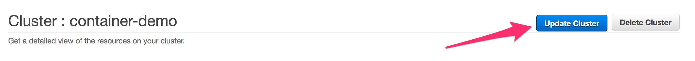

에서 더 이상 제거할 전략이 없을 때까지 모든 전략 옆에 있는 을 Default capacity provider strategy클릭합니다 x. 완료했으면 을(를) 클릭 Update합니다.

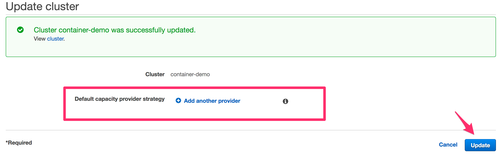

다음으로
다음 섹션에서는 다음을 수행합니다.

클러스터에 EC2 인스턴스 추가
EC2를 기본 용량 공급자로 사용하도록 전략 변경
클러스터 Auto Scaling 활성화
서비스를 배포하고 원하는 수가 현재 용량을 초과하도록 서비스에 대한 로드를 트리거하고 클러스터 자동 크기 조정이 작동하는 것을 지켜보십시오.

## ECS 클러스터 AUTO SCALING 배포
CDK
클러스터에서 EC2 용량 활성화
플랫폼을 만들고 관리하는 리포지토리로 다시 이동합니다.

```
cd ~/environment/container-demo/cdk
```

app.py에서 코드 섹션 아래에 있는 코드의 주석 처리를 제거합니다 ###### CAPACITY PROVIDERS SECTION #####. 다음과 같이 표시되어야 합니다.

```
        ###### CAPACITY PROVIDERS SECTION #####
        # Adding EC2 capacity to the ECS Cluster
        self.asg = self.ecs_cluster.add_capacity(
            "ECSEC2Capacity",
            instance_type=aws_ec2.InstanceType(instance_type_identifier='t3.small'),
            min_capacity=0,
            max_capacity=10
        )
        
        core.CfnOutput(self, "EC2AutoScalingGroupName", value=self.asg.auto_scaling_group_name, export_name="EC2ASGName")
        ##### END CAPACITY PROVIDER SECTION #####
```

이제 cdk를 사용하여 클러스터를 업데이트합니다.

```
cdk deploy --require-approval never
```

이 작은 코드 섹션을 추가하면 클러스터에 EC2 인스턴스를 추가하는 데 필요한 모든 구성 요소가 생성됩니다. 여기에는 Auto Scaling 그룹, 시작 구성, ECS Optimized AMI 등이 포함됩니다. 자세한 내용은 다음을 참조하십시오.공식 cdk 문서.

배포가 완료되면 다시 용량 공급자 데모 리포지토리로 이동하여 클러스터 자동 크기 조정 설정 작업을 시작하겠습니다.

```
cd ~/environment/ecsdemo-capacityproviders/ec2
```

클러스터 Auto Scaling 활성화
이전 섹션에서 했던 것처럼 다시 한 번 용량 공급자를 만들 것입니다. 이 시간; 그러나 EC2에서 지원하는 용량 공급자가 될 것이며 관리형 클러스터 자동 크기 조정을 활성화할 것입니다. 이제 해보자.

```
# Get the required cluster values needed when creating the capacity provider
export asg_name=$(aws cloudformation describe-stacks --stack-name ecsworkshop-base --query 'Stacks[*].Outputs[?ExportName==`EC2ASGName`].OutputValue' --output text)
export asg_arn=$(aws autoscaling describe-auto-scaling-groups --auto-scaling-group-names $asg_name --query 'AutoScalingGroups[].AutoScalingGroupARN' --output text)
export capacity_provider_name=$(echo "EC2$(date +'%s')")
# Creating capacity provider
aws ecs create-capacity-provider \
     --name $capacity_provider_name \
     --auto-scaling-group-provider autoScalingGroupArn="$asg_arn",managedScaling=\{status="ENABLED",targetCapacity=80\},managedTerminationProtection="DISABLED" \
     --region $AWS_REGION
```

이전에 워크샵에서 생성했기 때문에 용량 공급자가 이미 있다는 오류가 발생하면 다음 단계로 이동하십시오.

클러스터 Auto Scaling이 활성화된 용량 공급자를 생성하려면 먼저 Auto Scaling 그룹을 생성해야 합니다. ECS 클러스터에 EC2 용량을 추가할 때 이 섹션의 앞부분에서 이 작업을 수행했습니다. 용량 공급자를 생성하는 다음 명령에 필요한 Auto Scaling 그룹 세부 정보를 얻기 위해 몇 가지 cli 호출을 실행합니다.

다음 명령은 AWS CLI를 통해 용량 공급자를 생성하는 것입니다. 매개변수를 살펴보고 그 목적이 무엇인지 설명하겠습니다.

--name: 이것은 우리가 만들고 있는 용량 공급자의 사람이 읽을 수 있는 이름입니다.

--auto-scaling-group-provider: 꽤 많이 있습니다. 하나씩 풀어보겠습니다.

    - autoScalingGroupArn: 클러스터 Autoscaler가 사용할 Auto Scaling 그룹의 ARN입니다.
    - managedScaling: 클러스터 Auto Scaling을 활성화/비활성화하는 곳입니다. 또한 targetCapacity클러스터 활용의 어느 시점에서 자동 스케일러가 조치를 취하기를 원하는지 결정하는 를 설정 합니다.
    - managedTerminationProtection: EC2 인스턴스가 종료되기 전에(축소 작업의 경우) Auto scaler가 작업을 실행하지 않는 인스턴스만 종료하도록 하려면 이 파라미터를 활성화합니다.
이제 용량 공급자가 생성되었으므로 이를 ECS 클러스터와 연결해야 합니다.

```
aws ecs put-cluster-capacity-providers \
--cluster container-demo \
--capacity-providers $capacity_provider_name \
--default-capacity-provider-strategy capacityProvider=$capacity_provider_name,weight=1,base=1
```

클러스터 업데이트가 적용되었음을 나타내는 json 응답을 받게 됩니다. 이제 서비스를 배포하고 이 기능을 테스트할 시간입니다!

EC2 지원 ECS 서비스 배포
먼저, 이전에 했던 것처럼 diff현재 존재하는 것과 cdk를 통해 배포될 것에 대해 실행할 것입니다.

```
cdk diff
```

변경 사항을 검토하면 아직 배포되지 않았으므로 이 서비스에 대해 생성되는 모든 새 리소스가 표시되어야 합니다. 그런 점에서 배포해 보겠습니다!

```
cdk deploy --require-approval never
```

서비스가 배포되면 로드 밸런서 URL 출력을 기록해 둡니다. 복사하여 브라우저에 붙여넣습니다.

현재 배포 검사
위에서 한 작업은 하나의 작업을 실행하는 서비스를 배포하는 것입니다. 클러스터에 등록된 현재 EC2 인스턴스로는 서비스를 실행할 수 있는 충분한 용량이 있습니다.

콘솔로 이동하여 컨테이너 데모 클러스터를 선택합니다. ECS Instances 탭을 클릭하고 현재 용량을 검토합니다.

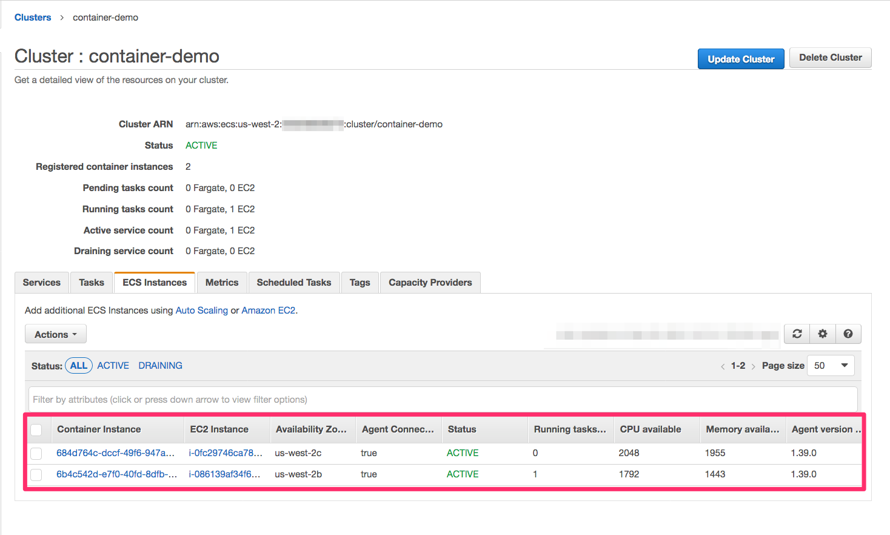

보시다시피 몇 가지 작업을 더 지원할 수 있는 충분한 용량이 있습니다. 그러나 현재 실행할 수 있는 용량보다 더 많은 작업을 실행해야 하는 경우에는 어떻게 될까요?

클러스터의 운영자로서 우리는 작업을 실행하는 백엔드 EC2 인프라를 확장하는 방법에 대해 생각해야 합니다. ).
우리는 또한 응용 프로그램을 확장하는 데 주의해야 합니다. 애플리케이션이 최종 사용자의 요구를 충족할 수 있도록 서비스에서 자동 크기 조정을 활성화하는 것이 좋습니다.
확장은 두 곳에서 고려해야 하기 때문에 EC2 지원 클러스터를 운영할 때 문제가 됩니다. 클러스터 자동 크기 조정이 활성화되면 이제 오케스트레이터가 애플리케이션의 요구 사항을 충족하도록 백엔드 인프라를 확장합니다. 이를 통해 EC2 지원 작업이 필요한 팀이 인프라 확장에 대해 생각하는 대신 "응용 프로그램 우선"을 생각할 수 있습니다.

현재 사용 가능한 용량 이상으로 서비스 확장
라이브로 하겠습니다! 배포 구성( ~/environment/ecsdemo-capacityproviders/ec2/app.py) 으로 돌아가서 다음을 수행합니다.

```
desired_count 매개변수를 에서 1로 변경합니다 10.

        self.load_balanced_service = aws_ecs_patterns.ApplicationLoadBalancedEc2Service(
            self, "EC2CapacityProviderService",
            service_name='ecsdemo-capacityproviders-ec2',
            cluster=self.base_platform.ecs_cluster,
            cpu=256,
            memory_limit_mib=512,
            #desired_count=1,
            desired_count=10,
            public_load_balancer=True,
            task_image_options=self.task_image,
        )
```

이제 변경 사항을 저장하고 배포해 보겠습니다.

```
cdk deploy --require-approval never
```

우리가 한 일과 무슨 일이 일어나고 있는지 살펴보겠습니다.

서비스에 대한 작업 수를 1에서 10으로 수정하고 있습니다. 이것은 클러스터에 현재 존재하는 용량 이상으로 확장될 것입니다.
클러스터에 할당된 용량 공급자는 전체 클러스터 리소스의 목표 용량이 80% 이상임을 인식합니다. 그러면 EC2를 확장하여 용량을 80% 이하로 되돌리는 Autoscaling 이벤트가 트리거됩니다.
컨테이너 데모 클러스터에 대한 ECS 콘솔로 이동하면 실행을 시도하는 10개의 작업이 있음을 알 수 있습니다.

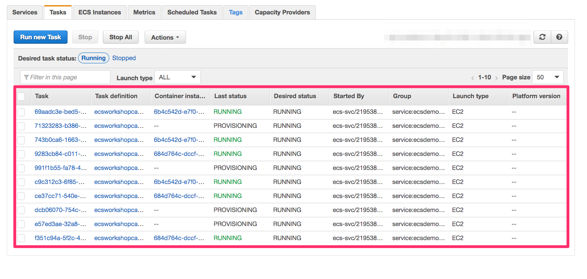

다음으로 ECS Instances탭 을 선택하면 실행 중인 인스턴스가 두 개뿐임을 알 수 있습니다. 상기 찾고 Pending tasks count그러나, 우리는 일정을 기다리고 4 개 가지 작업이 있음을 참조하십시오. 이는 리소스 가용성이 부족하기 때문입니다.

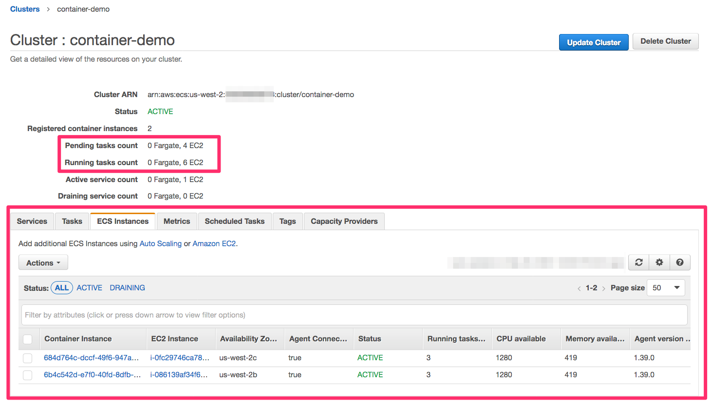

다음 몇 분 동안 배후에서 대상 추적 조정 정책이 Cloudwatch 경보를 트리거하여 Auto Scaling 그룹이 확장될 수 있도록 합니다. 잠시 후 새 EC2 인스턴스가 클러스터에 등록되는 것을 볼 수 있습니다. 그런 다음 해당 인스턴스에 대한 작업이 예약됩니다.

완료되면 콘솔은 이제 아래와 같이 보일 것입니다.

모든 작업은 RUNNING상태에 있어야 합니다.

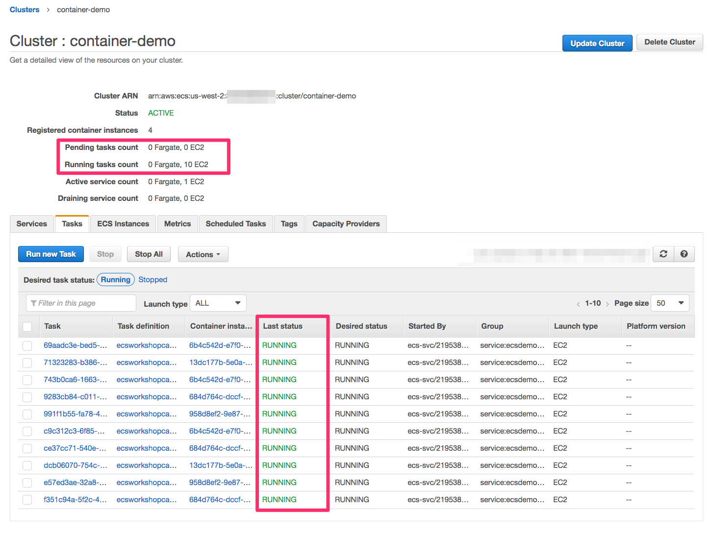

ECS 클러스터에 더 많은 EC2 인스턴스가 등록됩니다.

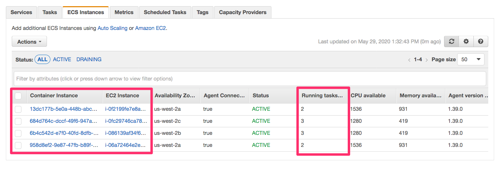

서비스를 다시 하나로 축소
클러스터 자동 확장이 백엔드 EC2 인프라를 확장하는 것을 보았으므로 이제 카운트를 다시 1로 줄이고 인프라가 다시 축소되는지 살펴보겠습니다.

라이브로 하겠습니다! 배포 구성( ~/environment/ecsdemo-capacityproviders/ec2/app.py) 으로 돌아가서 다음을 수행합니다.

desired_count 매개변수를 에서 10로 변경합니다 1.

```
        self.load_balanced_service = aws_ecs_patterns.ApplicationLoadBalancedEc2Service(
            self, "EC2CapacityProviderService",
            service_name='ecsdemo-capacityproviders-ec2',
            cluster=self.base_platform.ecs_cluster,
            cpu=256,
            memory_limit_mib=512,
            desired_count=1,
            #desired_count=10,
            public_load_balancer=True,
            task_image_options=self.task_image,
        )
```

이제 변경 사항을 저장하고 배포해 보겠습니다.

```
cdk deploy --require-approval never
```

그게 다야 이제 다음 몇 분 동안 클러스터 Auto Scaling은 용량 요구 사항을 훨씬 초과했음을 인식하고 EC2 인스턴스를 다시 축소합니다.

검토
워크숍의 이 섹션에서 우리가 달성한 것은 다음과 같습니다.

관리형 클러스터 Auto Scaling이 활성화된 EC2 지원 작업에 대한 용량 공급자를 생성했습니다.
우리는 하나의 작업과 충분한 백엔드 용량으로 서비스를 배포한 다음 10개의 작업으로 확장했습니다. 이로 인해 관리형 클러스터 Auto Scaling이 확장 이벤트를 트리거하여 백엔드 인프라가 작업의 가용성 요구 사항을 충족하도록 했습니다.
그런 다음 서비스를 다시 1로 축소하고 클러스터 Auto Scaling이 EC2 인스턴스를 다시 축소하여 우리가 과도하게 프로비저닝되지 않았는지 확인했습니다.
다음으로
다음 섹션에서는 다음을 수행합니다.

클러스터에 EC2 스팟 인스턴스를 추가합니다.
스팟 인스턴스에 대한 용량 공급자를 생성한 다음 새 용량 공급자에서 Cluster Auto Scaling을 활성화합니다.
기본 클러스터 용량 공급자 전략에 새 용량 공급자를 추가합니다.
온디맨드 및 스팟 용량 제공자 모두에 걸쳐 작업을 분산하는 새로운 전략으로 서비스를 배포하십시오. 이 전략을 통해 스팟 인스턴스를 사용하여 서비스를 확장하면서 비용을 최적화합니다.
서비스를 확장 및 축소하여 전략이 용량 공급자 간에 작업을 분산하고 클러스터 자동 크기 조정이 기본 EC2 인스턴스 크기 조정을 처리하는 방법을 확인합니다.

## EC2 스팟 용량 공급자 배포
CDK
EC2 스팟 인스턴스
Amazon EC2 스팟 인스턴스온디맨드 요금에 비해 최대 90% 할인된 예비 EC2 용량입니다. 스팟 인스턴스를 사용하면 AWS 클라우드에서 컴퓨팅 비용을 최적화하고 동일한 예산으로 애플리케이션의 처리량을 최대 10배까지 확장할 수 있습니다. 스팟 인스턴스와 온디맨드 인스턴스의 유일한 차이점은 EC2에 다시 용량이 필요할 때 스팟 인스턴스가 중단되고 2분 경고가 표시될 수 있다는 것입니다.

컨테이너화된 워크로드는 상태 비저장 및 내결함성이 있어 스팟 인스턴스에서 실행하기에 매우 적합합니다. 스팟 인스턴스 중단 알림을 자동으로 포착하도록 Amazon ECS 에이전트를 구성할 수 있으므로 인스턴스가 중단될 경우 로 설정됩니다 DRAINING. 컨테이너 인스턴스가 로 설정 DRAINING되면 Amazon ECS는 컨테이너 인스턴스에 배치하기 위해 새 작업이 예약되는 것을 방지합니다. RUNNING상태 에 있는 컨테이너 인스턴스의 서비스 작업 은 서비스의 배포 구성 매개변수 minimumHealthyPercent및 에 따라 중지되고 대체됩니다 maximumPercent. 자세한 내용은컨테이너 인스턴스 드레이닝 그리고 스팟 인스턴스 사용 선적 서류 비치.

스팟 인스턴스는 예비 EC2 용량이므로 스팟 인스턴스 가용성은 EC2 용량에 대한 수요 및 공급 추세에 따라 변동합니다. 스팟 인스턴스를 사용할 때 대상 용량을 프로비저닝하고 유지할 수 있는 주요 모범 사례는 인스턴스 유형을 유연하게 하는 것이므로 중단된 스팟 인스턴스를 확장하고 사용 가능한 다른 풀의 다른 인스턴스로 교체하기 위해 여러 스팟 용량 풀의 용량을 프로비저닝할 수 있습니다. 예비 용량. 스팟 용량 풀은 인스턴스 유형(예: m5.large), 운영 체제 및 가용 영역이 동일한 사용되지 않은 EC2 인스턴스 세트입니다.

인스턴스 유형 유연성 모범 사례는 EC2 Auto Scaling 그룹을 사용하여 매우 간단하게 달성할 수 있습니다. 여러 인스턴스 유형 및 구매 옵션 결합단일 Auto Scaling 그룹에서 SpotAllocationStrategy 를 사용하여 EC2 Auto Scaling은 시작하는 인스턴스 수에 대해 최적의 용량으로 풀에서 인스턴스를 시작하여 실시간 용량 데이터를 활용합니다. 최적의 용량 풀에서 인스턴스를 선택하면 중단 가능성이 줄어듭니다. 고객이 성공적으로 사용하는 방법 에 대해 자세히 알아보려면 다음을 확인하십시오.capacity-optimized capacity-optimized이 블로그 게시물.

클러스터에서 EC2 스팟 용량 활성화
플랫폼을 만들고 관리하는 리포지토리로 다시 이동합니다.

```
cd ~/environment/container-demo/cdk
```

app.py에서 코드 섹션 아래에 있는 코드의 주석 처리를 제거합니다 ###### EC2 SPOT CAPACITY PROVIDER SECTION ######. 다음과 같이 표시되어야 합니다.

```
        ##### EC2 SPOT CAPACITY PROVIDER SECTION ######
        # As of today, AWS CDK doesn't support Launch Templates on the AutoScaling construct, hence it
        # doesn't support Mixed Instances Policy to combine instance types on Auto Scaling and adhere to Spot best practices
        # In the meantime, CfnLaunchTemplate and CfnAutoScalingGroup resources are used to configure Spot capacity
        # https://github.com/aws/aws-cdk/issues/6734

        self.ecs_spot_instance_role = aws_iam.Role(
            self, "ECSSpotECSInstanceRole",
            assumed_by=aws_iam.ServicePrincipal("ec2.amazonaws.com"),
            managed_policies=[
                aws_iam.ManagedPolicy.from_aws_managed_policy_name("service-role/AmazonEC2ContainerServiceforEC2Role"),
                aws_iam.ManagedPolicy.from_aws_managed_policy_name("service-role/AmazonEC2RoleforSSM")
                ]
        )
                #
        self.ecs_spot_instance_profile = aws_iam.CfnInstanceProfile(
            self, "ECSSpotInstanceProfile",
            roles = [
                    self.ecs_spot_instance_role.role_name
                ]
            )
                
        # This creates a Launch Template for the Auto Scaling group
        self.lt = aws_ec2.CfnLaunchTemplate(
            self, "ECSEC2SpotCapacityLaunchTemplate",
            launch_template_data={
                "instanceType": "m5.large",
                "imageId": aws_ssm.StringParameter.value_for_string_parameter(
                            self,
                            "/aws/service/ecs/optimized-ami/amazon-linux-2/recommended/image_id"),
                "securityGroupIds": [ x.security_group_id for x in self.ecs_cluster.connections.security_groups ],
                "iamInstanceProfile": {"arn": self.ecs_spot_instance_profile.attr_arn},

                # Here we configure the ECS agent to drain Spot Instances upon catching a Spot Interruption notice from instance metadata
                "userData": core.Fn.base64(
                    core.Fn.sub(
                        "#!/usr/bin/bash\n"
                        "echo ECS_CLUSTER=${cluster_name} >> /etc/ecs/ecs.config\n" 
                        "sudo iptables --insert FORWARD 1 --in-interface docker+ --destination 169.254.169.254/32 --jump DROP\n"
                        "sudo service iptables save\n"
                        "echo ECS_ENABLE_SPOT_INSTANCE_DRAINING=true >> /etc/ecs/ecs.config\n" 
                        "echo ECS_AWSVPC_BLOCK_IMDS=true >> /etc/ecs/ecs.config\n"  
                        "cat /etc/ecs/ecs.config",
                        variables = {
                            "cluster_name":self.ecs_cluster.cluster_name
                            }
                        )
                    )
                },
                launch_template_name="ECSEC2SpotCapacityLaunchTemplate")

        self.ecs_ec2_spot_mig_asg = aws_autoscaling.CfnAutoScalingGroup(
            self, "ECSEC2SpotCapacity",
            min_size = "0",
            max_size = "10",
            vpc_zone_identifier = [ x.subnet_id for x in self.vpc.private_subnets ],
            mixed_instances_policy = {
                "instancesDistribution": {
                    "onDemandAllocationStrategy": "prioritized",
                    "onDemandBaseCapacity": 0,
                    "onDemandPercentageAboveBaseCapacity": 0,
                    "spotAllocationStrategy": "capacity-optimized"
                    },
                "launchTemplate": {
                    "launchTemplateSpecification": {
                        "launchTemplateId": self.lt.ref,
                        "version": self.lt.attr_default_version_number
                    },
                    "overrides": [
                        {"instanceType": "m5.large"},
                        {"instanceType": "m5d.large"},
                        {"instanceType": "m5a.large"},
                        {"instanceType": "m5ad.large"},
                        {"instanceType": "m5n.large"},
                        {"instanceType": "m5dn.large"},
                        {"instanceType": "m3.large"},
                        {"instanceType": "m4.large"},
                        {"instanceType": "t3.large"},
                        {"instanceType": "t2.large"}
                    ]
                }
            }
        )
                
        core.Tag.add(self.ecs_ec2_spot_mig_asg, "Name", self.ecs_ec2_spot_mig_asg.node.path)   
        core.CfnOutput(self, "EC2SpotAutoScalingGroupName", value=self.ecs_ec2_spot_mig_asg.ref, export_name="EC2SpotASGName")     
```

이제 cdk를 사용하여 클러스터를 업데이트합니다.

```
cdk deploy --require-approval never
```

해당 코드 섹션을 추가하면 클러스터에 EC2 스팟 인스턴스를 추가하는 데 필요한 모든 구성 요소가 생성됩니다. 여기에는 혼합 인스턴스 유형이 있는 Auto Scaling 그룹, 시작 템플릿, ECS 최적화 AMI 등이 포함됩니다. AutoScaling CDK 구성은 아직 시작 템플릿을 지원하지 않으므로 혼합 인스턴스 유형이 있으므로 CloudFormation 구성을 사용하여 인프라를 정의하고 있습니다. . 시작 템플릿 지원을 포함하는 작업을 추적 중입니다.여기. 중요한 부분을 분해해 보겠습니다.

우리가 만들고 있음을 주목하십시오 템플릿 시작. Auto Scaling 그룹에서 인스턴스 유형과 구매 옵션을 결합하는 데 필요합니다.
시작 템플릿의 사용자 데이터에서 중단 알림을 수신할 때 스팟 컨테이너 인스턴스를 드레이닝하도록 ECS 에이전트를 구성하고 ECS_ENABLE_SPOT_INSTANCE_DRAINING=true있습니다.
Auto Scaling 그룹에서 혼합 인스턴스 정책을 정의하고 있습니다. 인스턴스 배포 시 EC2 스팟 인스턴스만 시작하고 capacity-optimized스팟 할당 전략을 사용하도록 Auto Scaling 그룹을 설정하고 있습니다 . 이렇게 하면 Auto Scaling이 시작하는 인스턴스 수에 대해 최적의 용량으로 스팟 용량 풀에서 인스턴스를 시작합니다. 이러한 방식으로 배포하면 예비 EC2 용량을 가장 효율적으로 사용하고 중단 가능성을 줄이는 데 도움이 됩니다.
이 overrides섹션에서는 ECS 클러스터에서 사용할 수 있는 10가지 다른 인스턴스 유형을 구성하고 있습니다. 이 숫자에 사용 중인 가용 영역 수를 곱하면 용량을 시작할 수 있는 스팟 용량 풀의 수가 제공됩니다(예: 3개의 AZ에 걸쳐 있는 경우 30개의 서로 다른 스팟 용량 풀에서 용량을 얻을 수 있음을 의미). 이렇게 하면 기능 프로비저닝이 최대화되고 필요한 스팟 용량이 유지됩니다(풀이 많을수록 좋음).
이번에는 온디맨드보다 더 큰 인스턴스 유형을 사용하고 있습니다(*.large 대 t3.small). 인스턴스가 더 큰 이유는 유연하게 적용할 더 많은 수의 인스턴스 유형을 선택할 수 있기 때문입니다(작은 크기는 t* 인스턴스 유형과 m3와 같은 구세대 인스턴스에서만 사용할 수 있습니다. m4 및 m5 인스턴스는 가장 작은 유형이 큼). 예측 가능한 조정 동작을 위해 ECS용 Auto Scaling 그룹을 생성할 때 동일한 크기의 인스턴스를 결합하는 것이 좋습니다.
Auto Scaling 그룹 혼합 인스턴스 정책에 우리 의 사용 사례에 완벽하게 맞는 인스턴스 유형 t2과 포함했습니다 t3. CPU 집약적 및/또는 프로덕션 사용 사례의 경우 t2 및 t3 인스턴스는 버스트 가능한 성능 인스턴스입니다. 기본적으로 T3 인스턴스는 에서 실행됩니다 unlimited mode. 즉, 워크로드가 지속적으로 인스턴스 기준 성능 이상으로 버스트되고 버스트 크레딧이 고갈되면 크레딧 잉여 요금이 발생합니다. T2 인스턴스 standard mode는 기본적으로 실행됩니다 . 즉, 버스트 크레딧이 고갈되면 CPU 사용률이 기준 수준으로 점차 낮아집니다. 버스트 가능한 성능 인스턴스에 대해 자세히 알아볼 수 있습니다.여기. 계정 수준에서 기본 설정을 수정할 수도 있습니다.modify-default-credit-specification CLI 명령.

배포가 완료되면 다시 용량 공급자 데모 리포지토리로 이동하여 클러스터 자동 크기 조정 설정 작업을 시작하겠습니다.

```
cd ~/environment/ecsdemo-capacityproviders/ec2
```

클러스터 Auto Scaling 활성화
이전 섹션에서 했던 것처럼 이번에는 방금 생성한 Spot Instances Auto Scaling 그룹에 대한 용량 공급자를 다시 생성합니다. 또한 여기에서 관리형 클러스터 자동 크기 조정을 활성화합니다. 이제 해보자.

```
# Get the required cluster values needed when creating the capacity provider
export spot_asg_name=$(aws cloudformation describe-stacks --stack-name ecsworkshop-base --query 'Stacks[*].Outputs[?ExportName==`EC2SpotASGName`].OutputValue' --output text)
export spot_asg_arn=$(aws autoscaling describe-auto-scaling-groups --auto-scaling-group-names $spot_asg_name --query 'AutoScalingGroups[].AutoScalingGroupARN' --output text)
export spot_capacity_provider_name=$(echo "EC2Spot$(date +'%s')")
# Creating capacity provider
aws ecs create-capacity-provider \
     --name $spot_capacity_provider_name \
     --auto-scaling-group-provider autoScalingGroupArn="$spot_asg_arn",managedScaling=\{status="ENABLED",targetCapacity=80\},managedTerminationProtection="DISABLED" \
     --region $AWS_REGION
```

클러스터 Auto Scaling이 활성화된 용량 공급자를 생성하려면 먼저 Auto Scaling 그룹을 생성해야 합니다. ECS 클러스터에 EC2 스팟 용량을 추가할 때 이 섹션의 앞부분에서 이 작업을 수행했습니다. 용량 공급자를 생성하는 다음 명령에 필요한 Auto Scaling 그룹 세부 정보를 얻기 위해 몇 가지 cli 호출을 실행합니다.

다음 명령은 AWS CLI를 통해 용량 공급자를 생성하는 것입니다. 매개변수를 살펴보고 그 목적이 무엇인지 설명하겠습니다.

--name: 이것은 우리가 만들고 있는 용량 공급자의 사람이 읽을 수 있는 이름입니다.

--auto-scaling-group-provider: 꽤 많이 있습니다. 하나씩 풀어보겠습니다.

autoScalingGroupArn: 클러스터 Autoscaler가 사용할 Auto Scaling 그룹의 ARN입니다.
managedScaling: 클러스터 Auto Scaling을 활성화/비활성화하는 곳입니다. 또한 targetCapacity클러스터 활용의 어느 시점에서 자동 스케일러가 조치를 취하기를 원하는지 결정하는 를 설정 합니다.
managedTerminationProtection: EC2 인스턴스가 종료되기 전에(축소 작업의 경우) Auto scaler가 작업을 실행하지 않는 인스턴스만 종료하도록 하려면 이 파라미터를 활성화합니다.
이제 새 용량 공급자가 생성되었으므로 이를 ECS 클러스터와 연결해야 합니다. 이전 섹션에서 온디맨드 Auto Scaling 용량 공급자를 생성했으므로 클러스터에 Spot Auto Scaling 용량 공급자를 추가합니다. 온디맨드 용량 제공자에 1을 기본으로 할당하고 온디맨드 Auto Scaling 용량 제공자에 가중치 1을 할당하고 Spot Auto Scaling 용량 제공자에 가중치 4를 할당합니다. 이 구성을 사용하면 온디맨드 용량 공급자에서 첫 번째 작업이 예약됩니다. 후속 작업의 경우 온디맨드 용량 공급자에 예약된 각 작업에 대해 Spot Auto Scaling 용량 공급자에 4개가 예약됩니다.

```
aws ecs put-cluster-capacity-providers \
--cluster container-demo \
--capacity-providers $capacity_provider_name $spot_capacity_provider_name \
--default-capacity-provider-strategy capacityProvider=$capacity_provider_name,weight=1,base=1 capacityProvider=$spot_capacity_provider_name,weight=4,base=0
```

클러스터 업데이트가 적용되었음을 나타내는 json 응답을 받게 됩니다.

새 용량 공급자의 클러스터 자동 크기 조정 사용률 메트릭이 트리거되고 스팟 자동 크기 조정 그룹이 수평 확장될 때까지 몇 분 동안 기다립니다.

ECS 콘솔로 돌아가 container-demo클러스터를 선택 하면 CapacityProviders탭 에 새 용량 공급자가 표시됩니다 . ECS Instances탭으로 이동하면 이제 각 용량 공급자당 2개씩 4개의 EC2 인스턴스가 있음을 알 수 있습니다. 이는 Cluster Auto Scaling에서 목표 용량으로 80%를 지정하여 새 인스턴스가 나타날 때까지 기다릴 필요 없이 새 작업을 예약할 수 있는 공간을 허용하기 때문입니다. 스팟 인스턴스가 중단될 때 더 빠른 작업 확장 및 작업 교체 시작을 허용하기 위해 클러스터를 약간 오버프로비저닝하는 것이 모범 사례입니다. 추가 공간을 남기고 싶지 않다면 targetCapacity값을 100으로 조정할 수 있습니다 .

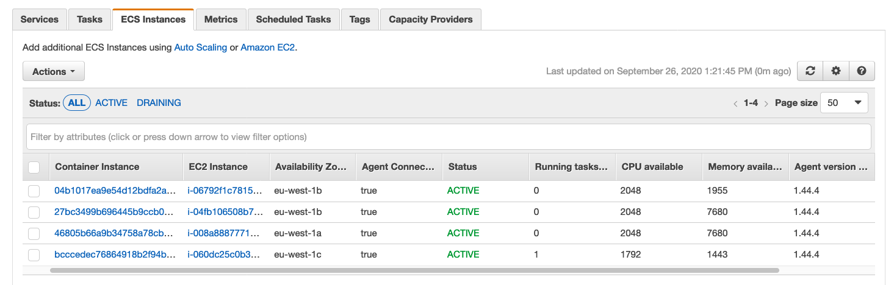

다음 CLI 명령을 사용하여 각 인스턴스가 속한 용량 공급자를 확인할 수 있습니다.

```
aws ecs describe-container-instances --cluster container-demo  \
                --container-instances $(aws ecs list-container-instances \
                                        --cluster container-demo \
                                        --query 'containerInstanceArns[]' \
                                        --output text) \
                --query 'containerInstances[].{InstanceId: ec2InstanceId, 
                                                CapacityProvider: capacityProviderName, 
                                                RunningTasks: runningTasksCount}' \
                --output table
```

출력은 다음과 유사합니다.

```
--------------------------------------------------------------
|                 DescribeContainerInstances                 |
+-------------------+-----------------------+----------------+
| CapacityProvider  |      InstanceId       | RunningTasks   |
+-------------------+-----------------------+----------------+
|  EC21601113073    |  i-06792f1c7815de3de  |  0             |
|  EC2Spot1601114241|  i-008a88877716d2659  |  0             |
|  EC2Spot1601114241|  i-0cb525a7402d3cb6a  |  0             |
|  EC21601113073    |  i-060dc25c0b3877faa  |  1             |
+-------------------+-----------------------+----------------+
```

EC2 지원 ECS 서비스 재배포
클러스터 기본 용량 공급자 전략을 업데이트했지만 지정된 전략이 없는 새 서비스에만 적용됩니다. 이것은 우리 서비스가 여전히 이전 전략을 사용하고 있음을 의미합니다. 서비스의 용량 공급자 전략을 업데이트하려면 서비스를 업데이트하고 다시 배포해야 합니다.

Amazon ECS 콘솔에서 container-demo클러스터 로 이동 하고 Services탭에서 ecsdemo-capacityproviders-ec2서비스를 클릭 합니다.

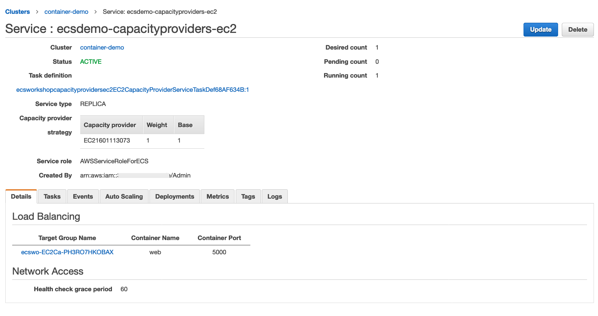

이제 클러스터 기본 용량 공급자 전략과 일치하도록 서비스 용량 공급자 전략을 업데이트하겠습니다. Update오른쪽 상단 모서리 에 있는 버튼을 클릭 하고 구성 서비스에서 를 Capacity provider strategy클릭 Add another provider합니다. 그런 다음 Provider 2드롭다운 메뉴에서 이전에 생성한 용량 공급자를 선택하고 EC2Spot*가중치 4를 할당합니다 Force new deployment. 새 전략이 적용되도록 서비스를 재배포하려면 확인란을 선택된 상태로 두십시오 . 그런 다음 화면 맨 아래로 스크롤하여 를 클릭 Skip to review하고 새 화면 Update Service에서 맨 아래 에 있는 버튼을 클릭합니다 . 그런 다음 를 클릭 View Service하여 ECS 서비스 콘솔로 돌아갑니다.

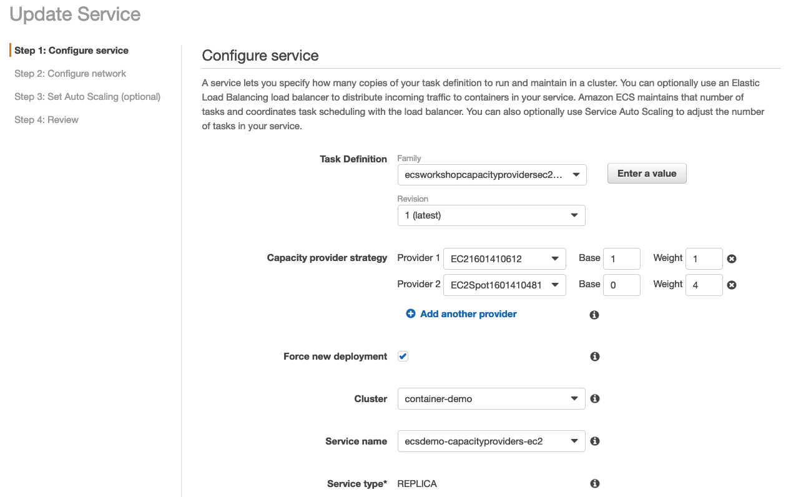

서비스가 다시 배포되는 동안 몇 분 정도 기다리십시오. Deployments탭 에서 모니터링할 수 있습니다 .

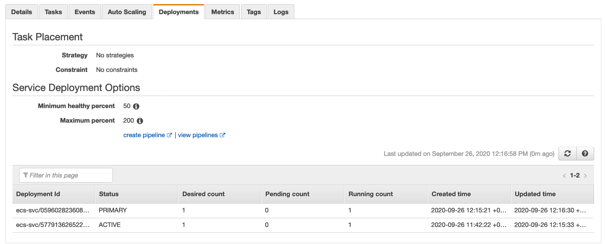

현재 사용 가능한 용량 이상으로 서비스 확장
이제 서비스를 다시 확장할 수 있습니다. 작업을 예약할 때 ECS는 방금 구성한 용량 공급자 전략을 따릅니다. 즉, On-Demand Auto Scaling Capacity 공급자에 대한 기본 작업 하나와 온디맨드 용량 공급자에 예약된 작업 1개마다 후속 4개가 다음 날짜에 예약됩니다. 스팟 용량 공급자.

배포 구성( ~/environment/ecsdemo-capacityproviders/ec2/app.py)으로 이동 하여 다음을 수행합니다.

desired_count 매개변수를 에서 1로 변경합니다 40. (이번에는 Spot Auto Scaling 그룹이 온디맨드 인스턴스보다 더 큰 인스턴스로 구성되어 더 많은 작업을 실행할 수 있기 때문에 더 많은 작업을 확장하고 있으며 Cluster Auto Scaling이 두 Auto Scaling 그룹을 어떻게 확장하는지 보고 싶습니다.)

```
        self.load_balanced_service = aws_ecs_patterns.ApplicationLoadBalancedEc2Service(
            self, "EC2CapacityProviderService",
            service_name='ecsdemo-capacityproviders-ec2',
            cluster=self.base_platform.ecs_cluster,
            cpu=256,
            memory_limit_mib=512,
            #desired_count=1,
            desired_count=40,
            public_load_balancer=True,
            task_image_options=self.task_image,
        )
```

이제 변경 사항을 저장하고 배포해 보겠습니다.

```
cdk deploy --require-approval never
```

우리가 한 일과 무슨 일이 일어나고 있는지 살펴보겠습니다.

서비스에 대한 작업 수를 1개에서 40개로 수정하고 있습니다. 이는 두 용량 공급자의 클러스터에 대해 현재 존재하는 용량 이상으로 확장될 것입니다.
서비스에서 사용하는 용량 공급자는 각각의 목표 용량이 80% 이상임을 인식합니다. 그러면 기본 Auto Scaling 그룹의 용량을 80% 이하로 다시 조정하는 Autoscaling 이벤트가 트리거됩니다.
EC2 Spot Auto Scaling 그룹은 시작 시 각 풀의 여유 용량 가용성을 기반으로 최적의 각 AZ에서 인스턴스 유형을 선택하여 확장합니다.
ECS 콘솔로 이동하면 실행을 시도하는 40개의 작업이 있음을 알 수 있습니다. 여러 용량 공급자를 사용하므로 단순화를 위해 이번에는 AWS CLI를 사용하여 작업을 모니터링합니다. 작업 상태를 확인하려면 다음 명령을 실행합니다.

```
aws ecs describe-tasks --cluster container-demo \
                       --tasks \
                         $(aws ecs list-tasks --cluster container-demo --query 'taskArns[]' --output text) \
                       --query 'sort_by(tasks,&capacityProviderName)[].{ 
                                          Id: taskArn, 
                                          AZ: availabilityZone, 
                                          CapacityProvider: capacityProviderName, 
                                          LastStatus: lastStatus, 
                                          DesiredStatus: desiredStatus}' \
                        --output table
```

Cluster Auto Scaler가 Auto Scaling 그룹을 확장하고 보류 중인 모든 작업이 예약되고 RUNNING. 출력은 다음과 유사합니다.

```
----------------------------------------------------------------------------------------------------------------------------------------------------
|                                                                   DescribeTasks                                                                  |
+------------+--------------------+----------------+--------------------------------------------------------------------------------+--------------+
|     AZ     | CapacityProvider   | DesiredStatus  |                                      Id                                        | LastStatus   |
+------------+--------------------+----------------+--------------------------------------------------------------------------------+--------------+
|  us-west-2a|  EC21601410612     |  RUNNING       |  arn:aws:ecs:us-west-2:012345678910:task/0fafc3da-0871-40a7-bbc8-ae27d9222971  |  RUNNING     |
|  us-west-2c|  EC21601410612     |  RUNNING       |  arn:aws:ecs:us-west-2:012345678910:task/41b65ccf-d372-428a-b7a5-864423e0ccb6  |  RUNNING     |
|  us-west-2c|  EC21601410612     |  RUNNING       |  arn:aws:ecs:us-west-2:012345678910:task/48f57b24-21ca-4357-93d9-ac7bc80376df  |  RUNNING     |
|  us-west-2a|  EC21601410612     |  RUNNING       |  arn:aws:ecs:us-west-2:012345678910:task/52fc0df1-76bc-4695-b97e-5c41defd1d87  |  RUNNING     |
|  us-west-2b|  EC21601410612     |  RUNNING       |  arn:aws:ecs:us-west-2:012345678910:task/7ed35946-5e02-4f15-a30c-6b8b730a14dc  |  RUNNING     |
|  us-west-2b|  EC21601410612     |  RUNNING       |  arn:aws:ecs:us-west-2:012345678910:task/8a75a425-2a88-408a-95e5-72becb6b653d  |  RUNNING     |
|  us-west-2b|  EC21601410612     |  RUNNING       |  arn:aws:ecs:us-west-2:012345678910:task/b5fe2be2-b3ca-404e-b622-202cb36f1e71  |  RUNNING     |
|  us-west-2a|  EC21601410612     |  RUNNING       |  arn:aws:ecs:us-west-2:012345678910:task/d1847007-b2b9-45dc-8bec-266d3625b4e6  |  RUNNING     |
|  us-west-2c|  EC21601410612     |  RUNNING       |  arn:aws:ecs:us-west-2:012345678910:task/fb3ac6c2-fdf9-498c-a38d-87482f0e373a  |  RUNNING     |
|  us-west-2c|  EC2Spot1601410481 |  RUNNING       |  arn:aws:ecs:us-west-2:012345678910:task/06a7b208-b26b-435f-8474-d9c7c7335b0f  |  RUNNING     |
|  us-west-2c|  EC2Spot1601410481 |  RUNNING       |  arn:aws:ecs:us-west-2:012345678910:task/0ea3d7d9-9028-491c-a610-d2337cd71576  |  RUNNING     |
|  us-west-2b|  EC2Spot1601410481 |  RUNNING       |  arn:aws:ecs:us-west-2:012345678910:task/15b901ed-4bab-4079-89ff-21fb12603704  |  RUNNING     |
|  us-west-2a|  EC2Spot1601410481 |  RUNNING       |  arn:aws:ecs:us-west-2:012345678910:task/197cec5f-6729-4a91-9c4a-d4b82f2d8e11  |  RUNNING     |
|  us-west-2b|  EC2Spot1601410481 |  RUNNING       |  arn:aws:ecs:us-west-2:012345678910:task/20d2ae15-3306-468d-a323-bd083457e257  |  RUNNING     |
|  us-west-2a|  EC2Spot1601410481 |  RUNNING       |  arn:aws:ecs:us-west-2:012345678910:task/2e5276a0-3a53-4d30-9ffd-9d732bc21444  |  RUNNING     |
|  us-west-2c|  EC2Spot1601410481 |  RUNNING       |  arn:aws:ecs:us-west-2:012345678910:task/34fcea68-340d-488a-8485-cb85f37b2421  |  RUNNING     |
|  us-west-2a|  EC2Spot1601410481 |  RUNNING       |  arn:aws:ecs:us-west-2:012345678910:task/3f8b5cd4-7cb6-4e36-949d-5e6b55e23026  |  RUNNING     |
|  us-west-2c|  EC2Spot1601410481 |  RUNNING       |  arn:aws:ecs:us-west-2:012345678910:task/40bb1a36-cf1b-413a-9900-edf77ed37666  |  RUNNING     |
|  us-west-2b|  EC2Spot1601410481 |  RUNNING       |  arn:aws:ecs:us-west-2:012345678910:task/4940999b-7d43-4776-bc93-c611f3e2f50d  |  RUNNING     |
|  us-west-2c|  EC2Spot1601410481 |  RUNNING       |  arn:aws:ecs:us-west-2:012345678910:task/51c7a1c2-ee99-482e-9d02-0b36fcf7c91d  |  RUNNING     |
|  us-west-2c|  EC2Spot1601410481 |  RUNNING       |  arn:aws:ecs:us-west-2:012345678910:task/57afe571-ccb2-43de-aeae-ed0b0e533dfa  |  RUNNING     |
|  us-west-2a|  EC2Spot1601410481 |  RUNNING       |  arn:aws:ecs:us-west-2:012345678910:task/61e8ae7e-0bc8-4ed9-ad79-6cee8d2f4561  |  RUNNING     |
|  us-west-2b|  EC2Spot1601410481 |  RUNNING       |  arn:aws:ecs:us-west-2:012345678910:task/6beb9d0f-b9a9-4a6d-9b5d-ca696eb6d222  |  RUNNING     |
|  us-west-2a|  EC2Spot1601410481 |  RUNNING       |  arn:aws:ecs:us-west-2:012345678910:task/7a0abdba-109b-451d-8802-976989867f99  |  RUNNING     |
|  us-west-2c|  EC2Spot1601410481 |  RUNNING       |  arn:aws:ecs:us-west-2:012345678910:task/7c2decc8-960e-444c-8112-94878d4bc842  |  RUNNING     |
|  us-west-2c|  EC2Spot1601410481 |  RUNNING       |  arn:aws:ecs:us-west-2:012345678910:task/7c7bf079-9feb-4a94-be46-5c7f4c9fabdb  |  RUNNING     |
|  us-west-2b|  EC2Spot1601410481 |  RUNNING       |  arn:aws:ecs:us-west-2:012345678910:task/8e086320-9898-4437-9760-ac49ca28c0ba  |  RUNNING     |
|  us-west-2c|  EC2Spot1601410481 |  RUNNING       |  arn:aws:ecs:us-west-2:012345678910:task/8eeb244a-2176-4c24-a35a-90dc738fe716  |  RUNNING     |
|  us-west-2a|  EC2Spot1601410481 |  RUNNING       |  arn:aws:ecs:us-west-2:012345678910:task/993f29a9-3f54-425f-9801-9260eef99a6e  |  RUNNING     |
|  us-west-2a|  EC2Spot1601410481 |  RUNNING       |  arn:aws:ecs:us-west-2:012345678910:task/ba45d37f-a456-4d55-8904-2917b6249426  |  RUNNING     |
|  us-west-2c|  EC2Spot1601410481 |  RUNNING       |  arn:aws:ecs:us-west-2:012345678910:task/c594dbde-bf60-421f-8a11-31e886305349  |  RUNNING     |
|  us-west-2c|  EC2Spot1601410481 |  RUNNING       |  arn:aws:ecs:us-west-2:012345678910:task/c92df92f-f2f2-44f5-a3ad-c1dc2a95e133  |  RUNNING     |
|  us-west-2b|  EC2Spot1601410481 |  RUNNING       |  arn:aws:ecs:us-west-2:012345678910:task/ca5f8402-95ab-4b12-a2e9-79f682e9ea73  |  RUNNING     |
|  us-west-2c|  EC2Spot1601410481 |  RUNNING       |  arn:aws:ecs:us-west-2:012345678910:task/cbffe95e-d0ee-4c30-9445-97cd74717e73  |  RUNNING     |
|  us-west-2c|  EC2Spot1601410481 |  RUNNING       |  arn:aws:ecs:us-west-2:012345678910:task/d3522c75-bb8a-415d-80c4-8812dece82ad  |  RUNNING     |
|  us-west-2c|  EC2Spot1601410481 |  RUNNING       |  arn:aws:ecs:us-west-2:012345678910:task/dea0db9c-e85e-4510-900f-18a93210c7f0  |  RUNNING     |
|  us-west-2b|  EC2Spot1601410481 |  RUNNING       |  arn:aws:ecs:us-west-2:012345678910:task/e68e9b9e-e5ff-49b7-8896-beccc85a5601  |  RUNNING     |
|  us-west-2a|  EC2Spot1601410481 |  RUNNING       |  arn:aws:ecs:us-west-2:012345678910:task/e7644caf-ae8d-4644-a6b9-3d845fe6fdab  |  RUNNING     |
|  us-west-2c|  EC2Spot1601410481 |  RUNNING       |  arn:aws:ecs:us-west-2:012345678910:task/ebd9a40d-0138-4c72-b6b6-92e19ee63721  |  RUNNING     |
|  us-west-2b|  EC2Spot1601410481 |  RUNNING       |  arn:aws:ecs:us-west-2:012345678910:task/fc3f7b8d-7777-41b1-8399-6aef81be546e  |  RUNNING     |
+------------+--------------------+----------------+--------------------------------------------------------------------------------+--------------+
```

전략에 구성된 대로 40작업 중 1기본 작업은 On-Demand Auto Scaling 용량 공급자 8에 예약되었고 더 많은 작업은 동일한 공급자 31에 예약되었으며 다른 작업 은 Spot Auto Scaling 용량에 예약되었습니다. 공급자.

각 용량 제공자에 대한 컨테이너 인스턴스가 어떻게 되는지 확인하십시오.

```
aws ecs describe-container-instances --cluster container-demo  \
                --container-instances $(aws ecs list-container-instances \
                                        --cluster container-demo \
                                        --query 'containerInstanceArns[]' \
                                        --output text) \
                --query 'containerInstances[].{InstanceId: ec2InstanceId, 
                                                CapacityProvider: capacityProviderName, 
                                                RunningTasks: runningTasksCount}' \
                --output table
```

다음과 유사한 출력이 표시됩니다.

```
--------------------------------------------------------------
|                 DescribeContainerInstances                 |
+-------------------+-----------------------+----------------+
| CapacityProvider  |      InstanceId       | RunningTasks   |
+-------------------+-----------------------+----------------+
|  EC2Spot1601410481|  i-0b3fff658490b7e82  |  8             |
|  EC21601410612    |  i-0cf703bce8be6fb8b  |  3             |
|  EC2Spot1601410481|  i-0e3facf7904e07090  |  8             |
|  EC21601410612    |  i-0a736772a3cd8a0d6  |  0             |
|  EC2Spot1601410481|  i-0b7c8dc3b712306b8  |  0             |
|  EC21601410612    |  i-09faef7cee2b0817e  |  3             |
|  EC2Spot1601410481|  i-011148f52770cec66  |  7             |
|  EC2Spot1601410481|  i-0381ead0179bf59cb  |  8             |
|  EC21601410612    |  i-0f20394abc80fc763  |  3             |
+-------------------+-----------------------+----------------+
```

이제 EC2 Auto Scaling 콘솔를 엽니다 ecsworkshop-base-ECSEC2SpotCapacity-*. 온 Instance management탭, 자동 스케일링 그룹이 출범시킨 예 유형 확인하십시오. 인스턴스 유형은 인스턴스가 시작될 때 최적의 스팟 풀이 무엇인지에 따라 다릅니다.

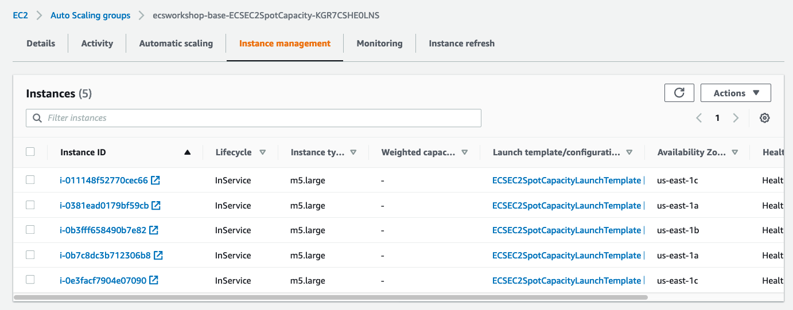

Details탭에서 아래로 스크롤 하여 이전에 구성한 혼합 인스턴스 유형 정책을 검토할 수 있습니다 Purchase options and instance types.

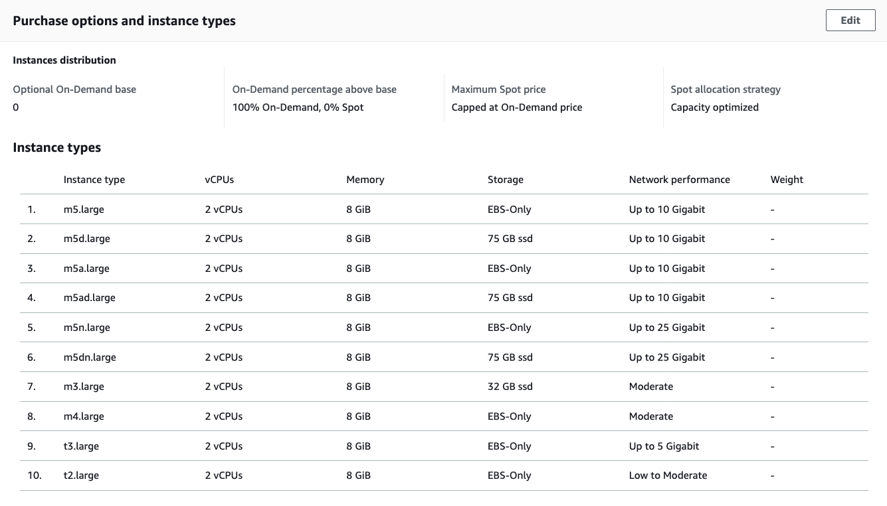

스팟 인스턴스 중단 처리
에이전트 구성 파일 DRAINING에서 ECS_ENABLE_SPOT_INSTANCE_DRAINING=true플래그를 활성화하여 중단 알림을 수신하면 스팟 컨테이너 인스턴스를 설정하도록 ECS 에이전트를 구성했습니다. 인스턴스가 로 설정되면 DRAININGApplication Load Balancer 뒤에 구성된 작업에 대해 ALB가 중단될 작업에 대한 새 요청 전송을 중지 deregistration_delay.timeout_seconds하고 진행 중인 요청에 대해 ALB 대상 그룹에 구성된 시간을 허용 합니다. 끝내기 위해. 스팟 인스턴스가 120초 알림으로 중단되므로 이 값을 90초로 구성했습니다.

동시에 ECS는 중단될 인스턴스에서 실행 중인 작업에 대한 교체 작업을 시작합니다. targetCapacityCluster Auto Scaling 과 같이 80%를 구성하였으므로 클러스터의 나머지 공간에 맞는 교체 작업이 예약되어 곧 시작됩니다. 이상적으로는 이러한 작업 healthy이 ALB에서 빠르게 고려되기를 원 하므로 healthy_threshold_count=2. 기본 설정에서 상태 확인은 30초마다 평가됩니다. 즉, 새 작업이 정상 상태가 되고 트래픽 처리를 시작하기 위해 2회의 연속 상태 확인이 성공하면 최소 1분이 걸립니다.

PENDINGEC2 용량이 예약되기를 기다리는 추가 작업이 있는 경우 대상이 80%를 초과하므로 클러스터 Auto Scaling이 확장 작업을 트리거합니다.

다음에서 구성을 검토하십시오 ~/environment/ecsdemo-capacityproviders/ec2/app.py.

```
self.cfn_target_group.target_group_attributes = [{ "key" : "deregistration_delay.timeout_seconds", "value": "90" }]
self.cfn_target_group.healthy_threshold_count = 2
```

아래 이미지에서 흐름의 예를 볼 수 있습니다.

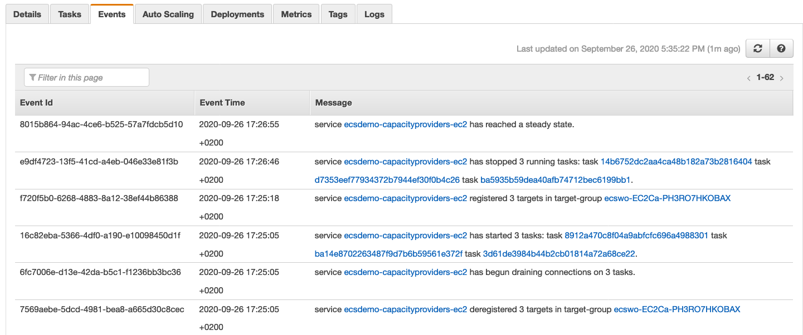

맨 아래부터 시작하는 3개의 이벤트에서 DRAININGECS가 대상 그룹의 인스턴스에서 실행 중인 3개의 대상을 등록 취소하는 방법을 볼 수 있습니다 . 이 작업은 로드 밸런서에서 연결 드레이닝을 시작하고 3개의 교체 작업도 생성합니다.
약 13초 후 새 작업이 RUNNING대상 그룹에 등록되고 health_threshold_count(이 경우 2)가 전달될 때까지 상태 확인을 수행하기 시작합니다.
연결 드레이닝이 시작된 후 90초가 지나면 연결 드레이닝이 완료되면서 중단될 인스턴스에서 실행 중인 작업이 중지됩니다.
인스턴스를 로 설정한 후 2분이 지나기 전에 DRAININGECS 서비스가 정상 상태에 도달합니다.
컨테이너 데모 클러스터 내 ECS 콘솔의 인스턴스를 수동으로 드레이닝하고 ECS instances탭으로 이동하여 하나의 인스턴스를 선택하고 Actions–> 를 클릭하여 이를 직접 재현할 수 있습니다 Drain instances.

서비스를 다시 하나로 축소
이제 용량 공급자 전략이 실행되는 것을 보았으므로 카운트를 다시 1로 줄이고 인프라가 다시 확장되는지 살펴보겠습니다.

배포 구성( ~/environment/ecsdemo-capacityproviders/ec2/app.py) 으로 돌아가서 다음을 수행합니다.

```
desired_count 매개변수를 에서 40로 변경합니다 1.

        self.load_balanced_service = aws_ecs_patterns.ApplicationLoadBalancedEc2Service(
            self, "EC2CapacityProviderService",
            service_name='ecsdemo-capacityproviders-ec2',
            cluster=self.base_platform.ecs_cluster,
            cpu=256,
            memory_limit_mib=512,
            desired_count=1,
            #desired_count=40,
            public_load_balancer=True,
            task_image_options=self.task_image,
        )
```

이제 변경 사항을 저장하고 배포해 보겠습니다.

```
cdk deploy --require-approval never
```

그게 다야 이제 앞으로 몇 분 동안 클러스터 Auto Scaling은 우리가 두 용량 공급자의 용량 요구 사항을 훨씬 초과한다는 것을 인식하고 EC2 인스턴스를 다시 축소합니다.

검토
워크숍의 이 섹션에서 우리가 달성한 것은 다음과 같습니다.

스팟 인스턴스로 구성된 EC2 지원 작업을 위한 추가 용량 공급자를 생성했습니다.
비용을 최적화하기 위해 이전 섹션 온디맨드 EC2 용량 제공자와 새로운 EC2 스팟 용량 제공자 모두에 걸쳐 ECS 서비스 작업을 분산하거나 ECS 서비스 작업을 수행하도록 용량 제공자 전략을 업데이트했습니다.
서비스를 확장하고 확장하여 실행 중인 새로운 전략과 Cluster Auto Scaling이 두 Auto Scaling 그룹을 적절하게 확장한 방법을 확인하십시오.
ECS 에이전트가 스팟 인스턴스 중단을 관리하는 방법을 알아보십시오.

대청소
cdk 명령을 실행하여 배포한 서비스(및 종속 구성 요소)를 삭제합니다.

```
cdk destroy -f
```

그런 다음 콘솔에서 ECS 클러스터로 돌아갑니다. 오른쪽 상단에서 을 선택 Update Cluster합니다.


에서 더 이상 제거할 전략이 없을 때까지 모든 전략 옆에 있는 을 Default capacity provider strategy클릭합니다 x. 완료했으면 을(를) 클릭 Update합니다.


## CLEAN UP
ecs 애플리케이션 및 플랫폼 삭제

```
cd ~/environment/ecsdemo-capacityproviders/ec2
cdk destroy -f
cd ~/environment/ecsdemo-capacityproviders/fargate
cdk destroy -f
cd ~/environment/container-demo/cdk
cdk destroy -f
```

```
python -c "import boto3
c = boto3.client('logs')
services = ['ecsworkshop-capacityproviders-fargate', 'ecsworkshop-capacityproviders-ec2']
for service in services:
    frontend_logs = c.describe_log_groups(logGroupNamePrefix=service)
    print([c.delete_log_group(logGroupName=x['logGroupName']) for x in frontend_logs['logGroups']])"
```