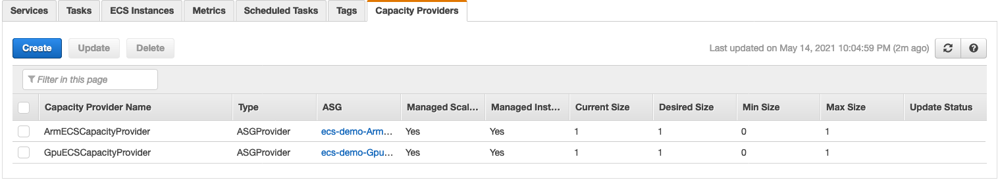
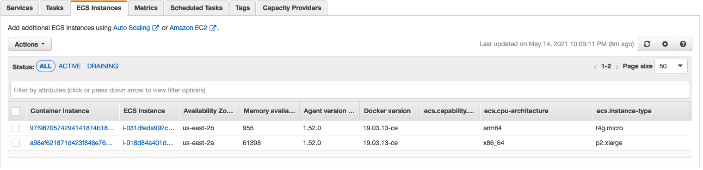

# ECS의 고급 스케줄링 기술

1. 소개
이 연습에서는 Amazon ECS에서 실행되는 작업에 대한 고급 일정 시나리오를 살펴봅니다. EC2 컴퓨팅이 필요한 작업이 시작되면 Amazon ECS는 CPU 및 메모리와 같은 작업 정의에 지정된 요구 사항에 따라 작업을 배치할 위치를 결정해야 합니다. 그러나 CPU 및 메모리 요구 사항을 충족하는 기본 사항을 넘어 작업을 클러스터에 배치하는 방법을 더 많이 제어하려는 경우에는 어떻게 될까요? 이때 배치 제약 및 배치 전략과 같은 스케줄링 기술이 도움이 될 수 있습니다. GPU 및 ARM 지원이 필요한 작업을 포함하여 특수 사용 사례를 기반으로 작업을 예약하는 방법에 중점을 둘 것입니다. 두 가지 유형의 ECS 최적화 AMI(ARM 및 GPU)를 사용하여 컨테이너 인스턴스를 동일한 ECS 클러스터에 등록하여 작업 요구 사항에 따라 원하는 컨테이너 인스턴스에 특정 작업을 배치하는 방법을 배웁니다. 시작하기 전에 Amazon ECS가 원하는 컨테이너 인스턴스를 선택하는 작업을 배치할 때 따르는 프로세스를 살펴보겠습니다.

해당 작업 정의에서 CPU, 메모리 및 포트 요구 사항을 충족하는 인스턴스를 식별합니다.
작업을 충족하는 인스턴스를 식별합니다. 배치 제약.
작업을 충족하는 인스턴스를 식별합니다. 배치 전략.
작업 배치를 위한 인스턴스를 선택합니다.
작업 배치 제약
작업 배치 제약 조건은 작업 배치 중에 고려되는 규칙입니다. 작업 배치 제약 조건은 작업을 실행하거나 새 서비스를 생성할 때 지정할 수 있습니다. 기존 서비스에 대한 작업 배치 제약 조건도 업데이트할 수 있습니다. 자세한 내용은Amazon ECS 작업 배치.

작업 배치 전략
태스크 배치 전략은 태스크 배치를 위한 인스턴스 또는 종료할 태스크를 선택하기 위한 알고리즘입니다. 작업을 실행하거나 새 서비스를 생성할 때 작업 배치 전략을 지정할 수 있습니다. 기존 서비스에 대해서도 작업 배치 전략을 업데이트할 수 있습니다. 자세한 내용은Amazon ECS 작업 배치.

Amazon ECS에서 고급 작업 배치 기능을 활용하는 방법을 살펴보는 것으로 시작해 보겠습니다.

## 환경 및 작업 배포
3. 저장소 복제

```
cd ~/environment
git clone https://github.com/aws-containers/ecsworkshop-advanced-scheduling-chapter.git
cd ecsworkshop-advanced-scheduling-chapter
```

AWS Cloudformation을 사용하여 코드를 통해 배포 구성을 정의하고 있습니다. CloudFormation이 생성할 리소스를 더 잘 이해하기 위해 코드를 살펴보겠습니다.

3.2 네트워킹 CFN 스택 배포:
시작하려면 스택 이름을 다음과 같이 지정하고 다음 AWS CloudFormation(CFN) 템플릿을 사용하여 표준 네트워킹 리소스(VPC, 퍼블릭 및 프라이빗 서브넷)를 배포합니다 ecsworkshop-vpc.

```
aws cloudformation create-stack \
  --stack-name=ecsworkshop-vpc \
  file://ecsworkshop-vpc.yaml \
  --capabilities CAPABILITY_NAMED_IAM
```

위의 CFN 스택이 준비되면(CREATE_COMPLETE 상태에 도달) 스택은 VPCId, SecurityGroup, Public & Private SubnetIds. EC2 인스턴스를 생성할 때 이러한 값이 필요합니다. DescribeStackAPI 를 호출하고 네트워킹 리소스 생성을 확인 하는 다음 aws cli 명령을 실행합니다 .

```
$ aws cloudformation describe-stacks --stack-name ecsworkshop-vpc --query 'Stacks[*].Outputs' --output table
-------------------------------------------------------------------------------------------------------------------------------------
|                                                          DescribeStacks                                                           |
+--------------------+------------------------------------+-------------------+-----------------------------------------------------+
|     Description    |            ExportName              |     OutputKey     |                     OutputValue                     |
+--------------------+------------------------------------+-------------------+-----------------------------------------------------+
|  Private Subnets   |  ecsworkshop-vpc-PrivateSubnetIds  |  PrivateSubnetIds |  subnet-056b33da478b11f58,subnet-07a7ef29d05b2ada5  |
|  Public Subnets    |  ecsworkshop-vpc-PublicSubnetIds   |  PublicSubnetIds  |  subnet-00f53ccb59fba3013,subnet-075535e0065bee628  |
|  ECS Security Group|  ecsworkshop-vpc-SecurityGroups    |  SecurityGroups   |  sg-06767fd76e0421a4e                               |
|  The VPC Id        |  ecsworkshop-vpc-VpcId             |  VpcId            |  vpc-074d610367de94848                              |
+--------------------+------------------------------------+-------------------+-----------------------------------------------------+
```

위의 출력이 표시되면 다음 단계로 이동할 준비가 된 것입니다.

3.3 클러스터 리소스 배포:
다음으로 ECS 클러스터 인프라를 생성하고 아래에서 더 자세히 살펴보겠습니다. 이 스택 배포에서는 위에서 배포한 VPC 기본 플랫폼 스택에서 VPC, 보안 그룹 및 서브넷을 가져옵니다.

```
aws cloudformation create-stack \
    --stack-name=ecs-demo \
    --template-body=ecsworkshop-demo.yaml \
    --capabilities CAPABILITY_NAMED_IAM
```

위 명령은 ECS 최적화 AMI를 가리키는 ECS 클러스터, 시작 구성, AutoScaling 그룹과 같은 AWS 리소스가 포함된 Cloudformation 스택을 배포합니다. 우리가 생성하는 AutoScaling 그룹은 두 가지입니다. 하나는 ARM 기반이고 다른 하나는 GPU가 연결되어 있습니다.

배포가 진행되는 동안 배포 대상을 더 잘 이해하기 위해 Cloudformation 템플릿을 검토해 보겠습니다.

코드 검토
앞서 언급했듯이 워크숍에서 이 장의 목표는 해당 요구 사항과 일치하는 EC2 인스턴스에 작업을 예약하는 것입니다. 우리가 작업하고 있는 이 두 가지 사용 사례는 ARM 기반 컨테이너와 GPU가 필요한 컨테이너를 배포하는 것입니다. ARM 인프라 검토부터 시작하겠습니다.

3.4 ARM 클러스터 용량 및 작업 정의
ARM 기반 EC2 인스턴스를 클러스터에 배포하려면 ARM 기반 EC2 인스턴스를 시작 및 실행하고 클러스터에 연결할 몇 가지 리소스를 생성해야 합니다.

시작 구성을 만드는 것으로 시작합니다. 여기에서 AMI ID, 보안 그룹 및 IAM 역할 세부 정보를 지정하고 마지막으로 인라인으로 정의한 코드를 실행하는 사용자 데이터를 지정합니다. 사용자 데이터의 코드는 EC2 인스턴스를 클러스터에 등록합니다.

```
# ARM64 based Launch Configuration. 
  ArmASGLaunchConfiguration:
    Type: AWS::AutoScaling::LaunchConfiguration
    Properties:
      ImageId: !Ref ArmLatestAmiId
      SecurityGroups: !Split
        - ','
        - Fn::ImportValue: !Sub "${VPCStackParameter}-SecurityGroups"
      InstanceType: !Ref 'ArmInstanceType'
      IamInstanceProfile: !Ref 'EC2InstanceProfile'
      UserData:
        Fn::Base64: !Sub |
          #!/bin/bash -xe
          echo ECS_CLUSTER=${ECSCluster} >> /etc/ecs/ecs.config
          yum install -y aws-cfn-bootstrap
          /opt/aws/bin/cfn-signal -e $? --stack ${AWS::StackName} --resource ArmECSAutoScalingGroup --region ${AWS::Region}
```

다음으로, 자동 조정 및 관리를 위해 논리적 그룹으로 취급되는 Amazon EC2 인스턴스 모음이 포함된 Autoscaling 그룹을 생성합니다. Auto Scaling 그룹을 통해 상태 확인 교체 및 조정 정책과 같은 Amazon EC2 Auto Scaling 기능을 사용할 수도 있습니다.

```
 # AutoScalingGroup to launch Container Instances using ARM64 Launch Configuration.  
  ArmECSAutoScalingGroup:
    Type: AWS::AutoScaling::AutoScalingGroup
    Properties:
      NewInstancesProtectedFromScaleIn: true
      VPCZoneIdentifier: !Split
        - ','
        - Fn::ImportValue: !Sub "${VPCStackParameter}-PrivateSubnetIds"
      LaunchConfigurationName: !Ref 'ArmASGLaunchConfiguration'
      MinSize: '0'
      MaxSize: !Ref 'MaxSize'
      DesiredCapacity: !Ref 'DesiredCapacity'
      Tags:
        - Key: Name
          Value: !Sub 'ARM64-${ECSCluster}'
          PropagateAtLaunch: true
    CreationPolicy:
      ResourceSignal:
        Timeout: PT15M
    UpdatePolicy:
      AutoScalingReplacingUpdate:
        WillReplace: true
```

Autoscaling 그룹의 확장 및 관리를 위해 클러스터 Autoscaling이 활성화된 용량 공급자를 생성합니다. 이렇게 하면 작업이 시작될 때 필요에 따라 EC2 인스턴스가 작동 및 중지됩니다. 용량 공급자를 위에서 생성한 Autoscaling 그룹과 연결합니다. 그러면 확장이 필요할 때 ECS에서 제어합니다.

```
  ArmECSCapacityProvider:
    Type: AWS::ECS::CapacityProvider
    Properties:
        AutoScalingGroupProvider:
            AutoScalingGroupArn: !Select [0, !GetAtt ARMCustomResource.Data ]
            ManagedScaling:
                MaximumScalingStepSize: 10
                MinimumScalingStepSize: 1
                Status: ENABLED
                TargetCapacity: 100
            ManagedTerminationProtection: ENABLED
```

작업 배치 제약 조건은 작업 배치 중에 고려되는 규칙입니다. 지원되는 2가지 유형의 작업 배치 제약 조건 중에서 다음을 사용합니다. 의 멤버이다. 사용 가능한 표현식에서 ecs.cpu-architecture를 사용하여 컨테이너 인스턴스의 원하는 CPU 아키텍처에 작업을 배치합니다. 다음은 ARM64 아키텍처에 작업을 배치하는 예입니다.

마지막으로 컨테이너 시작 방법을 Amazon ECS에 지시하는 작업 정의를 배포합니다. 이 작업 정의에서 컨테이너 이미지, CPU/메모리 요구 사항, 로깅 구성 및 배치 제약 조건을 정의합니다. 배치 제약 지시문은 시작될 때 작업이 시작되는 위치를 더 잘 제어할 수 있는 곳입니다. ECS에는 사용할 수 있는 두 가지 유형의 제약 조건이 있습니다.

고유 인스턴스

각 작업을 다른 컨테이너 인스턴스에 배치합니다. 이 작업 배치 제약 조건은 작업을 실행하거나 새 서비스를 생성할 때 지정할 수 있습니다.
의 멤버이다

표현식을 충족하는 컨테이너 인스턴스에 작업을 배치합니다. 제약 조건의 표현식 구문에 대한 자세한 내용은 (클러스터 쿼리 언어)[https://docs.aws.amazon.com/AmazonECS/latest/developerguide/cluster-query-language.html]를 참조하십시오.
아래 작업 정의에서는 의 memberOf기본값(속성)[https://docs.aws.amazon.com/AmazonECS/latest/developerguide/task-placement-constraints.html#attributes]을 쿼리하는 표현식과 함께 제약 조건을 사용하고 cpu-architecture있습니다. 클러스터 쿼리 언어를 사용하여 arm64 아키텍처인 EC2 인스턴스에만 이러한 작업을 예약하도록 ECS에 지시합니다.

```
# ECS Task Definition for ARM64 Instance type. PlacementConstraints properties are setting the desired cpu-architecture to arm64.
  Arm64taskdefinition:
    Type: AWS::ECS::TaskDefinition
    Properties:
      Family: !Join ['', [!Ref 'AWS::StackName', -arm64]]
      PlacementConstraints: 
        - Type: memberOf
          Expression: 'attribute:ecs.cpu-architecture == arm64'
      ContainerDefinitions:
      - Name: simple-arm64-app
        Cpu: 10
        Command:
          - sh
          - '-c'
          - 'uname -a'
        Essential: true
        Image: public.ecr.aws/amazonlinux/amazonlinux:latest
        Memory: 200
        LogConfiguration:
          LogDriver: awslogs
          Options:
            awslogs-group: !Ref 'CloudwatchLogsGroup'
            awslogs-region: !Ref 'AWS::Region'
            awslogs-stream-prefix: ecs-arm64-demo-app
```

3.5 GPU 클러스터 용량 및 작업 정의
위에서 리소스를 정의한 방법과 유사하게 GPU 지원 인스턴스에 대해서도 동일하게 수행합니다. 여기서 가장 큰 차이점은 사용된 AMI입니다.

```
  GpuASGLaunchConfiguration:
    Type: AWS::AutoScaling::LaunchConfiguration
    Properties:
      ImageId: !Ref GPULatestAmiId
      SecurityGroups: !Split
        - ','
        - Fn::ImportValue: !Sub "${VPCStackParameter}-SecurityGroups"
      InstanceType: !Ref 'GpuInstanceType'
      IamInstanceProfile: !Ref 'EC2InstanceProfile'
      UserData:
        Fn::Base64: !Sub |
          #!/bin/bash -xe
          echo ECS_CLUSTER=${ECSCluster} >> /etc/ecs/ecs.config
          yum install -y aws-cfn-bootstrap
          /opt/aws/bin/cfn-signal -e $? --stack ${AWS::StackName} --resource GpuECSAutoScalingGroup --region ${AWS::Region}

  GpuECSAutoScalingGroup:
    Type: AWS::AutoScaling::AutoScalingGroup
    Properties:
      NewInstancesProtectedFromScaleIn: true
      VPCZoneIdentifier: !Split
        - ','
        - Fn::ImportValue: !Sub "${VPCStackParameter}-PrivateSubnetIds"
      LaunchConfigurationName: !Ref 'GpuASGLaunchConfiguration'
      MinSize: '0'
      MaxSize: !Ref 'MaxSize'
      DesiredCapacity: !Ref 'DesiredCapacity'
      Tags:
        - Key: Name
          Value: !Sub 'GPU-${ECSCluster}'
          PropagateAtLaunch: true
    CreationPolicy:
      ResourceSignal:
        Timeout: PT15M
    UpdatePolicy:
      AutoScalingReplacingUpdate:
        WillReplace: true

  GpuECSCapacityProvider:
    Type: AWS::ECS::CapacityProvider
    Properties:
        AutoScalingGroupProvider:
            AutoScalingGroupArn: !Select [1, !GetAtt ARMCustomResource.Data ]
            ManagedScaling:
                MaximumScalingStepSize: 10
                MinimumScalingStepSize: 1
                Status: ENABLED
                TargetCapacity: 100
            ManagedTerminationProtection: ENABLED
```

위의 ARM64 작업 정의에서 설명한 대로 ecs.instance-type 속성을 사용하여 컨테이너 인스턴스의 원하는 InstanceType에 작업을 배치합니다. 다음은 GPU 아키텍처에 작업을 배치하는 예입니다. 참고: GPU 지원이 필요한 배포 작업의 경우 instance-typeGPU 기본 패밀리 유형이 특정 인스턴스 유형에서만 지원되기 때문에 속성을 사용 합니다. AWS CloudFormation 스택을 생성하는 동안 선언/지원되는 인스턴스 유형 목록에서 원하는 인스턴스 유형을 선택할 수 있습니다.

아래 작업 정의에서 GPU를 실행해야 하는 컨테이너 이미지를 정의합니다. ARM 작업과 마찬가지로 memberOf배치 제약 조건을 사용하지만 쿼리는 약간 다릅니다. GPU를 사용하지 않고는 작업을 실행할 수 없으므로 여기서는 인스턴스 유형을 기반으로 이러한 작업을 배치합니다. 또한 여러 인스턴스 유형을 사용하려는 경우에 대비하여 사용자 지정 속성과 쿼리를 생성할 수도 있습니다.

또한 컨테이너가 ResourceRequirements키 아래에 GPU를 요청하고 있음을 알 수 있습니다 . 이렇게 하면 시작 시 GPU가 작업에 할당됩니다.

```
# ECS Task Definition for GPU Instance type. PlacementConstraints properties are setting the desired cpu-architecture to gpu.
  Gputaskdefinition:
    Type: AWS::ECS::TaskDefinition
    Properties:
      Family: !Join ['', [!Ref 'AWS::StackName', -gpu]]
      PlacementConstraints: 
        - Type: memberOf
          Expression: !Sub 'attribute:ecs.instance-type == ${GpuInstanceType}'
      ContainerDefinitions:
      - Name: simple-gpu-app
        Cpu: 100
        Essential: true
        Image: nvidia/cuda:11.0-base
        Memory: 80
        ResourceRequirements:
          - Type: GPU
            Value: '1'
        Command:
          - sh
          - '-c'
          - nvidia-smi
        LogConfiguration:
          LogDriver: awslogs
          Options:
            awslogs-group: !Ref 'CloudwatchLogsGroup'
            awslogs-region: !Ref 'AWS::Region'
            awslogs-stream-prefix: ecs-gpu-demo-app
```

리소스가 배포되었는지 확인
다음을 실행하여 계정의 클러스터 리소스를 보여주는 출력을 가져옵니다.

```
$ aws cloudformation describe-stacks --stack-name ecs-demo --query 'Stacks[*].Outputs' --output table
```

출력은 다음과 같아야 합니다.

```
------------------------------------------------------------------------------------------------------------------------------
|                                                       DescribeStacks                                                       |
+------------------------+-------------------------+-------------------------------------------------------------------------+
|       Description      |        OutputKey        |                               OutputValue                               |
+------------------------+-------------------------+-------------------------------------------------------------------------+
|  ECS Cluster name      |  ecscluster             |  ecs-demo-ECSCluster-NPsCvf3k6aWv                                      |
|  Arm Capacity Provider |  ArmECSCapacityProvider |  ecs-demo-ArmECSCapacityProvider-FXpQH4EJ6DSz                          |
|  GPU Capacity Provicder|  GpuECSCapacityProvider |  ecs-demo-GpuECSCapacityProvider-KYleqfF16Iqy                          |
|  Arm64 task definition |  Armtaskdef             |  arn:aws:ecs:us-west-2:012345678912:task-definition/ecs-demo-arm64:1   |
|  GPU task definition   |  Gputaskdef             |  arn:aws:ecs:us-west-2:012345678912:task-definition/ecs-demo-gpu:1     |
+------------------------+-------------------------+-------------------------------------------------------------------------+
```

이 시점에서 기본 플랫폼을 배포했으며 일부 컨테이너를 실행할 준비가 되었습니다. 공유 ECS 클러스터에서 원하는 작업 정의를 사용하여 ECS 작업을 배포하는 방법을 살펴보겠습니다.

## 작업 배치 검증
ARM 기반 EC2 인스턴스에서 ECS 작업을 실행하려면 RunTask cli 옵션에 3개의 입력 매개변수를 제공해야 합니다. RunTask 명령에는 ECS 클러스터, 작업 정의 및 CapacityProvider 전략이 필요합니다. CloudFormation 출력 값을 사용하여 ARM_TASKDEF 셸 환경을 생성합니다.

CloudFormation을 사용하여 ARM 기반 작업 정의를 생성할 때 작업 배치 제약 조건을 구성했습니다. 배치 제약 구성에 따라 ECS 스케줄러는 컨테이너 인스턴스 CPU 아키텍처를 사용하고 CPU 아키텍처가 arm64인 경우에만 작업이 배치됩니다. 그렇지 않으면 ECS 클러스터가 있는 컨테이너 인스턴스에 작업이 배치되지 않습니다.

ARM 기반 작업 정의를 설명하고 taskDefinition.placementConstraints 값에 대한 출력을 쿼리하여 배치 제약 조건 구성을 확인할 수 있습니다. 이 명령은 또한 ARM_TASKDEF 값이 올바르게 설정되었는지 확인합니다.

```
ARM_TASKDEF=$(aws cloudformation describe-stacks --stack-name ecs-demo \
    --query 'Stacks[*].Outputs[?OutputKey==`Armtaskdef`]' --output text | awk '{print $NF}')
    
aws ecs describe-task-definition --task-definition $ARM_TASKDEF \
    --query 'taskDefinition.placementConstraints' 
```

출력은 다음과 같아야 합니다.

```
[
    {
        "type": "memberOf",
        "expression": "attribute:ecs.cpu-architecture == arm64"
    }
]
```

마찬가지로 GPU 작업 정의 리소스 이름에 대한 CloudFormation 스택 출력을 쿼리하여 GPU_TASKDEF 환경 변수를 구성했습니다. 또한 GPU 기본 작업 정의를 생성했으며 이 작업 정의를 생성하는 동안 p2.xlarge와 동일한 인스턴스 유형을 찾도록 배치 구성을 구성했습니다. GPU_TASKDEF에 대해 describe task definition 명령을 실행하여 이를 확인합니다.

```
$ GPU_TASKDEF=$(aws cloudformation describe-stacks --stack-name ecs-demo \
 --query 'Stacks[*].Outputs[?OutputKey==`Gputaskdef`]' --output text | awk '{print $NF}')
 
$ aws ecs describe-task-definition --task-definition $GPU_TASKDEF \
     --query 'taskDefinition.placementConstraints'
```

출력은 다음과 같아야 합니다.

```
[
    {
        "type": "memberOf",
        "expression": "attribute:ecs.instance-type == p2.xlarge"
    }
]
```

이러한 제약 조건에 따라 사용자가 ECS 작업(CreateService/RunTask)을 시작하려고 하면 ECS 스케줄러가 constraints작업 정의에서 필드를 찾습니다 . 제약 조건에 따라 제약 조건과 일치하는 ECS 클러스터 내의 컨테이너 인스턴스에 작업이 배치됩니다.

사용 가능한 컨테이너 인스턴스가 요구 사항을 충족하지 않으면 ECS 스케줄러가 작업을 배치할 수 없습니다.

6.2 성공 시나리오에서 검증
이제 작업을 배포할 시간입니다! 다음 명령을 실행하여 ECS 클러스터에 배포된 작업을 가져옵니다.

```
$ ARM_ECSCP=$(aws cloudformation describe-stacks --stack-name ecs-demo \
    --query 'Stacks[*].Outputs[?OutputKey==`ArmECSCapacityProvider`]' --output text | awk '{print $NF}')
$ aws ecs run-task --cluster $ECS_CLUSTER --task-definition $ARM_TASKDEF --capacity-provider-strategy "capacityProvider=${ARM_ECSCP}"
```

GPU 지원 인스턴스에 대해서도 동일한 작업을 수행할 수 있습니다! GPU 지원 인스턴스는 프리 티어 자격이 없으며 비용이 발생할 수 있습니다. 혼자 실행하는 경우 이 섹션을 건너뛰고 참조용으로만 사용하는 것이 좋습니다.

GPU 배포 코드를 보려면 여기를 확장하세요.

```
GPU_ECSCP=$(aws cloudformation describe-stacks --stack-name ecs-demo \
    --query 'Stacks[*].Outputs[?OutputKey==`GpuECSCapacityProvider`]' --output text | awk '{print $NF}')
aws ecs run-task --cluster $ECS_CLUSTER --task-definition $GPU_TASKDEF --capacity-provider-strategy "capacityProvider=${GPU_ECSCP}"
```

작업이 제출되었음을 나타내는 JSON 응답을 받게 됩니다. 실패를 확인합니다. 비어 있으면 작업이 성공적으로 제출되었음을 의미합니다. 또한 JSON 출력에 제출되고 PROVISIONING 단계에 있는 태스크 lastStatus를 찾습니다.

클러스터 자동 크기 조정이 시작되는 데 몇 분 정도 걸립니다. 클러스터에 인스턴스가 없는 상태에서 시작하여 ECS가 수요에 따라 EC2 인스턴스의 크기 조정을 처리하도록 합니다.

ECS 콘솔로 이동하여 ecs-demo-ECSCluster-RANDOM을 선택하면 용량 공급자 ArmECSCacityProvider 및 GpuECSCacityProvider 현재 크기가 각각 1로 증가한 것을 볼 수 있습니다.



ECS 인스턴스 탭에서 이제 두 개의 EC2 인스턴스(각 작업에 대해 1개)가 있는 것을 볼 수 있습니다. ECS Instance 탭에서 설정 아이콘을 클릭하고 ecs.cpu-architecture 및 ecs-instance-type을 선택합니다. 이 값을 기반으로 용량 공급자가 각 작업 정의 제약 조건에 필요한 대로 GPU(instance-type=p2.xlarge) 및 ARM(cpu-architecture=arm64) 인스턴스 유형을 모두 시작한 것을 볼 수 있습니다.



이제 특정 배치 제약 조건에 따라 클러스터에 두 가지 작업을 성공적으로 배포했습니다!

ECS 콘솔에서 작업으로 이동하여 실행 중인 작업의 확인란을 선택한 다음 를 선택 Stop합니다. 약 15분 후 클러스터 자동 확장 처리는 EC2 인스턴스를 필요로 하는 작업이 없으므로 EC2 인스턴스를 종료합니다.

모든 리소스를 삭제하는 정리 단계로 이동해 보겠습니다.

정리
이 워크샵을 위해 생성된 CloudFormation 스택을 삭제합니다.

```
$ aws autoscaling update-auto-scaling-group --auto-scaling-group-name GpuECSAutoScalingGroup --no-new-instances-protected-from-scale-in
$ aws autoscaling update-auto-scaling-group --auto-scaling-group-name ArmECSAutoScalingGroup --no-new-instances-protected-from-scale-in
$ aws cloudformation delete-stack --stack-name ecs-demo
$ aws cloudformation delete-stack --stack-name ecsworkshop-vpc
```
