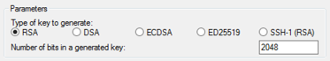

# Amazon ECS 사용 설정

Amazon Web Services(AWS)에 이미 가입했고 Amazon Elastic Compute Cloud (Amazon EC2)를 사용하고 있는 경우, Amazon ECS를 곧 사용할 수 있습니다. 두 서비스의 설정 프로세스는 유사합니다. 다음 가이드에서는 첫 번째 Amazon ECS 클러스터를 시작할 준비를 합니다.

Amazon ECS를 설정하려면 다음 태스크를 수행합니다.

## AWS에 가입
AWS에 가입 시 AWS 계정은 Amazon EC2 및 Amazon ECS를 포함한 모든 서비스에 자동으로 가입됩니다. 사용자는 사용한 서비스에 대해서만 청구됩니다.

이미 AWS 계정이 있다면 다음 태스크로 건너뜁니다. AWS 계정이 없는 경우에는 다음 절차에 따라 계정을 만드세요.

### AWS 계정을 생성하려면

1. https://portal.aws.amazon.com/billing/signup을 엽니다.

2. 온라인 지시 사항을 따릅니다.

등록 절차 중 전화를 받고 전화 키패드를 사용하여 확인 코드를 입력하는 과정이 있습니다.

다음 작업에 필요하므로 AWS 계정 번호를 기록합니다.

## IAM 사용자 생성
Amazon EC2 및 Amazon ECS 등의 AWS의 서비스에 액세스하는 경우 서비스가 사용자가 리소스에 대한 액세스 권한이 있는지를 파악할 수 있도록 자격 증명을 제공해야 합니다. 콘솔은 암호를 요구합니다. AWS 계정에 대한 액세스 키를 생성하면 명령줄 인터페이스 또는 API에 액세스할 수 있습니다. 그러나 AWS 계정의 자격 증명을 사용하여 AWS에 액세스하지 않고, AWS Identity and Access Management(IAM)를 사용하는 것이 좋습니다. IAM 사용자를 생성하여 관리자 권한과 함께 IAM 그룹에 추가하거나, 이 사용자에게 관리자 권한을 부여합니다. 그러면 IAM 사용자의 특정 URL과 자격 증명을 사용하여 AWS에 액세스할 수 있습니다.

AWS에 가입했지만 IAM 사용자를 생성하지 않았다면 IAM 콘솔에서 생성할 수 있습니다.

### 관리자 사용자를 직접 생성하여 관리자 그룹에 추가하려면(콘솔)

1. 루트 사용자(Root user)를 선택하고 AWS 계정 계정 이메일 주소를 입력하여 IAM 콘솔에 계정 소유자로 로그인합니다. 다음 페이지에서 암호를 입력합니다.

    참고
    Administrator IAM 사용자를 사용하는 아래 모범 사례를 준수하고, 루트 사용자 자격 증명을 안전하게 보관해 두는 것이 좋습니다. 몇 가지 계정 및 서비스 관리 태스크를 수행하려면 반드시 루트 사용자로 로그인해야 합니다.

2. 탐색 창에서 사용자(Users)와 사용자 추가(Add users)를 차례로 선택합니다.

3. 사용자 이름(User name)에 Administrator를 입력합니다.

4. AWS Management Console 액세스(console access) 옆의 확인란을 선택합니다. 그런 다음 사용자 지정 암호(Custom password)를 선택하고 텍스트 상자에 새 암호를 입력합니다.

5. (선택 사항) 기본적으로 AWS에서는 새 사용자가 처음 로그인할 때 새 암호를 생성해야 합니다. 사용자가 다음에 로그인할 때 새 암호를 생성해야 합니다(User must create a new password at next sign-in) 옆에 있는 확인란의 선택을 취소하면 새 사용자가 로그인한 후 암호를 재설정할 수 있습니다.

6. 다음: 권한(Next: Permissions)을 선택합니다.

7. 권한 설정(Set permissions) 아래에서 그룹에 사용자 추가(Add user to group)를 선택합니다.

8. 그룹 생성(Create group)을 선택합니다.

9. 그룹 생성(Create group) 대화 상자의 그룹 이름(Group name)에 Administrators를 입력합니다.

10. 정책 필터링(Filter policies)을 선택한 다음 AWS 관리형 - 직무(managed - job function)를 선택하여 테이블 내용을 필터링합니다.

11. 정책 목록에서 AdministratorAccess 확인란을 선택합니다. 그런 다음 그룹 생성(Create group)을 선택합니다.

    참고
    AdministratorAccess 권한을 사용하여 AWS Billing and Cost Management 콘솔에 액세스하려면 먼저 결제에 대한 IAM 사용자 및 역할 액세스를 활성화해야 합니다. 이를 위해 결제 콘솔에 액세스를 위임하기 위한 자습서 1단계의 지침을 따르세요.

12. 그룹 목록으로 돌아가 새 그룹의 확인란을 선택합니다. 목록에서 그룹을 확인하기 위해 필요한 경우 새로 고침(Refresh)을 선택합니다.

13. 다음: 태그(Next: Tags)를 선택합니다.

14. (선택 사항) 태그를 키 값 페어로 연결하여 메타데이터를 사용자에게 추가합니다. IAM에서 태그 사용에 대한 자세한 내용은 IAM 사용 설명서의 IAM 엔터티 태깅을 참조하세요.

15. 다음: 검토(Next: Review)를 선택하여 새 사용자에 추가될 그룹 멤버십의 목록을 확인합니다. 계속 진행할 준비가 되었으면 사용자 생성(Create user)을 선택합니다.

이와 동일한 절차에 따라 그룹이나 사용자를 추가로 생성하여 사용자에게 AWS 계정 리소스에 액세스할 수 있는 권한을 부여할 수 있습니다. 특정 AWS 리소스에 대한 사용자 권한을 제한하는 정책을 사용하는 방법을 알아보려면 액세스 관리 및 정책 예제를 참조하세요.

이 새로운 IAM 사용자로 로그인하려면 먼저 AWS 콘솔에서 로그아웃한 후 다음 URL을 사용합니다. 여기에서 your_aws_account_id는 하이픈을 제외한 AWS 계정 번호를 나타냅니다. 예를 들어 AWS 계정 번호가 1234-5678-9012이면 AWS 계정 ID는 123456789012입니다.

```
https://your_aws_account_id.signin.aws.amazon.com/console/
```

방금 생성한 IAM 사용자 이름과 암호를 입력합니다. 로그인하면 탐색 모음에 "your_user_name @ your_aws_account_id"가 표시됩니다.

로그인 페이지의 URL에 AWS 계정 ID가 포함되지 않게 하려면 계정 별칭을 생성합니다. IAM 대시보드에서 사용자 지정(Customize)을 선택하고 회사 이름 등의 별칭을 입력합니다. 계정 별칭 생성 후 로그인할 때는 다음과 같이 URL을 사용합니다.

```
https://your_account_alias.signin.aws.amazon.com/console/
```

본인 계정의 IAM 사용자 로그인 링크를 확인하려면 IAM 콘솔을 열고 대시보드에서 IAM 사용자 로그인 링크(IAM users sign-in link) 아래를 확인합니다.

IAM에 대한 자세한 내용은 AWS Identity and Access Management 사용 설명서를 참조하세요.

## 키 페어 생성
Amazon ECS의 경우, 키 페어는 EC2 시작 유형을 사용할 때만 필요합니다.

AWS에서는 퍼블릭 키 암호화를 사용하여 인스턴스에 대한 로그인 정보를 보호합니다. Amazon ECS 컨테이너 인스턴스 같은 Linux 인스턴스는 SSH 액세스에 사용할 암호가 없습니다. 키 페어를 사용하면 인스턴스에 안전하게 로그인할 수 있습니다. 컨테이너 인스턴스를 시작할 때 키 페어의 이름을 지정한 다음 SSH를 사용하여 로그인할 때 프라이빗 키를 제공합니다.

키 페어를 아직 생성하지 않은 경우 Amazon EC2 콘솔을 사용하여 생성할 수 있습니다. 여러 리전에서 인스턴스를 시작하려면 각 리전에서 키 페어를 생성해야 합니다. 리전에 대한 자세한 내용은 Linux 인스턴스용 Amazon EC2 사용 설명서의 리전 및 가용 영역을 참조하세요.

### 키 페어를 생성하려면

1. Amazon EC2 콘솔을 사용하여 키 페어를 생성합니다. 키 페어를 생성하는 방법에 대한 자세한 내용은 Amazon EC2 Linux 인스턴스용 사용 설명서의 키 페어 생성을 참조하세요.

2. macOS 또는 Linux 컴퓨터에서 SSH 클라이언트를 사용하여 Linux 인스턴스에 연결하려면 사용자만 프라이빗 키 파일을 읽을 수 있도록 다음 명령으로 해당 권한을 설정합니다.

```
chmod 400 your_user_name-key-pair-region_name.pem
```

자세한 내용은 Linux 인스턴스용 Amazon EC2 사용 설명서의 Amazon EC2 키 페어를 참조하세요.

### 키 페어를 사용하여 인스턴스에 연결하려면

macOS 또는 Linux를 실행 중인 컴퓨터에서 Linux 인스턴스에 연결하려면 -i 옵션과 프라이빗 키 경로를 사용하여 SSH 클라이언트에 .pem 파일을 지정합니다. Windows를 실행 중인 컴퓨터에서 Linux 인스턴스에 연결하려면 MindTerm 또는 PuTTY를 사용합니다. PuTTY를 사용하려면 이를 먼저 설치하고 다음 절차에 따라 .pem 파일을 .ppk 파일로 변환해야 합니다.

### PuTTY를 사용하여 Windows에서 Linux 인스턴스에 연결하려면

1. http://www.chiark.greenend.org.uk/~sgtatham/putty/에서 PuTTY를 다운로드하고 설치합니다. 전체 제품군을 설치해야 합니다.

2. PuTTYgen을 시작합니다(예: 시작(Start) 메뉴에서 모든 프로그램(All Programs) > PuTTY > PuTTYgen 선택).

3. 생성할 키 유형(Type of key to generate)에서 RSA를 선택합니다.


					
4. 로드(Load)를 선택합니다. 기본적으로 PuTTYgen에는 확장명이 .ppk인 파일만 표시됩니다. .pem 파일을 찾으려면 모든 유형의 파일을 표시하는 옵션을 선택합니다.


5. 이전 절차에서 생성한 프라이빗 키 파일을 선택하고 열기(Open)를 선택합니다. 확인(OK)을 선택하여 확인 대화 상자를 닫습니다.

6. 프라이빗 키 저장(Save private key)을 선택합니다. PuTTYgen에서 암호 없이 키 저장에 대한 경고가 표시됩니다. 예(Yes)를 선택합니다.

7. 키 페어에 사용한 것과 동일한 키 이름을 지정합니다. PuTTY가 자동으로 .ppk 파일 확장자를 추가합니다.

## Virtual Private Cloud 생성
Amazon Virtual Private Cloud(Amazon VPC)를 이용하면 사용자가 정의한 가상 네트워크로 AWS 리소스를 시작할 수 있습니다. VPC에서 컨테이너 인스턴스를 시작하는 것이 좋습니다.

    참고
    Amazon ECS 콘솔을 처음으로 실행하면 클러스터에 VPC가 생성되므로 Amazon ECS 콘솔을 사용하기 위해서는 다음 섹션으로 건너뛰면 됩니다.

기본 VPC가 있는 경우 이 섹션을 건너뛰고 다음 작업인 보안 그룹 생성으로 이동합니다. 기본 VPC가 있는지를 확인하려면 Linux 인스턴스용 Amazon EC2 사용 설명서에서 Amazon EC2 콘솔에서 지원되는 플랫폼을 참조하세요. 그렇지 않으면 아래 단계에 따라 계정에서 기본이 아닌 VPC를 생성할 수 있습니다.

    중요
    계정에서 특정 리전의 Amazon EC2 Classic을 지원하는 경우 해당 리전에 기본 VPC가 없는 것입니다.

VPC 생성하는 방법에 대한 자세한 내용은 Amazon VPC 사용자 가이드의 VPC만 생성을 참조하고 다음 표를 사용하여 선택할 옵션을 선택하세요.

옵션 | 값
--- | ---
생성할 리소스 | VPC 전용
이름 | 선택적으로 VPC의 이름을 입력합니다.
IPv4 CIDR block | IPv4 CIDR 수동 입력. CIDR 블록 크기는 /16과 /28 사이여야 합니다.
IPv6 CIDR block | No IPv6 CIDR 블록
Tenancy | 기본값

Amazon VPC에 대한 자세한 내용은 Amazon VPC 사용 설명서의 Amazon VPC란 무엇인가? 섹션을 참조하세요.

## 보안 그룹 생성
보안 그룹은 연결된 컨테이너 인스턴스에 대한 방화벽 역할을 하여 컨테이너 인스턴스 수준에서 인바운드 트래픽과 아웃바운드 트래픽을 모두 제어합니다. 해당 IP 주소에서 SSH를 사용하여 컨테이너 인스턴스에 연결할 수 있게 하는 규칙을 보안 그룹에 추가할 수 있습니다. 어디서나 인바운드 및 아웃바운드 HTTP/HTTPS 액세스를 허용하는 규칙을 추가할 수도 있습니다. 작업에 필요한 포트를 여는 규칙을 추가합니다. 컨테이너 인스턴스는 Amazon ECS 서비스 엔드포인트와 통신하기 위해 외부 네트워크에 액세스해야 합니다.

    참고
    Amazon ECS 클래식 콘솔 처음 실행은 사용한 태스크 정의를 기반으로 인스턴스 및 로드 밸런서에 대한 보안 그룹을 생성하므로 Amazon ECS 콘솔을 사용하려는 경우, 다음 섹션으로 이동할 수 있습니다.

여러 리전에서 컨테이너 인스턴스를 시작하려면 각 리전에서 보안 그룹을 생성해야 합니다. 자세한 내용은 Linux 인스턴스용 Amazon EC2 사용 설명서의 리전 및 가용 영역을 참조하세요.

    작은 정보
    로컬 컴퓨터의 퍼블릭 IP 주소가 필요하며, 서비스를 사용해 확인할 수 있습니다. 예를 들면, Amazon에서는 http://checkip.amazonaws.com/ 또는 https://checkip.amazonaws.com/ 서비스를 제공합니다. IP 주소를 제공하는 다른 서비스를 찾으려면 "what is my IP address"로 검색합니다. 고정 IP 주소가 없는 방화벽 뒤나 ISP(인터넷 서비스 제공업체)를 통해 연결되어 있는 경우 클라이언트 컴퓨터가 사용하는 IP 주소의 범위를 찾아야 합니다.

보안 그룹을 생성하는 방법에 대한 자세한 내용은 Linux 인스턴스용 Amazon EC2 사용 설명서의 보안 그룹 생성을 참조하고 다음 표를 사용하여 선택할 옵션을 선택하세요.

옵션 | 값
--- | ---
리전(Region) | 키 페어를 생성한 리전과 동일한 리전.
이름 | 기억하기 쉬운 이름(예: ecs-instances-default-cluster).
VPC | 기본 VPC("(기본값)")으로 표시.

    참고
    계정에서 Amazon EC2 Classic을 지원하는 경우 이전 작업에서 생성한 VPC를 선택합니다.

Amazon ECS 컨테이너 인스턴스는 인바운드 포트를 열어야 할 필요가 없습니다. 하지만 컨테이너 인스턴스에 로그인하고 Docker 명령을 사용하여 태스크를 검사할 수 있도록 SSH 규칙을 추가할 수 있습니다. 또한 컨테이너 인스턴스에서 웹 서버를 실행하는 태스크를 호스팅하게 하려는 경우 HTTP 및 HTTPS에 대한 규칙을 추가할 수도 있습니다. 컨테이너 인스턴스는 Amazon ECS 서비스 엔드포인트와 통신하기 위해 외부 네트워크에 액세스해야 합니다. 이러한 보안 그룹 규칙을 필요에 따라 추가하려면 다음 절차를 수행합니다.

보안 그룹에 다음 세 가지 인바운드 규칙을 추가합니다. 보안 그룹을 생성하는 방법 대한 자세한 내용은 Linux 인스턴스용 Amazon EC2 사용 설명서의 보안 그룹에 규칙 추가를 참조하세요.

옵션 | 값
--- | ---
HTTP 규칙 | 유형: HTTP<br>출처: 모든 소스(0.0.0.0/0)<br>이 옵션은 0.0.0.0/0 IPv4 CIDR 블록을 자동으로 소스로 추가합니다. 테스트 환경에서 잠시 사용하는 것은 괜찮지만 프로덕션 환경에서는 안전하지 않습니다. 프로덕션에서는 특정 IP 주소나 주소 범위만 인스턴스에 액세스하도록 허용하세요.
HTTPS 규칙 | 유형: HTTPS<br>출처: 모든 소스(0.0.0.0/0)<br>테스트 환경에서 잠시 사용하는 것은 괜찮지만 프로덕션 환경에서는 안전하지 않습니다. 프로덕션에서는 특정 IP 주소나 주소 범위만 인스턴스에 액세스하도록 허용하세요.
SSH 규칙 | 유형: SSH<br>소스: 사용자 지정(Custom)을 선택하고 컴퓨터 또는 네트워크의 퍼블릭 IP 주소를 CIDR 표기법으로 지정합니다. 개별 IP 주소를 CIDR 표기법으로 지정하려면 라우팅 접두사 /32를 추가합니다. 예를 들어, IP 주소가 203.0.113.25인 경우 203.0.113.25/32를 지정합니다. 회사에서 주소를 범위로 할당하는 경우 전체 범위(예: 203.0.113.0/24)를 지정합니다.<br>중요<br>테스트를 위해 짧은 시간 동안만 허용하는 경우를 제외하고는 해당 인스턴스에 대한 모든 IP 주소(0.0.0.0/0)로부터의 SSH 액세스를 허용하지 않는 것이 보안을 위해 좋습니다.

## AWS CLI 설치
AWS Management Console은 Amazon ECS로 모든 태스크를 수동 관리하는 데 사용할 수 있습니다. 그러나 로컬 데스크톱이나 개발자 상자에 AWS CLI를 설치하면 Amazon ECS에서 일반적인 관리 태스크를 자동화할 수 있는 스크립트를 작성할 수 있습니다.

Amazon ECS에 AWS CLI를 사용하려면 최신 AWS CLI 버전을 설치합니다. AWS CLI 설치 또는 최신 버전 업그레이드 방법에 대한 자세한 내용은 AWS Command Line Interface 사용 설명서의 AWS 명령줄 인터페이스 설치를 참조하세요.