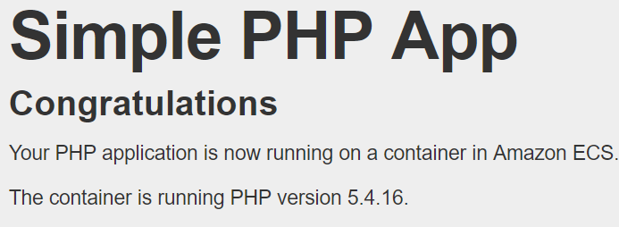

# AWS CDK를 사용하여 Amazon ECS 시작하기

이 주제에서는 Amazon Elastic Container Service와 AWS Cloud Development Kit (CDK)를 사용하여 컨테이너식 웹 서버를 Fargate에 배포하는 방법을 보여줍니다. AWS CDK는 코드형 인프라(IAC) 프레임워크로 본격적인 프로그래밍 언어를 사용하는 AWS 인프라를 정의할 수 있습니다. 하나 이상의 스택을 포함하는 CDK 지원 언어 중 하나로 앱을 작성한 다음 AWS CloudFormation 템플릿에 합성하여 리소스를 AWS 계정에 배포합니다.

CDK에 포함된 AWS Construct Library는 모든 AWS 서비스가 제공하는 리소스를 모델링하는 API를 제공합니다. 가장 많이 사용되는 서비스의 라이브러리는 스마트 기본값을 제공하고 필요한 파라미터를 적게 사용하여 모범 사례를 구현하는 큐레이트된 구조를 제공합니다. 이 모듈 중 하나인 [aws-ecs-patterns](https://docs.aws.amazon.com/cdk/api/v2/docs/aws-cdk-lib.aws_ecs_patterns-readme.html)는 컨테이너화된 서비스와 필요한 모든 지원 리소스를 단 몇 줄의 코드로 정의할 수 있는 상위 수준의 추상화를 제공합니다.

이 주제에서 사용할 구조는 [ApplicationLoadBalancedFargateService](https://docs.aws.amazon.com/cdk/api/v2/docs/aws-cdk-lib.aws_ecs_patterns.ApplicationLoadBalancedFargateService.html)입니다. 이름에서 알 수 있듯이 이 구조는 애플리케이션 로드 밸런서 뒤의 Fargate에 Amazon ECS 서비스를 배포합니다. 또한 aws-ecs-patterns 모듈에는 네트워크 로드 밸런서를 사용하거나 Amazon EC2를 실행하는 구조도 포함되어 있습니다(이러한 옵션을 원하는 경우).

이 태스크를 시작하기 전에 [AWS CDK 시작하기 - 사전 조건](https://docs.aws.amazon.com/cdk/v2/guide/getting_started.html#getting_started_prerequisites)에 설명 된 대로 AWS CDK 개발 환경을 설정하고, 다음을 실행하여 AWS CDK를 설치합니다.

```
npm install -g aws-cdk
```

    참고
    이 지침에서는 AWS CDK v2를 사용하고 있다고 가정합니다.

## 주제

- 1단계: AWS CDK 프로젝트 설정
- 2단계: AWS CDK를 사용하여 Fargate에 컨테이너화된 웹 서버 정의
- 3단계: 웹 서비스 테스트
- 4단계: 정리
- 다음 단계

### 1단계: AWS CDK 프로젝트 설정
새 AWS CDK 앱에 대한 디렉터리를 생성하고 프로젝트를 초기화합니다.

<details>
<summary>TypeScript</summary>
<div markdown="1">

```
mkdir hello-ecs
cd hello-ecs
cdk init --language typescript
```

</div>
</details>

<details>
<summary>JavaScript</summary>
<div markdown="1">

```
mkdir hello-ecs
cd hello-ecs
cdk init --language javascript
```

</div>
</details>

<details>
<summary>Python</summary>
<div markdown="1">

```
mkdir hello-ecs
cd hello-ecs
cdk init --language python
```

프로젝트가 초기화되면 프로젝트의 가상 환경을 활성화하고 AWS CDK의 기준선 종속성을 설치합니다.

```
source .venv/bin/activate
python -m pip install -r requirements.txt
```

</div>
</details>

<details>
<summary>Java</summary>
<div markdown="1">

```
mkdir hello-ecs
cd hello-ecs
cdk init --language java
```

이 Maven 프로젝트를 Java IDE로 가져옵니다(예: Eclipse에서 파일(File) > 가져오기(Import) > Maven > 기존 Maven 프로젝트(Existing Maven Projects) 사용).

</div>
</details>

<details>
<summary>C#</summary>
<div markdown="1">

```
mkdir hello-ecs
cd hello-ecs
cdk init --language csharp
```

</div>
</details>

    참고
    다음과 같이 디렉토리의 이름을 hello-ecs로 지정해야 합니다. AWS CDK 애플리케이션 템플릿은 프로젝트 디렉토리의 이름을 사용하여 소스 파일 및 클래스의 이름을 생성합니다. 다른 이름을 사용하는 경우 앱이 이 지침과 일치하지 않습니다.

AWS CDK v2에는 aws-cdk-lib라는 단일 패키지에 모든 AWS 서비스에 대한 안정적인 구성이 포함되어 있습니다. 이 패키지는 프로젝트를 초기화하거나 처음 구축(일부 언어의 경우)할 때 종속 항목으로 설치됩니다. 이 주제에서는 Amazon ECS 작업을 위한 높은 수준의 추상화를 제공하는 Amazon ECS 패턴 구문을 사용합니다. 이 모듈은 Amazon ECS 구문 등을 사용하여 Amazon ECS 애플리케이션에 필요한 재소스를 프로비저닝합니다.

이러한 라이브러리를 CDK 애플리케이션으로 가져오는 데 사용하는 이름은 사용하는 프로그래밍 언어에 따라 약간 다릅니다. 참고로 다음은 지원되는 각 CDK 프로그래밍 언어에서 사용되는 이름입니다.


<details>
<summary>TypeScript</summary>
<div markdown="1">

```
@aws-cdk-lib/aws-ecs
@aws-cdk-lib/aws-ecs-patterns
```

</div>
</details>

<details>
<summary>JavaScript</summary>
<div markdown="1">

```
@aws-cdk-/aws-ecs
@aws-cdk-lib/aws-ecs-patterns
```

</div>
</details>

<details>
<summary>Python</summary>
<div markdown="1">

```
aws_cdk.aws_ecs
aws_cdk.aws_ecs_patterns
```

</div>
</details>

<details>
<summary>Java</summary>
<div markdown="1">

```
software.amazon.awscdk.services.ecs
software.amazon.awscdk.services.ecs.patterns
```

</div>
</details>

<details>
<summary>C#</summary>
<div markdown="1">

```
Amazon.CDK.AWS.ECS
Amazon.CDK.AWS.ECS.Patterns
```

</div>
</details>

### 2단계: AWS CDK를 사용하여 Fargate에 컨테이너화된 웹 서버 정의
DockerHub에서 [amazon-ecs-sample](https://hub.docker.com/r/amazon/amazon-ecs-sample) 컨테이너 이미지를 사용합니다. 이 이미지에는 Amazon Linux 2에서 실행되는 PHP 웹 앱이 포함되어 있습니다.

생성한 AWS CDK 프로젝트에서 스택의 정의를 포함하는 파일을 편집합니다. 코드는 다음과 같습니다. ApplicationLoadBalancedFargateService 구성의 인스턴스화 또는 최소한 그 이름이 보입니다.

    참고
    스택이란 무엇입니까? 스택은 배포 단위입니다. 모든 리소스는 스택에 있어야 하며 스택의 모든 리소스는 함께 배포됩니다. 리소스를 배포하지 못하면 이미 배포된 다른 모든 리소스가 롤백됩니다. AWS CDK 앱은 여러 스택을 포함할 수 있으며 한 스택의 리소스는 다른 스택의 리소스를 참조할 수 있습니다.


<details>
<summary>TypeScript</summary>
<div markdown="1">

lib/hello-ecs-stack.ts를 업데이트하여 다음을 확인합니다.
```
import * as cdk from '@aws-cdk-lib';
import { Construct } from 'constructs';

import * as ecs from '@aws-cdk-lib/aws-ecs';
import * as ecsp from '@aws-cdk-lib/aws-ecs-patterns';

export class HelloEcsStack extends cdk.Stack {
  constructor(scope: Construct, id: string, props?: cdk.StackProps) {
    super(scope, id, props);

    new ecsp.ApplicationLoadBalancedFargateService(this, 'MyWebServer', {
      taskImageOptions: {
        image: ecs.ContainerImage.fromRegistry('amazon/amazon-ecs-sample'),
      },
      publicLoadBalancer: true
    });
  }
}
```

</div>
</details>

<details>
<summary>JavaScript</summary>
<div markdown="1">

lib/hello-ecs-stack.js를 업데이트하여 다음을 확인합니다.
```
const cdk = require('@aws-cdk-lib');
const { Construct } = require('constructs');

const ecs = require('@aws-cdk-lib/aws-ecs');
const ecsp = require('@aws-cdk-lib/aws-ecs-patterns');

class HelloEcsStack extends cdk.Stack {
  constructor(scope: Construct, id: string, props?: cdk.StackProps) {
    super(scope, id, props);

    new ecsp.ApplicationLoadBalancedFargateService(this, 'MyWebServer', {
      taskImageOptions: {
        image: ecs.ContainerImage.fromRegistry('amazon/amazon-ecs-sample'),
      },
      publicLoadBalancer: true
    });
  }
}

module.exports = { HelloEcsStack }
```

</div>
</details>

<details>
<summary>Python</summary>
<div markdown="1">

hello-ecs/hello_ecs_stack.py를 업데이트하여 다음을 확인합니다.
```
import aws_cdk as cdk
from constructs import Construct

import aws_cdk.aws_ecs as ecs
import aws_cdk.aws_ecs_patterns as ecsp

class HelloEcsStack(cdk.Stack):

    def __init__(self, scope: Construct, construct_id: str, **kwargs) -> None:
        super().__init__(scope, construct_id, **kwargs)

        ecsp.ApplicationLoadBalancedFargateService(self, "MyWebServer",
            task_image_options=ecsp.ApplicationLoadBalancedTaskImageOptions(
                image=ecs.ContainerImage.from_registry("amazon/amazon-ecs-sample")),
            public_load_balancer=True
        )
```

</div>
</details>

<details>
<summary>Java</summary>
<div markdown="1">

src/main/java/com.myorg/HelloEcsStack.java를 업데이트하여 다음을 확인합니다.
```
package com.myorg;

import software.constructs.Construct;
import software.amazon.awscdk.Stack;
import software.amazon.awscdk.StackProps;

import software.amazon.awscdk.services.ecs.ContainerImage;
import software.amazon.awscdk.services.ecs.patterns.ApplicationLoadBalancedFargateService;
import software.amazon.awscdk.services.ecs.patterns.ApplicationLoadBalancedTaskImageOptions;

public class HelloEcsStack extends Stack {
    public HelloEcsStack(final Construct scope, final String id) {
        this(scope, id, null);
    }

    public HelloEcsStack(final Construct scope, final String id, final StackProps props) {
        super(scope, id, props);

        ApplicationLoadBalancedFargateService.Builder.create(this, "MyWebServer")
        	.taskImageOptions(ApplicationLoadBalancedTaskImageOptions.builder()
        			.image(ContainerImage.fromRegistry("amazon/amazon-ecs-sample"))
        			.build())
        	.publicLoadBalancer(true)
        	.build();        
    }
}
```

</div>
</details>

<details>
<summary>C#</summary>
<div markdown="1">

src/HelloEcs/HelloEcsStack.cs를 업데이트하여 다음을 확인합니다.
```
using Amazon.CDK;
using Constructs;

using Amazon.CDK.AWS.ECS;
using Amazon.CDK.AWS.ECS.Patterns;

namespace HelloEcs
{
    public class HelloEcsStack : Stack
    {
        internal HelloEcsStack(Construct scope, string id, IStackProps props = null) : base(scope, id, props)
        {
            new ApplicationLoadBalancedFargateService(this, "MyWebServer",
                new ApplicationLoadBalancedFargateServiceProps
                {
                    TaskImageOptions = new ApplicationLoadBalancedTaskImageOptions
                    {
                        Image = ContainerImage.FromRegistry("amazon/amazon-ecs-sample")
                    },
                    PublicLoadBalancer = true
                });
        }
    }
}
```

</div>
</details>

이 짧은 조각에서 확인할 수 있는 항목은 다음과 같습니다.

- 서비스의 논리적 이름 `MyWebServer`.

- DockerHub에서 얻은 컨테이너 이미지 `amazon/amazon-ecs-sample`.

- 로드 밸런서에 퍼블릭 주소가 있으므로 인터넷에서 액세스할 수 있다는 사실.

여기에서 설명한 것처럼 Amazon ECS 클러스터, 기본 Amazon Virtual Private Cloud 및 Amazon EC2 인스턴스, Auto Scaling 그룹, Application Load Balancer, 필요한 IAM 역할 및 정책, 웹 서버를 배포하는 데 필요한 기타 AWS 리소스를 생략하는 경우 AWS CDK는 이러한 리소스도 생성합니다. 자동 프로비저닝된 일부 리소스는 스택에 정의된 모든 Amazon ECS 서비스에서 공유됩니다.

소스 파일을 저장한 다음 앱의 기본 디렉터리에서 cdk synth를 실행합니다. AWS CDK가 앱을 실행하고 앱에서 AWS CloudFormation 템플릿을 합성한 다음 템플릿을 표시합니다. 템플릿은 약 600줄의 YAML이므로 시작 부분만 여기에 표시합니다. (사용자의 템플릿은 다를 수 있습니다.)

```
Resources:
  MyWebServerLB3B5FD3AB:
    Type: AWS::ElasticLoadBalancingV2::LoadBalancer
    Properties:
      LoadBalancerAttributes:
        - Key: deletion_protection.enabled
          Value: "false"
      Scheme: internet-facing
      SecurityGroups:
        - Fn::GetAtt:
            - MyWebServerLBSecurityGroup01B285AA
            - GroupId
      Subnets:
        - Ref: EcsDefaultClusterMnL3mNNYNVpcPublicSubnet1Subnet3C273B99
        - Ref: EcsDefaultClusterMnL3mNNYNVpcPublicSubnet2Subnet95FF715A
      Type: application
    DependsOn:
      - EcsDefaultClusterMnL3mNNYNVpcPublicSubnet1DefaultRouteFF4E2178
      - EcsDefaultClusterMnL3mNNYNVpcPublicSubnet2DefaultRouteB1375520
    Metadata:
      aws:cdk:path: HelloEcsStack/MyWebServer/LB/Resource
  MyWebServerLBSecurityGroup01B285AA:
    Type: AWS::EC2::SecurityGroup
    Properties:
      GroupDescription: Automatically created Security Group for ELB HelloEcsStackMyWebServerLB06757F57
      SecurityGroupIngress:
        - CidrIp: 0.0.0.0/0
          Description: Allow from anyone on port 80
          FromPort: 80
          IpProtocol: tcp
          ToPort: 80
      VpcId:
        Ref: EcsDefaultClusterMnL3mNNYNVpc7788A521
    Metadata:
      aws:cdk:path: HelloEcsStack/MyWebServer/LB/SecurityGroup/Resource
# and so on for another few hundred lines
```

실제로 AWS 계정의 서비스를 배포하려면 cdk deploy를 실행합니다. AWS CDK가 생성한 IAM 정책을 승인하라는 메시지가 표시됩니다.

배포에는 몇 분 정도가 소요됩니다. AWS CDK가 매우 많은 리소스를 생성합니다. 배포에서 출력되는 마지막 몇 줄에는 로드 밸런서의 퍼블릭 호스트 이름과 새 웹 서버의 HTTP URL이 포함됩니다.

```
Outputs:
HelloEcsStack.MyWebServerLoadBalancerDNSXXXXXXX = Hello-MyWeb-ZZZZZZZZZZZZZ-ZZZZZZZZZZ.us-west-2.elb.amazonaws.com
HelloEcsStack.MyWebServerServiceURLYYYYYYYY = http://Hello-MyWeb-ZZZZZZZZZZZZZ-ZZZZZZZZZZ.us-west-2.elb.amazonaws.com
```

### 3단계: 웹 서비스 테스트
배포 출력에서 URL을 복사해 웹 브라우저에 붙여 넣습니다. 웹 서버에서 시작 메시지가 표시되어야 합니다.



### 4단계: 정리
이제 웹 서버 작업이 완료되었으므로(축하 메시지를 표시하는 것 외에는 아무 작업도 수행하지 않음) CDK를 사용해 서비스를 제거할 수 있습니다. 앱의 기본 디렉토리에서 cdk destroy를 실행합니다. 이렇게 하면 의도하지 않은 AWS 요금을 지불하지 않을 수 있습니다.

## 다음 단계
AWS CDK를 사용한 AWS 인프라 개발에 대해 자세히 알아보려면 AWS CDK 개발자 안내서를 참조하세요.

선택한 언어로 AWS CDK 앱을 작성하는 방법에 대한 내용은 다음을 참조하세요.

<details>
<summary>TypeScript</summary>
<div markdown="1">

[TypeScript에서 AWS CDK 작업](https://docs.aws.amazon.com/cdk/v2/guide/work-with-cdk-typescript.html)

</div>
</details>

<details>
<summary>JavaScript</summary>
<div markdown="1">

[JavaScript에서 AWS CDK 작업](https://docs.aws.amazon.com/cdk/v2/guide/work-with-cdk-javascript.html)

</div>
</details>

<details>
<summary>Python</summary>
<div markdown="1">

[Python에서 AWS CDK 작업](https://docs.aws.amazon.com/cdk/v2/guide/work-with-cdk-python.html)

</div>
</details>

<details>
<summary>Java</summary>
<div markdown="1">

[Java에서 AWS CDK 작업](https://docs.aws.amazon.com/cdk/v2/guide/work-with-cdk-java.html)

</div>
</details>

<details>
<summary>C#</summary>
<div markdown="1">

[C#에서 AWS CDK 작업](https://docs.aws.amazon.com/cdk/v2/guide/work-with-cdk-csharp.html)

</div>
</details>
