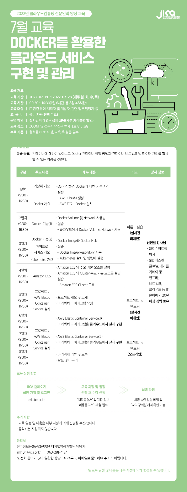
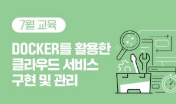

# 전주정보문화산업진흥원

[교재 다운로드](https://icshin-jica.s3.ap-northeast-2.amazonaws.com/2022/02.Docker%E1%84%85%E1%85%B3%E1%86%AF+%E1%84%92%E1%85%AA%E1%86%AF%E1%84%8B%E1%85%AD%E1%86%BC%E1%84%92%E1%85%A1%E1%86%AB+%E1%84%8F%E1%85%B3%E1%86%AF%E1%84%85%E1%85%A1%E1%84%8B%E1%85%AE%E1%84%83%E1%85%B3+%E1%84%89%E1%85%A5%E1%84%87%E1%85%B5%E1%84%89%E1%85%B3+%E1%84%80%E1%85%AE%E1%84%92%E1%85%A7%E1%86%AB+%E1%84%86%E1%85%B5%E1%86%BE+%E1%84%80%E1%85%AA%E1%86%AB%E1%84%85%E1%85%B5/PDF.zip)

<!--

Docker를 활용한 클라우드 서비스 구현 및 관리

-->